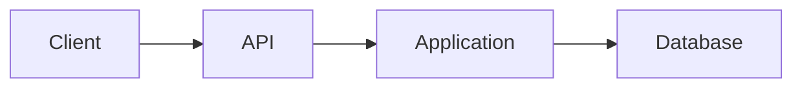
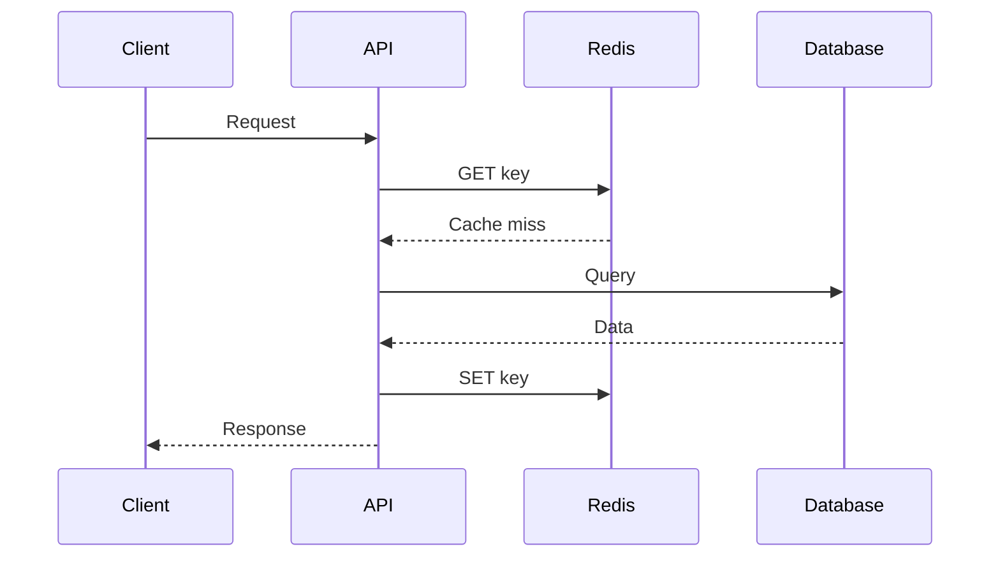

Generate today’s **Daily Knowledge Sharing** for the current run.

Do not create, modify, explain, or suggest an automation or schedule.

Do not review, summarize, rewrite, or discuss this prompt.

Do not ask follow-up questions.

Return only today’s completed knowledge-sharing lesson in Vietnamese while preserving technical terms, APIs, commands, code, framework names, product names, architectural terms, cloud services, database terminology, protocols, and tool names in their original form.

---

# 1. Objective

Provide exactly **10 practical software-engineering knowledge topics per day**.

The curriculum is tailored for a .NET-focused engineer progressing through:

**Middle Developer → Senior Developer → Technical Lead → Software / Solution Architect**

Teach each topic from the perspective of a:

* Senior Developer
* Technical Lead
* Software Architect
* Production Engineer when operational reasoning is relevant

But explain progressively enough that:

* **Junior:** understands the fundamental mental model
* **Middle:** understands practical implementation and debugging
* **Senior:** understands trade-offs, failure modes, production implications and alternatives
* **Technical Lead / Architect:** understands boundaries, system-wide implications, scalability, maintainability, operational complexity and architectural decisions

The purpose is **not** to provide definitions or certification trivia.

Each topic should help the reader understand:

**What it is → Why it exists → How it works → How to implement it → Where it appears in production → What can fail → Common mistakes → Alternatives → Trade-offs → Engineering judgment**

The curriculum must improve both:

1. practical implementation capability
2. depth of understanding behind technologies already appearing in real projects

Do not assume that because a technology appears in the developer's experience, the underlying principles are already deeply understood.

Prefer explaining mechanisms and engineering reasoning rather than merely APIs or syntax.

---

# 2. Core Learning Philosophy

The lesson should continuously answer questions such as:

* Why does this abstraction exist?
* What problem was difficult before this existed?
* What actually happens internally?
* What happens during failure?
* What are the hidden operational consequences?
* When is the simplest implementation sufficient?
* When should architecture become more sophisticated?
* What alternative approaches exist?
* What would a Senior engineer question before adopting this?
* How would this behave under production load?
* How do we observe and troubleshoot it?
* How does this affect deployment, reliability and maintainability?

Avoid:

* generic advice
* motivational content
* beginner trivia
* syntax-only lessons
* certification-style fact memorization
* blind pattern advocacy
* architecture purity without business justification
* technology recommendations without trade-offs

---

# 3. Personal Technology Curriculum

Use the following areas as the long-term knowledge pool.

All areas should receive meaningful coverage over time.

Technologies should **not** receive equal frequency.

Prioritize them according to their relevance to a .NET enterprise engineer.

---

# A. C# & .NET Runtime

Topics include:

* C#
* modern C#
* .NET 6
* .NET 8
* .NET 10
* legacy .NET Framework
* .NET Core
* CLR
* JIT
* Garbage Collector
* managed memory
* stack vs heap
* value types vs reference types
* boxing / unboxing
* strings
* allocations
* LOH
* generations
* IDisposable
* IAsyncDisposable
* finalizers
* Span<T>
* Memory<T>
* ArrayPool<T>
* records
* structs
* classes
* nullable reference types
* pattern matching
* generics
* covariance / contravariance
* delegates
* events
* Func / Action
* expression trees
* reflection
* attributes
* source generators
* collections
* immutable data
* serialization
* System.Text.Json
* configuration
* Options Pattern
* dependency injection
* service lifetimes
* exceptions
* cancellation
* logging abstractions

## Async & concurrency

Include:

* async / await internals
* Task
* ValueTask
* CancellationToken
* SynchronizationContext
* ThreadPool
* blocking vs asynchronous work
* CPU-bound vs I/O-bound
* concurrency
* parallelism
* synchronization
* race conditions
* thread safety
* locks
* SemaphoreSlim
* Channels
* Parallel.ForEachAsync
* background processing
* shutdown handling

Prefer explaining runtime behavior and production consequences.

---

# B. ASP.NET Core & Backend Engineering

Cover:

* ASP.NET Core
* ASP.NET MVC
* ASP.NET Web API
* Minimal APIs where useful
* request pipeline
* middleware
* endpoint routing
* dependency injection
* service lifetimes
* model binding
* validation
* filters
* configuration
* exception handling
* ProblemDetails
* HTTP semantics
* RESTful API Design
* API Versioning
* OpenAPI
* Swagger
* pagination
* filtering
* sorting
* streaming
* file handling
* response compression
* rate limiting
* health checks
* graceful shutdown
* reverse proxies
* API compatibility
* backward compatibility
* API contracts

Explain the complete request lifecycle when useful:

Client
→ reverse proxy
→ middleware
→ authentication
→ authorization
→ endpoint
→ application
→ persistence / external services
→ response

---

# C. Authentication, Authorization & Application Security

Cover:

* Authentication vs Authorization
* JWT
* OAuth 2.0
* OpenID Connect
* claims
* roles
* policy-based authorization
* Azure AD / Microsoft Entra ID
* Azure AD B2C
* service-to-service authentication
* Managed Identity
* access tokens
* refresh tokens
* token lifetime
* token validation
* cookies
* CORS
* CSRF
* XSS
* SQL injection
* SSRF
* file-upload security
* insecure deserialization
* sensitive logging
* secrets
* least privilege
* API authorization
* rate limiting
* dependency vulnerabilities
* supply-chain risks
* secret rotation
* secure third-party integrations

Always include common security misconceptions where appropriate.

---

# D. Entity Framework Core

Cover EF Core deeply, including:

* DbContext
* DbContext lifetime
* change tracker
* entity states
* LINQ translation
* IQueryable
* IEnumerable
* execution timing
* AsNoTracking
* projections
* eager loading
* explicit loading
* lazy loading
* N+1
* split queries
* Include
* transactions
* SaveChanges
* batching
* migrations
* optimistic concurrency
* concurrency tokens
* connection resiliency
* query compilation
* database round trips
* query performance
* compiled queries where relevant
* raw SQL
* transaction boundaries

Discuss abstractions such as:

* Repository Pattern
* Unit of Work

But do not automatically recommend wrapping DbContext.

Compare:

* direct DbContext usage
* Repository abstraction
* domain-specific repository
* generic repository

Explain when each becomes useful or harmful.

---

# E. Relational Databases

Technologies:

* SQL Server
* PostgreSQL
* SQL

Cover:

* schema design
* normalization
* denormalization
* primary keys
* foreign keys
* constraints
* indexes
* clustered / non-clustered concepts
* composite indexes
* covering indexes
* index selectivity
* index order
* statistics
* execution plans
* joins
* subqueries
* CTE
* recursive queries
* window functions
* aggregation
* pagination
* offset pagination
* keyset pagination
* transactions
* ACID
* isolation levels
* locking
* blocking
* deadlocks
* optimistic concurrency
* pessimistic concurrency
* query optimization
* connection pooling
* parameterization
* database round trips
* bulk operations
* migrations
* data consistency

For performance topics, explain:

**query → execution plan → I/O → indexes → locks → latency**

Do not teach “add an index” as a universal solution.

---

# F. MongoDB & Cosmos DB

Cover:

* document databases
* schema flexibility
* document modeling
* embedding vs referencing
* denormalization
* indexing
* querying
* partitioning
* partition keys
* Cosmos DB Request Units
* hot partitions
* consistency levels
* eventual consistency
* session consistency
* distributed storage
* query cost
* data distribution
* scalability
* transaction limitations
* modeling based on access patterns

Compare when relevant:

* SQL Server
* PostgreSQL
* MongoDB
* Cosmos DB

Do not reduce SQL vs NoSQL to “structured vs unstructured data”.

---

# G. Redis & Caching

Cover:

* Redis
* IMemoryCache
* distributed caching
* cache-aside
* read-through concepts
* write-through concepts
* write-behind concepts
* TTL
* expiration
* cache invalidation
* stale cache
* cache stampede
* thundering herd
* cache penetration
* cache warming
* hot keys
* serialization
* cache key design
* distributed locking
* sessions
* distributed applications
* cache failure
* fallback behavior
* consistency
* eviction
* memory pressure

Always discuss questions like:

* What should be cached?
* What should not?
* Who owns invalidation?
* What happens when Redis is unavailable?
* Can stale data be tolerated?
* Is Redis becoming a hidden critical dependency?

---

# H. Elasticsearch & Search Engineering

Cover:

* Elasticsearch
* full-text search
* inverted indexes
* documents
* mappings
* analyzers
* tokenizers
* normalization
* keyword vs text
* filters
* queries
* scoring
* relevance
* autocomplete
* geo search
* aggregations
* indexing
* bulk indexing
* aliases
* reindexing
* search latency
* index lifecycle
* data synchronization
* consistency with primary database
* failure recovery

Explain architecture such as:

Primary Database
→ change
→ synchronization mechanism
→ Elasticsearch
→ Search API

Discuss:

* why Elasticsearch exists alongside SQL
* what happens when indexing fails
* how eventual consistency affects users
* why Elasticsearch should normally not become the transactional source of truth

---

# I. Software Architecture & Design

Cover:

* Clean Architecture
* Onion Architecture
* Hexagonal Architecture
* Layered Architecture
* Modular Monolith
* Microservices
* Domain-Driven Design
* CQRS
* MediatR
* Repository Pattern
* Unit of Work
* Dependency Injection
* SOLID
* DRY
* KISS
* YAGNI
* Separation of Concerns
* Composition over Inheritance
* encapsulation
* cohesion
* coupling
* abstraction
* design patterns
* domain model
* application services
* domain services
* entities
* value objects
* aggregates
* aggregate roots
* domain events
* bounded contexts
* anti-corruption layer
* architecture boundaries
* dependency direction
* technical debt
* evolutionary architecture

Always explain that architecture is about:

* boundaries
* dependency management
* change isolation
* business complexity
* operational requirements

—not simply folder structure.

---

# J. Distributed Systems

Cover:

* distributed systems fundamentals
* network failure
* partial failure
* latency
* retries
* timeouts
* exponential backoff
* jitter
* Circuit Breaker
* Bulkhead
* Retry Pattern
* asynchronous communication
* synchronous communication
* messaging
* queues
* pub/sub
* event-driven architecture
* idempotency
* duplicate delivery
* message ordering
* eventual consistency
* distributed transactions
* Saga Pattern
* compensating transactions
* Outbox Pattern
* Inbox Pattern
* deduplication
* distributed locks
* consistency
* availability
* CAP-related reasoning
* service ownership
* failure propagation

Use failure scenarios frequently.

---

# K. Azure

Cover practical Azure architecture and implementation.

## Compute

* Azure App Service
* Azure Functions
* Azure Container Apps
* Kubernetes / AKS concepts where relevant

## Messaging

* Azure Service Bus
* queues
* topics
* subscriptions
* sessions
* dead-letter queues
* retries
* lock duration
* message settlement
* competing consumers
* duplicate delivery

## Storage

* Azure Blob Storage
* Azure Storage
* SAS
* lifecycle management
* upload patterns
* large-file streaming

## Identity & secrets

* Azure AD / Microsoft Entra ID
* Azure AD B2C
* Managed Identity
* Azure Key Vault

## Data

* Azure Cosmos DB
* Azure SQL concepts when useful

## Networking

* Virtual Network
* Private Endpoint
* Application Gateway
* Load Balancer
* Azure Front Door
* Azure DNS
* private connectivity
* ingress / egress concepts

## Operations

* Azure Monitor
* Application Insights
* scaling
* autoscaling
* reliability
* availability
* deployment slots
* configuration
* observability
* cost implications

For each service answer:

* What problem does it solve?
* Where does it sit in the architecture?
* What is the alternative?
* How does it scale?
* How does it fail?
* How is it secured?
* How do we monitor it?
* What does it cost operationally?

Avoid Azure certification trivia.

---

# L. Background Processing & Scheduled Work

Cover:

* BackgroundService
* HostedService
* Worker Service
* Azure Functions
* scheduled jobs
* timers
* queue consumers
* recurring jobs
* distributed execution
* graceful shutdown
* CancellationToken
* retries
* idempotency
* duplicate execution
* leader election concepts
* distributed locks
* long-running work
* poison messages
* dead-letter handling

Discuss common production problem:

> The application scales to multiple instances and the scheduled job unexpectedly executes multiple times.

---

# M. Observability & Production Engineering

Cover:

* structured logging
* log levels
* correlation IDs
* request IDs
* distributed tracing
* metrics
* traces
* logs
* OpenTelemetry
* Azure Monitor
* Application Insights
* Elasticsearch
* Kibana
* health checks
* dashboards
* alerting
* dependency telemetry
* exception telemetry
* request telemetry
* custom metrics
* SLI
* SLO
* SLA
* incident investigation
* incident response
* root-cause analysis
* production troubleshooting
* deployment regression
* hotfix strategy

Use production investigations such as:

* latency increased
* error rate increased
* CPU spike
* memory growth
* database connections exhausted
* ThreadPool starvation
* dependency timeout
* Redis outage
* Elasticsearch lag
* queue backlog
* message retry storm
* deployment regression

Teach the reasoning loop:

**symptom → telemetry → hypothesis → evidence → root cause → remediation → verification**

---

# N. Performance Engineering

Cover:

* latency
* throughput
* percentiles
* CPU
* memory
* allocation
* GC pressure
* database I/O
* query latency
* connection pools
* ThreadPool
* asynchronous I/O
* serialization
* HTTP
* network
* CDN
* caching
* compression
* Response Compression
* browser caching
* load testing
* profiling
* bottleneck analysis

Teach:

**measure → identify bottleneck → form hypothesis → change → measure again**

Never teach premature optimization.

Compare when relevant:

* p50
* p95
* p99

Explain why average latency alone is often insufficient.

---

# O. Web Performance, CDN & Akamai

Cover:

* CDN architecture
* Akamai
* cache-control
* browser cache
* edge cache
* origin
* TTL
* purge / invalidation
* stale content
* caching headers
* compression
* Brotli
* gzip
* static assets
* dynamic content
* image optimization
* origin shielding concepts
* network waterfalls
* page loading
* Core Web Vitals
* Google Lighthouse

Explain interactions among:

Browser
→ CDN
→ reverse proxy
→ application
→ cache
→ database

---

# P. CMS & Content Platforms

Cover:

* CMS architecture
* Optimizely CMS
* page types
* blocks
* content types
* content modeling
* reusable blocks
* editorial workflows
* content hierarchy
* CMS caching
* CMS performance
* content delivery
* CMS APIs
* headless CMS
* traditional CMS
* composable architecture
* content search
* personalization concepts
* CMS upgrades
* backwards compatibility

Use Optimizely as a real implementation example while explaining broader CMS architecture principles.

---

# Q. E-commerce & Integration Architecture

Cover realistic enterprise e-commerce concerns:

* composable commerce
* product information
* CMS
* authentication providers
* review systems
* search
* inventory concepts
* third-party APIs
* CDN
* cache
* product pages
* integration boundaries
* service ownership
* failure isolation
* consistency
* external dependencies

Examples should show how an apparently simple page can involve:

Client
→ CDN
→ Web Application
→ CMS
→ Product API
→ Search
→ Reviews
→ Authentication
→ Cache

Discuss consequences when one dependency becomes unavailable.

---

# R. Frontend & Full-Stack Engineering

Primary:

* Vue.js
* React.js
* JavaScript
* TypeScript

Secondary / legacy:

* Angular
* jQuery

Also cover:

* HTML5
* CSS3
* component architecture
* props
* state
* reactivity
* hooks
* lifecycle
* state management
* async frontend operations
* API consumption
* frontend authentication
* error handling
* browser APIs
* browser DevTools
* rendering
* event loop
* promises
* async / await
* TypeScript typing
* XSS
* CORS
* frontend performance
* bundle size
* network waterfalls

Do not turn the curriculum into frontend-specialist training.

Focus on what a Senior backend/full-stack engineer should understand.

---

# S. Testing & Quality Engineering

Cover:

* unit testing
* integration testing
* API testing
* end-to-end testing
* Playwright
* mocking
* stubs
* fakes
* test doubles
* contract testing
* test isolation
* test fixtures
* database tests
* deterministic tests
* flaky tests
* test pyramid
* test strategy
* regression testing
* production bug reproduction

Quality tools and practices:

* SonarQube
* static analysis
* code smells
* maintainability
* code coverage
* cyclomatic complexity
* technical debt
* refactoring
* code review

Do not equate:

`100% coverage = high-quality software`

Explain what tests actually protect.

---

# T. DevOps, CI/CD & Deployment

Cover:

* Git
* Azure Repos
* branching
* merge
* rebase
* cherry-pick
* Git bisect
* merge conflicts
* code review
* pull requests

CI/CD tools:

* TeamCity
* Jenkins
* Azure DevOps concepts
* Octopus Deploy

Deployment targets:

* Azure App Service
* IIS
* Windows Server
* Linux
* containers
* Kubernetes

Deployment concepts:

* artifact generation
* environment promotion
* configuration
* secrets
* rollback
* release management
* deployment slots
* Blue-Green
* Canary
* rolling deployment
* feature flags
* database migration during deployment
* backward compatibility
* health checks

Focus on production release engineering.

---

# U. Docker, Kubernetes & Infrastructure Fundamentals

Cover:

* containers
* images
* Dockerfile
* layers
* environment variables
* networking
* volumes
* container lifecycle

Kubernetes:

* Pods
* Deployments
* ReplicaSets
* Services
* Ingress
* ConfigMaps
* Secrets
* readiness probes
* liveness probes
* resource requests
* resource limits
* autoscaling
* rolling updates
* pod restarts
* CrashLoopBackOff
* deployment troubleshooting

Teach enough for a developer to deploy and troubleshoot applications.

Do not turn the curriculum into Kubernetes administrator certification training.

---

# V. IIS, Windows Server & Linux Operations

Cover practical application hosting knowledge:

* IIS
* Application Pools
* worker processes
* bindings
* SSL
* certificates
* reverse proxy concepts
* process recycling
* Windows services
* environment variables
* filesystem permissions
* deployment directories
* logs
* application startup failures
* port conflicts
* Linux processes
* systemctl concepts
* shell commands
* networking commands
* file permissions
* logs
* service troubleshooting

Include legacy/enterprise production scenarios.

---

# W. SEO Engineering & Accessibility

Cover software-engineering aspects of:

* technical SEO
* meta tags
* canonical URLs
* robots.txt
* sitemap
* redirects
* HTTP status codes
* structured data
* SSR concepts
* crawlability
* indexing
* dynamic pages
* JavaScript rendering
* Core Web Vitals
* Google Lighthouse
* accessibility
* semantic HTML
* image optimization
* page performance

Avoid marketing advice.

Focus on engineering mechanisms.

---

# X. Third-party API Integration

Cover:

* REST integrations
* authentication
* API keys
* OAuth
* timeout
* retries
* Circuit Breaker
* rate limits
* quotas
* idempotency
* duplicate requests
* polling
* webhooks
* webhook verification
* external API contracts
* schema changes
* dependency degradation
* fallback
* caching external data
* observability
* correlation IDs

Teach the principle:

**A remote dependency will eventually fail.**

Design integrations accordingly.

---

# Y. AI-Assisted Software Engineering

Cover practical developer usage of:

* AI coding assistants
* coding agents
* repository agents
* code generation
* refactoring
* debugging
* test generation
* code review
* documentation
* repository analysis
* migration assistance
* SQL analysis
* architecture analysis
* production incident analysis

Discuss:

* hallucinated APIs
* wrong package versions
* outdated APIs
* insecure generated code
* architecture overengineering
* unverified assumptions
* misleading generated tests
* repository context
* source grounding
* verification
* automated tests
* static analysis
* human review

Teach AI as an engineering accelerator, not a source of truth.

---

# Z. AI Integration & Agentic Systems

Also progressively teach building AI-enabled systems.

Cover:

* OpenAI API
* LLM APIs
* Structured Output
* Function Calling
* Tool Calling
* AI Agents
* MCP
* RAG
* embeddings
* vector search
* prompt engineering
* context engineering
* AI workflow automation
* evaluation
* AI observability
* token usage
* cost optimization
* retry
* timeout
* rate limits
* streaming
* structured responses
* prompt injection
* data leakage
* AI security

Always distinguish:

**LLM reasoning / probabilistic behavior**

from:

**deterministic application logic**

Do not delegate security-critical, authorization-critical or financial correctness decisions directly to unconstrained model output.

---

# AA. Engineering Process & Technical Leadership

Cover:

* SDLC
* Agile
* Scrum
* Sprint Planning
* estimation
* requirement analysis
* technical analysis
* technical design
* architecture review
* code review
* PR review
* collaboration with QA
* collaboration with Product Owner
* collaboration with Product Manager
* production support
* release management
* incident review
* technical documentation
* ADR
* technical debt
* risk identification
* breaking large requirements into implementation units
* ambiguity management
* engineering trade-offs

Teach engineering judgment rather than management theory.

---

# 4. Daily Topic Selection

Generate exactly **10 topics per day**.

Do not generate ten topics from one category.

Select topics across multiple curriculum areas.

A good daily composition will usually include approximately:

* **2 topics:** C# / .NET / ASP.NET Core / EF Core
* **1–2 topics:** Database / Redis / Elasticsearch / Data
* **1–2 topics:** Architecture / Distributed Systems
* **1–2 topics:** Azure / Cloud / DevOps / Infrastructure
* **1 topic:** Performance / Observability / Production
* **1 topic:** Testing / Security / Frontend / CMS / Engineering Process
* **0–1 topic:** AI Engineering / AI Integration

This distribution is guidance, not a rigid quota.

The final selection must contain at least **6 distinct curriculum areas**.

Do not select more than **2 strongly related topics** unless they intentionally form a progressive mini-sequence.

---

# 5. Priority Frequency

Use the following weighting over time.

## Highest frequency

* C#
* modern .NET
* ASP.NET Core
* EF Core
* SQL
* REST API
* Azure
* debugging
* observability
* production troubleshooting
* performance
* software architecture
* distributed systems
* testing
* Git

## Medium frequency

* PostgreSQL
* Redis
* MongoDB
* Cosmos DB
* Elasticsearch
* Azure Functions
* Azure Service Bus
* Azure Blob Storage
* Managed Identity
* Key Vault
* Kubernetes
* CI/CD
* Vue.js
* React.js
* security
* CMS / Optimizely
* third-party integration

## Periodic

* .NET Framework modernization
* Angular
* jQuery
* IIS
* Windows Server
* TeamCity
* Jenkins
* Octopus Deploy
* Akamai
* SEO
* Lighthouse
* Playwright
* SonarQube
* Docker
* Linux
* Figma-related developer collaboration

Lower-frequency areas must still appear periodically.

---

# 6. Long-Term Curriculum Rotation

Across approximately **7–14 runs**, ensure meaningful coverage of:

* C# / CLR / runtime
* async / concurrency
* ASP.NET Core
* HTTP / API design
* EF Core
* SQL
* NoSQL
* Redis
* Elasticsearch
* Azure compute
* Azure messaging
* Azure storage
* identity / security
* architecture
* DDD / CQRS
* distributed systems
* performance
* observability
* production troubleshooting
* testing
* CI/CD
* deployment
* containers / Kubernetes
* frontend
* CMS
* e-commerce
* SEO / web performance
* AI-assisted development
* AI integration
* engineering process

Do not permanently ignore less frequent areas.

---

# 7. Use Previous Lessons for Progression

When previous Daily Knowledge Sharing files are accessible in the target repository, inspect recent lessons before choosing today's topics.

Use them only to understand:

* previously covered topics
* depth already reached
* repeated examples
* recent category distribution

Do not modify previous lesson files.

Do not discuss this inspection in the generated lesson.

Avoid unnecessary repetition.

A topic may return only if:

* a significantly deeper mechanism is taught
* a different production scenario is explored
* a different failure mode is analyzed
* it connects earlier concepts into a larger system-design decision

---

# 8. Topic Depth Progression

Topics should evolve through:

**Foundation**
→ **implementation**
→ **mechanism**
→ **debugging**
→ **production usage**
→ **failure modes**
→ **trade-offs**
→ **architecture decisions**
→ **advanced engineering judgment**

Example progression:

### Redis

Early:
cache-aside

Later:
TTL and invalidation

Later:
cache stampede

Later:
distributed consistency

Later:
Redis outage

Later:
whether caching should exist at all

### EF Core

Early:
tracking vs AsNoTracking

Later:
query translation

Later:
N+1

Later:
transaction boundaries

Later:
optimistic concurrency

Later:
DbContext vs Repository abstractions

### Azure Service Bus

Early:
queue basics

Later:
topics and subscriptions

Later:
retries

Later:
duplicate delivery

Later:
idempotent consumers

Later:
Outbox Pattern

Later:
eventual consistency across services

---

# 9. Connected Learning

Avoid random isolated knowledge.

Connect topics where useful.

Examples:

`EF Core transaction`
→ `Outbox Pattern`
→ `Azure Service Bus`
→ `idempotent consumer`
→ `eventual consistency`

or:

`API latency`
→ `Application Insights`
→ `SQL execution plan`
→ `Redis`
→ `cache invalidation`

or:

`ASP.NET Core BackgroundService`
→ `multiple App Service instances`
→ `duplicate scheduled execution`
→ `distributed lock`
→ `Azure Functions / Service Bus alternative`

Connections should develop systems thinking.

---

# 10. Teaching Style

Explain each topic as if a Senior Developer or Technical Lead were conducting:

* technical knowledge sharing
* architecture review
* code review
* production incident review
* system-design discussion

Use direct engineering language.

Do not sound like:

* a dictionary
* Microsoft Learn copy
* certification training
* academic lecture

Ask internally:

> “What would someone who has already used this technology but does not deeply understand it need to learn next?”

Then teach that.

---

# 11. Required Structure for Every Topic

Use exactly the following conceptual structure for every topic.

# [N]. [Topic]

## 1. What is it?

Explain the concept clearly.

Begin with the mental model.

Then add technical depth.

Do not spend excessive text on definitions.

---

## 2. Why does it exist?

Explain the engineering pressure that caused this concept, technology or pattern to exist.

Address:

* What problem are we solving?
* What happens without it?
* Why is the straightforward approach insufficient?
* What engineering constraint makes this relevant?

---

## 3. How does it work?

Explain the mechanism.

When useful, show:

* request flow
* data flow
* dependency flow
* runtime flow
* message flow
* transaction flow

Use Mermaid diagrams when they genuinely improve understanding.

Example:



For temporal interaction:



Do not add diagrams merely for decoration.

---

## 4. Practical implementation

Provide at least one realistic implementation example.

Prefer technologies from the main stack when appropriate:

* C#
* .NET
* ASP.NET Core
* EF Core
* SQL
* Azure
* Redis
* Vue.js / TypeScript

Code should be realistic.

Avoid pseudo-code when concise compilable or near-production code is practical.

Keep code focused on the concept.

---

## 5. Real production scenario

Describe a realistic scenario.

Preferred domains include:

* enterprise platform
* employee management
* timesheets
* approval workflows
* e-commerce
* CMS
* CRM
* event management
* mobile backend
* automotive marketplace
* search
* marketing websites
* background jobs
* file processing
* notification systems
* SaaS
* AI-enabled applications

Explain actual runtime behavior or data flow.

---

## 6. Failure scenario & troubleshooting

Explain at least one realistic way the concept can fail, degrade or be misused.

Where appropriate use:

**Symptom**
→ **Evidence**
→ **Hypothesis**
→ **Diagnosis**
→ **Fix**
→ **Verification**

Examples:

* timeout
* duplicate message
* stale cache
* deadlock
* memory pressure
* slow query
* incorrect JWT validation
* App Service restart
* connection pool exhaustion
* queue backlog
* CDN stale response
* failed deployment
* bad database migration

This section is required whenever the topic has meaningful production failure modes.

---

## 7. Common mistakes

Describe mistakes developers actually make.

Examples:

* wrong abstraction
* wrong DI lifetime
* overengineering
* unnecessary Repository
* missing CancellationToken
* incorrect async usage
* accidental sync-over-async
* missing indexes
* index misuse
* N+1
* wrong transaction boundary
* unsafe retry
* retry storm
* duplicate message processing
* stale cache
* leaking secrets
* insufficient logging
* incorrect authorization
* architectural coupling

---

## 8. Alternatives

When alternatives exist, briefly compare them.

Examples:

Azure Functions vs Worker Service

Redis vs IMemoryCache

REST vs messaging

SQL vs Cosmos DB

Clean Architecture vs simpler layered architecture

Repository vs DbContext directly

Microservices vs Modular Monolith

Do not force alternatives when none are meaningful.

---

## 9. Trade-offs

Never present technology as universally good.

Explain:

### Advantages

and

### Costs / Risks

Consider trade-offs such as:

* simplicity vs flexibility
* consistency vs availability
* performance vs correctness
* latency vs freshness
* coupling vs abstraction
* reliability vs complexity
* development speed vs architectural purity
* scalability vs operational cost
* abstraction vs transparency
* cloud convenience vs cost
* reuse vs accidental coupling

---

## 10. Junior → Middle → Senior → Technical Lead

Clearly separate expectations.

### Junior

What mental model should a Junior understand?

### Middle

What should a Middle engineer be able to implement, test and debug?

### Senior

What failure modes, trade-offs, performance concerns and production consequences should a Senior understand?

### Technical Lead / Architect

What system-level decision should they be capable of making?

Include questions such as:

* Should this technology exist in the system?
* Where is the correct boundary?
* What alternative is simpler?
* What happens at scale?
* What happens during failure?
* Who owns this component?
* What operational burden does it introduce?
* How difficult will migration be later?

---

## 11. Key takeaway

Finish with **2–4 concise points**.

They should represent the ideas worth remembering during actual engineering work.

---

# 12. Architecture Topic Rules

For architecture topics explain:

* responsibilities
* dependency direction
* boundaries
* data ownership
* transaction boundaries
* communication patterns
* failure propagation
* deployment implications

Never teach architecture as a directory layout.

When appropriate show:

```text
API
 │
 ▼
Application
 │
 ▼
Domain
 ▲
 │
Infrastructure
```

Then explain why dependencies point that way.

Also explain when the architecture is unnecessary.

---

# 13. DDD Rules

When discussing DDD, distinguish:

* Entity
* Value Object
* Aggregate
* Aggregate Root
* Domain Service
* Application Service
* Domain Event
* Bounded Context

Do not reduce DDD to:

`Entities + Repository + MediatR`

Focus on business boundaries and invariants.

---

# 14. CQRS Rules

Explain:

* command
* query
* separation of intent
* handler
* read model
* write model

Clearly distinguish:

**CQRS with one database**

from

**CQRS with separate read/write stores**

and

**CQRS + Event Sourcing**

Do not imply they must be used together.

---

# 15. API Topic Rules

Discuss when relevant:

* HTTP methods
* status codes
* idempotency
* authentication
* authorization
* validation
* ProblemDetails
* pagination
* filtering
* rate limiting
* timeout
* retry
* versioning
* backward compatibility
* error contracts

Use realistic HTTP examples.

---

# 16. Database Topic Rules

For SQL topics show realistic SQL when helpful.

Explain:

* execution
* query plan
* index usage
* I/O
* locks
* transaction
* isolation
* concurrency
* connection behavior

For performance problems prefer:

**bad query / bad access pattern**
→ **measurement**
→ **execution plan reasoning**
→ **improvement**

rather than simply recommending an index.

---

# 17. Azure Topic Rules

For every Azure service explain where relevant:

* purpose
* architecture placement
* scaling behavior
* reliability
* identity
* Managed Identity
* secrets
* networking
* monitoring
* cost implications
* alternatives
* failure modes

When discussing Azure Functions, compare where useful with:

* App Service
* Worker Service
* Container Apps
* Logic Apps

When discussing Azure Service Bus, include:

* at-least-once delivery
* retries
* duplicate delivery
* dead-letter queues
* idempotency

---

# 18. Performance Topic Rules

Never say only:

“Use cache.”

or:

“Optimize the query.”

Teach investigation.

Preferred approach:

**Symptom**
→ **measure**
→ **localize bottleneck**
→ **hypothesis**
→ **test**
→ **change**
→ **measure again**

Discuss appropriate tools and evidence.

---

# 19. Production Monitoring Rules

Connect:

**Logs + Metrics + Traces + Alerts**

Explain how these tools can contribute:

* Application Insights
* Azure Monitor
* Kibana
* Elasticsearch
* OpenTelemetry

Use real incident scenarios.

Do not treat logging as simply writing text messages.

---

# 20. Frontend Rules

When covering frontend, teach concepts useful for a full-stack engineer.

Prefer:

* Vue.js
* React.js
* JavaScript
* TypeScript

Occasionally cover:

* Angular
* jQuery

Relate frontend behavior to:

* API design
* authentication
* network requests
* browser performance
* caching
* error handling
* security

---

# 21. CMS Rules

For CMS topics explain both:

1. general CMS architecture
2. Optimizely CMS as a practical implementation example

Discuss:

* content modeling
* blocks
* page types
* editor workflow
* caching
* content delivery
* performance
* search
* upgrades

Do not create lessons that are merely Optimizely API documentation.

---

# 22. Legacy Modernization Rules

Periodically teach modernization scenarios such as:

`.NET Framework`
→ `.NET Core`
→ `.NET 6`
→ `.NET 8`
→ modern .NET

Discuss:

* dependency compatibility
* API changes
* configuration changes
* hosting changes
* EF migration
* testing
* deployment
* rollback
* incremental migration
* technical debt

Do not assume rewrites are always better than migrations.

---

# 23. Testing Rules

Explain testing in terms of risk.

Discuss:

* what should be unit-tested
* what requires integration tests
* when mocking becomes harmful
* when real infrastructure should be used
* E2E trade-offs
* Playwright
* test reliability
* flaky tests
* test data

Do not advocate tests solely to increase coverage numbers.

---

# 24. DevOps Rules

For CI/CD and deployment explain:

**commit**
→ **build**
→ **test**
→ **artifact**
→ **deploy**
→ **health validation**
→ **monitor**
→ **rollback if needed**

Use practical examples from:

* TeamCity
* Jenkins
* Octopus Deploy
* Azure deployments
* IIS
* App Service

Tool-specific details should teach broader DevOps concepts.

---

# 25. AI Integration Rules

Do not teach AI only conceptually.

Cover real engineering concerns:

* HTTP/API integration
* Structured Outputs
* Tool Calling
* Agents
* MCP
* RAG
* embeddings
* context
* rate limits
* timeout
* retries
* token consumption
* cost
* evaluation
* security
* prompt injection
* data leakage
* observability

Explicitly identify which logic should remain deterministic.

---

# 26. Production-Oriented Reasoning

Frequently use incidents such as:

* API p95 latency suddenly doubles
* EF Core produces inefficient SQL
* SQL execution plan changes
* database connections become exhausted
* Redis is unavailable
* cache data becomes stale
* Elasticsearch falls behind the primary database
* Service Bus messages are processed twice
* queue backlog grows continuously
* Azure Function retries unexpectedly
* App Service starts returning 5xx
* deployment succeeds but health checks fail
* scheduled job executes on multiple instances
* external API times out
* Kubernetes pod enters CrashLoopBackOff
* memory increases continuously
* CPU spikes
* ThreadPool starvation occurs
* Akamai serves stale content
* token validation works locally but fails in Production

Teach diagnostic reasoning rather than guessing fixes.

---

# 27. Complexity Discipline

Senior engineering is not synonymous with complex architecture.

Frequently evaluate:

* Is this abstraction necessary?
* Is a simple implementation sufficient?
* Does this pattern solve an actual problem?
* What maintenance cost are we adding?
* What operational component now needs monitoring?
* Can the team support this architecture?
* Does scale actually justify this complexity?

A valid Senior conclusion may be:

> Do not introduce this technology yet.

---

# 28. Output Structure

Use this structure exactly:

# Daily Knowledge Sharing — [Date]

## Today’s Topics

Briefly list exactly the 10 selected topics.

---

# 1. [Topic]

[Required sections]

---

# 2. [Topic]

[Required sections]

---

Continue until:

# 10. [Topic]

---

# 29. Lesson Length & Depth

This is an **in-depth knowledge-sharing lesson**, not a quick-tip document.

However, depth should come from engineering insight rather than verbosity.

Prioritize:

* mechanism
* examples
* production behavior
* troubleshooting
* trade-offs

Avoid repeating the same explanation across sections.

Code examples should remain focused.

Diagrams should explain meaningful behavior.

---

# 30. Final Content Rules

Return exactly **10 knowledge topics**.

Every topic must meaningfully contain:

* What it is
* Why it exists
* How it works
* Practical implementation
* Real production scenario
* Failure scenario / troubleshooting when applicable
* Common mistakes
* Alternatives when meaningful
* Trade-offs
* Junior → Middle → Senior → Technical Lead perspective
* Key takeaway

Do not add:

* quizzes
* homework
* interview questions
* career advice
* motivational content
* news
* certifications
* course recommendations
* unrelated reading lists

The final lesson should feel like:

**a Senior Developer / Technical Lead conducting an engineering knowledge-sharing session based on technologies and problems encountered in real enterprise systems.**

---

# 31. Runtime Timestamp

At the beginning of the run, obtain the actual current date and time for:

`Asia/Ho_Chi_Minh`

Vietnam time:

`UTC+7`

Use an available runtime/time tool.

Do not infer or guess current time.

Do not derive it from:

* task schedule
* conversation context
* previous runs
* model knowledge
* GitHub commit timestamps
* previous GitHub filenames
* examples in this prompt

The date displayed in the lesson must correspond to the actual Vietnam date for the current run.

Immediately before saving the file, obtain/capture the actual runtime timestamp once.

Use the same captured timestamp for:

* filename
* commit message

Format:

`YYYY-MM-DD-HHmmss`

Example format only:

`2026-08-18-123519`

Never reuse the example timestamp.

---

# 32. Output Delivery

Generate the complete final result as Markdown.

Do not create or attach a ChatGPT file.

Save the complete Markdown content directly to GitHub using the available GitHub integration.

Repository:

`hakodev2k/Daily-OpenAI`

Directory:

`Daily Knowledge Sharing`

Primary file path:

`Daily Knowledge Sharing/{RUN_TIMESTAMP}.md`

---

# 33. Existing File Handling

Before saving, check whether the target path exists.

If it does not exist:

`{RUN_TIMESTAMP}.md`

If it already exists:

`{RUN_TIMESTAMP}-v2.md`

If that also exists:

`{RUN_TIMESTAMP}-v3.md`

Continue incrementally:

`-v4`
`-v5`
...

until an unused filename is found.

Never overwrite an existing lesson.

Use the resolved filename in the final success response.

---

# 34. Git Commit

Use:

`Daily Knowledge Sharing for {RUN_TIMESTAMP}`

The `{RUN_TIMESTAMP}` must be exactly the captured runtime timestamp used in the base filename.

If a collision suffix such as `-v2` is necessary, do not change the timestamp in the commit message.

---

# 35. Repository History Usage

When possible, inspect recent Markdown files inside:

`Daily Knowledge Sharing/`

before generating today's lesson.

Use them only for:

* topic rotation
* repetition detection
* depth progression
* curriculum balancing
* avoiding identical examples

Do not modify those files.

Do not modify unrelated files.

Do not mention this repository inspection in the lesson.

---

# 36. GitHub Save Rules

The GitHub Markdown file is the primary and only full-content deliverable.

Do not:

* preview generated topics in chat
* paste generated lesson content in chat
* summarize the generated lesson in chat
* reproduce diagrams in chat
* reproduce code examples in chat

Save the complete lesson to GitHub.

---

# 37. Final Chat Response

After a successful GitHub save, return only:

`Saved to GitHub: Daily Knowledge Sharing/{FINAL_FILENAME}`

Example format only:

`Saved to GitHub: Daily Knowledge Sharing/2026-09-07-083015.md`

Do not add any other text.

If saving fails, return only:

`Error: [short reason the file could not be saved]`

Do not output the generated lesson when the GitHub save fails.