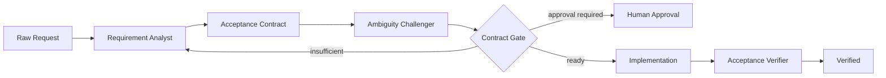

# Acceptance Contract Gate

A reusable AI engineering framework that converts ambiguous change requests into a verifiable acceptance contract before implementation begins.

## Problem

Coding agents often start implementing while key facts are still implicit: scope boundaries, expected behavior, edge cases, compatibility requirements, data rules, failure handling, and Definition of Done. This creates technically plausible code that may solve the wrong problem.

The Acceptance Contract Gate forces the agent to turn a request into explicit, testable obligations before editing code. It separates requirement interpretation from implementation and uses deterministic validation so an agent cannot declare a contract complete merely because it wrote one.

## When to use

Use this kit when a task contains ambiguity, incomplete acceptance criteria, cross-component impact, public behavior changes, data changes, external integrations, or multiple plausible interpretations.

Typical triggers:

- feature requests written in business language;
- bug reports without precise expected behavior;
- migration or refactoring requests with compatibility constraints;
- API or event changes;
- QA findings where the correct behavior is unclear;
- tasks involving role, permission, state, time, retry, or boundary rules.

For purely mechanical edits with deterministic expected output, the full gate may be skipped.

## Architecture



Components:

- **Skills**: requirement decomposition and ambiguity resolution.
- **Rules**: enforce evidence, scope boundaries, approval points, and non-invention.
- **Subagents**: Requirement Analyst and Ambiguity Challenger have distinct responsibilities.
- **Workflow**: defines the contract lifecycle from request to verified implementation.
- **Hooks**: run deterministic contract checks before implementation and completion.
- **Scripts**: validate the contract schema and detect unresolved obligations.
- **Schema/template**: provide a stable portable format.

## Package structure

```text
acceptance-contract-gate/
├── README.md
├── skills/
│   ├── requirement-decomposition.md
│   └── ambiguity-resolution.md
├── rules/
│   └── acceptance-contract-rules.md
├── subagents/
│   ├── requirement-analyst.md
│   └── ambiguity-challenger.md
├── workflows/
│   └── acceptance-contract-workflow.md
├── hooks/
│   └── hooks.md
├── scripts/
│   ├── validate-contract.py
│   └── check-unresolved-obligations.py
├── schemas/
│   └── acceptance-contract.schema.json
└── templates/
    └── acceptance-contract.example.json
```

## Installation

Copy this folder into a repository, for example:

```text
.ai/acceptance-contract-gate/
```

Requirements:

- Python 3.9+ for helper scripts;
- an AI coding agent with repository read access;
- write access only after the contract gate passes.

The kit is tool-neutral and can be adapted to Codex, Claude Code, Cursor, ChatGPT, GitHub Copilot, OpenCode, or other coding agents.

## Configuration

Optional environment variables:

- `ACCEPTANCE_CONTRACT`: contract path, default `acceptance-contract.json`;
- `ACCEPTANCE_REQUIRE_APPROVAL_FOR_HIGH_RISK`: default `1`;
- `ACCEPTANCE_MAX_REVIEW_LOOPS`: default `2`.

Customize project-specific protected areas and approval rules in `rules/acceptance-contract-rules.md`.

## Usage

Example request:

> When an employee becomes inactive, stop mail forwarding after the configured end time.

The Requirement Analyst must derive explicit obligations such as:

- what qualifies as inactive;
- which forwarding configurations are eligible;
- timezone semantics for end time;
- behavior when end time is missing;
- idempotency expectations;
- expected database state after cleanup;
- Exchange or external-system side effects;
- retry/failure behavior;
- tests and observable completion criteria.

The Ambiguity Challenger then attempts to find unstated choices. If a behavior materially changes depending on an unknown product decision, the contract cannot be marked ready without explicit approval or a documented safe assumption allowed by policy.

Validate before implementation:

```bash
python .ai/acceptance-contract-gate/scripts/validate-contract.py acceptance-contract.json
python .ai/acceptance-contract-gate/scripts/check-unresolved-obligations.py acceptance-contract.json
```

## Workflow

1. **Trigger** — receive a task with non-trivial behavioral meaning.
2. **Evidence gathering** — inspect request text, existing behavior, code, tests, contracts, and documentation.
3. **Requirement decomposition** — convert the request into actors, triggers, inputs, rules, outputs, side effects, failures, boundaries, and non-goals.
4. **Contract drafting** — create `acceptance-contract.json`.
5. **Ambiguity challenge** — independently search for contradictory, missing, or unverifiable obligations.
6. **Gate** — allow implementation only when blocking ambiguities are resolved and required approvals exist.
7. **Implementation** — build against the accepted contract.
8. **Verification** — map implementation and tests back to every required obligation.
9. **Completion** — report implementation status separately from verification status.

## Safety

Explicit human approval is required for contract decisions involving:

- breaking public API or event contracts;
- database schema changes;
- destructive data behavior;
- security/permission relaxation;
- production infrastructure/configuration;
- secrets;
- irreversible external side effects;
- choosing among materially different business behaviors when the source requirement does not decide.

The agent must not fabricate stakeholder intent to unblock itself.

## Verification

A task is **contract-ready** only when:

- contract structure is valid;
- required obligations are testable;
- blocking ambiguities are empty;
- assumptions are explicit;
- non-goals are explicit;
- high-risk decisions have approval records when required.

A task is **implemented** when code changes exist.

A task is **verified** only when each required obligation has evidence such as a test, static check, contract comparison, or documented manual verification.

## Failure and recovery

- Missing evidence: perform at most two targeted repository/document searches, then mark the obligation unresolved.
- Contradictory sources: stop and record the conflict; do not silently choose one.
- Validation failure: fix the contract structure before implementation.
- Same ambiguity after two review loops: escalate to human approval.
- Test failure: diagnose and retry at most twice for a genuinely transient cause; otherwise stop with evidence.

## Customization

Useful extension points:

- add domain-specific obligation types to the JSON schema;
- add project-specific protected surfaces;
- integrate the validation scripts into CI;
- add specialized challengers for security, database, or API compatibility;
- generate test-case skeletons from accepted obligations.
