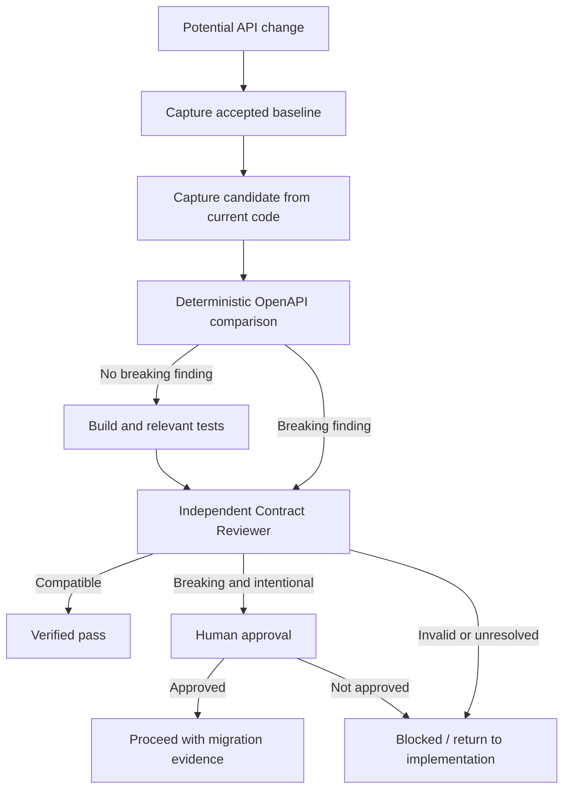

# Agent API Contract Regression Gate

A reusable AI-engineering package that prevents coding agents from silently introducing backward-incompatible HTTP API changes. It combines deterministic OpenAPI comparison with bounded agent review, explicit approval boundaries, test evidence, and recovery rules.

## Problem

AI coding agents can successfully implement a feature, pass local tests, and still break consumers by removing an endpoint, changing required inputs, removing documented responses, changing schema types, making optional fields required, or narrowing enums. Ad-hoc review is easy to miss and implementation success is not proof of contract compatibility.

This kit introduces a repeatable pre-merge/release gate that captures an accepted API baseline, captures the candidate contract from the change, runs deterministic compatibility checks, requires independent review, and blocks protected actions when a breaking contract is detected without approval.

## When to use

Use this package for changes that may affect public, partner, mobile, frontend, or service-to-service HTTP contracts, especially:

- feature implementation that changes endpoints or DTOs;
- controller/minimal-API refactoring;
- serializer/framework upgrades;
- dependency upgrades affecting OpenAPI generation;
- release preparation;
- AI-assisted bug fixes touching API boundaries;
- changes to required parameters, response codes, schemas, or enums.

## When not to use

Do not use this as the only validation for protocols not represented by OpenAPI, runtime-only behavioral compatibility, database schema compatibility, event contracts, or security behavior. Add domain-specific verification for those surfaces.

## Architecture



The deterministic comparator owns common machine-checkable compatibility findings. The AI reviewer owns context-sensitive semantic review but cannot erase deterministic evidence or self-approve a breaking public contract.

## Package tree

```text
agent-api-contract-regression-gate/
├── README.md
├── config/
│   └── gate.yaml
├── examples/
│   ├── baseline-openapi.json
│   └── candidate-openapi.json
├── hooks/
│   └── pre-merge.md
├── rules/
│   └── api-contract-safety.md
├── schemas/
│   └── contract-report.schema.json
├── scripts/
│   ├── capture-openapi.sh
│   ├── compare-openapi.py
│   └── verify-package.py
├── skills/
│   ├── capture-contract-baseline.md
│   └── compare-contracts.md
├── subagents/
│   └── contract-reviewer.md
├── tests/
│   └── test_compare_openapi.py
└── workflows/
    └── api-contract-regression-gate.md
```

## Component responsibilities

- `config/gate.yaml` defines gate policy, approval classes, retry limits, and conventional artifact paths for an orchestrator or coding-agent adapter.
- `rules/api-contract-safety.md` defines enforceable MUST/MUST NOT/SHOULD behavior.
- `skills/capture-contract-baseline.md` provides the reproducible baseline-capture procedure.
- `skills/compare-contracts.md` defines how deterministic findings and semantic review are combined.
- `subagents/contract-reviewer.md` defines the independent verification role; the implementer must not be the sole verifier for high-risk contract changes.
- `workflows/api-contract-regression-gate.md` defines the bounded end-to-end execution, retry, failure, approval, and Definition-of-Done logic.
- `hooks/pre-merge.md` defines the blocking lifecycle hook before merge.
- `scripts/capture-openapi.sh` retrieves or reads OpenAPI and normalizes it to JSON without persisting credentials.
- `scripts/compare-openapi.py` detects common breaking/non-breaking changes and emits a machine-readable report.
- `schemas/contract-report.schema.json` defines the report handoff contract.
- `tests/test_compare_openapi.py` verifies the comparator against representative compatibility cases.
- `scripts/verify-package.py` verifies required kit files, JSON validity, Python syntax, README references, and forbidden placeholder phrases.
- `examples/*.json` provide a baseline/candidate pair containing intentional breaking changes for a smoke test.

## Dependencies

Required:

- Python 3.9+.
- Bash for `scripts/capture-openapi.sh`.
- `curl` only when capturing from HTTP(S).

Optional:

- `PyYAML` when the OpenAPI source is YAML instead of JSON.

The comparator itself uses only the Python standard library for JSON input.

## Installation

Copy the `agent-api-contract-regression-gate` directory into your repository's agent/tooling area. Keep paths intact unless you update references consistently.

On Unix-like systems, make scripts executable if desired:

```bash
chmod +x scripts/capture-openapi.sh scripts/compare-openapi.py scripts/verify-package.py
```

Create an ignored working directory for generated evidence if your repository does not already have one:

```bash
mkdir -p artifacts
```

Do not commit secrets or authentication material into this package or generated reports.

## Configuration

Adjust `config/gate.yaml` to match orchestration policy. The default policy classifies these as breaking:

- removed API path;
- removed HTTP method;
- removed documented response;
- newly required parameter;
- existing parameter becoming required;
- required schema property added;
- schema type/reference change;
- enum narrowing.

`config/gate.yaml` is the orchestration policy contract. `scripts/compare-openapi.py` implements the default deterministic checks above directly; if you customize policy semantics, update the comparator and its tests in the same change.

Default generated paths:

```text
artifacts/openapi-baseline.json
artifacts/openapi-candidate.json
artifacts/api-contract-report.json
```

## Permissions

Use least privilege. Reading repository code, generating OpenAPI, reading an approved contract artifact, and running local build/tests are normally sufficient.

Do not silently broaden permissions to fetch a protected contract. Authentication for remote retrieval must be configured externally; `scripts/capture-openapi.sh` intentionally does not accept or persist secrets.

The package requires explicit human approval before merge/release/deploy when a confirmed breaking public contract remains intentional. It does not authorize production deployment, destructive SQL, schema migration, data deletion, secret changes, infrastructure changes, force-push, security weakening, or other protected actions.

## Usage

### 1. Capture the accepted baseline

From a file:

```bash
./scripts/capture-openapi.sh path/to/released-openapi.json artifacts/openapi-baseline.json
```

From an approved URL:

```bash
./scripts/capture-openapi.sh https://example.test/openapi.json artifacts/openapi-baseline.json
```

### 2. Capture the candidate

Generate OpenAPI from the exact candidate build, then normalize it:

```bash
./scripts/capture-openapi.sh path/to/current-openapi.json artifacts/openapi-candidate.json
```

### 3. Compare

```bash
python3 scripts/compare-openapi.py \
  --baseline artifacts/openapi-baseline.json \
  --candidate artifacts/openapi-candidate.json \
  --output artifacts/api-contract-report.json
```

Exit codes:

- `0`: comparison completed with no detected breaking changes;
- `2`: comparison completed and breaking changes were detected; workflow state becomes `needs-approval`;
- `1`: input/tool/validation error; treat as blocked, not passed.

### 4. Run repository-native verification

Run the build and the relevant unit/integration/contract tests defined by the target repository. The kit intentionally does not guess project-specific build commands.

### 5. Independent review

Hand the comparison report, relevant diff, build/test evidence, and acceptance criteria to `subagents/contract-reviewer.md`. The reviewer checks both deterministic findings and semantic compatibility that OpenAPI cannot represent.

## Example invocation

The supplied example intentionally contains a new required query parameter, a removed `404` response, and enum narrowing:

```bash
python3 scripts/compare-openapi.py \
  --baseline examples/baseline-openapi.json \
  --candidate examples/candidate-openapi.json \
  --output artifacts/example-report.json
```

Expected result: exit code `2` and report status `needs-approval` with breaking findings.

## Testing the comparator

```bash
python3 -m unittest tests/test_compare_openapi.py -v
```

The tests cover identical contracts, path removal, required-parameter addition, enum narrowing, and a non-breaking added path.

## Workflow

Follow `workflows/api-contract-regression-gate.md`:

1. inspect repository/API context;
2. identify accepted baseline;
3. capture baseline;
4. generate and capture candidate;
5. run deterministic comparison;
6. run relevant build/tests;
7. delegate independent compatibility review;
8. stop for human approval if a breaking contract is intentional;
9. preserve evidence and complete final verification.

Capture retries are bounded at 2 for transient network failures. Comparison retries are bounded at 1 after corrected/regenerated input. Build/test remediation is bounded at 2 cycles before escalation. Permission failures do not trigger privilege escalation.

## Approval boundaries

Human approval is mandatory for a confirmed breaking public contract, including endpoint removal, newly required consumer input, enum narrowing, schema incompatibility, or equivalent semantic breakage discovered by the reviewer.

Approval means the change may proceed with migration evidence; it does not mean the finding disappears. Preserve the report and document consumer migration requirements.

## Failure handling

- **Transient capture failure:** retry at most 2 times and preserve the last error.
- **Invalid contract:** stop, regenerate/fix input, then allow at most 1 comparison retry.
- **Comparison tool failure:** stop as `error`; never interpret missing output as pass.
- **Build/test failure:** return to implementation with evidence; maximum 2 fix/retest cycles before escalation.
- **Permission failure:** stop and request authorized access; never widen permissions automatically.
- **Breaking change without approval:** stop as `needs-approval` before protected actions.
- **Repeated unresolved failure:** stop as `blocked` with artifacts, logs, findings, and unresolved risk preserved.

## Verification

For the package itself:

```bash
python3 scripts/verify-package.py .
python3 -m unittest tests/test_compare_openapi.py -v
```

For use in a target repository, success requires evidence that:

- accepted baseline and exact candidate were captured;
- deterministic comparison completed;
- report is parseable and complete;
- relevant build/tests passed;
- independent contract review completed;
- no unapproved breaking contract remains;
- remaining semantic risks are documented.

## Definition of Done

The gate is complete only when all of the following are true:

- required API context was gathered;
- baseline identity is known and accepted;
- candidate corresponds to the exact change under review;
- baseline and candidate artifacts exist;
- deterministic comparison completed successfully;
- relevant build/tests passed;
- independent review completed;
- any intentional breaking change has explicit human approval;
- report/output contract is satisfied;
- unresolved risks are documented;
- no blocking validation, permission, tool, or test failure remains.

Task execution alone is not verification. Generating code or an OpenAPI file does not prove compatibility.

## Customization

Keep the core workflow tool-neutral. Adapters for Codex, Claude Code, Cursor, ChatGPT, GitHub Copilot, OpenCode, or another agent should map their tool permissions and lifecycle hooks to the same skills, rules, workflow states, report schema, and approval boundaries.

When adding new compatibility checks, update `scripts/compare-openapi.py`, add representative cases to `tests/test_compare_openapi.py`, and keep `config/gate.yaml`, `skills/compare-contracts.md`, `workflows/api-contract-regression-gate.md`, and this README consistent.
