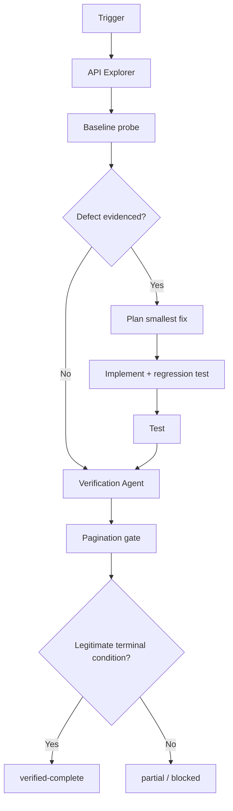

# Agent API Pagination Completeness Gate

A reusable agent workflow and deterministic verification gate for proving that paginated API integrations retrieve complete collections rather than silently stopping early, looping, skipping pages, or counting duplicates as success.

## Problem
Paginated integrations often fail without obvious HTTP errors: a cursor is not propagated, a Link header is ignored, offset arithmetic is wrong, a final page is misdetected, retries resume from the wrong location, or unstable ordering causes missing/duplicate records. A successful first request is not evidence that the full collection was retrieved.

## Purpose
This package gives coding agents and developers a bounded workflow to investigate pagination, repair evidenced defects, and independently verify completeness using deterministic tooling.

## When to use
Use when adding or changing API clients, sync/background jobs, export tools, crawlers, SDK wrappers, production investigations involving count mismatches, or any task where all records must be retrieved.

## When not to use
Do not use it to mutate remote API data, bypass provider rate limits, increase privileges, or infer completeness for streaming/unbounded feeds that have no meaningful terminal condition.

## Architecture


## Package tree
```text
agent-api-pagination-completeness-gate/
├── README.md
├── config/
│   └── pagination-policy.yaml
├── examples/
│   └── sample-result.json
├── hooks/
│   └── lifecycle.md
├── rules/
│   └── pagination-safety.md
├── schemas/
│   └── pagination-result.schema.json
├── scripts/
│   ├── pagination_gate.py
│   └── verify_package.py
├── skills/
│   ├── pagination-investigation.md
│   └── pagination-remediation.md
├── subagents/
│   ├── api-explorer.md
│   └── verification-agent.md
├── templates/
│   └── pagination-report.md
├── tests/
│   └── test_pagination_gate.py
└── workflows/
    └── api-pagination-completeness.md
```

## Components
- `skills/pagination-investigation.md`: read-only procedure for tracing pagination and gathering evidence.
- `skills/pagination-remediation.md`: minimal-change remediation procedure with bounded test/fix loops.
- `rules/pagination-safety.md`: enforceable safety, retry, evidence, and approval rules.
- `subagents/api-explorer.md`: read-only investigator.
- `subagents/verification-agent.md`: independent verifier; it must not be the implementation owner.
- `workflows/api-pagination-completeness.md`: end-to-end orchestration and Definition of Done.
- `hooks/lifecycle.md`: deterministic pre-task, post-edit, and final verification hooks.
- `scripts/pagination_gate.py`: HTTP pagination probe with duplicate and loop detection.
- `scripts/verify_package.py`: verifies that all required package files exist and contain no omitted implementation markers.
- `schemas/pagination-result.schema.json`: result contract.
- `templates/pagination-report.md`: evidence/report handoff format.

## Installation
Requires Python 3.10+.

```bash
python -m pip install requests pyyaml pytest
```

Optional JSON Schema validation can use:

```bash
python -m pip install jsonschema
```

## Configuration
Edit `config/pagination-policy.yaml` to match repository limits. Safe defaults cap traversal at 500 pages or 100,000 items, use 30-second request timeouts, and permit at most two retries per transient page failure.

Credentials must be supplied by the host environment or secret store. Do not place API tokens in this package, command history, result JSON, or reports.

## Permissions
The normal workflow requires read-only repository access, test execution, and read-only HTTP access to the target API. It does not require production write access, deployment rights, secret-management rights, or infrastructure mutation permissions.

## Usage
### Link-header pagination
```bash
python scripts/pagination_gate.py \
  --url "https://api.example.test/items" \
  --mode link \
  --items-field data \
  --id-field id \
  --header "Authorization:Bearer $API_TOKEN"
```

### Cursor pagination
```bash
python scripts/pagination_gate.py \
  --url "https://api.example.test/items" \
  --mode cursor \
  --items-field data.items \
  --cursor-field meta.next_cursor \
  --cursor-param cursor \
  --id-field id
```

### Page-number pagination
```bash
python scripts/pagination_gate.py \
  --url "https://api.example.test/items" \
  --mode page-number \
  --items-field items \
  --limit 100 \
  --id-field id
```

### Offset pagination
```bash
python scripts/pagination_gate.py \
  --url "https://api.example.test/items" \
  --mode offset \
  --items-field items \
  --limit 100 \
  --id-field id
```

The script writes `pagination-result.json` and exits 0 only for `verified-complete`. `partial` or `blocked` exits 2.

## Workflow
1. API Explorer identifies pagination contract, entry points, ordering, retries, item identity, and termination logic.
2. Capture a baseline with existing tests and a safe gate run.
3. If there is no evidenced defect, move directly to independent verification.
4. If a defect is evidenced, implement the smallest compatible fix and regression test.
5. Run focused tests, then the relevant suite.
6. Verification Agent independently runs the gate and validates terminal evidence.
7. Complete only when the result is `verified-complete` and all Definition of Done checks are satisfied.

## Input/output contract
Inputs are endpoint, pagination mode, item identity field, page/cursor metadata, policy, optional externally supplied headers, and repository-specific tests/context.

Output follows `schemas/pagination-result.schema.json` and contains status, mode, pages fetched, total/unique items, duplicate count, loop count, terminal evidence, and errors. A vague statement such as “sync completed” is not a valid handoff.

## Safety boundaries and approval
The gate itself performs GET requests only. Agents must stop for explicit human approval before production deployment, production configuration changes, credential/secret changes, infrastructure changes, destructive data operations, breaking API contracts, or any security-control weakening. Lack of permission is a blocking condition, not justification to escalate privilege.

## Failure and recovery
Transient 429/5xx/network failures may retry at most two times per page. A repeated cursor/target immediately stops traversal as `partial`. Authentication failures, invalid response shapes, or ambiguous provider contracts become `blocked`. Safety-cap exhaustion becomes `partial`. Remediation allows at most two test-fix-retest attempts; repeated failure stops with preserved evidence.

## Verification
Run package self-verification:

```bash
python scripts/verify_package.py
```

Run unit tests:

```bash
pytest -q tests/test_pagination_gate.py
```

Then run the gate against a safe representative endpoint/fixture. Completion requires a legitimate terminal condition, `loopsDetected == 0`, empty `errors`, relevant tests passing, and a scoped diff when code was changed.

## Definition of Done
- Pagination mode and documented termination rule are known.
- Required context and evidence were gathered.
- Any defect was reproduced or supported by concrete logs/tests before remediation.
- Required source/test changes exist and are scoped to the problem.
- Relevant tests pass.
- Independent verification completed.
- `pagination-result.json` reports `verified-complete` with valid terminal evidence, no loop, and no blocking error.
- Required human approvals exist for any approval-boundary action.
- Remaining risks such as unstable provider ordering are documented.
- No blocking failure remains.

## Customization
Keep the core skills, rules, status values, retry bounds, and result contract stable. Adapt endpoint arguments, item/cursor fields, test commands, and policy limits per repository. Tool-specific agent adapters may wrap this package, but should not merge implementation and independent verification ownership.
