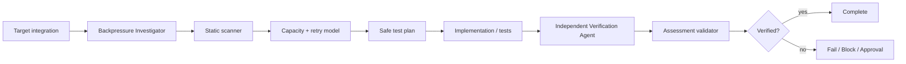

# Agent API Rate Limit & Backpressure Gate

A reusable engineering gate for outbound API integrations that verifies throttling behavior, bounded concurrency, bounded pending work, retry safety, and recovery under downstream degradation.

## Problem
Outbound integrations often fail safely at low traffic but amplify incidents under burst load: fan-out creates too many concurrent calls, 429/503 responses trigger synchronized retries, queues grow without bounds, or `Retry-After` is ignored. The result can be retry storms, latency collapse, memory growth, cascading failures, and prolonged recovery after the downstream service becomes healthy.

## Purpose
This package gives an AI coding agent a concrete investigation and verification loop plus deterministic scanner/validator scripts. It separates heuristic detection from evidence-based verification and requires an independent verifier before `pass`.

## When to use
Use when adding or changing HTTP/API integrations, bulk/batch fan-out, queue consumers, polling jobs, webhook processors, retry policies, rate limiters, worker counts, or when investigating 429/503 spikes and downstream overload.

## When not to use
Do not use scanner findings alone as proof of a defect. Do not use this package to increase production quotas, concurrency, worker counts, infrastructure capacity, or production configuration without explicit approval.

## Architecture


## Package tree
```text
agent-api-rate-limit-backpressure-gate/
├── README.md
├── config/rate-limit-policy.json
├── schemas/assessment.schema.json
├── scripts/scan-rate-limit-risk.py
├── scripts/validate-assessment.py
├── skills/rate-limit-backpressure-assessment.md
├── rules/rate-limit-safety.md
├── subagents/backpressure-investigator.md
├── subagents/verification-agent.md
├── workflows/rate-limit-backpressure-gate.md
├── hooks/lifecycle-hooks.md
├── examples/assessment.json
└── tests/self-test.py
```

## Component responsibilities
`skills/rate-limit-backpressure-assessment.md` defines the reusable procedure. `rules/rate-limit-safety.md` defines mandatory and forbidden behavior. `subagents/backpressure-investigator.md` owns context and hypothesis formation while `subagents/verification-agent.md` independently validates the outcome. `workflows/rate-limit-backpressure-gate.md` defines the bounded end-to-end workflow. `scripts/scan-rate-limit-risk.py` reports suspicious retry/fan-out/queue patterns; its output is advisory. `scripts/validate-assessment.py` enforces the output contract. `tests/self-test.py` exercises both scripts. `config/rate-limit-policy.json` centralizes default thresholds and approval boundaries.

## Dependencies
Python 3.9+ for bundled scripts. No third-party Python packages are required. Repository-specific tests/build tools remain unchanged.

## Installation
Copy this directory into a repository or agent-instruction location while preserving relative paths. Adjust `config/rate-limit-policy.json` only when repository policy is stricter or provider-specific limits are known.

## Permissions
Default operation requires repository read access and permission to run local non-destructive tests/builds. Read-only telemetry is allowed. Production deployment/configuration, infrastructure changes, breaking contracts, large dependency upgrades, quota changes, and other dangerous actions require explicit human approval.

## Usage
Run the static risk scanner:

```bash
python3 scripts/scan-rate-limit-risk.py /path/to/repository --output scan.json
```

Exit `0` means no heuristic hits, `1` means findings require review, and `2` means invalid invocation/input.

Follow the assessment skill and workflow, then validate the final assessment:

```bash
python3 scripts/validate-assessment.py assessment.json
```

Run the package self-test:

```bash
python3 tests/self-test.py
```

## Required analysis model
For each downstream boundary, identify producer rate, pending-work capacity, worker count, nested fan-out, maximum in-flight requests, retryable statuses/exceptions, delay strategy, jitter, `Retry-After`/reset metadata handling, maximum attempt/time budget, timeout/cancellation behavior, rejection/admission behavior, and recovery semantics.

A retry policy is not sufficient backpressure. The package requires both retry control and admission/concurrency control so that throttling decreases or bounds request pressure rather than multiplying it.

## Test scenarios
A meaningful verification should include a deterministic downstream stub where practical and cover: a 429 response with `Retry-After`; repeated transient 503 responses; a burst larger than configured parallelism; queue/admission saturation; non-retryable failures; and downstream recovery. Evidence should include request timestamps/counts, retry attempts, peak in-flight requests, queue/rejection behavior, and final recovery.

## Verification
`Task executed` is not `Task verified successfully`. Status `pass` requires all assessment verification flags to be true: `retry_after_tested`, `parallelism_bounded`, `queue_bounded`, and `storm_tested`. The Verification Agent must independently challenge the implementation and evidence.

## Retry and recovery
The engineering workflow itself allows at most two reruns for transient tool/test-environment failures. It never retries deterministic failures without diagnosis/change. Preserve failing inputs, command output, request timeline, and attempt number. After two transient failures, mark the assessment `blocked` and escalate.

For the application under review, retries must be bounded by attempts and/or total time. They should honor provider metadata when contractually defined and use jitter for concurrent clients. Recovery testing must verify the integration resumes useful throughput without immediately recreating overload.

## Approval boundaries
Stop before production configuration or deployment, infrastructure changes, breaking API contracts, large dependency upgrades, quota/worker/concurrency increases, or any irreversible action. Never silently increase permissions or production capacity to make a test pass.

## Failure handling
Unknown provider throttling semantics produce `blocked` until evidence is available. Pressure amplification or unbounded work produces `fail`. A necessary dangerous remediation produces `needs-approval` before mutation. Permission or environment failures preserve evidence and become `blocked`.

## Definition of Done
The downstream call path and pressure boundaries are mapped; retryable failures and retry budget are explicit; provider throttling metadata behavior is known; concurrency and pending work are bounded; 429 and storm/saturation/recovery scenarios were tested; request pressure remained bounded; independent verification completed; assessment validates against `schemas/assessment.schema.json`; required approvals exist; remaining risks are recorded; and no blocking failure remains for a `pass` verdict.

## Customization
Tune `default_max_parallelism` and provider-specific retry statuses only with evidence. Add deterministic scanner patterns when they materially improve signal. Keep scanner findings advisory and preserve the separation between static suspicion and runtime proof.
