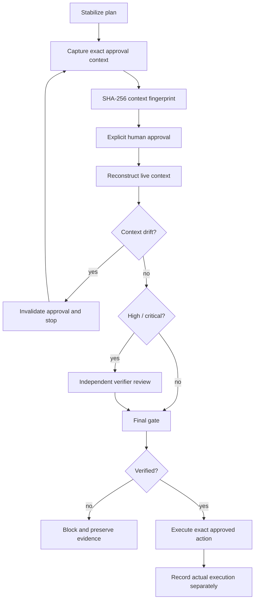

# Agent Approval Context Drift Gate

A reusable guardrail for AI-assisted workflows that require human approval before dangerous or high-risk actions. It prevents an approval from being reused after the actual execution context has changed.

## Problem

A human may approve a production deployment, migration, force push, infrastructure change, secret/config update, breaking API change, or other risky action based on one specific plan. After approval, an agent may edit code, rebase, change commands, target different resources, receive broader permissions, or switch environment. The old approval may still look valid in conversation history even though it no longer describes what will execute.

This package makes approval **context-bound rather than conversational**. Approval is tied to a deterministic SHA-256 fingerprint that covers the task, risk, action type, target environment, repository revision, final plan, target resources, commands/tool calls, effective permissions, executor, and dangerous-action flag.

## When to use

Use before consuming approval for:

- production deployment
- destructive SQL
- database schema changes or data deletion
- file/resource deletion
- force push or Git history rewrite
- infrastructure changes
- secret changes
- production configuration changes
- breaking API contracts
- weakening security controls
- irreversible migrations
- large dependency upgrades
- any high/critical action where the human decision depends on exact scope

It is also useful for long-running agents where approval may be separated from execution by many edits or tool calls.

## When not to use

Do not use this as a substitute for authorization, RBAC, change management, deployment policy, or runtime safety controls. It proves that approval evidence matches the current declared execution context; it does not prove the external action succeeded or that the action itself is correct.

## Architecture



## Components

- `config/approval-context-policy.json` — risk/review/approval policy and fail-closed conditions.
- `schemas/approval-context.schema.json` — exact execution context contract.
- `schemas/approval-record.schema.json` — human approval contract.
- `schemas/context-drift-report.schema.json` — deterministic drift comparison output.
- `schemas/approval-review.schema.json` — independent high/critical review contract.
- `scripts/fingerprint-context.py` — computes a canonical SHA-256 context fingerprint.
- `scripts/evaluate-context-drift.py` — compares approved and current contexts and lists changed fields.
- `scripts/evaluate-final-gate.py` — blocks stale approval, rejected approval, missing review, or self-review.
- `skills/capture-approval-context.md` — procedure for freezing and fingerprinting approval scope.
- `skills/revalidate-approval-context.md` — just-in-time revalidation procedure.
- `rules/approval-context-governance.md` — MUST/MUST NOT/SHOULD safety rules.
- `subagents/approval-context-curator.md` — owns context capture and reconstruction.
- `subagents/approval-context-verifier.md` — independent high/critical verifier.
- `workflows/approval-context-drift-workflow.md` — end-to-end bounded workflow.
- `hooks/approval-context-hooks.md` — lifecycle hooks for capture, invalidation, drift detection, review, and final gate.
- `templates/approval-context.example.json` — example context structure.
- `templates/approval-record.example.json` — example human approval record.
- `tests/smoke-test.py` — stdlib-only smoke tests for clean, drifted, stale-approval, and self-review paths.

## Package tree

```text
agent-approval-context-drift-gate/
├── README.md
├── config/
│   └── approval-context-policy.json
├── hooks/
│   └── approval-context-hooks.md
├── rules/
│   └── approval-context-governance.md
├── schemas/
│   ├── approval-context.schema.json
│   ├── approval-record.schema.json
│   ├── approval-review.schema.json
│   └── context-drift-report.schema.json
├── scripts/
│   ├── evaluate-context-drift.py
│   ├── evaluate-final-gate.py
│   └── fingerprint-context.py
├── skills/
│   ├── capture-approval-context.md
│   └── revalidate-approval-context.md
├── subagents/
│   ├── approval-context-curator.md
│   └── approval-context-verifier.md
├── templates/
│   ├── approval-context.example.json
│   └── approval-record.example.json
├── tests/
│   └── smoke-test.py
└── workflows/
    └── approval-context-drift-workflow.md
```

## Dependencies

Runtime scripts use Python 3.9+ standard library only. No network access or third-party Python package is required by the deterministic core.

The host repository or agent platform still provides the real repository revision, resource inventory, command/tool-call set, effective permission set, environment identity, and execution mechanism.

## Installation

Copy this directory into the repository or shared agent-tooling repository. Keep the relative paths intact unless all hook/workflow references are updated together.

Review `config/approval-context-policy.json` and make local policy stricter where required. Do not weaken approval requirements merely to make an automated workflow pass.

## Configuration

The default fingerprint binds these context fields:

1. `task_id`
2. `risk`
3. `action_type`
4. `target_environment`
5. `repository_revision`
6. `plan_fingerprint`
7. `resource_fingerprint`
8. `command_fingerprint`
9. `permission_fingerprint`
10. `actor_id`
11. `dangerous_action`

The plan/resource/command/permission values are themselves SHA-256 fingerprints. Build them from canonical sorted representations in the host workflow. For example, sort resource identifiers and permission scopes before hashing so ordering noise does not cause false drift.

## Permissions

The curator and verifier require read access to the repository revision, intended target resources, command/tool-call descriptions, environment identity, and effective permission scopes.

The verifier does not need effectful permissions. Least privilege is preferred: verification should normally remain read-only.

The executing agent must not silently increase permissions after approval. Any permission change changes `permission_fingerprint` and invalidates approval.

## Usage

### 1. Build the context

Start from `templates/approval-context.example.json` and replace example values with exact current data. Compute deterministic fingerprints for the final plan, target resource set, command/tool actions, and effective permission set.

### 2. Fingerprint the context

```bash
python3 scripts/fingerprint-context.py context.json --output context-fingerprint.json
```

Present the human approver with both a readable action summary and the returned fingerprint.

### 3. Store explicit approval

Create an approval record matching `schemas/approval-record.schema.json`. The `context_fingerprint` must exactly equal the approved context fingerprint. Never rewrite the approval after context changes.

### 4. Reconstruct the live context before execution

Re-read the repository revision, final plan, resources, commands, permissions, actor, target environment, action type, and risk. Do not copy them from the old approval context without checking live state.

### 5. Detect drift

```bash
python3 scripts/evaluate-context-drift.py approved-context.json current-context.json --output drift.json
```

Exit codes:

- `0` — unchanged
- `3` — drifted; stop and obtain a new approval
- `2` — invalid input/runtime validation error

Any changed bound field invalidates the old approval.

### 6. Independent review for high/critical risk

The `approval-context-verifier` independently recomputes the current fingerprint and emits a review matching `schemas/approval-review.schema.json`. The reviewer must not be the executor.

### 7. Final gate

High/critical example:

```bash
python3 scripts/evaluate-final-gate.py current-context.json approval.json \
  --review review.json \
  --policy config/approval-context-policy.json
```

For low/medium risk, `--review` may be omitted only when local policy does not require it.

Exit codes:

- `0` — verified
- `3` — blocked
- `2` — invalid input/runtime validation error

Only `verified` permits the workflow to proceed to the exact approved side effect.

## Example invocation in an agent loop

```text
Planner finishes production deployment plan
→ Curator hashes exact revision/resources/commands/permissions/environment
→ Human approves fingerprint 9f…
→ Agent rebases before deploy
→ Curator reconstructs context
→ repository_revision changes
→ evaluate-context-drift returns drifted
→ old approval is invalid
→ agent stops and requests approval for new fingerprint
```

This is the intended behavior. A rebase may not change business intent, but it changes the executable source revision and therefore the evidence the approver originally reviewed.

## Approval boundaries

Explicit human approval is required before dangerous actions including production deployment, destructive SQL, database schema/data/file deletion, force push/history rewrite, infrastructure changes, secret changes, production configuration changes, breaking API contracts, weakening security controls, irreversible migrations, and large dependency upgrades.

Agents must stop before these actions. Approval must bind the exact current context. Similar previous approval is not sufficient.

## Failure and recovery

### Context drift
Detection: `evaluate-context-drift.py` returns `drifted`.  
Recovery: preserve both contexts and drift report, rebuild current context, obtain a new approval.  
Retry: no automatic retry of the same stale approval.

### Transient repository/tool read failure
Detection: source state cannot be read reliably.  
Recovery: preserve the error and retry once.  
Stop: second failure blocks execution and escalates.

### Permission failure
Detection: required read or execution permission is absent.  
Recovery: stop and escalate.  
Forbidden recovery: silently widening permissions.

### Approval/review rejection
Detection: `approved=false` or review status is not `approved`.  
Recovery: stop; change the plan/context only through normal planning, then request a new approval if appropriate.  
Retry: never retry deterministic rejection as though it were transient.

### Ambiguous execution outcome
If an effectful tool times out or disconnects after execution begins, do not assume success or failure. Preserve the result and reconcile actual external state before replaying the action. The approval gate does not solve duplicate-side-effect recovery by itself.

## Verification

A task is only approval-verified when:

- the current context can be reconstructed from live state;
- current and approved context fingerprints are identical;
- approval is explicit and approved;
- high/critical review is independently approved and not self-review;
- permissions have not expanded;
- target environment/resources/commands have not changed;
- final gate returns `verified`.

This verifies approval applicability. It does not prove the external operation executed successfully.

## Definition of Done

- Exact approval context exists and includes every configured bound field.
- Plan, resource, command, and permission fingerprints are deterministic.
- Explicit approval references the exact context fingerprint.
- Just-in-time current context was reconstructed from live state.
- Drift evaluation reports `unchanged`.
- High/critical work has an independent approved review from a non-executor.
- Final gate reports `verified`.
- Dangerous actions did not execute before approval verification.
- Actual execution evidence, when execution occurs, is stored separately.
- Remaining uncertainty or unresolved risk is documented rather than presented as verified.

## Smoke test

The included smoke test is stdlib-only:

```bash
python3 tests/smoke-test.py
```

It covers an unchanged context that passes, repository-revision drift, a stale approval after plan change, and high-risk self-review blocking.

## Portability

The core is tool-neutral. It can be used with OpenAI Codex, Claude Code, Cursor, ChatGPT, GitHub Copilot, OpenCode, custom MCP agents, CI orchestrators, or human-operated scripts. Tool-specific adapters only need to provide the exact context inputs; they should not change the approval semantics.

## Customization

You may add new bound fields such as deployment artifact digest, database migration checksum, feature-flag set, cloud account ID, tenant ID, or container image digest. When adding fields, update the schema, fingerprint scripts, policy documentation, workflow, smoke tests, and README together. A field that can materially change what the human is authorizing should normally be fingerprint-bound.
