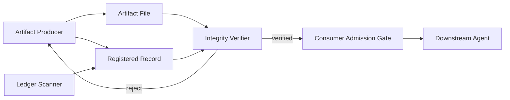

# Agent Artifact Integrity Gate

## Problem
Multi-agent and long-running AI workflows often persist intermediate artifacts such as plans, context bundles, reports, generated patches, test summaries, migration plans, or research outputs. A later stage may consume those files after they were edited, expired, copied from another task, produced from stale dependencies, or generated by a failed stage. File existence alone does not prove that an artifact is safe to trust.

This kit adds provenance, SHA-256 integrity, freshness, task/repository binding, source lineage, independent verification, and a deterministic admission gate before downstream consumption.

## Purpose
Use this package to turn agent artifacts into explicitly registered and verifiable workflow inputs instead of informal files passed between agents.

## When to use
Use when:
- multiple agents hand off files;
- a workflow resumes after interruption;
- artifacts are cached or reused later;
- generated plans drive implementation;
- research or test outputs influence high-risk decisions;
- migration, release, security, or production stages depend on prior agent output.

## When not to use
Do not add the ledger to disposable outputs that are generated and consumed synchronously inside one trusted process and never persisted. This package validates artifact integrity and provenance; it does not replace semantic review of whether the artifact's conclusions are correct.

## Architecture


The Artifact Producer owns generation and registration but cannot self-certify high-trust use. The Integrity Verifier independently checks bytes, scope, freshness and lineage. Hooks run deterministic scripts before consumption, commit, and completion. The ledger scanner detects tampering, expired records, missing source lineage, duplicate IDs, and missing artifact files.

## Component responsibilities
- `skills/artifact-registration.md`: producer-side registration procedure.
- `skills/artifact-consumption.md`: downstream admission procedure.
- `rules/artifact-integrity-rules.md`: enforceable MUST/MUST NOT/SHOULD controls.
- `subagents/artifact-producer.md`: generation/provenance owner.
- `subagents/integrity-verifier.md`: independent integrity reviewer.
- `workflows/artifact-integrity-workflow.md`: end-to-end lifecycle and bounded recovery loops.
- `hooks/artifact-integrity-hooks.md`: lifecycle commands.
- `scripts/register-artifact.py`: creates a record and SHA-256 hash.
- `scripts/verify-artifact.py`: validates current bytes, freshness, scope and verification state.
- `scripts/mark-artifact-verified.py`: independently promotes a valid record to `verified` and prevents producer=self-verifier.
- `scripts/check-artifact-ledger.py`: scans a ledger directory for integrity violations.
- `config/artifact-policy.json`: portable policy defaults.
- `schemas/artifact-record.schema.json`: record contract.
- `templates/artifact-record.example.json`: example record shape.
- `examples/consumer-admission-example.md`: realistic consumer gate example.

## Package tree
```text
agent-artifact-integrity-gate/
├── README.md
├── skills/
│   ├── artifact-registration.md
│   └── artifact-consumption.md
├── rules/
│   └── artifact-integrity-rules.md
├── subagents/
│   ├── artifact-producer.md
│   └── integrity-verifier.md
├── workflows/
│   └── artifact-integrity-workflow.md
├── hooks/
│   └── artifact-integrity-hooks.md
├── scripts/
│   ├── register-artifact.py
│   ├── verify-artifact.py
│   ├── mark-artifact-verified.py
│   └── check-artifact-ledger.py
├── config/
│   └── artifact-policy.json
├── schemas/
│   └── artifact-record.schema.json
├── templates/
│   └── artifact-record.example.json
└── examples/
    └── consumer-admission-example.md
```

## Installation
Copy this folder into the target repository. Python 3.10+ is sufficient; scripts use only the standard library.

Recommended runtime directories:
```text
.agent-artifacts/
├── outputs/
└── records/
```

Add `.agent-artifacts/` to `.gitignore` if artifacts may contain private task data. If integrity records are intended to be auditable repository assets, store records separately from sensitive output files.

## Configuration
Edit `config/artifact-policy.json`.

Important fields:
- `default_ttl_hours`: normal artifact freshness period.
- `max_ttl_hours`: upper policy bound.
- `require_repository_binding`: prevent cross-repository reuse.
- `require_task_binding`: prevent cross-task reuse.
- `require_independent_verification_for`: consumer categories that require `verified` state.
- `blocking_producer_statuses`: producer outcomes that cannot be consumed.

Environment variables used by the hook examples:
- `ARTIFACT_PATH`
- `ARTIFACT_RECORD`
- `TASK_ID`
- `REPOSITORY_ID`
- `PRODUCER`
- `ARTIFACT_TYPE`
- `ARTIFACT_TTL_HOURS` optional, default 24
- `ARTIFACT_LEDGER_DIR` optional, default `.agent-artifacts/records`

No secrets are required.

## Usage
### 1. Register an artifact
```bash
python scripts/register-artifact.py \
  --artifact .agent-artifacts/outputs/implementation-plan.md \
  --record .agent-artifacts/records/implementation-plan.json \
  --task-id TASK-1842 \
  --repository-id owner/repository \
  --repository-ref main@abc123 \
  --producer planner-agent \
  --artifact-type implementation-plan \
  --ttl-hours 24
```

The record starts as `registered`, not `verified`.

### 2. Independent verification
```bash
python scripts/mark-artifact-verified.py \
  --artifact .agent-artifacts/outputs/implementation-plan.md \
  --record .agent-artifacts/records/implementation-plan.json \
  --policy config/artifact-policy.json \
  --task-id TASK-1842 \
  --repository-id owner/repository \
  --verifier integrity-verifier
```

This command refuses producer=self-verifier.

### 3. Consumer admission
```bash
python scripts/verify-artifact.py \
  --artifact .agent-artifacts/outputs/implementation-plan.md \
  --record .agent-artifacts/records/implementation-plan.json \
  --policy config/artifact-policy.json \
  --task-id TASK-1842 \
  --repository-id owner/repository \
  --require-verified
```

Exit codes:
- `0`: checks passed.
- `10`: integrity/policy violation.
- `2`: operational/configuration error.

### 4. Scan the ledger
```bash
python scripts/check-artifact-ledger.py \
  --ledger .agent-artifacts/records \
  --policy config/artifact-policy.json
```

## Workflow
```text
Produce
  ↓
Register artifact + SHA-256
  ↓
Producer sanity verification
  ↓
Independent Integrity Verifier
  ↓
Verified?
 ├─ No → revise/regenerate (max 2 revisions) → verify again
 └─ Yes
      ↓
Consumer admission gate
      ↓
Downstream stage
      ↓
Ledger validation
      ↓
Verified completion
```

Transient filesystem/tool failures may retry once. Producer revisions are capped at two. Hash mismatch requires regeneration or re-registration; it must never be bypassed by approval.

## Approval boundaries
Explicit human approval is required to:
- override a blocking integrity decision;
- reuse an artifact across another task;
- reuse an artifact across another repository;
- let a high-trust stage consume an artifact without independent verification.

Human approval cannot make mismatched bytes trustworthy. A hash mismatch always requires a new/re-registered artifact.

This package does not authorize production deployment, destructive database operations, secret changes, infrastructure changes, force pushes, or security weakening. Those actions remain subject to their own approval boundaries.

## Failure handling
- **Artifact missing:** stop; recreate artifact.
- **Hash mismatch:** reject; regenerate or register a new version.
- **Expired artifact:** regenerate or independently reverify if project policy permits; do not edit timestamps only.
- **Task/repository mismatch:** reject by default.
- **Blocked/failed producer:** reject.
- **Missing source lineage:** producer revision, maximum two.
- **Transient filesystem error:** retry once.
- **Repeated verification failure:** preserve evidence, escalate, stop downstream work.

## Verification
`Task executed` means an artifact was produced.

`Task verified successfully` means:
1. artifact exists;
2. record is present;
3. current SHA-256 equals registered SHA-256;
4. artifact is not expired;
5. task and repository scope match;
6. producer status is admissible;
7. required source lineage exists;
8. high-trust consumers have independent verification;
9. ledger scan reports no blocking violation for the artifact.

## Definition of Done
- All persisted cross-stage artifacts have records.
- Every consumed artifact passes admission immediately before use.
- Required independent verification exists.
- No blocking ledger violation remains.
- No missing source artifact ID exists.
- No unresolved hash mismatch exists.
- Any override has explicit human approval and reason.
- Remaining semantic risks are documented separately from integrity status.

## Safety
Integrity metadata must not contain secrets. Verification tools are read-only except `register-artifact.py` creating records and `mark-artifact-verified.py` updating verification metadata. The scripts never delete artifact files, execute generated content, or perform production actions.

## Portability
Core rules are tool-neutral and can be used with Codex, Claude Code, Cursor, ChatGPT, GitHub Copilot, OpenCode, CI pipelines, or custom agent orchestration. Tool-specific adapters should call the same deterministic scripts rather than duplicate integrity logic.

## Customization
Common adaptations:
- add artifact-type-specific TTLs to policy and wrapper hooks;
- bind records to commit SHA rather than a free-form ref;
- persist verification events in an append-only audit store;
- extend lineage checks to recursively reject stale parents;
- add organization-specific high-trust consumer categories;
- add JSON Schema validation in CI using the schema file.

Keep producer responsibility, independent verification, and consumer admission as separate stages even when adapting the storage layout.