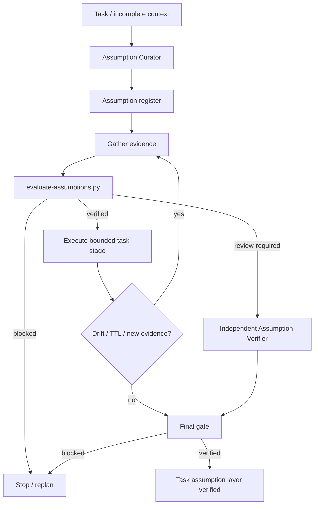

# Agent Assumption Evidence Gate

A tool-neutral guard for AI-assisted engineering that prevents unverified beliefs from silently becoming facts inside plans, code changes, tests, reviews, or final completion claims.

## Problem
AI agents routinely fill missing context with plausible assumptions: a field is stable, a dependency behaves a certain way, a configuration exists in production, a failing test is unrelated, or a runtime environment matches local development. Those assumptions may be reasonable, but if they are not made explicit and evidence-bound, an agent can build an internally consistent solution on a false premise.

This kit turns material assumptions into governed artifacts with deterministic lifecycle checks.

## Purpose
Use this package to:
- make material assumptions explicit and falsifiable;
- bind assumptions to evidence, consumers, TTL, and revalidation triggers;
- stop contradicted, expired, or unresolved high-risk assumptions from driving work;
- require independent verification for high-risk consumed assumptions;
- invalidate stale reviews when assumptions or policy change;
- distinguish task execution from evidence-backed verification.

## When to use
Use for feature work, bug fixing, repository exploration, dependency upgrades, database work, CI/CD diagnosis, production incidents, migrations, architecture decisions, integrations, or long-running agent tasks with incomplete or changing context.

## When not to use
Do not create records for trivial facts that cannot affect decisions. Do not use this package as a replacement for tests, requirements, observability, approval controls, or production change-management procedures.

## Architecture


## Package tree
```text
agent-assumption-evidence-gate/
├── README.md
├── config/
│   └── assumption-policy.json
├── schemas/
│   ├── assumption-record.schema.json
│   ├── assumption-gate-report.schema.json
│   └── assumption-review.schema.json
├── scripts/
│   ├── fingerprint-assumptions.py
│   ├── evaluate-assumptions.py
│   └── evaluate-final-gate.py
├── skills/
│   ├── build-assumption-register.md
│   └── revalidate-assumptions.md
├── rules/
│   └── assumption-governance.md
├── subagents/
│   ├── assumption-curator.md
│   └── assumption-verifier.md
├── workflows/
│   └── assumption-evidence-workflow.md
├── hooks/
│   └── assumption-evidence-hooks.md
├── templates/
│   └── assumptions.example.json
├── examples/
│   └── assumption-review.example.json
└── tests/
    └── smoke-test.py
```

## Component responsibilities
- `assumption-policy.json`: materiality, TTL, evidence, waiver, review, and retry policy.
- `assumption-record.schema.json`: structured assumption/evidence contract.
- `assumption-gate-report.schema.json`: deterministic gate output contract.
- `assumption-review.schema.json`: independent review contract.
- `fingerprint-assumptions.py`: SHA-256 binding for assumption register and optional policy.
- `evaluate-assumptions.py`: detects unresolved consumed assumptions, contradictions, expiry, unsupported `supported` claims, and invalid waivers.
- `evaluate-final-gate.py`: rejects stale report/review fingerprints and high-risk self-review.
- Skills: reusable procedures for creating and revalidating assumption registers.
- Subagents: clear ownership separation between curation and independent verification.
- Workflow/hooks: bounded lifecycle integration points.
- Smoke test: deterministic stdlib-only behavioral verification.

## Dependencies
- Python 3.9+
- Standard library only for package scripts/tests
- Git is optional to the package core; host agents may use repository tools to gather evidence.

## Installation
Copy this directory into a repository, then customize `config/assumption-policy.json` if required. Keep the schemas/scripts paths consistent with the workflow and hooks.

## Configuration
Important policy defaults:
- high-risk materiality: `high`, `critical`;
- independent review required for high-risk consumed assumptions;
- maximum revalidation attempts: 1;
- default TTL: 120 minutes, maximum 1440 minutes;
- contradicted and expired assumptions cannot be used;
- critical assumptions cannot be waived;
- `supported` requires positive evidence;
- permission failures never justify silent permission expansion.

## Usage
Start from the example:
```bash
cp templates/assumptions.example.json assumptions.json
```

Evaluate the register:
```bash
python scripts/evaluate-assumptions.py \
  assumptions.json \
  config/assumption-policy.json \
  --output assumption-gate.json
```

Generate fingerprints when preparing independent review:
```bash
python scripts/fingerprint-assumptions.py \
  assumptions.json \
  --policy config/assumption-policy.json
```

Run the final gate when independent review is required:
```bash
export AGENT_ID="implementation-agent"
python scripts/evaluate-final-gate.py \
  assumption-gate.json \
  assumptions.json \
  config/assumption-policy.json \
  --actor "$AGENT_ID" \
  --review assumption-review.json \
  --output assumption-final.json
```

For work where review is not required, omit `--review`.

## Status semantics
- `verified`: deterministic assumption checks passed for the current register/policy.
- `review-required`: no hard deterministic blocker exists, but unresolved lower-risk/stale evidence needs handling before the workflow can claim full verification.
- `blocked`: a deterministic blocker exists, such as a contradicted consumed assumption, unsupported `supported` state, critical invalid waiver, stale final evidence, or high-risk self-review.

A successful tool invocation is not the same as verified task completion.

## Evidence model
Prefer evidence from:
1. repository files/contracts/configuration;
2. focused tests/build output;
3. runtime observations and logs;
4. database/API read evidence;
5. official documentation;
6. explicit human decisions where policy permits a waiver.

Evidence must say whether it supports the statement and when it was observed. A missing error, agent consensus, current implementation behavior, or conventional practice is not positive evidence by itself.

## Revalidation
Revalidate an assumption when one of its `revalidate_on` triggers occurs, when TTL expires, or when new evidence conflicts with the record. Typical triggers include:
- base branch/revision movement;
- dependency or API contract change;
- database schema/config change;
- environment or production configuration change;
- new runtime/log evidence;
- agent handoff after a long pause.

Never extend TTL automatically just because obtaining new evidence failed.

## Approval boundaries
This kit does not authorize dangerous actions. Explicit human approval remains mandatory before production deployment, destructive SQL/data deletion, schema changes, force push/history rewrite, infrastructure changes, secret changes, production config changes, breaking API contracts, weakening security, irreversible migrations, or large dependency upgrades.

All assumptions materially affecting such an action must be resolved and independently reviewed where policy requires it before approval is acted upon.

## Failure handling
- Transient evidence read/tool transport failure: retry at most once and preserve the first failure.
- Validation failure: do not retry without changed record/evidence.
- Permission failure: stop; do not silently widen permissions.
- Contradictory evidence: mark `contradicted`, invalidate consumers, and replan.
- Expired evidence: refresh once if safely possible; otherwise stop.
- Stale fingerprint: regenerate gate/review; never reuse stale approval evidence.

## Verification
Run the smoke test:
```bash
python tests/smoke-test.py
```

The smoke test covers:
- supported low/medium-risk register verifies;
- consumed unresolved high-risk assumption blocks;
- independent high-risk review verifies;
- self-review blocks;
- expired evidence cannot silently remain verified.

The smoke test file is provided as executable package evidence; its presence is not a claim that a host environment has executed it. Run it in the target repository/CI to obtain execution evidence.

## Definition of Done
The assumption layer is complete only when:
- all material assumptions affecting completed work are registered;
- every supported assumption contains positive evidence;
- no contradicted or expired assumption remains consumed;
- high-risk consumed assumptions have independent review when required;
- current register/policy fingerprints match gate/review inputs;
- required human approval exists for dangerous actions;
- final gate returns `verified`;
- remaining uncertainty is explicitly documented and non-blocking.

## Tool portability
The core contracts and scripts are tool-neutral. Codex, Claude Code, Cursor, ChatGPT, GitHub Copilot, OpenCode, or another coding agent only needs an adapter/process capable of reading/writing the JSON artifacts and invoking the scripts. Do not claim tool capabilities that the host does not provide.

## Customization
Tune materiality levels, TTL, allowed evidence kinds, independent-review requirements, and waiver policy in `config/assumption-policy.json`. For volatile runtime systems, shorten TTL. For safety-sensitive repositories, require review for `medium` as well as high-risk assumptions and forbid all waivers.