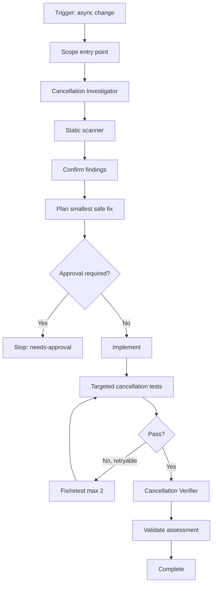

# Agent Async Cancellation Propagation Gate

A reusable AI engineering package for reviewing and repairing asynchronous execution paths that lose, replace, swallow, or fail to propagate cancellation signals.

## Problem
Async request handlers, jobs, consumers, retries, polling loops, database calls, and outbound HTTP calls can continue running after their caller has canceled. Common causes include omitted token forwarding, `CancellationToken.None`, swallowed `OperationCanceledException`, uncancellable delays, blocking waits, and retry loops with no cancellation exit.

## Purpose
Provide a repeatable, evidence-based gate that helps an AI coding agent trace cancellation from entry point to downstream operations, apply the smallest safe fix, test cancellation behavior, and prove the final change independently.

## When to use
Use when a change touches:
- ASP.NET/Core-style request handlers or endpoints.
- Background workers or scheduled jobs.
- Message consumers or command handlers.
- Database or HTTP I/O.
- Retry/backoff or polling loops.
- Async streams or long-running asynchronous operations.
- Any code that accepts, creates, links, replaces, or ignores cancellation tokens.

## When not to use
Do not use this package as a generic async performance review or as a substitute for domain-specific timeout, transaction, or resilience design. It focuses specifically on cancellation propagation and cancellation-safe control flow.

## Architecture



## Package tree

```text
agent-async-cancellation-propagation-gate/
├── README.md
├── config/
│   └── cancellation-gate.yaml
├── schemas/
│   └── assessment.schema.json
├── skills/
│   └── cancellation-propagation-review.md
├── rules/
│   └── cancellation-safety.md
├── subagents/
│   ├── cancellation-investigator.md
│   └── cancellation-verifier.md
├── workflows/
│   └── cancellation-gate.md
├── hooks/
│   └── lifecycle-hooks.md
├── scripts/
│   ├── scan-cancellation-risk.py
│   └── validate-assessment.py
├── examples/
│   └── assessment.example.json
└── tests/
    └── self-test.py
```

## Component responsibilities
- `config/cancellation-gate.yaml` defines retry limits, risk categories, approval boundaries, required verification, and statuses.
- `schemas/assessment.schema.json` defines the structured handoff/report contract.
- `skills/cancellation-propagation-review.md` is the reusable end-to-end procedure.
- `rules/cancellation-safety.md` contains enforceable MUST/MUST NOT/SHOULD behavior.
- `subagents/cancellation-investigator.md` owns tracing and evidence collection.
- `subagents/cancellation-verifier.md` independently validates the final implementation.
- `workflows/cancellation-gate.md` defines stages, checkpoints, retries, failure paths, and Definition of Done.
- `hooks/lifecycle-hooks.md` maps predictable lifecycle events to deterministic checks.
- `scripts/scan-cancellation-risk.py` scans source for common cancellation hazards.
- `scripts/validate-assessment.py` validates the final assessment contract and prevents unsupported `pass` status.
- `examples/assessment.example.json` demonstrates a valid report.
- `tests/self-test.py` exercises the scanner and assessment validator.

## Installation
Copy this directory into the target repository or into a shared agent-instructions repository. Python 3.9+ is sufficient for the provided scripts; they use only the standard library.

## Configuration
Edit `config/cancellation-gate.yaml` when the repository needs different file extensions, approval boundaries, or verification requirements. Keep `max_fix_retries` bounded; the default is 2.

## Permissions
The package needs read access to source/tests and permission to run local build/test commands. Implementation agents need write access only to the approved repository scope. No production, secret-management, infrastructure, or database-administration permission is required by the core workflow.

## Usage
From the package directory, run the scanner against a repository:

```bash
python scripts/scan-cancellation-risk.py /path/to/repository --json
```

Review scanner hits against the actual execution path. The scanner is intentionally heuristic; a match is evidence to inspect, not automatic proof of a defect.

After investigation and implementation, create an assessment JSON matching `schemas/assessment.schema.json` and validate it:

```bash
python scripts/validate-assessment.py path/to/assessment.json
```

Run the package self-test:

```bash
python tests/self-test.py
```

## Example invocation for an AI coding agent

Use `skills/cancellation-propagation-review.md` and `rules/cancellation-safety.md`. Trace the cancellation token from the changed endpoint/job/consumer through all downstream async boundaries. Run the scanner, confirm findings with repository evidence, implement only the smallest safe propagation fix, add targeted cancellation tests, then hand the final diff and assessment to the independent Cancellation Verifier. Stop before any approval-required action.

## Workflow
1. Establish changed scope and cancellation source.
2. Trace token flow through all relevant awaits and branches.
3. Run the deterministic scanner.
4. Confirm or dismiss findings with evidence.
5. Define expected cancellation semantics and targeted tests.
6. Stop for explicit approval if the required fix crosses an approval boundary.
7. Implement the smallest safe change.
8. Run targeted cancellation tests and relevant build/test checks.
9. Retry fix/retest at most 2 times for retryable failures.
10. Have the independent verifier re-trace and inspect the final diff.
11. Validate the structured assessment.
12. Mark `pass` only when all required verification evidence is true.

## Approval boundaries
Explicit human approval is required before:
- Breaking public API contract changes.
- Production configuration changes.
- Database schema changes.
- Major dependency upgrades.
- Security control changes.

The agent must stop before performing these actions; it must not broaden permissions to unblock itself.

## Failure handling
Transient tool failures may be retried at most 2 times. Code/test failures may enter at most 2 fix/retest cycles, preserving the command, output, hypothesis, and diff for each attempt. Permission/environment failures become `blocked`. Approval-required changes become `needs-approval`. Semantic ambiguity about intended cancellation behavior also blocks completion until the expected behavior is defined.

## Verification
A successful run is evidence-based. `pass` requires:
- Static scanner output reviewed against the execution path.
- Targeted cancellation tests passing.
- Final diff reviewed for unrelated or unsafe changes.
- Independent verifier review completed.
- Assessment contract validation passing.

The validator intentionally rejects a `pass` assessment when any required verification flag is false or missing.

## Definition of Done
The package considers the task complete only when the cancellation source and in-scope downstream path are traced, confirmed defects are fixed or explicitly blocked, targeted cancellation tests pass, relevant scanner findings are reviewed, the final diff is scoped, independent verification is complete, the assessment validates, required approvals are present, and no blocking risk remains.

## Customization
Repositories can extend the scanner with framework-specific patterns, add language-specific fixtures, or integrate the hooks into CI. Keep deterministic detection separate from agent judgment: scripts should surface evidence, while repository-aware investigation decides whether a finding is actually unsafe.
