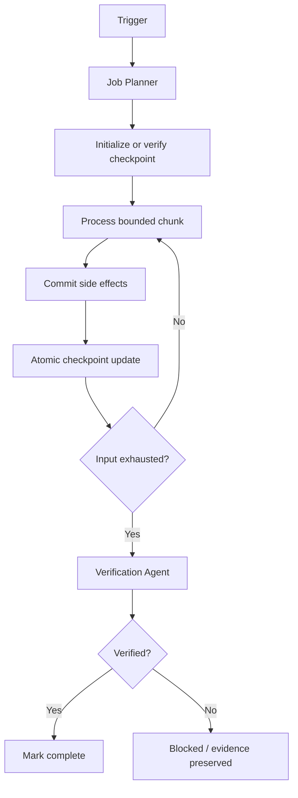

# Agent Background Job Checkpoint Resume Gate

## Problem
Long-running jobs often fail after processing substantial work. Restarting from zero wastes time and can duplicate external side effects; blindly resuming from guessed state can skip work or corrupt data.

## Purpose
This kit defines a reusable, tool-neutral workflow for checkpointing background jobs, validating resume state, bounding retries, separating planning from verification, and requiring approval when replay safety cannot be proven.

## When to use
Use for imports, exports, batch API processing, synchronization, AI enrichment, repository maintenance, and other chunkable jobs that can be interrupted and resumed.

## When not to use
Do not use when the job cannot expose a deterministic cursor, when side effects have no safe durability boundary, or when resumability would require guessing already-processed work. Those jobs require redesign or explicit human-led recovery.

## Architecture


The central invariant is **commit work first, then advance the checkpoint**. Resume is allowed only when job identity and input fingerprint still match.

## Package tree
```text
agent-background-job-checkpoint-resume-gate/
├── README.md
├── config/checkpoint-policy.yaml
├── schemas/checkpoint.schema.json
├── scripts/checkpoint_gate.py
├── scripts/verify_package.py
├── tests/test_checkpoint_gate.py
├── skills/checkpointed-job-execution.md
├── rules/checkpoint-safety.md
├── subagents/job-planner.md
├── subagents/verification-agent.md
├── workflows/checkpoint-resume-workflow.md
├── hooks/lifecycle.md
├── templates/replay-approval.md
└── examples/checkpoint.json
```

## Component responsibilities
- `skills/checkpointed-job-execution.md`: reusable execution procedure and stop conditions.
- `rules/checkpoint-safety.md`: enforceable MUST, MUST NOT, and SHOULD rules.
- `subagents/job-planner.md`: owns cursor, durability, retry, and approval design.
- `subagents/verification-agent.md`: independently proves resume safety.
- `workflows/checkpoint-resume-workflow.md`: bounded end-to-end workflow and failure paths.
- `hooks/lifecycle.md`: predictable pre-run, post-chunk, failure, and completion actions.
- `scripts/checkpoint_gate.py`: deterministic initialize, verify, and atomic update operations.
- `scripts/verify_package.py`: validates required package files and rejects omission placeholders.
- `config/checkpoint-policy.yaml`: default checkpoint, resume, retry, and safety settings.
- `schemas/checkpoint.schema.json`: checkpoint data contract.
- `templates/replay-approval.md`: human approval contract for ambiguous non-idempotent replay.
- `examples/checkpoint.json`: example checkpoint document.
- `tests/test_checkpoint_gate.py`: verifies normal resume and changed-input rejection.

## Dependencies
Python 3.9+ is sufficient for the included scripts. Tests require `pytest`. The core procedure is independent of any specific agent product, database, queue, or job framework.

## Installation
Copy this directory into the target repository. Keep the files together or update references consistently. Add the checkpoint output path (default `.ai-checkpoints/`) to `.gitignore` if runtime checkpoints must remain local.

## Configuration
Edit `config/checkpoint-policy.yaml` to match project chunk size, checkpoint frequency, maximum checkpoint age, and retry policy. The executable script itself uses explicit command arguments so it can be integrated with any runtime.

Recommended cursor choices, in descending preference, are stable continuation tokens, monotonically increasing primary keys, immutable composite keys, and offsets only when source ordering is guaranteed not to change.

## Permissions
The agent needs only repository read/write access required for implementation and local execution of validation/tests. Production writes, destructive operations, schema or infrastructure changes, secret/config changes, breaking API changes, irreversible migrations, and ambiguous non-idempotent replays require explicit human approval.

## Usage
Initialize a checkpoint:
```bash
python scripts/checkpoint_gate.py init \
  --checkpoint .ai-checkpoints/background-job.json \
  --job-id customer-sync-2026-08-21 \
  --job-type customer-sync \
  --input input/customers.json
```

Verify before resume:
```bash
python scripts/checkpoint_gate.py verify \
  --checkpoint .ai-checkpoints/background-job.json \
  --job-id customer-sync-2026-08-21 \
  --job-type customer-sync \
  --input input/customers.json
```

After a chunk is durably committed, advance the cursor:
```bash
python scripts/checkpoint_gate.py update \
  --checkpoint .ai-checkpoints/background-job.json \
  --cursor '{"last_customer_id":4200}' \
  --processed-count 4200 \
  --status running \
  --side-effects-committed
```

When input is exhausted:
```bash
python scripts/checkpoint_gate.py update \
  --checkpoint .ai-checkpoints/background-job.json \
  --status completed
```

Run package checks:
```bash
python scripts/verify_package.py
pytest -q tests/test_checkpoint_gate.py
```

## Workflow
The Job Planner first gathers repository context and identifies entry point, input ordering, transaction boundaries, side effects, nearby tests, and failure behavior. The implementation then initializes or verifies the checkpoint, processes one bounded chunk, commits side effects, and only afterward atomically advances the cursor. Failures preserve the last durable cursor. The Verification Agent independently reviews the diff, simulates interruption boundaries where practical, and confirms resume invariants.

Automatic retries are limited to three and apply only to transient tool or network failures. Validation, identity, input fingerprint, permission, business-rule, and replay-ambiguity failures stop immediately.

## Approval boundaries
Explicit human approval is required before replaying a range that may already contain committed non-idempotent side effects. Use `templates/replay-approval.md` to bind approval to the exact job, checkpoint, cursor, scope, and environment. Any changed input or replay scope invalidates that approval.

## Failure handling
- **Transient failure:** preserve checkpoint, retry at most three times with configured backoff.
- **Validation failure:** stop; do not modify the checkpoint to force progress.
- **Identity or fingerprint mismatch:** stop; create a newly scoped job rather than reusing state.
- **Checkpoint corruption:** preserve the corrupt artifact and reconstruct only from reviewed durable evidence.
- **Permission failure:** stop; never silently increase privilege.
- **Business-rule failure:** mark failed with concise evidence and escalate.
- **Ambiguous side-effect replay:** stop before replay and obtain human approval.

## Verification
Successful execution is not equivalent to verified completion. Verification requires evidence that:
- required package artifacts exist;
- identity and fingerprint checks reject wrong resume state;
- completed checkpoints cannot resume;
- cursor advancement occurs only after durable side effects;
- checkpoint writes are atomic;
- automatic retries are bounded to three;
- automated tests pass;
- the implementation diff contains no unrelated changes;
- required approvals exist for dangerous actions;
- no blocking risk remains undocumented.

## Definition of Done
The topic is complete only when required context was gathered, deterministic cursor semantics were defined, checkpoint handling exists, tests pass, resume safety was independently verified, dangerous replay is approval-gated, remaining risks are documented, and no blocking failure remains.

## Customization
Adapters may wrap `checkpoint_gate.py` for Hangfire, Azure Functions, Kubernetes jobs, GitHub Actions, workers, queues, or custom schedulers. Keep the invariant and contracts unchanged: bind state to job identity and input, commit before checkpoint advance, preserve evidence on failure, bound retries, and never auto-replay uncertain irreversible effects.
