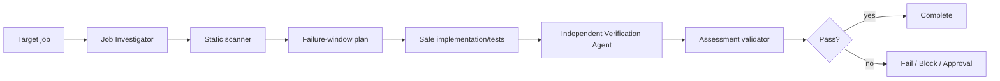

# Agent Background Job Idempotency Gate

A reusable evidence-based gate for proving that duplicate or retried background-job deliveries do not create duplicate business effects.

## Problem
At-least-once queues, schedulers, worker crashes, timeouts, and retry policies can execute the same logical operation multiple times. A handler can return successfully while still duplicating invoices, emails, payments, records, or external API calls.

## When to use
Use when adding/changing a queue consumer or scheduled job, changing retries/acknowledgement behavior, investigating duplicate effects, or reviewing a job before release.

## When not to use
Do not use as proof that an infrastructure product offers exactly-once business semantics. Do not use it to replay/purge production queues or mutate production state without explicit approval.

## Architecture


## Package tree
```text
agent-background-job-idempotency-gate/
├── README.md
├── config/idempotency-policy.json
├── schemas/assessment.schema.json
├── scripts/scan-idempotency.py
├── scripts/validate-assessment.py
├── skills/idempotency-assessment.md
├── rules/idempotency-safety.md
├── subagents/job-investigator.md
├── subagents/verification-agent.md
├── workflows/idempotency-gate.md
├── hooks/lifecycle-hooks.md
├── examples/assessment.json
└── tests/self-test.py
```

## Components
`skills/idempotency-assessment.md` is the reusable investigation procedure. `rules/idempotency-safety.md` defines enforceable safety boundaries. `subagents/job-investigator.md` owns evidence collection while `subagents/verification-agent.md` independently challenges completion. `workflows/idempotency-gate.md` defines the bounded end-to-end flow. `scripts/scan-idempotency.py` finds suspicious source patterns; results are hypotheses, not proof. `scripts/validate-assessment.py` enforces the final output contract. `tests/self-test.py` checks both scripts. `config/idempotency-policy.json` centralizes retries, required properties, approvals, and risk classes.

## Dependencies
Python 3.9+ for bundled scripts. Repository-specific build/test tooling remains unchanged. No Python packages are required.

## Installation
Copy this directory into a repository or agent-instruction location. Keep relative paths intact. Optionally adjust `config/idempotency-policy.json` to match stricter repository rules.

## Permissions
Default operation is read-only repository inspection plus local non-destructive test/build execution. Production deployment/configuration, schema changes, data deletion, queue purge/replay, breaking contracts, and other configured dangerous actions require explicit human approval.

## Usage
Run the deterministic scanner from this package:

```bash
python3 scripts/scan-idempotency.py /path/to/repository --output scan.json
```

Exit `0` means no heuristic findings, `1` means findings require review, and `2` means invalid invocation/input. Then follow `skills/idempotency-assessment.md` and `workflows/idempotency-gate.md`.

Validate the final assessment:

```bash
python3 scripts/validate-assessment.py assessment.json
```

Run package self-test:

```bash
python3 tests/self-test.py
```

## Required investigation model
For one logical operation, identify a stable operation key, duplicate-detection mechanism, atomic durable-effect boundary, retry classification, acknowledgement/completion point, external side effects, and observable effect count. Explicitly reason about crashes before the effect, after the effect but before acknowledgement, and during ambiguous external calls.

## Verification
A task being executed is not equivalent to verified idempotency. Status `pass` requires all three assessment flags to be true: duplicate delivery tested, retry tested, and business effect count verified. The independent verifier must inspect evidence rather than relying on the implementing agent's claim.

For database effects, prefer a durable uniqueness/atomic inbox boundary where appropriate. For external effects, verify provider idempotency semantics or use durable receipts/outbox/reconciliation. A successful handler return alone is insufficient.

## Retry and recovery
Automated investigative/test retries are bounded to two transient reruns. Preserve command output and failing inputs. Deterministic failures require diagnosis/change before rerun. Permission or environment failures become `blocked`; dangerous remediation becomes `needs-approval`; unresolved duplicate effects remain `fail`.

## Approval boundaries
Stop before schema changes, production configuration/deployment, queue purge/replay, data deletion, breaking contracts, irreversible changes, or any repository-specific dangerous action. Never silently expand permissions.

## Definition of Done
The target job and all business effects are mapped; stable operation identity and acknowledgement boundary are known; scanner findings were reviewed; duplicate and retry scenarios were tested or explicitly blocked with evidence; effect count was verified; independent verification completed; assessment validates against the contract; required approvals exist; remaining risks are recorded; and no blocking failure remains for a `pass` verdict.

## Customization
Add repository-specific risk patterns only when they are deterministic enough to be useful. Keep scanner findings advisory and evidence-based. Tighten approval boundaries or retry limits in `config/idempotency-policy.json`; do not weaken organization-level safety requirements.
