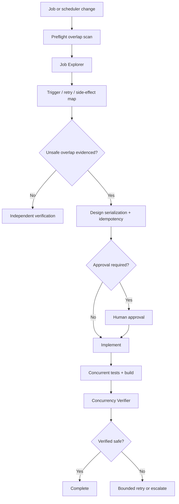

# Agent Background Job Overlap Concurrency Gate

A reusable implementation kit for investigating and preventing unsafe overlap between recurring, queued, retried, or manually triggered background jobs.

## Problem
Background jobs often become unsafe when execution duration exceeds trigger interval, retries begin while a previous attempt is still running, multiple application instances process the same logical operation, or manual and scheduled triggers race. Typical consequences are duplicate notifications, duplicate downstream API calls, stale writes, double billing, corrupted progress state, lock contention, and retry amplification.

## Purpose
This kit gives coding agents and developers a repeatable evidence-first workflow to map job triggers, determine overlap semantics, select the smallest safe serialization/idempotency mechanism, implement tests, and independently verify concurrency behavior.

## When to use
Use when adding or changing recurring/queued jobs, worker concurrency, retry/timeout policies, schedules, distributed locks, idempotency handling, or when production symptoms suggest duplicate job effects.

## When not to use
Do not use it as proof that all distributed concurrency is safe. The repository scanner is heuristic. Do not use the kit to make unapproved production scheduler, database schema, infrastructure, secret, destructive-data, or job-disable changes.

## Architecture



## Package tree

```text
agent-background-job-overlap-concurrency-gate/
├── README.md
├── config/
│   └── policy.json
├── schemas/
│   └── finding.schema.json
├── skills/
│   ├── investigate-job-overlap.md
│   └── design-concurrency-safety.md
├── rules/
│   └── concurrency-safety.md
├── subagents/
│   ├── job-explorer.md
│   └── concurrency-verifier.md
├── workflows/
│   └── overlap-safety-workflow.md
├── hooks/
│   ├── preflight-overlap-scan.md
│   └── final-verification.md
├── scripts/
│   ├── scan-job-overlap.py
│   └── verify-package.py
├── examples/
│   └── job-inventory.json
└── tests/
    └── test_scan_job_overlap.py
```

## Component responsibilities
- `skills/investigate-job-overlap.md`: evidence collection and overlap analysis.
- `skills/design-concurrency-safety.md`: selects serialization/idempotency controls and test obligations.
- `rules/concurrency-safety.md`: mandatory, forbidden, and preferred behavior.
- `subagents/job-explorer.md`: read-only investigation owner.
- `subagents/concurrency-verifier.md`: independent safety verifier.
- `workflows/overlap-safety-workflow.md`: bounded end-to-end execution flow.
- `hooks/preflight-overlap-scan.md`: deterministic pre-edit scan.
- `hooks/final-verification.md`: build/test/diff verification gate.
- `scripts/scan-job-overlap.py`: heuristic repository scanner for scheduler/retry/side-effect combinations.
- `scripts/verify-package.py`: checks required kit artifacts and policy consistency.
- `schemas/finding.schema.json`: contract for evidence-backed findings.
- `examples/job-inventory.json`: concrete inventory format example.

## Installation
Copy this directory into the target repository, for example `.ai-kits/agent-background-job-overlap-concurrency-gate/`. Python 3.9+ is sufficient for included scripts and tests; there are no third-party Python dependencies.

## Configuration
Edit `config/policy.json` only where project policy differs. Keep retry loops bounded. Add repository-specific scanner extensions or ignored generated directories as needed. The default overlap policy is `forbid`, but a job may intentionally allow overlap when all state transitions and external side effects are proven conflict-safe/idempotent.

## Permissions
Default to repository read/write plus local build/test execution. Production scheduler access, production database mutation, infrastructure changes, secret changes, destructive operations, and deployments are not required for normal investigation and verification and require explicit human approval if requested.

## Usage

Run the heuristic preflight scan from the target repository:

```bash
python .ai-kits/agent-background-job-overlap-concurrency-gate/scripts/scan-job-overlap.py \
  --root . \
  --policy .ai-kits/agent-background-job-overlap-concurrency-gate/config/policy.json \
  --output overlap-findings.json
```

Run scanner tests:

```bash
python -m unittest .ai-kits/agent-background-job-overlap-concurrency-gate/tests/test_scan_job_overlap.py
```

Verify the copied package:

```bash
python .ai-kits/agent-background-job-overlap-concurrency-gate/scripts/verify-package.py \
  --package-root .ai-kits/agent-background-job-overlap-concurrency-gate
```

## Example agent invocation

> Investigate the `SyncCustomerStatus` background job using this kit. Map all scheduled/manual/retry triggers, determine whether attempts can overlap across instances, identify every external side effect and its idempotency evidence, run the overlap scanner, and produce structured findings. If an unsafe overlap is confirmed, design the smallest fix. Do not change production configuration or schemas without explicit approval. Require a concurrent-start test and independent verification before reporting success.

## Workflow
Follow `workflows/overlap-safety-workflow.md`. Investigation ownership belongs to Job Explorer; implementation follows the concurrency-safety skill; final safety status belongs to Concurrency Verifier rather than the implementing agent alone.

The standard sequence is:

1. Run the preflight scanner.
2. Locate all triggers and retry paths.
3. Establish runtime/timeout/interval evidence.
4. Map database and external side effects.
5. Determine existing serialization and idempotency guarantees.
6. Reproduce or otherwise evidence the overlap mechanism.
7. Select the smallest safe control.
8. Stop for approval when required.
9. Implement with concurrent tests.
10. Build/test and inspect the final diff.
11. Independently verify concurrent start, retry/timeout, ownership, stale recovery, and side-effect semantics.

## Choosing a mitigation
Use business invariants to choose the mechanism rather than blindly adding a lock:

- Global singleton execution: distributed lock/lease keyed by stable job identity.
- Per-entity serialization: distributed lock keyed by normalized business key.
- Overlap allowed: atomic state transitions plus idempotent external side effects.
- Duplicate business operation must be rejected: durable idempotency key/unique constraint.
- Retry can overlap unknown prior attempt: preserve logical idempotency key across attempts.

A process-local mutex only coordinates one process and is not proof of safety in a multi-instance deployment.

## Approval boundaries
Explicit human approval is required before production scheduler changes, production job disabling, database schema changes, destructive data/file changes, infrastructure changes, secret changes, deployment, force-push/history rewrite, or weakening security controls. Agents must stop before these actions and must never increase permissions silently.

## Failure handling
Transient local/tool failures may be retried. Implementation/test correction is bounded to two cycles. Preserve failing test output and previous evidence. Missing runtime or scheduler evidence produces `unverified`, not a guessed conclusion. Permission failures stop the affected investigation branch. Missing approval produces `blocked`.

## Verification
`Task executed` and `Task verified successfully` are different states. A safe completion requires evidence appropriate to the job:

- concurrent executions are serialized, deduplicated, or conflict-safe;
- lock acquisition/release ownership is correct when locks are used;
- stale lock/lease recovery is defined;
- retry behavior cannot amplify unsafe overlap;
- irreversible external side effects are idempotent when duplicate execution remains possible;
- relevant build/tests pass;
- final diff contains no unintended or unapproved production changes.

The scanner only identifies candidates. It cannot prove a defect or prove safety.

## Definition of Done
- Every trigger and retry path is identified.
- Side effects and transaction boundaries are mapped.
- Intended overlap semantics are explicit.
- Confirmed unsafe overlap has a scoped mitigation.
- Concurrent-start behavior is tested.
- Relevant retry/failure/recovery paths are tested or explicitly documented as blocked.
- Build and relevant tests pass, or unrelated baseline failures are evidenced.
- Concurrency Verifier reports `verified-safe`.
- Required approvals exist before approval-required actions.
- Remaining risks are documented and no blocking failure is hidden.

## Customization
Extend scanner patterns for project-specific schedulers such as Hangfire, Quartz, Celery, Sidekiq, BullMQ, hosted services, or internal workers. Keep tool-specific adapters isolated; retain the core investigation, evidence, approval, bounded-retry, and independent-verification rules so the package remains portable across coding agents.
