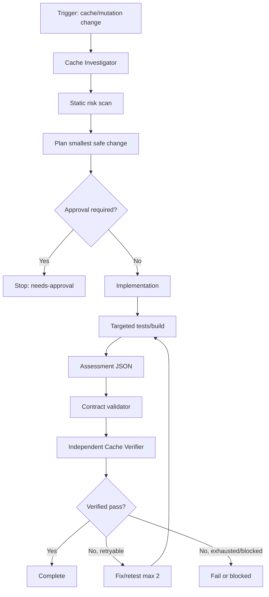

# Agent Cache Invalidation Safety Gate

A reusable AI engineering package for preventing stale-data, cross-tenant leakage, and destructive cache-reset regressions when developers or coding agents change cached reads, durable mutations, cache keys, TTL behavior, or invalidation logic.

## Problem
Cache correctness bugs often appear only after a successful data mutation: the database contains the new state while one or more cache entries still expose the previous state. The failure can be subtle when a mutation affects detail, list, summary, permission, search, or derived cache entries, or when concurrent readers repopulate stale data between commit and invalidation.

This package gives an agent a repeatable evidence-driven gate for tracing mutation-to-cache relationships, identifying invalidation fan-out, applying the smallest safe fix, running deterministic checks, and requiring independent verification before completion.

## When to use
Use this package when a task touches:
- Redis, distributed cache, `IMemoryCache`, `IDistributedCache`, cache-aside logic, memoization, or application-specific cache abstractions.
- Durable mutations to entities whose reads may be cached.
- Cache keys, namespaces, tenant/user dimensions, TTLs, refresh jobs, or invalidation events.
- Bug reports involving stale values, inconsistent reads, cache poisoning, or cross-tenant/user cache collisions.

## When not to use
Do not use this package as a generic performance-tuning workflow when no mutable cached state exists. It is also not a production cache-operation tool: production cache flushes, destructive resets, namespace changes, and production configuration changes remain approval-gated.

## Architecture



## Package tree

```text
agent-cache-invalidation-safety-gate/
├── README.md
├── config/
│   └── cache-gate.yaml
├── examples/
│   └── sample-assessment.json
├── hooks/
│   └── lifecycle.md
├── rules/
│   └── cache-safety.md
├── schemas/
│   └── cache-assessment.schema.json
├── scripts/
│   ├── scan-cache-risk.py
│   └── validate-assessment.py
├── skills/
│   └── cache-invalidation-review.md
├── subagents/
│   ├── cache-investigator.md
│   └── cache-verifier.md
├── tests/
│   └── self-test.sh
└── workflows/
    └── cache-invalidation-gate.md
```

## Component responsibilities
- `skills/cache-invalidation-review.md`: actionable review procedure from repository tracing through final evidence.
- `rules/cache-safety.md`: enforceable MUST/MUST NOT/SHOULD constraints.
- `subagents/cache-investigator.md`: read-only ownership for cache/mutation mapping and evidence collection.
- `subagents/cache-verifier.md`: independent ownership for final correctness verification.
- `workflows/cache-invalidation-gate.md`: end-to-end bounded workflow with retry, stop, approval, and Definition of Done rules.
- `hooks/lifecycle.md`: pre-task scan, post-edit checks, final assessment validation, and approval-boundary hooks.
- `scripts/scan-cache-risk.py`: read-only heuristic scanner for broad flush primitives and mutation/cache coupling without obvious invalidation.
- `scripts/validate-assessment.py`: deterministic validation of the assessment contract and pass semantics.
- `schemas/cache-assessment.schema.json`: machine-readable handoff contract.
- `config/cache-gate.yaml`: retry budget, risk/status vocabulary, evidence fields, and approval boundaries.
- `examples/sample-assessment.json`: valid example output.
- `tests/self-test.sh`: deterministic smoke test for the validator and scanner behavior.

## Dependencies
- Python 3.8+ for the scripts.
- Bash for `tests/self-test.sh`.
- Repository-specific build/test tooling for application verification.

No Python third-party packages are required.

## Installation
Copy this directory into the target repository, for example under `.ai/agent-cache-invalidation-safety-gate/` or another agent-instructions location. Preserve relative paths within the package.

If your agent system supports reusable rules, skills, subagents, or hooks, wire the corresponding Markdown files into that system. Otherwise, use `workflows/cache-invalidation-gate.md` as the execution entry point and reference the other assets directly.

## Configuration
Review `config/cache-gate.yaml` before first use. The default package uses:
- Maximum fix/retest attempts: 2.
- Status values: `pass`, `fail`, `blocked`, `needs-approval`, `inconclusive`.
- Approval-required operations: production cache flush, destructive cache reset, shared cache namespace change, production configuration change, and breaking API contract.

Projects may extend approval boundaries, but should not weaken the production-safety defaults without explicit human review.

## Permissions
Default operation should require only:
- Read access to repository source/configuration.
- Write access to the current development branch when implementation is requested.
- Permission to run local build/tests.

The package does **not** require production cache credentials. Do not grant them merely to complete this workflow.

## Usage
From the package root, run the static scanner against a repository:

```bash
python3 scripts/scan-cache-risk.py /path/to/repo --json
```

Use the findings as investigation leads. The scanner is intentionally conservative and heuristic; it does not replace repository tracing.

After producing a final assessment JSON:

```bash
python3 scripts/validate-assessment.py ./assessment.json
```

Run the package smoke tests:

```bash
bash tests/self-test.sh
```

## Example invocation
Give the agent the task scope plus this instruction:

> Run `workflows/cache-invalidation-gate.md` for the current change. Trace every changed mutation to cached read paths, preserve evidence, avoid production cache mutation, and return `pass` only after the assessment validator and independent verifier both pass.

## Workflow
1. Scope the changed cache and mutation boundaries.
2. Delegate repository mapping to the Cache Investigator.
3. Run the static scanner and preserve its output.
4. Define the consistency expectation for every affected cache contract.
5. Plan the smallest safe invalidation/update/versioning change.
6. Stop before any approval-required operation.
7. Implement and add targeted tests.
8. Run relevant build/tests, including post-mutation cached reads and applicable failure/race cases.
9. Produce assessment JSON matching the schema.
10. Validate the assessment deterministically.
11. Delegate final review to the independent Cache Verifier.
12. If verification fails for a retryable reason, fix/retest at most two times. Otherwise stop and preserve evidence.

## Approval boundaries
Explicit human approval is required before:
- Production cache flush or destructive cache reset.
- Shared cache namespace/key contract changes with broad impact.
- Production configuration changes.
- Breaking public API contracts.
- Infrastructure changes, destructive data operations, secret changes, or other dangerous actions required by the surrounding task.

Agents must stop before these actions. Least privilege is mandatory; permissions must not be silently increased.

## Failure and recovery
- **Transient tool failure:** retry once, preserve stderr, then use safe manual inspection if possible.
- **Build/test failure:** enter the workflow fix/retest loop, maximum two attempts.
- **Validation failure:** correct the assessment structure only when evidence supports it; never modify evidence merely to force `pass`.
- **Permission/environment failure:** report `blocked`; do not elevate permissions automatically.
- **Unknown cache ownership/consistency contract:** report `inconclusive` rather than assuming correctness.
- **High-risk broad cache flush:** block completion until removed or explicitly handled; production execution remains forbidden.

## Verification
Task execution and task verification are separate states. A code change existing is not proof that cache correctness is restored.

A verified `pass` requires:
- Relevant mutation/cache relationships were mapped.
- Cache key scope and expected consistency are explicit.
- No unresolved high-risk invalidation path remains.
- Relevant tests/build checks pass.
- `scripts/validate-assessment.py` exits successfully.
- The independent Cache Verifier returns `pass`.
- No required approval is pending.

## Definition of Done
The package-specific Definition of Done is satisfied only when:
- Required context and evidence were gathered.
- Every relevant changed mutation is connected to its cache invalidation/update/versioning behavior or explicitly documented as not cached.
- Tenant/user isolation dimensions are preserved where applicable.
- Required implementation and tests exist.
- Relevant build/tests pass.
- Assessment contract validation passes.
- Independent verification passes.
- Retry budget has not been exceeded.
- No approval-required action remains unresolved.
- Remaining non-blocking risks are documented.

## Customization
The scanner patterns are intentionally language-agnostic heuristics. Extend `PATTERNS` and `TEXT_SUFFIXES` in `scripts/scan-cache-risk.py` for project-specific cache APIs, but keep the script read-only.

You may add repository-specific test commands or hook adapters around `hooks/lifecycle.md`. Keep the core workflow, retry limit, evidence requirements, and production approval boundaries consistent across adapters.
