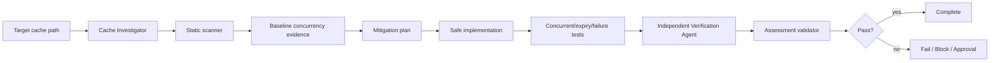

# Agent Cache Stampede Prevention Gate

A reusable evidence-based gate for detecting and preventing cache stampede/thundering-herd regressions in cache-backed application paths.

## Problem
When many callers miss or expire the same cache key at once, each caller may regenerate the value independently. A single hot-key expiry can therefore multiply database/API load, trigger retry storms, exhaust pools, and extend an outage even when cache hit rate usually looks healthy.

## Purpose
This package gives an AI coding agent and developer a bounded workflow to identify regeneration fan-out, prove backend invocation counts under concurrency, implement the smallest safe mitigation, and independently verify cold-miss, expiry, and failure behavior.

## When to use
Use when adding/changing caching, investigating periodic backend spikes, reviewing hot keys, changing TTL/invalidation behavior, or preparing a cache-backed path for release.

## When not to use
Do not use this package to justify production cache flushes, mass invalidation, infrastructure mutation, or production TTL changes without explicit approval. A static scanner finding is not proof of a defect.

## Architecture


## Package tree
```text
agent-cache-stampede-prevention-gate/
├── README.md
├── config/cache-policy.json
├── schemas/assessment.schema.json
├── scripts/scan-cache-stampede.py
├── scripts/simulate-stampede.py
├── scripts/validate-assessment.py
├── skills/cache-stampede-assessment.md
├── rules/cache-safety.md
├── subagents/cache-investigator.md
├── subagents/verification-agent.md
├── workflows/cache-stampede-gate.md
├── hooks/lifecycle-hooks.md
├── examples/assessment.json
└── tests/self-test.py
```

## Component responsibilities
`skills/cache-stampede-assessment.md` is the reusable investigation procedure. `rules/cache-safety.md` defines enforceable behavior and approval boundaries. `subagents/cache-investigator.md` owns context/evidence collection while `subagents/verification-agent.md` independently challenges the claimed mitigation. `workflows/cache-stampede-gate.md` defines the bounded end-to-end flow. `scripts/scan-cache-stampede.py` finds suspicious source patterns. `scripts/simulate-stampede.py` provides a deterministic synthetic demonstration of unprotected versus single-flight regeneration. `scripts/validate-assessment.py` enforces the final output contract. `tests/self-test.py` exercises all bundled deterministic scripts. `config/cache-policy.json` centralizes retries, defaults, required controls, and approval boundaries.

## Dependencies
Python 3.9+ for bundled scripts. Repository-specific build, test, cache, and load-test tooling remains unchanged. No third-party Python packages are required.

## Installation
Copy this directory into the target repository or agent-instruction directory while keeping relative paths intact. Tighten `config/cache-policy.json` if repository or organization policy is stricter.

## Permissions
Default operation is repository read/search plus local non-destructive tests, build, static analysis, and disposable load simulation. Explicit human approval is required before production cache flushes, production config/deployment changes, infrastructure changes, schema changes, secret changes, or data deletion.

## Usage
Run the static scanner:

```bash
python3 scripts/scan-cache-stampede.py /path/to/repository --output scan.json
```

Exit `0` means no heuristic findings, `1` means findings require review, and `2` means invocation/input failure.

Run the bundled deterministic simulator:

```bash
python3 scripts/simulate-stampede.py --clients 32 --latency-ms 150 --output simulation.json
```

The simulator intentionally shows how concurrent cold misses can create many backend calls without single-flight and one backend regeneration with the protected implementation. It is a teaching/baseline tool, not proof about the target repository.

Follow `skills/cache-stampede-assessment.md` and `workflows/cache-stampede-gate.md`, then validate the final assessment:

```bash
python3 scripts/validate-assessment.py assessment.json
```

Run package self-test:

```bash
python3 tests/self-test.py
```

## Investigation model
For each affected logical cache key, identify the key construction, key cardinality, TTL/expiry policy, regeneration function, backend dependency, maximum caller concurrency, invalidation behavior, retry/fallback behavior, and observability. Explicitly examine cold start, synchronized expiry, mass invalidation, regeneration failure, and timeout/cancellation windows.

A useful mitigation may be per-key single-flight/request coalescing, a narrowly scoped distributed lock, stale-while-revalidate, stale-on-error, proactive refresh, or another mechanism that demonstrably bounds regeneration. TTL jitter or an equivalent strategy should spread synchronized expiration when many entries would otherwise expire together. The package does not prescribe one cache provider or implementation.

## Workflow
The investigator first maps the path and captures baseline evidence, then static findings are reviewed as hypotheses. A remediation plan defines the intended regeneration bound and tests before code is changed. Dangerous actions stop at the approval checkpoint. After implementation, concurrent-miss, expiry-boundary, and backend-failure tests run. The independent verifier then re-runs relevant checks before the assessment can become `pass`.

## Hooks
`hooks/lifecycle-hooks.md` defines four predictable actions: pre-task static scanning, optional synthetic simulation, blocking post-edit focused verification, and blocking final assessment validation. Automated transient reruns are capped at two attempts.

## Failure and recovery
Transient tool or disposable test-environment failures may be retried at most twice while preserving commands, parameters, outputs, backend invocation counts, and attempt numbers. Deterministic test/build failures require diagnosis or a change before another run. Permission/environment blockers become `blocked`. Dangerous remediation becomes `needs-approval`. Evidence of unbounded regeneration or an untested failure path remains `fail`.

## Approval boundaries
Stop before production cache flush/mass invalidation, production configuration changes, deployments, infrastructure changes, schema changes, secret changes, data deletion, or any stricter repository-specific dangerous action. Never silently increase permissions to make a test pass.

## Verification
Task execution is not successful verification. A `pass` assessment requires all four flags to be true: concurrent miss tested, backend call count verified, expiry spread verified, and failure path tested. Hit rate, latency, or a green handler return alone is insufficient; verification must include backend regeneration count for the same logical key under concurrency.

The independent verifier must also inspect the diff for overly broad locks, semantic changes, stale-data risks, hidden retry amplification, and unrelated edits.

## Definition of Done
The cache-key scope and regeneration function are mapped; baseline behavior is evidenced; scanner findings were reviewed; a bounded regeneration mechanism or equivalent behavior is demonstrated; concurrent miss, expiry spread, backend call count, and failure path are verified; project tests/build pass; independent verification completed; required approvals exist; the final assessment validates against `schemas/assessment.schema.json`; remaining risks are documented; and no blocking failure remains for a `pass` verdict.

## Customization
Adjust concurrency/load defaults and approval boundaries in `config/cache-policy.json`. Add scanner patterns only when they provide useful deterministic signals. Keep static findings advisory and require runtime or test evidence before treating them as confirmed defects. Repository-specific limits should be stricter than, or equal to, the package defaults rather than weaker.
