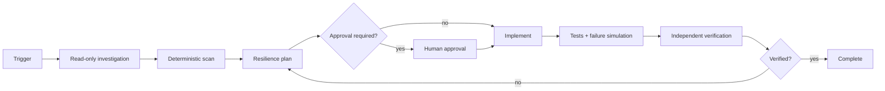

# Agent Circuit Breaker Failure Isolation Gate

Reusable AI-engineering kit for preventing a degraded external dependency from cascading into retry storms, thread/socket exhaustion, queue growth and broader service failure.

## Problem
Retries alone can amplify outages. Agents also tend to “fix” timeouts by increasing attempts/timeouts without proving idempotency or total retry multiplication. This gate forces evidence collection, bounded retry/timeout design, explicit circuit states, independent verification and approval boundaries.

## When to use
Use for new critical outbound integrations, recurring timeout/5xx incidents, retry storms, or changes to HTTP/RPC resilience behavior. Do not use as a substitute for capacity planning, server-side rate limiting, or a business fallback specification that does not exist.

## Architecture

The return to planning is bounded by the workflow: one validation return; transient tool/environment retries are capped at two.

## Package tree
```text
agent-circuit-breaker-failure-isolation-gate/
├── README.md
├── config/gate-policy.json
├── schemas/finding.schema.json
├── scripts/scan-resilience.py
├── scripts/verify-package.py
├── skills/investigate-failure-isolation.md
├── skills/design-resilience-change.md
├── rules/resilience-safety.md
├── subagents/resilience-investigator.md
├── subagents/verification-agent.md
├── workflows/circuit-breaker-gate.md
├── hooks/pre-change-scan.md
├── hooks/final-verification.md
└── examples/sample-client.cs
```

## Components
- Investigator maps dependency call paths and evidence without editing.
- Design skill defines timeout, retry classification, circuit scope, half-open probes, fallback and telemetry.
- Scanner flags likely unbounded retry and outbound calls lacking nearby timeout evidence; it is a heuristic gate, not proof by itself.
- Verification Agent independently checks code, tests, scanner evidence and diff.
- Policy centralizes retry count, exclusions and approval-required action classes.

## Installation
Copy this directory into a repository. Requires Python 3.9+ for deterministic scripts. No Python packages are required. Adapt `config/gate-policy.json` extensions/exclusions to the repository. Framework-specific circuit breaker libraries are deliberately not mandated.

## Permissions
Core investigation needs repository read plus local test/build execution. No production credentials are required. Production configuration/deployment, infrastructure changes, breaking contracts and security weakening require explicit human approval.

## Usage
From the copied package directory, or adjust paths if installed elsewhere:

```bash
python scripts/verify-package.py --root .
python scripts/scan-resilience.py --root . --policy config/gate-policy.json --output circuit-breaker-findings.before.json
```

Then follow `workflows/circuit-breaker-gate.md`. After implementation, rerun the scanner to `circuit-breaker-findings.after.json`, execute project tests/build, inspect the diff, and hand evidence to `subagents/verification-agent.md`.

## Input/output contract
Inputs are repository root, target dependency/operation, acceptance criteria, available logs/traces and resilience configuration. Scanner output follows `schemas/finding.schema.json`: status, evidence-backed findings and verification counters. Workflow terminal statuses are `pass`, `fail`, `needs-review`, or `blocked`.

## Approval boundaries
Stop before production configuration or deployment, infrastructure changes, breaking API contracts, security-control weakening, secret changes, destructive data operations, force pushes, or irreversible migrations. Never increase permissions merely to unblock the workflow.

## Failure and recovery
Transient tool/environment failures may retry at most twice while preserving previous evidence. Permission failures stop without privilege escalation. Test/validation failure requires a new hypothesis and may return to planning once; a second unresolved validation failure stops. Ambiguous business fallback semantics produce `needs-review`, never fabricated success.

## Verification
Task execution is not success. Verification requires bounded timeout/retry behavior, correct failure classification, cancellation propagation, open/half-open tests when a breaker is introduced or changed, no unexplained high/critical scanner finding in changed scope, required project tests/build passing, diff inspection, required approvals, and independent verifier `pass`.

## Definition of Done
- relevant dependency call path and retry multiplier are understood;
- timeout and retry attempts are bounded;
- retryable versus terminal failures are explicit;
- circuit/fallback semantics are tested when applicable;
- cancellation and security constraints remain intact;
- deterministic evidence and project tests pass;
- no unintended change or missing approval remains;
- independent verification passes and residual risks are documented.

## Customization
Tune scanner extensions/exclusions and policy severity for the repository. Add framework-specific tests or adapters next to project code, but keep the workflow/rules tool-neutral. The sample C# client demonstrates bounded timeout/retry only; production circuit-breaker configuration should use the repository's chosen resilience library and measured thresholds rather than copying arbitrary constants.
