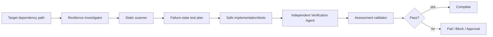

# Agent Circuit Breaker Recovery Gate

A reusable evidence-based gate for verifying that circuit breakers fail fast under sustained dependency failure and recover safely without retry storms, stale open state, excessive half-open probes, or misleading fallbacks.

## Problem
Circuit breakers can reduce cascading failures, but incorrect policy ordering, scope, retry budgets, timeout behavior, fallback semantics, or recovery probes can create new failure modes: dependencies remain overloaded, unrelated traffic shares one breaker, fallbacks mask stale data, or recovery causes a traffic spike.

## When to use
Use when adding or changing a circuit breaker, retry policy, timeout, fallback, HTTP/DB/external dependency client, or when investigating cascading failures, a breaker stuck open, repeated oscillation, or slow recovery.

## When not to use
Do not use library configuration alone as proof of resilience. Do not intentionally fail production dependencies or change production resilience settings without explicit approval.

## Architecture


## Package tree
```text
agent-circuit-breaker-recovery-gate/
├── README.md
├── config/circuit-breaker-policy.json
├── schemas/assessment.schema.json
├── scripts/scan-circuit-breaker.py
├── scripts/validate-assessment.py
├── skills/circuit-breaker-assessment.md
├── rules/circuit-breaker-safety.md
├── subagents/resilience-investigator.md
├── subagents/verification-agent.md
├── workflows/circuit-breaker-recovery.md
├── hooks/lifecycle-hooks.md
├── examples/assessment.json
└── tests/self-test.py
```

## Components
`skills/circuit-breaker-assessment.md` defines the reusable procedure. `rules/circuit-breaker-safety.md` contains enforceable boundaries. `subagents/resilience-investigator.md` owns context and failure-state analysis; `subagents/verification-agent.md` independently verifies recovery. `workflows/circuit-breaker-recovery.md` defines the bounded end-to-end flow. `scripts/scan-circuit-breaker.py` detects suspicious resilience patterns; findings are hypotheses, not proof. `scripts/validate-assessment.py` validates the final handoff contract. `tests/self-test.py` exercises both scripts. `config/circuit-breaker-policy.json` centralizes retry and approval policy.

## Dependencies
Python 3.9+ for the bundled scripts. No third-party Python packages are required. Repository-specific build/test tooling remains unchanged.

## Installation
Copy this directory into a repository or agent instruction location and preserve relative paths. Tighten `config/circuit-breaker-policy.json` if repository or organization policy is stricter.

## Permissions
Default use requires repository read/search plus local non-destructive tests/build and read-only telemetry. Production configuration/deployment, breaking API contracts, security-control changes, and large dependency upgrades require explicit human approval.

## Usage
Run the deterministic scanner:

```bash
python3 scripts/scan-circuit-breaker.py /path/to/repository --output scan.json
```

Exit `0` means no heuristic findings, `1` means findings require contextual review, and `2` means invalid invocation/input.

Follow the skill and workflow, then validate the final assessment:

```bash
python3 scripts/validate-assessment.py assessment.json
```

Run the package self-test:

```bash
python3 tests/self-test.py
```

## Required assessment model
For each protected dependency path, identify timeout behavior, retry count/backoff, breaker threshold, open duration, half-open probe limit, failure classification, breaker scope/lifetime, fallback behavior, and observability. Verify how these policies compose rather than reviewing each in isolation.

## Verification
Task execution is not proof of resilience. A `pass` verdict requires all four verification flags to be true: open state tested, half-open behavior tested, recovery tested, and fallback verified. Tests should prove that calls fail fast while open, half-open probes are bounded, a healthy dependency can close/reset the breaker, and fallback output is distinguishable from normal fresh success.

## Retry and recovery
Investigative or test-environment failures may be retried at most twice when transient. Preserve failing commands, output, inputs, and attempt numbers. Deterministic failures require diagnosis or a code/config change before rerun. Repeated environment/permission failures become `blocked`; dangerous remediation becomes `needs-approval`.

## Approval boundaries
Stop before production configuration/deployment, breaking API changes, security-control changes, large dependency upgrades, irreversible infrastructure actions, or any stricter repository-defined approval boundary. Never silently increase permissions.

## Definition of Done
The protected dependency and breaker scope are known; timeout/retry/breaker/fallback ordering is explicit; failure classification is verified; scanner findings are reviewed; open, half-open, recovery, and fallback behavior are tested; independent verification is complete; assessment contract validates; required approvals exist; remaining risks are recorded; and no blocking failure remains for `pass`.

## Customization
Add repository-specific deterministic patterns only when they materially improve detection. Keep static findings advisory and evidence-based. Tighten retry counts and approval boundaries as needed, but do not weaken higher-level safety policy.
