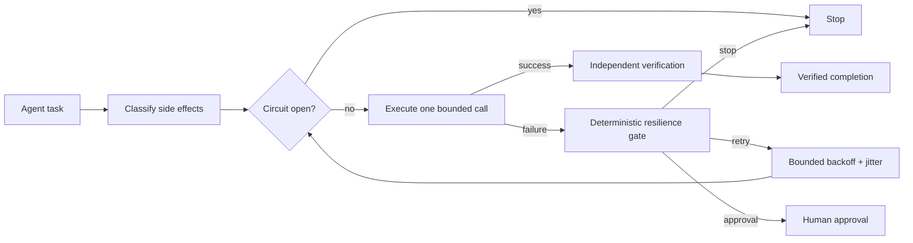

# Agent Circuit Breaker Resilience Gate

Reusable implementation kit for AI agents that call unreliable external APIs, MCP tools, SaaS services, or remote infrastructure. The package prevents retry storms, duplicate side effects, runaway latency, and policy bypass by combining deterministic retry classification, bounded backoff, idempotency checks, and circuit-breaker rules.

## Problem
AI agents often respond to network errors by simply retrying. That is unsafe when the failure is non-transient, the operation is non-idempotent, the upstream is already degraded, or the retry budget is unbounded. Repeated retries can amplify outages, duplicate mutations, consume tokens/time, and hide the real failure mode.

This package turns retry behavior into an explicit gated workflow with deterministic rules.

## When to use
Use for HTTP APIs, MCP tools, cloud/SaaS integrations, remote test/build services, webhooks, payment/order mutations, CI APIs, GitHub/Graph-style APIs, and other external dependencies where transient failures occur.

## When not to use
Do not use this as a replacement for service-native resilience, queues, transactional outbox/inbox, distributed sagas, or database transactions. It also does not execute remote calls itself; it provides the decision layer that the host agent/tooling must honor.

## Architecture



## Package tree

```text
agent-circuit-breaker-resilience-gate/
├── README.md
├── config/
│   └── policy.yaml
├── examples/
│   └── retryable-503.json
├── hooks/
│   └── lifecycle.md
├── rules/
│   └── resilience-safety.md
├── schemas/
│   └── decision.schema.json
├── scripts/
│   ├── resilience_gate.py
│   └── verify_package.py
├── skills/
│   ├── resilience-policy-review.md
│   └── resilient-tool-call.md
├── subagents/
│   ├── call-executor.md
│   └── resilience-verifier.md
├── templates/
│   └── call-request.md
├── tests/
│   └── test_resilience_gate.py
└── workflows/
    └── resilient-external-call.md
```

## Component responsibilities
- `scripts/resilience_gate.py` deterministically decides whether a failed call may retry, must stop, or requires approval.
- `config/policy.yaml` contains timeout, retry, circuit-breaker, backoff, status-code, and approval policy.
- `skills/resilient-tool-call.md` gives agents the operational procedure for safe external calls.
- `skills/resilience-policy-review.md` governs changes to retry/timeout/circuit policy.
- `rules/resilience-safety.md` defines mandatory and forbidden behavior.
- `subagents/call-executor.md` owns bounded execution.
- `subagents/resilience-verifier.md` independently verifies retry compliance and postconditions.
- `workflows/resilient-external-call.md` ties the stages together with bounded loops and failure paths.
- `hooks/lifecycle.md` defines deterministic lifecycle checkpoints.
- `schemas/decision.schema.json` defines the gate result contract.

## Dependencies
Python 3.9+ and PyYAML:

```bash
python -m pip install pyyaml
```

The core gate has no network dependency and never performs an external call.

## Configuration
Edit `config/policy.yaml` to match the target service. Important controls:

- `operation_timeout_seconds`: maximum duration for one call.
- `max_attempts_per_call`: total attempt count, including the first call.
- `consecutive_failures_to_open`: breaker threshold.
- `failure_rate_window` and `failure_rate_threshold`: rolling failure-rate threshold.
- `open_seconds`: wait before half-open probing.
- `half_open_probe_limit`: bounded recovery probes.
- `retryable_status_codes`: HTTP-like transient failures.
- `non_retryable_status_codes`: failures that stop immediately.
- `max_retry_after_seconds`: cap on server-provided retry delay.
- `require_idempotency_for_retries`: prevents unsafe mutation retries.
- `approval_required_for`: protected policy changes.

Keep service-specific tuning conservative. Increasing retries can multiply upstream load and should be treated as a production-impacting change.

## Usage
After a failed attempt, run:

```bash
python scripts/resilience_gate.py \
  --policy config/policy.yaml \
  --attempt 1 \
  --idempotent true \
  --status 503 \
  --error-kind upstream-5xx \
  --output decision.json
```

The result is one of:

- `retry` — the failure is classified as transient, the call is safe to retry, and attempt budget remains.
- `stop` — do not issue another call.
- `approval` — automatic retry is unsafe; explicit human approval is required.

Exit codes are `0` for retry, `2` for stop, and `4` for approval required.

A non-idempotent mutation receiving HTTP 503 should not be retried automatically:

```bash
python scripts/resilience_gate.py \
  --policy config/policy.yaml \
  --attempt 1 \
  --idempotent false \
  --status 503
```

That returns `approval` rather than `retry`.

## Circuit breaker integration
The included `CircuitBreaker` class models closed, open, and half-open states. The host agent/runtime should persist circuit state per dependency/operation scope rather than recreating it for every attempt. When open, no new calls should be made until `open_seconds` expires. Half-open probes are limited by policy.

For distributed systems, use a shared resilience library or store when multiple workers must honor the same breaker state. This kit intentionally keeps the core gate portable and dependency-light.

## Retry semantics
A retry is allowed only when all required conditions are true:

1. Failure is classified as retryable.
2. Circuit is not open.
3. Attempt budget remains.
4. The operation is idempotent or protected by a real idempotency mechanism.
5. No protected policy override is required.

Backoff uses bounded exponential delay with jitter. `Retry-After` is respected but capped by policy.

## Approval boundaries
Explicit human approval is required before:

- disabling the circuit breaker,
- increasing retry attempt budget,
- increasing operation timeout,
- bypassing idempotency requirements,
- changing production resilience policy,
- retrying an unsafe mutation whose side effects cannot be proven idempotent.

Agents must never silently broaden permissions, rotate credentials, or weaken resilience controls to force a task through.

## Failure and recovery
### Retryable transient failure
Examples: timeout, connection reset, 429, selected 5xx. Retry only within the configured budget.

### Non-retryable failure
Examples: 400, 401, 403, 404, 409, 422 by default. Stop and preserve evidence.

### Tool/configuration failure
If the resilience gate cannot run or policy is invalid, block further retries rather than falling back to ad-hoc behavior.

### Circuit open
Stop sending traffic. Preserve evidence and allow only bounded half-open probes after the configured open period.

### Verification mismatch
Do not repeat the mutation automatically. Return failure/inconclusive and escalate.

## Verification
Run package tests:

```bash
python -m unittest tests/test_resilience_gate.py
python scripts/verify_package.py
```

Task-level verification must additionally confirm:

- each attempt respected timeout and attempt budget,
- every retry matched a retryable classification,
- non-idempotent operations were not automatically retried,
- circuit-open state blocked new traffic,
- expected business/service postcondition was independently verified,
- exhausted retries are reported as failure rather than hidden.

## Input/output contract
The gate consumes:

- current attempt number,
- idempotency boolean,
- optional HTTP-like status,
- optional normalized error kind,
- optional Retry-After,
- current circuit state,
- policy file.

It returns `schemas/decision.schema.json` with:

- `action`,
- `reason`,
- `retry_delay_seconds`,
- `circuit_state`,
- `attempt`,
- `approval_required`.

## Definition of Done
A resilient external-call task is complete only when:

- operation intent and side effects were classified,
- idempotency was explicitly determined,
- all attempts stayed within timeout and retry budget,
- retry decisions were produced from deterministic policy,
- circuit state was respected,
- protected policy changes had required approval,
- final service/business postcondition was independently verified,
- unresolved risk and final failure evidence are preserved.

Transport success alone is not proof of task completion.

## Customization
Adapt `policy.yaml` per service rather than using one global retry profile. Different endpoints may have different idempotency semantics, rate limits, latency profiles, and recovery behavior. Keep tool-specific adapters outside the core instructions so the package can be used with OpenAI Codex, Claude Code, Cursor, ChatGPT, GitHub Copilot, OpenCode, or other agent runtimes.
