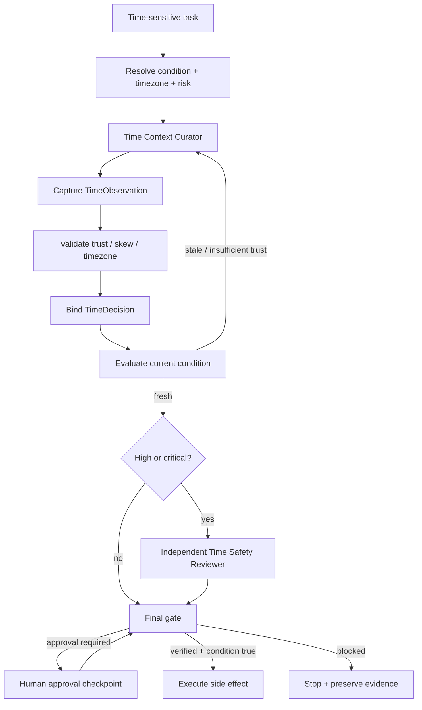

# Agent Clock-Time Dependency Guard

Reusable, tool-neutral guardrail for AI-agent workflows whose correctness depends on **current time, expiry, TTL, deadlines, maintenance windows, cutoffs, or schedules**.

## Problem

Agents often make time-dependent decisions from implicit local time, stale timestamps, mixed timezones, or an unverified machine clock. A decision can be correct when planned and wrong seconds or minutes later when the side effect actually runs. Common failures include deploying outside a maintenance window, using expired approval/token evidence, running after a financial cutoff, or comparing naive local timestamps as if they were UTC.

This kit makes time an explicit evidence dependency rather than hidden ambient state.

## Purpose

Bind each time-sensitive decision to:

- a named time source,
- trust level,
- UTC observation timestamp,
- business timezone,
- clock-skew evidence,
- freshness budget based on risk,
- exact decision condition,
- independent review for high/critical risk,
- explicit human approval for dangerous actions.

It distinguishes **task executed** from **time decision verified successfully**.

## When to use

Use for TTL/expiry checks, release/deploy windows, scheduled side effects, business cutoffs, approval/permission expiry, token/certificate timing, maintenance windows, migration windows, delayed jobs, or any workflow that asks whether something is valid *now*.

## When not to use

Do not use this as a distributed-lock service, scheduler, NTP client, authorization system, or replacement for domain-specific calendar/business-day rules. It validates time evidence and decision freshness; it does not create a trustworthy external clock by itself.

## Architecture



## Package tree

```text
agent-clock-time-dependency-guard/
├── README.md
├── config/
│   └── time-policy.json
├── schemas/
│   ├── time-decision.schema.json
│   ├── time-observation.schema.json
│   └── time-review.schema.json
├── scripts/
│   ├── capture-system-time.py
│   ├── evaluate-final-gate.py
│   ├── evaluate-time-decision.py
│   └── validate-time-observation.py
├── skills/
│   ├── capture-trusted-time.md
│   └── revalidate-time-sensitive-decision.md
├── rules/
│   └── time-dependency-governance.md
├── subagents/
│   ├── time-context-curator.md
│   └── time-safety-reviewer.md
├── workflows/
│   └── time-sensitive-decision-workflow.md
├── hooks/
│   └── time-dependency-hooks.md
├── templates/
│   └── time-decision.example.json
└── tests/
    └── smoke-test.py
```

## Component responsibilities

- **Time Context Curator**: obtains and refreshes time evidence; cannot approve or execute the protected action.
- **Time Safety Reviewer**: independently verifies high/critical decisions; cannot edit the decision to make it pass.
- **Policy**: defines observation-age limits, required trust by risk, skew budget, retry count, and approval boundaries.
- **Schemas**: define observation, decision, and review handoff contracts.
- **Scripts**: perform deterministic capture, validation, condition evaluation, and final binding checks.
- **Hooks**: specify lifecycle points where the deterministic checks block execution.

## Requirements

- Python 3.9+.
- Python standard library only.
- An external/reference time source is required in your integration if high/critical decisions must achieve `verified` trust. The bundled capture script intentionally does not make network calls.

## Installation

Copy this directory into a repository. Keep paths intact, or update hook/workflow commands consistently if relocated.

Run the smoke test:

```bash
python tests/smoke-test.py
```

Expected output:

```text
smoke-test: PASS
```

## Configuration

Edit `config/time-policy.json`:

- `max_clock_skew_ms`: largest accepted measured skew.
- `max_observation_age_seconds`: freshness budget per risk tier.
- `required_trust_by_risk`: minimum source trust.
- `require_independent_review_for`: risk tiers requiring another reviewer.
- `high_risk_decisions`: examples that should normally be classified high/critical.
- `max_transient_retries`: bounded retry count; default is `1`.

Trust levels:

- `unverified`: no meaningful trust claim.
- `asserted`: source supplied time but no independent verification was proven.
- `verified`: an approved reference source was actually checked and recorded.

**Do not mark a local system clock `verified` merely because the operating system reports a time.**

## Usage

### 1. Capture an observation

For low/medium-risk local workflows:

```bash
python scripts/capture-system-time.py \
  --source-id local-system-clock \
  --trust-level asserted \
  --timezone UTC \
  --output observation.json
```

For a verified observation, your adapter must actually compare against an approved reference and provide the measured skew/reference metadata. The bundled script allows `--trust-level verified` only when `--reference-source` is supplied, but your integration remains responsible for truthfully performing that verification.

### 2. Validate evidence

```bash
python scripts/validate-time-observation.py observation.json --max-skew-ms 2000
```

### 3. Build a decision

Start from `templates/time-decision.example.json` and replace example timestamps/evidence with current values. Conditions supported by the evaluator:

- `before`
- `after`
- `between` (start inclusive, end exclusive)
- `ttl-valid`
- `ttl-expired`

All decision timestamps must be timezone-aware ISO-8601 values.

### 4. Evaluate time immediately before the protected action

```bash
python scripts/evaluate-time-decision.py decision.json \
  --policy config/time-policy.json \
  > evaluation.json
```

`status=evaluated` means the evidence is acceptable for policy evaluation. The caller must also require `condition_satisfied=true` before executing the requested time-bounded action.

If status is `revalidation-required`, refresh time evidence and evaluate again. Do not widen the window or TTL to make it pass.

### 5. Independent high-risk review

For high/critical risk, create a review matching `schemas/time-review.schema.json`. `decision_fingerprint` is the SHA-256 of canonical JSON (`sort_keys=True`, separators `(',', ':')`) for the exact decision. The reviewer must differ from `executor_id`.

### 6. Final gate

Low/medium risk:

```bash
python scripts/evaluate-final-gate.py decision.json evaluation.json \
  --policy config/time-policy.json
```

High/critical risk:

```bash
python scripts/evaluate-final-gate.py decision.json evaluation.json \
  --policy config/time-policy.json \
  --review review.json
```

Only `status=verified` permits the workflow to continue, and the caller must still require the evaluated condition to be true.

## Time semantics

Use **UTC wall-clock time** for calendar deadlines and cross-system timestamps. Retain the business timezone explicitly for interpretation. Use **monotonic time** for elapsed-duration measurement where possible because wall clocks can jump due to synchronization or manual changes.

Never compare naive local timestamps. Never infer timezone from the machine locale, repository owner, user location, or previous task.

## Approval boundaries

Time verification never substitutes for authorization. Explicit human approval is still required before production deployment, destructive SQL/data/file deletion, schema changes, secret changes, production configuration changes, breaking API contracts, security weakening, infrastructure changes, irreversible migrations, force push/history rewrite, or equivalent dangerous actions.

Agents must stop before approval-required actions and must never increase permissions or extend a time window silently.

## Failure and recovery

- **Transient time-source/tool failure**: retry once; preserve the failed attempt.
- **Stale observation**: obtain a new observation and re-evaluate.
- **Clock skew exceeded**: block; investigate synchronization/reference source.
- **Insufficient source trust**: obtain a stronger approved source; do not relabel existing evidence.
- **Ambiguous timezone/naive timestamp**: block until corrected.
- **False business condition**: stop; do not auto-extend deadline/window.
- **Permission failure**: stop/escalate; do not silently elevate permissions.
- **Stale or self-review**: obtain a fresh independent review.
- **Repeated transient failure**: stop after the configured bounded retry and preserve evidence.

## Verification

A successful run proves that:

1. current time evidence was captured and validated,
2. source trust meets the risk tier,
3. clock skew is within policy,
4. observation age is within freshness budget,
5. timestamps are timezone-aware,
6. the exact condition was evaluated,
7. evaluation is bound to the current decision and observation,
8. high/critical review is independent and fingerprint-bound,
9. required human approval exists separately,
10. the time condition is still true immediately before execution.

## Definition of Done

- Required time context and business timezone are explicit.
- A current TimeObservation exists and validates.
- TimeDecision matches the actual action/risk/condition.
- Deterministic evaluation completed with `condition_satisfied=true`.
- Any stale evidence was refreshed with prior evidence preserved.
- Required independent review is approved and current.
- Required human approval is recorded.
- Final gate returns `verified`.
- Execution and verification timestamps are recorded separately.
- No blocking failure or unresolved time ambiguity remains.

## Portability

The core contracts and scripts are independent of OpenAI Codex, Claude Code, Cursor, ChatGPT, GitHub Copilot, OpenCode, or other agents. Integrate platform-specific time APIs by producing the same TimeObservation fields rather than changing the core workflow.

## Customization

Add domain-specific decision types and tighter freshness/skew limits in policy. If your system has a trusted platform/database/NTP source, implement a small adapter that captures it into `time-observation.schema.json`. Keep source verification isolated from the core evaluator so the deterministic decision logic remains portable.
