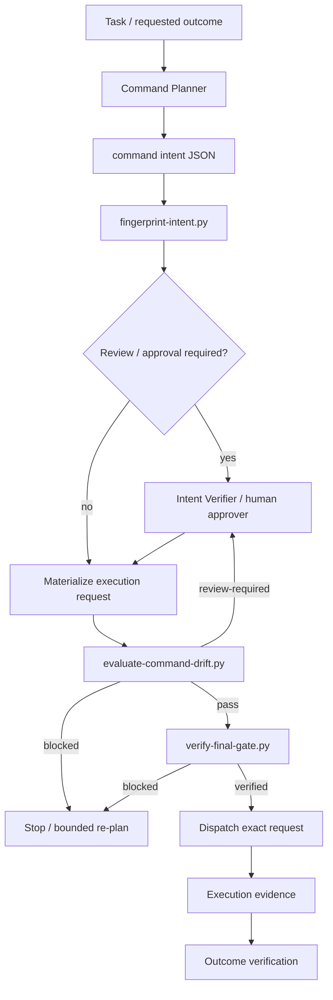

# Agent Command Intent Drift Gate

A reusable guardrail that prevents an AI agent from executing a command or tool request whose resolved executable, arguments, target, environment, side effects, or approval scope no longer match the command intent that was reviewed.

## Problem

AI-assisted workflows often plan one operation and execute a subtly different one. Drift can appear after variable expansion, wrapper/adaptor translation, a retry, a regenerated shell command, a changed target, a copied production flag, or a tool call assembled by another agent. A human may approve `deploy staging`, while the final command points at production; a reviewer may inspect a safe SQL command, while the dispatched request gains a destructive flag.

A successful command exit does not prove that the executed operation was the reviewed operation.

## Purpose

This kit creates an explicit command-intent contract, fingerprints it deterministically, materializes the exact execution request before dispatch, compares the two, requires independent review for high-risk drift, and enforces human approval for dangerous actions.

## When to use

Use it for commands or structured tool calls that can materially affect repositories, databases, cloud resources, deployments, external APIs, infrastructure, secrets, permissions, releases, production configuration, or other persistent state.

It is especially useful for multi-agent workflows where planning, implementation, review, and execution may happen in different stages or processes.

## When not to use

Do not add this ceremony to trivial read-only commands whose target and arguments cannot create meaningful risk. This gate is also not a substitute for sandboxing, IAM, policy-as-code, database permissions, protected branches, deployment controls, or provider-side idempotency.

## Architecture



## Component responsibilities

- **Command Planner** builds the exact intended operation without executing it.
- **Intent Verifier** independently checks high/critical-risk intent and reviewable drift.
- **`fingerprint-intent.py`** normalizes only safe textual properties while preserving argument order and hashes the reviewed intent.
- **`evaluate-command-drift.py`** deterministically compares the current execution request with reviewed intent.
- **`verify-final-gate.py`** re-binds intent, policy, execution request, review identity, and mandatory human approval immediately before dispatch.
- **Hooks** define lifecycle enforcement points.
- **Governance rules** define mandatory and forbidden behavior.

## Package tree

```text
agent-command-intent-drift-gate/
├── README.md
├── config/
│   └── intent-policy.json
├── schemas/
│   ├── command-intent.schema.json
│   ├── execution-request.schema.json
│   └── intent-review.schema.json
├── scripts/
│   ├── fingerprint-intent.py
│   ├── evaluate-command-drift.py
│   └── verify-final-gate.py
├── skills/
│   ├── capture-reviewed-command-intent.md
│   └── revalidate-command-before-execution.md
├── rules/
│   └── command-intent-governance.md
├── subagents/
│   ├── command-planner.md
│   └── intent-verifier.md
├── workflows/
│   └── command-intent-drift-workflow.md
├── hooks/
│   └── command-intent-hooks.md
├── templates/
│   └── command-intent.example.json
├── examples/
│   └── intent-review.example.json
└── tests/
    └── smoke-test.py
```

## Dependencies

Core scripts use Python 3 standard library only. JSON Schema files use Draft 2020-12 and can be validated by any compatible validator if the host repository already uses one.

No cloud SDK, shell framework, or AI-provider-specific dependency is required.

## Installation

Copy this directory into the repository, keep the relative paths intact, and adapt `config/intent-policy.json` to local approval boundaries and review policy.

Do not weaken mandatory dangerous-action approval merely to simplify an agent workflow.

## Configuration

`config/intent-policy.json` controls:

- normalization of executable casing and whitespace;
- preservation of argument order;
- independent review requirements for high/critical risk;
- self-review prohibition;
- deterministic drift behavior;
- bounded retry/re-plan limits;
- dangerous actions requiring explicit human approval.

Argument order is deliberately preserved because CLI argument/flag ordering can carry semantics and generic sorting cannot safely infer which flags are unordered.

## Input contracts

### Command intent

`schemas/command-intent.schema.json` captures:

- `intent_id` and `actor_id`;
- reviewed executable and ordered arguments;
- target and environment;
- side-effect class;
- risk;
- approval action;
- explicit constraints.

### Execution request

`schemas/execution-request.schema.json` represents the exact request after safe-to-inspect expansion and before dispatch.

### Review

`schemas/intent-review.schema.json` binds a review to the exact intent fingerprint and records `reviewer_type` as `agent` or `human`. Dangerous actions require a human review/approval whose `approval_action` exactly matches the intent.

## Usage

Start from `templates/command-intent.example.json` or produce an equivalent schema-valid file.

Fingerprint the reviewed intent:

```bash
python scripts/fingerprint-intent.py \
  --intent artifacts/command-intent.json \
  --policy config/intent-policy.json \
  --output artifacts/intent-fingerprint.json
```

Materialize the exact execution request without dispatching it, then evaluate drift:

```bash
python scripts/evaluate-command-drift.py \
  --intent artifacts/command-intent.json \
  --execution artifacts/execution-request.json \
  --policy config/intent-policy.json \
  --output artifacts/drift-decision.json
```

Exit codes:

- `0`: pass;
- `3`: review required;
- `2`: blocked;
- `1`: validation/runtime error.

Immediately before dispatch, run the final gate:

```bash
python scripts/verify-final-gate.py \
  --intent artifacts/command-intent.json \
  --execution artifacts/execution-request.json \
  --decision artifacts/drift-decision.json \
  --policy config/intent-policy.json \
  --review artifacts/intent-review.json \
  --actor agent-implementation-01
```

Omit `--review` only when the current decision/risk/action does not require one.

## Deterministic drift rules

The evaluator blocks:

- intent ID mismatch;
- executable change;
- target change;
- environment change;
- escalation to a more dangerous side-effect class;
- arguments added after review.

The evaluator requests review for:

- reviewed arguments removed;
- argument reordering when the token set remains otherwise equivalent;
- side-effect classification changes that do not escalate risk.

A reviewer cannot convert a deterministic blocker into a pass. The intent must be corrected/replanned and fingerprinted again.

## Review and approval boundaries

High/critical-risk intent requires independent review when configured. The implementing actor cannot be the sole reviewer when self-review is disabled.

The following actions require explicit human approval by default:

- production deployment;
- destructive SQL;
- database schema changes;
- data/file deletion;
- force push or history rewrite;
- infrastructure changes;
- secret changes;
- production configuration changes;
- breaking API changes;
- weakening security controls;
- irreversible migrations;
- large dependency upgrades.

Approval is valid only for the exact current intent fingerprint and exact `approval_action`. If target, environment, arguments, policy, or intent changes, revalidation/re-approval is required.

## Failure and recovery

- **Transient read/status error:** retry once and preserve the original error.
- **Validation error:** no blind retry; fix the contract/input.
- **Deterministic drift blocker:** no automatic retry; stop and re-plan at most once after new evidence.
- **Permission failure:** do not silently increase privileges or switch credentials; escalate.
- **Review fingerprint mismatch:** obtain a new review for current intent.
- **Unknown result after external side effect:** do not replay blindly; reconcile actual remote state first.
- **Opaque wrapper or unresolved command:** stop because the exact executable/arguments cannot be verified.

## Verification

Run the included standard-library smoke test from the package directory:

```bash
python tests/smoke-test.py
```

The smoke test covers:

- exact-match pass and final verification;
- unreviewed added argument blocking;
- target drift blocking;
- argument reorder requiring review;
- high-risk self-review rejection;
- dangerous action rejecting agent-only approval;
- dangerous action accepting an independently bound human approval.

In a host repository, additionally verify the actual command outcome using task-specific evidence such as build/test output, API read-back, database state, deployment status, or repository state. Command gate success proves intent integrity, not business correctness.

## Execution vs verification

**Task executed** means the exact materialized command/tool request was dispatched and returned a result.

**Task verified successfully** means, in addition, the command passed the intent gate, mandatory review/approval was valid, and task-specific post-action evidence proves the intended outcome.

Never treat code generation, command construction, or exit code alone as final verification.

## Definition of Done

- relevant command context was gathered from authoritative sources;
- a schema-valid intent exists;
- intent fingerprint is current;
- exact execution request was materialized before dispatch;
- deterministic drift evaluation has no blocker;
- review-required drift was independently reviewed;
- dangerous actions have explicit matching human approval;
- final gate returned `verified` for the exact execution request;
- the exact dispatched operation was recorded;
- task-specific outcome evidence was collected;
- retries stayed within policy limits;
- remaining risks/open questions are recorded;
- no permissions, target, environment, or side-effect scope was silently broadened.

## Safety and permissions

Use least privilege. This package never grants operational authority; it only verifies consistency between intent and execution. Provider-side permissions, protected environments, branch protections, database roles, secret controls, and production change processes remain authoritative.

Secrets must never be embedded in intent/review artifacts. Reference secret identifiers or configuration keys instead.

## Portability

The core model is tool-neutral and can be used with OpenAI Codex, Claude Code, Cursor, ChatGPT, GitHub Copilot, OpenCode, CI runners, MCP clients, or custom agents. Tool-specific adapters should only materialize the `execution-request` contract; they must not bypass the deterministic drift gate.

## Customization

Safe customizations include:

- adding organization-specific dangerous action names;
- tightening independent-review thresholds;
- adding target/resource identity fields to local schemas;
- wrapping the scripts in CI hooks or agent lifecycle hooks;
- adding provider-specific read-back verification after execution.

When extending the contracts, update schemas, scripts, workflow, hooks, examples, smoke tests, and this README together so fingerprints and approval semantics remain consistent.
