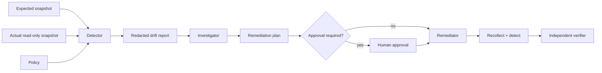

# Agent Configuration Drift Detection Gate

Reusable, tool-neutral kit for detecting, classifying, remediating, and independently verifying configuration drift without exposing secret values or silently modifying production.

## Problem
Configuration can diverge from the repository or approved baseline because of manual edits, stale deployment inputs, environment overrides, secret rotation, feature flags, or generation defects. Ad-hoc agent investigation can leak secrets, compare mismatched scopes, or "fix" production before proving which side is wrong.

## Purpose
Turn configuration-drift work into a bounded evidence workflow: validate comparable snapshots, detect drift deterministically, redact sensitive values, classify causes, gate dangerous remediation, recollect the same scope, and independently verify convergence.

## When to use
Use for post-deployment parity checks, environment mismatch investigations, configuration-related incidents, pre-release validation, or suspected manual drift. Do not use this package as a secret-management system, a deployment engine, or authorization to change production.

## Architecture


## Package tree
```text
agent-config-drift-detection-gate/
├── README.md
├── config/drift-policy.json
├── schemas/drift-report.schema.json
├── rules/config-drift-safety.md
├── skills/detect-and-classify-drift.md
├── skills/remediate-config-drift.md
├── subagents/config-investigator.md
├── subagents/config-remediator.md
├── subagents/independent-verifier.md
├── workflows/config-drift-response.md
├── hooks/config-drift-hooks.md
├── scripts/detect-config-drift.py
├── scripts/verify-drift-report.py
├── examples/expected.json
├── examples/actual.json
└── tests/test-drift-detector.py
```

## Components
`detect-config-drift.py` performs deterministic JSON leaf comparison and redaction. `verify-drift-report.py` checks report structure and rejects leaked sensitive values. The policy centralizes secret-name patterns, retry limit, approval boundaries, and required verification. Skills define investigation and remediation procedures; subagents separate read-only investigation, implementation, and independent verification; the workflow and hooks define bounded orchestration.

## Dependencies and permissions
Python 3.9+ is sufficient; scripts use only the standard library. The core detector needs local read access to snapshots and write access only to its report directory. Environment retrieval should be read-only and least-privileged. This kit never requires production write permission for detection.

## Installation
Copy this directory into the target repository. Adjust `config/drift-policy.json` secret-name patterns to match naming conventions. Produce JSON snapshots of the same application/environment scope. Keep raw snapshots containing real secrets outside Git and outside long-lived agent artifacts; prefer pre-redacted or ephemeral files.

## Usage
From the package root:
```bash
python3 scripts/detect-config-drift.py \
  --expected examples/expected.json \
  --actual examples/actual.json \
  --policy config/drift-policy.json \
  --output artifacts/drift-report.json

python3 scripts/verify-drift-report.py artifacts/drift-report.json
python3 -m unittest tests/test-drift-detector.py
```
Detector exit codes: `0` clean, `2` drift detected, `3` invalid input/tool error. A drift exit is an investigation signal rather than an execution failure.

## Example invocation for an AI coding agent
"Use `workflows/config-drift-response.md`. Compare my approved JSON baseline with the authorized read-only staging snapshot. Follow `rules/config-drift-safety.md`; do not expose secrets or change production. Preserve a verified drift report, classify every difference with evidence, and stop before any approval-required action."

## Workflow
1. Validate snapshot provenance, scope, and JSON syntax.
2. Detect drift and preserve the report/exit code.
3. Verify structure and redaction.
4. Classify each difference using repository/environment evidence.
5. Trace the generation path and plan the smallest remediation.
6. Stop for explicit approval when required.
7. Apply only authorized changes and run relevant tests/builds.
8. Recollect the same actual scope and rerun detection.
9. Independent verifier checks convergence, tests, approvals, and unintended changes.

## Approval boundaries
Explicit human approval is mandatory before production configuration changes, secret changes, infrastructure changes, deployment, breaking contracts, data deletion, or other destructive/irreversible operations. Agents must not increase privileges to obtain or apply such changes.

## Failure and recovery
Transient snapshot/tool failures may be retried at most twice while preserving evidence. Invalid JSON is corrected rather than blindly retried. Permission failures stop without privilege escalation. Remediation may be replanned once after a failed verification; a second failed remediation stops and escalates. Source-of-truth ambiguity is a human decision point.

## Verification
A task was **executed** when comparison/remediation commands ran. It is **verified successfully** only when the report verifier passes, secret values remain redacted, relevant tests/builds pass, post-change comparison meets the intended state, independent verification checks unintended changes, and required approvals exist.

The JSON Schema in `schemas/drift-report.schema.json` documents the handoff contract. The dependency-free verifier enforces the critical subset at runtime without requiring a third-party schema package.

## Definition of Done
- Expected and actual sources represent the same proven scope.
- Machine-readable report exists and passes verification.
- Sensitive values are redacted.
- Each drift item is resolved, intentionally accepted with evidence, or explicitly documented as non-blocking.
- Relevant tests/builds pass.
- Required convergence is proven by a clean post-change comparison.
- Independent verifier confirms no unintended changes.
- Required approvals were obtained before dangerous actions.
- Remaining risks are documented and no blocking failure remains.

## Customization
Extend secret-name patterns rather than hard-coding secret values. Wrap cloud/Kubernetes/App Configuration retrieval in a separate read-only adapter that outputs JSON, leaving the core comparison unchanged. Add project-specific build/test hooks while retaining the same exit-code and report contracts.
