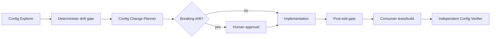

# Agent Config Schema Drift Gate

Reusable safety and verification kit for AI-assisted changes to JSON/YAML configuration contracts. It catches silent key removal and type drift before an agent declares a change complete.

## Problem
Configuration edits often bypass compile-time checks. An AI coding agent can rename/remove a key or change a scalar type while the edited file remains syntactically valid; failures then appear in another service, environment, startup path, or deployment.

## When to use
Use for application settings, agent/tool manifests, policy files, feature configuration, CI configuration, and other JSON/YAML consumed as a contract. Do not use it as a secret scanner, deployment system, or substitute for application-specific validation.

## Architecture


## Package tree
```text
agent-config-schema-drift-gate/
├── README.md
├── config/policy.json
├── hooks/lifecycle-hooks.md
├── rules/config-safety.md
├── schemas/handoff.schema.json
├── scripts/config_drift_gate.py
├── skills/config-contract-investigation.md
├── subagents/config-explorer.md
├── subagents/config-change-planner.md
├── subagents/config-verifier.md
├── tests/test_config_drift_gate.py
└── workflows/config-change-gate.md
```

## Installation
Copy this directory into the repository or agent-kit directory. Requires Python 3. JSON works with the standard library; YAML scanning additionally requires `pip install pyyaml`.

## Configuration
Edit `config/policy.json`: narrow `allowed_config_globs`, choose the repository-local baseline directory, tune sensitive key-name patterns, and keep `max_removed_keys` at `0` unless your governance explicitly allows otherwise. The script records key paths and Python value types, not configuration values.

## First adoption
From this kit directory, initialize snapshots against the target repository:

```bash
python scripts/config_drift_gate.py --root /path/to/repo --policy config/policy.json --write-baseline
python scripts/config_drift_gate.py --root /path/to/repo --policy config/policy.json
python -m unittest tests/test_config_drift_gate.py
```

Inspect and commit the generated `/path/to/repo/.ai-config-baseline/` files. Initialization establishes the reviewed starting contract; it must not be used to conceal unexplained drift.

## Normal usage
Before and after agent edits:

```bash
python scripts/config_drift_gate.py --root /path/to/repo --policy config/policy.json --report /path/to/repo/.ai-config-drift-report.json
```

Exit `0` means the deterministic contract gate passed. Exit `2` means blocking drift or validation failure. A gate pass does not replace consumer build/tests.

## Components
`skills/config-contract-investigation.md` defines evidence-first investigation. `rules/config-safety.md` supplies enforceable boundaries. Explorer maps producers/consumers; Planner owns compatibility planning; Verifier independently proves completion. `workflows/config-change-gate.md` owns bounded retries and approval. `hooks/lifecycle-hooks.md` maps lifecycle events to the script. `schemas/handoff.schema.json` provides a portable structured handoff contract.

## Permissions and approval
Normal operation requires repository read plus local report generation. Baseline writes require repository write. Explicit human approval is required before baseline replacement for removed keys/type changes and before production config, secret, infrastructure, breaking API/consumer contract, destructive, or irreversible changes. The kit never deploys or elevates permissions.

## Failure and recovery
Transient tool/command failures may retry at most twice while preserving evidence. Implementation-caused test failures permit at most two fix-test cycles. Parse, permission, missing-baseline, and missing-approval failures block immediately until evidence changes. Repeated failure ends as blocked/inconclusive rather than looping.

## Verification
A task is only **verified successfully** when the final gate passes, affected consumer tests/build pass, required approval is present, the final diff contains no unintended changes, and the independent verifier returns `verified`. Merely executing edits is not completion.

## Definition of Done
All in-scope config parses; required baseline snapshots exist; no unexplained removed keys or type changes remain; affected consumers were identified; required tests/build pass; approval exists for intentional breaking drift; final diff is scoped; verification evidence is preserved; no blocking failure remains.

## Customization
Extend policy globs for repository conventions. Add application-specific validators/build commands to the final hook rather than putting nondeterministic reasoning into the Python gate. Keep vendor-specific agent adapters outside the core workflow so the same kit can be used with Codex, Claude Code, Cursor, ChatGPT, Copilot, OpenCode, or another coding agent capable of following repository instructions and invoking local commands.
