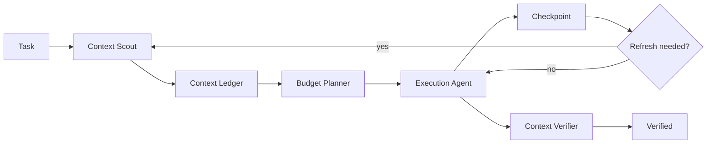

# Agent Context Budget Orchestrator

A reusable framework for controlling what an AI coding agent reads, retains, compresses, refreshes, and discards during long engineering tasks.

## Problem

Coding agents often accumulate too much context: whole files, repeated logs, stale hypotheses, duplicate test output, old plans, and irrelevant repository details. Large context increases cost, slows reasoning, hides critical evidence, and can cause the agent to act on outdated information.

This kit introduces an explicit context lifecycle with budgets, evidence tiers, checkpoints, refresh rules, and deterministic validation.

## When to use

Use this kit for:

- repository exploration across many files;
- long bug investigations;
- feature work spanning multiple modules;
- large code reviews;
- multi-step refactors;
- incident analysis with logs and traces;
- multi-agent workflows;
- tasks where token/cost limits matter;
- tasks where evidence becomes stale as files change.

For tiny one-file edits, the full workflow is optional.

## Architecture



The system separates semantic judgment from deterministic checks:

- **Skills** define context selection, compression, refresh, and handoff procedures.
- **Rules** prevent uncontrolled full-repository loading and stale evidence reuse.
- **Subagents** divide context discovery from independent verification.
- **Workflow** defines context lifecycle stages and stop conditions.
- **Hooks** enforce ledger validation at checkpoints.
- **Scripts** calculate budget usage and validate the context ledger schema.

## Package structure

```text
agent-context-budget-orchestrator/
├── README.md
├── skills/
│   ├── context-selection.md
│   └── context-compression.md
├── rules/
│   └── context-governance.md
├── subagents/
│   ├── context-scout.md
│   └── context-verifier.md
├── workflows/
│   └── context-budget-workflow.md
├── hooks/
│   └── hooks.md
├── scripts/
│   ├── calculate-context-budget.py
│   └── validate-context-ledger.py
├── schemas/
│   └── context-ledger.schema.json
├── templates/
│   └── context-ledger.example.json
└── config/
    └── context-budget.example.json
```

## Installation

Copy this folder into a repository, for example:

```text
.ai/agent-context-budget-orchestrator/
```

Requirements:

- Python 3.9+ for deterministic scripts;
- an AI agent that can read repository files and keep a task-local working note or JSON ledger.

No vendor-specific runtime is required.

## Configuration

Copy `config/context-budget.example.json` to a project-specific config and adjust:

- total context budget;
- maximum number of active source items;
- maximum summary size per source;
- evidence refresh age;
- reserved budget for task instructions and outputs.

The numeric budget is an engineering control, not a claim about any specific model's context window.

## Usage

Example task:

> Diagnose why order status occasionally remains `Processing` after payment succeeds.

1. Context Scout identifies only the likely entry points, state mutation, payment callbacks, background processors, tests, and recent logs.
2. It records every retained source in `context-ledger.json` with purpose, evidence tier, summary, freshness, and reread conditions.
3. Budget Planner checks projected context usage.
4. Execution Agent works only from active context and can request targeted expansion.
5. At each checkpoint, stale evidence is refreshed and obsolete hypotheses are retired.
6. Before completion, Context Verifier checks that final claims still point to current evidence.

Run deterministic checks:

```bash
python .ai/agent-context-budget-orchestrator/scripts/validate-context-ledger.py context-ledger.json
python .ai/agent-context-budget-orchestrator/scripts/calculate-context-budget.py \
  --ledger context-ledger.json \
  --config .ai/agent-context-budget-orchestrator/config/context-budget.example.json
```

## Workflow

1. Parse task and identify decision questions.
2. Build a minimal initial context map.
3. Assign evidence tiers: `critical`, `supporting`, `reference`, or `discardable`.
4. Create the ledger and estimate context cost.
5. Read targeted sources until decision questions are answerable.
6. Execute work using active context only.
7. Checkpoint after meaningful state changes.
8. Refresh sources invalidated by edits or new evidence.
9. Compress completed branches of investigation.
10. Verify final claims against fresh critical evidence.

See `workflows/context-budget-workflow.md` for exact retry and stop rules.

## Safety

The orchestrator MUST NOT:

- drop unresolved critical evidence only to fit budget;
- replace exact security/config/database facts with lossy summaries when exact values matter;
- keep secrets in persistent summaries;
- infer file contents that were not read;
- treat an old summary as current after its underlying source changed.

Human approval is required if context reduction would hide information necessary for a dangerous action such as production deployment, schema migration, permission changes, or destructive operations.

## Verification

A task is not verified merely because the agent stayed within budget.

Verification requires:

- ledger structure is valid;
- budget limits are respected or an explicit exception is documented;
- every final critical claim maps to current evidence;
- stale critical evidence has been refreshed;
- discarded context has a recorded reason;
- unresolved questions are surfaced rather than hidden by compression.

## Failure and recovery

- Budget exceeded: compress supporting/reference items first, then request targeted rereads. Never silently remove critical evidence.
- Missing evidence: stop the affected reasoning branch and gather it.
- Conflicting evidence: retain both items, mark conflict, and escalate to investigation.
- Stale evidence: reread source before using it for a final claim.
- Script failure: retry once for environment issues; otherwise stop and report the exact error.

## Customization

Common extensions:

- add repository-specific source categories;
- integrate tokenizer-specific estimation if your platform exposes one;
- persist ledgers between agent runs;
- add multi-agent handoff summaries;
- enforce context-budget checks in CI for generated agent artifacts;
- add protected evidence types that may never be compressed.
