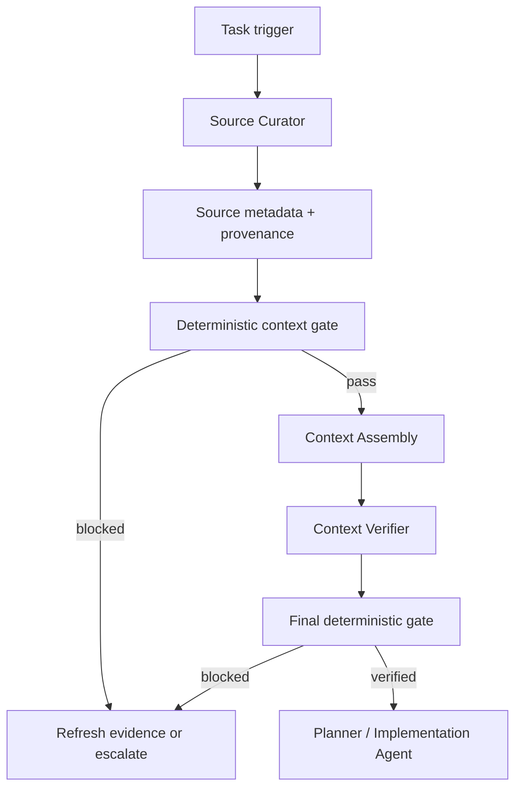

# Agent Context Source Trust & Provenance Gate

A reusable AI engineering kit for preventing agents from planning or acting on untrusted, stale, conflicting, or provenance-free context.

## Problem
Coding and operations agents often combine repository files, logs, tickets, web content, API responses, human notes, and model-generated summaries. Without a gate, low-trust context can be promoted into “facts,” embedded instructions can steer tool use, stale runtime data can drive wrong decisions, and later reviewers cannot trace why a claim was accepted.

## Purpose
This package introduces a deterministic context trust gate plus reusable agent procedures. It requires source metadata, claim-to-source provenance, bounded evidence refresh, independent verification, and explicit blocking behavior before context is handed to a planner or implementation agent.

## When to use
Use for feature implementation, bug fixing, incident investigation, repository understanding, code review, technical research, architecture analysis, migration planning, or any agent workflow that merges multiple evidence sources.

## When not to use
Do not use it as a substitute for application authorization, secret scanning, production access control, or human approval for dangerous operations. It verifies context quality; it does not authorize operational actions.

## Architecture


## Package tree
```text
agent-context-source-trust-provenance-gate/
├── README.md
├── config/
│   └── trust-policy.json
├── schemas/
│   └── context-manifest.schema.json
├── scripts/
│   ├── context_trust_gate.py
│   └── verify_package.py
├── skills/
│   ├── context-assembly.md
│   └── source-assessment.md
├── rules/
│   └── context-trust-safety.md
├── subagents/
│   ├── context-verifier.md
│   └── source-curator.md
├── workflows/
│   └── context-provenance-gate.md
├── hooks/
│   └── lifecycle.md
├── templates/
│   └── context-manifest.json
├── examples/
│   ├── context-manifest-block.json
│   └── context-manifest-pass.json
└── tests/
    └── test_context_trust_gate.py
```

## Component responsibilities
- `skills/source-assessment.md`: discover, classify, score, and corroborate evidence.
- `skills/context-assembly.md`: convert verified sources into a minimal claim-oriented context packet.
- `rules/context-trust-safety.md`: enforce provenance, evidence, permission, and approval boundaries.
- `subagents/source-curator.md`: read-only evidence discovery and manifest preparation.
- `subagents/context-verifier.md`: independent claim and provenance verification.
- `workflows/context-provenance-gate.md`: bounded end-to-end workflow and retry behavior.
- `hooks/lifecycle.md`: deterministic pre-task, post-context-change, pre-handoff, and package checks.
- `scripts/context_trust_gate.py`: executable trust/provenance validator with meaningful exit codes.
- `scripts/verify_package.py`: required-file and placeholder integrity check.
- `config/trust-policy.json`: portable trust thresholds and allowed source types.
- `schemas/context-manifest.schema.json`: structured handoff contract.
- `templates/context-manifest.json`: editable starting manifest.
- `examples/*`: known pass/block fixtures.
- `tests/test_context_trust_gate.py`: deterministic regression tests.

## Dependencies
Python 3.9+ only. Runtime scripts use the Python standard library; no third-party package is required.

## Installation
Copy this directory into the target repository or an internal agent-kit directory. Keep the relative paths intact, then customize `config/trust-policy.json` to match the repository’s evidence types and required trust thresholds.

## Configuration
`config/trust-policy.json` controls minimum score, minimum authoritative-source count, maximum uncorroborated sources, allowed/authoritative source types, blocked source-location patterns, timestamp requirements, and score weights.

Do not lower thresholds merely to make a failing task pass. Policy changes that materially weaken safety require human review.

## Permissions
The Source Curator and Context Verifier should operate read-only. They do not need deployment, write, secret-management, or infrastructure permissions. Never increase permissions silently to obtain context.

## Usage
Start from the template:

```bash
cp templates/context-manifest.json context-manifest.json
python scripts/context_trust_gate.py context-manifest.json --policy config/trust-policy.json --output context-manifest.checked.json
```

Exit code `0` means verified. Exit code `2` means blocked by evidence/provenance policy. Invalid or missing JSON also terminates with a non-success result.

Validate the package itself:

```bash
python scripts/verify_package.py
python -m unittest tests/test_context_trust_gate.py
```

## Example invocation
```bash
python scripts/context_trust_gate.py examples/context-manifest-pass.json --policy config/trust-policy.json
python scripts/context_trust_gate.py examples/context-manifest-block.json --policy config/trust-policy.json
```

The first example should verify; the second should block because it uses a blocked source location, lacks a timestamp for dynamic evidence, has insufficient authoritative evidence, and produces a low trust score.

## Workflow
1. Inspect repository structure and locate task-specific entry points.
2. Gather only relevant direct evidence.
3. Record source IDs, type, exact location, authority, relevance, timestamp, and corroboration.
4. Run the source pre-check.
5. Build claims with explicit source IDs and confidence.
6. Keep facts, hypotheses, decisions, and open questions separate.
7. Have the Context Verifier independently spot-check high-impact claims.
8. Run the final gate.
9. Hand context to planning/implementation only when status is `verified`.

## Approval boundaries
This package requires a stop before production deployment, destructive SQL, deletion, Git history rewriting, infrastructure changes, secret changes, production configuration changes, breaking API contracts, weakening security controls, irreversible migrations, or large dependency upgrades. Context verification is never approval for those actions.

## Failure and recovery
- Stale dynamic evidence: refresh at most twice.
- Temporarily unavailable read-only source: retry at most twice and preserve prior failure evidence.
- Validation failure: return exact gate errors to the Source Curator.
- Permission failure: stop and report the minimum missing permission; do not escalate privilege automatically.
- Conflicting material evidence: preserve both sources, mark the claim unresolved, and block handoff.
- Persistent failure after the retry budget: status remains `blocked` and evidence is preserved for human review.

## Verification
A task is verified only when the final gate exits `0`, the manifest status is `verified`, every material claim references known source IDs, trust thresholds pass, blocked sources are absent, required timestamps exist, and no unresolved high-impact claim remains.

“Task executed” is not equivalent to “task verified successfully.”

## Definition of Done
- Relevant context was gathered using least privilege.
- At least the configured minimum authoritative evidence is present.
- Every material claim has provenance.
- Dynamic evidence has valid timestamps.
- Conflicts and open questions are explicit.
- Deterministic tests pass.
- Final gate exits 0.
- Dangerous actions remain behind explicit human approval.
- Remaining non-blocking risks are documented.

## Portability
The workflow is tool-neutral and can be used with OpenAI Codex, Claude Code, Cursor, ChatGPT, GitHub Copilot, OpenCode, or other agents. Tool-specific adapters should translate their source/tool metadata into the manifest contract without changing the core rules or verification behavior.

## Customization
Extend `allowed_source_types` only for evidence types you can identify and verify. Adjust trust weights to your environment, add organization-specific blocked patterns, and integrate the pre-handoff command into CI or agent lifecycle hooks. Keep deterministic validation separate from LLM judgment.
