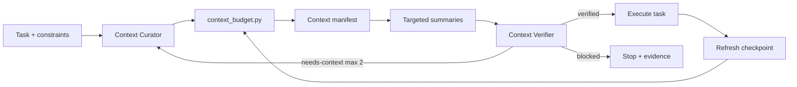

# Agent Context Window Budget Gate

A reusable gate for AI-assisted engineering that prevents context overflow, silent truncation, stale evidence, and repeated loading of low-value repository material while preserving task constraints and source-linked evidence.

## Problem
Long coding-agent sessions often accumulate files, logs, histories, generated summaries, and tool output until important instructions compete with background context. The failure is subtle: an agent may still respond while forgetting acceptance criteria, reasoning from stale evidence, or repeatedly re-reading unrelated files.

## Purpose
Build and continuously verify a bounded context manifest before and during AI engineering work. Deterministic scripts estimate context cost and enforce caps; agent procedures decide relevance and preserve evidence; an independent verifier checks that compression did not remove safety-critical information.

## When to use
Use for large repositories, long-running feature/bug tasks, production investigations, architecture reviews, multi-stage agent workflows, or any task with substantial logs/tool output.

## When not to use
Do not use as a substitute for model/provider hard limits, secret scanning, access control, or repository indexing. Small tasks involving only a few short files usually do not need the full workflow.

## Architecture


## Package tree
```text
agent-context-window-budget-gate/
├── README.md
├── config/policy.json
├── schemas/context-manifest.schema.json
├── scripts/context_budget.py
├── scripts/verify_manifest.py
├── skills/context-selection.md
├── skills/context-refresh.md
├── rules/context-safety.md
├── subagents/context-curator.md
├── subagents/context-verifier.md
├── workflows/budgeted-context-workflow.md
├── hooks/pre-context-budget.md
├── hooks/final-context-verification.md
├── examples/context-manifest.json
└── tests/test_context_budget.py
```

## Dependencies
Python 3.9+; standard library only. JSON Schema is provided as an integration contract but runtime scripts intentionally require no third-party validator.

## Installation
Copy this directory into a repository. Adjust `config/policy.json` for the target model/context policy. Keep `reserve_output_tokens` large enough for implementation, tool calls, and verification output.

## Configuration
`max_input_tokens` is the working context ceiling; `reserve_output_tokens` is never available to loaded context. `warning_ratio` and `block_ratio` control status. `max_single_artifact_tokens` forces targeted summarization of very large sources. `priority_order` controls deterministic source ordering after relevance discovery.

## Permissions
Core workflow requires read-only repository access. Product-source edits are outside this kit. Never grant broader permissions merely to collect more context. Secrets and production data must not be loaded.

## Usage
From the copied package directory:

```bash
python scripts/context_budget.py --root ../.. --policy config/policy.json --output context-manifest.json --task-id fix-order-timeout ../../src/Orders/OrderService.cs ../../tests/Orders/OrderServiceTests.cs
python scripts/verify_manifest.py context-manifest.json --policy config/policy.json
python -m unittest tests/test_context_budget.py
```

Paths supplied to `context_budget.py` must resolve inside `--root`. Exit code 2 means invalid/missing input; exit code 3 means the budget is blocked.

## Workflow
Follow `workflows/budgeted-context-workflow.md`. Anchor immutable task constraints first, discover direct evidence, budget candidates, summarize only oversized/secondary sources, verify independently, then execute. Refresh after meaningful edits, changed requirements, or hypothesis-changing test results.

## Component responsibilities
`context-selection.md` defines initial evidence selection. `context-refresh.md` removes stale/duplicate context. `context-safety.md` supplies enforceable boundaries. Context Curator owns selection but cannot implement. Context Verifier independently checks budget and source fidelity. Hooks make both checks blocking lifecycle actions.

## Input/output contract
The generated manifest conforms to `schemas/context-manifest.schema.json`. Every item records path, category, priority, estimated token cost, decision, reason, and evidence. Status is `ready`, `warning`, `blocked`, or `verified`.

## Approval boundaries
Explicit human approval is required before dropping user constraints, security rules, or acceptance criteria. The preferred behavior is to stop rather than request such approval because those items normally remain mandatory. Production changes, destructive operations, secret changes, breaking contracts, migrations, and deployments remain outside this context-management kit and require their own approvals.

## Failure and recovery
Transient tool execution may be retried once. Context reduction/refresh is bounded to two total attempts. Missing sources block discovery. Oversized individual artifacts are summarized structurally and re-read by targeted range when exact evidence is required. A third budget/refresh failure stops with the current manifest and largest contributors preserved.

## Verification
Run `verify_manifest.py`, then have Context Verifier sample high-impact summaries against originals. Verification must prove usable budget is respected, mandatory constraints remain available, oversized artifacts are not blindly included, excluded sources are not direct dependencies of planned work, and stale evidence is not treated as current.

## Definition of Done
- A context manifest exists and validates structurally.
- Estimated input context does not exceed configured usable budget.
- Task, constraints, acceptance criteria, and approval boundaries are preserved.
- Every summary retains its source path and is faithful for the decisions that depend on it.
- Context Verifier returns `verified`.
- No known stale evidence is treated as current.
- Retry count has not exceeded two and no blocking failure remains.

## Customization
Adjust category priority and caps for your repository/model. Add repository-specific discovery adapters upstream, but keep this package's manifest contract and safety rules tool-neutral. For tokenizer-accurate accounting, replace the conservative byte/4 estimator with the target model tokenizer while preserving script exit semantics and policy fields.
