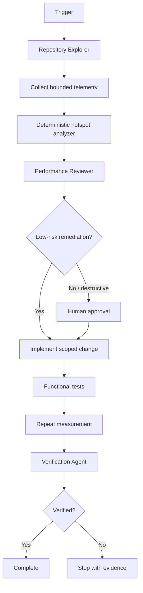

# Agent Cosmos Partition Key Hotspot Gate

A reusable AI-engineering package for diagnosing Azure Cosmos DB logical-partition hotspots before an agent proposes risky repartitioning, throughput changes, or data migration.

## Problem
Cosmos workloads can become slow or throttled when a small number of logical partition-key values consume disproportionate request volume or RU. Agent-driven fixes are risky when they jump from symptoms such as 429 responses directly to partition-key redesign without proving the cause.

## Purpose
This kit gives coding/operations agents a repeatable workflow to gather evidence, detect skew deterministically, trace hot keys back to repository behavior, rank low-risk mitigations, enforce approval boundaries, and independently verify results.

## When to use
Use for unexplained RU growth, 429/throttling spikes, tenant/user-specific latency, suspected low-cardinality keys, scheduled workload fan-in, retry amplification, or before approving a partition-key redesign.

## When not to use
Do not use this package as a substitute for full capacity planning, Cosmos account security review, or a data-migration implementation. A `block` result proves threshold breach in the sample; it does not by itself prove repartitioning is the correct fix.

## Architecture



## Package tree

```text
agent-cosmos-partition-key-hotspot-gate/
├── README.md
├── config/
│   └── policy.yaml
├── examples/
│   └── partition-sample.csv
├── hooks/
│   └── lifecycle.md
├── rules/
│   └── cosmos-partition-safety.md
├── schemas/
│   └── hotspot-report.schema.json
├── scripts/
│   ├── analyze_partition_hotspots.py
│   └── verify_package.py
├── skills/
│   ├── partition-hotspot-investigation.md
│   └── remediation-design.md
├── subagents/
│   ├── repository-explorer.md
│   ├── performance-reviewer.md
│   └── verification-agent.md
├── tests/
│   └── test_analyze_partition_hotspots.py
└── workflows/
    └── hotspot-investigation.md
```

## Component responsibilities
- `skills/partition-hotspot-investigation.md`: evidence-first investigation procedure.
- `skills/remediation-design.md`: ranks reversible mitigations and defines migration safeguards.
- `rules/cosmos-partition-safety.md`: mandatory, forbidden, and preferred behavior.
- `subagents/repository-explorer.md`: maps Cosmos usage without editing.
- `subagents/performance-reviewer.md`: owns diagnosis and remediation ranking.
- `subagents/verification-agent.md`: independently verifies Definition of Done.
- `workflows/hotspot-investigation.md`: end-to-end bounded workflow and retry policy.
- `hooks/lifecycle.md`: deterministic pre-task, post-analysis, approval, and final gates.
- `scripts/analyze_partition_hotspots.py`: analyzes CSV samples and emits structured results.
- `scripts/verify_package.py`: checks required package files and README references.
- `config/policy.yaml`: reusable thresholds and approval flags.
- `schemas/hotspot-report.schema.json`: output contract.
- `examples/partition-sample.csv`: small sample input.
- `tests/test_analyze_partition_hotspots.py`: deterministic analyzer tests.

## Installation
Requires Python 3.9+ for the included scripts and tests. No third-party Python dependencies are required.

Copy this directory into a repository and adjust `config/policy.yaml` thresholds to match the workload. Keep production credentials outside the package.

## Configuration
`config/policy.yaml` defaults to:
- hot request-share threshold: 20%
- hot RU-share threshold: 30%
- minimum sample count: 100
- lookback guidance: 30 minutes
- maximum transient retry attempts: 2
- approval required for partition-key change, container recreation, and bulk migration

The analyzer intentionally parses only the simple scalar policy fields it needs, so it remains dependency-free.

## Permissions
The default investigation needs only repository read access and access to a redacted telemetry export. Production data write, container-management, throughput-management, secret-management, and deployment permissions are not required for diagnosis and must not be silently added.

## Usage
From the package root:

```bash
python scripts/analyze_partition_hotspots.py \
  --input examples/partition-sample.csv \
  --policy config/policy.yaml \
  --output hotspot-report.json
```

Exit codes:
- `0`: pass or warn; inspect `verification_status` for insufficient samples.
- `2`: hotspot threshold breached (`block`).
- `3`: invalid input/tooling error.

Run unit tests:

```bash
python -m unittest tests/test_analyze_partition_hotspots.py
```

Run package integrity verification:

```bash
python scripts/verify_package.py
```

## Example invocation for an AI coding agent
Use `workflows/hotspot-investigation.md`. First map the container and partition-key derivation using `subagents/repository-explorer.md`. Then run the deterministic analyzer on a bounded telemetry export. Do not propose repartitioning until `skills/partition-hotspot-investigation.md` has separated skew from retry amplification, cross-partition queries, and scheduled workload concentration. Use `skills/remediation-design.md` to rank mitigations. Stop for human approval before any action identified in `rules/cosmos-partition-safety.md`.

## Workflow
The canonical workflow is `workflows/hotspot-investigation.md`:

```text
Trigger
  ↓
Repository context
  ↓
Bounded telemetry
  ↓
Deterministic analysis
  ↓
Diagnosis
  ↓
Remediation design
  ↓
Approval when required
  ↓
Scoped execution
  ↓
Functional test
  ↓
Same-method post measurement
  ↓
Independent verification
```

Transient telemetry/tool failures may be retried at most twice. Validation, permission, contradictory-evidence, and approval failures stop immediately. Test/build failures allow at most two targeted fix/retest cycles.

## Approval boundaries
Explicit human approval is mandatory before:
- changing the partition-key design;
- recreating a Cosmos container;
- bulk migration/backfill or irreversible cutover;
- production throughput/configuration changes;
- any action that changes security or data-isolation guarantees.

Agents must stop before these actions and must never elevate permissions to unblock themselves.

## Failure handling
- **Insufficient sample:** report `warn` and `insufficient-sample`; do not claim the workload is healthy.
- **Invalid sample:** stop with validation evidence.
- **Transient telemetry/tool failure:** retry no more than two times.
- **Permission failure:** stop without permission escalation.
- **Build/test failure:** preserve output and allow at most two targeted fix/retest loops.
- **Approval missing:** stop before dangerous action.
- **Contradictory evidence:** keep the cause as a hypothesis and gather a bounded additional sample.

## Verification
A task is not verified merely because the analyzer ran or code changed. Verification requires applicable evidence from:
- deterministic hotspot report;
- repository trace supporting the diagnosed cause;
- functional tests for executed changes;
- same-method before/after measurement;
- approval evidence for dangerous changes;
- independent Verification Agent review.

The structured output contract is `schemas/hotspot-report.schema.json`.

## Definition of Done
The package-specific task is complete only when:
1. relevant container, partition-key derivation, and workload paths are mapped;
2. telemetry source/window is recorded and sample sufficiency is known;
3. deterministic analysis produced a valid `pass`, `warn`, or `block` result;
4. every confirmed cause has evidence and hypotheses are labeled separately;
5. selected remediation is the smallest safe option with rollback and verification criteria;
6. all approval-required actions have explicit approval before execution;
7. executed changes pass functional tests;
8. post-change analysis uses the same methodology and meets target thresholds or remaining risk is documented;
9. Verification Agent status is `verified`;
10. no blocking failure remains.

## Customization
Tune `config/policy.yaml` to the workload and replace the CSV-export step with a project-specific telemetry adapter if needed. Keep the core evidence, approval, bounded-retry, and independent-verification rules unchanged unless an equivalent stronger control replaces them.
