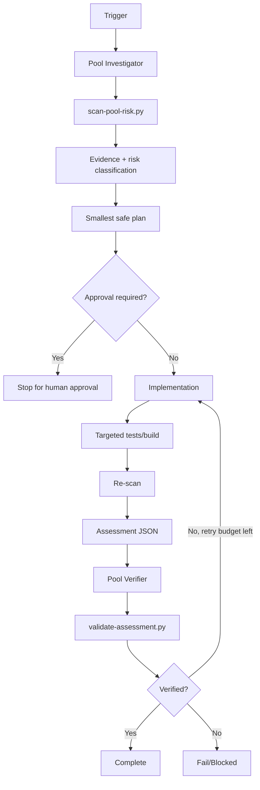

# Agent Database Connection Pool Exhaustion Gate

A reusable AI engineering package for detecting, investigating, fixing, and independently verifying database connection-pool exhaustion risks in API, background-job, message-consumer, EF Core, and raw ADO.NET code paths.

## Problem
Connection pools can be exhausted by leaked connections, incorrect `DbContext` lifetimes, sync-over-async blocking, long transactions, unbounded fan-out, retry storms, or configuration changes that hide rather than solve the underlying issue. These failures often surface as intermittent timeouts under concurrency rather than obvious functional bugs.

## Purpose
This package gives coding agents a bounded, evidence-driven workflow that combines deterministic scanning with repository reasoning, targeted tests, explicit approval boundaries, and independent verification.

## When to use
Use it when changing database access, DI registrations, worker concurrency, retry behavior, transaction scope, connection strings/pool settings, or when production evidence suggests connection acquisition/open timeouts.

## When not to use
Do not use it as a substitute for a full database capacity investigation when the bottleneck is confirmed to be server-side CPU, storage, locking, query plans, or provider infrastructure with no connection-pool symptom. It can still contribute evidence, but should not force a pool-related diagnosis.

## Architecture



## Package tree

```text
agent-database-connection-pool-exhaustion-gate/
├── README.md
├── config/
│   └── pool-safety.yaml
├── examples/
│   └── assessment.example.json
├── hooks/
│   └── lifecycle.md
├── rules/
│   └── pool-safety-rules.md
├── schemas/
│   └── assessment.schema.json
├── scripts/
│   ├── scan-pool-risk.py
│   └── validate-assessment.py
├── skills/
│   └── investigate-pool-exhaustion.md
├── subagents/
│   ├── pool-investigator.md
│   └── pool-verifier.md
├── tests/
│   └── self-test.py
└── workflows/
    └── pool-exhaustion-gate.md
```

## Component responsibilities
- `config/pool-safety.yaml`: shared thresholds, risk weights, approval boundaries, statuses, and evidence requirements.
- `scripts/scan-pool-risk.py`: deterministic heuristic scan for risky connection lifetime, blocking, fan-out, retry, transaction, DI, and pool-tuning patterns.
- `schemas/assessment.schema.json`: structured handoff contract for findings and verification results.
- `scripts/validate-assessment.py`: deterministic validation of assessment completeness and pass conditions.
- `skills/investigate-pool-exhaustion.md`: reusable investigation and remediation procedure.
- `rules/pool-safety-rules.md`: enforceable MUST/MUST NOT/SHOULD behavior.
- `subagents/pool-investigator.md`: owns evidence gathering and risk classification.
- `subagents/pool-verifier.md`: independently verifies the final state.
- `workflows/pool-exhaustion-gate.md`: complete bounded workflow with retries, stop conditions, approvals, failure paths, and Definition of Done.
- `hooks/lifecycle.md`: pre-task, post-edit, final-validation, and approval guard hooks.
- `tests/self-test.py`: validates scanner behavior and the example assessment contract.
- `examples/assessment.example.json`: concrete passing output contract example.

## Installation
Copy this folder into the target repository. Python 3.9+ is sufficient for the included scripts; they use only the Python standard library.

From the package root, run:

```bash
python tests/self-test.py
```

## Configuration
Edit `config/pool-safety.yaml` to align risk weights and approval boundaries with the repository. The scanner is intentionally heuristic; changing a threshold does not replace contextual review.

## Permissions
Normal investigation requires read access to the repository and permission to run local tests/build commands. Least privilege applies. No production credentials are required by this package.

Explicit human approval is required before:
- production connection-string or pool-setting changes;
- database schema changes;
- destructive SQL;
- infrastructure changes;
- secret changes;
- production configuration changes;
- production deployment.

## Usage

### 1. Establish baseline

```bash
python scripts/scan-pool-risk.py /path/to/repository --json > pool-risk-before.json
```

Exit codes:
- `0`: no heuristic high-risk condition detected;
- `1`: high-risk condition detected and review is required;
- `2`: invalid input/tool usage.

### 2. Follow the investigation skill
Use `skills/investigate-pool-exhaustion.md` to trace entry points, DI lifetime, connection ownership, transaction scope, retry behavior, and concurrency.

### 3. Implement the smallest safe change
Typical corrections include:
- disposing connections/contexts correctly;
- changing an invalid singleton database lifetime;
- bounding parallel database work;
- removing sync-over-async blocking;
- shortening transaction scope;
- limiting retries and avoiding retry multiplication.

Do not increase pool size as the default first response.

### 4. Re-scan and test

```bash
python scripts/scan-pool-risk.py /path/to/repository --json > pool-risk-after.json
```

Run targeted repository tests/build checks appropriate to the changed code.

### 5. Produce and validate assessment
Create an assessment matching `schemas/assessment.schema.json`, using `examples/assessment.example.json` as a format example.

```bash
python scripts/validate-assessment.py assessment.json
```

### 6. Independent verification
The `pool-verifier` reviews the final diff, test output, scanner result, lifetimes, disposal behavior, concurrency bounds, transaction scope, and unresolved risks.

## Example invocation for an AI coding agent

> Run the database connection pool exhaustion gate on the changed background-worker path. Use `skills/investigate-pool-exhaustion.md`, enforce `rules/pool-safety-rules.md`, run the scanner before and after edits, keep fix-retest cycles to at most 2, stop before approval-required production/config/database actions, produce an assessment matching `schemas/assessment.schema.json`, and have `subagents/pool-verifier.md` independently verify completion.

## Workflow
The authoritative workflow is `workflows/pool-exhaustion-gate.md`. Its fix-retest loop is capped at 2 cycles. Repeated failure stops with preserved evidence instead of retrying indefinitely.

## Approval boundaries
Agents must stop before approval-required actions. They must not increase permissions, edit secrets, tune production pool settings, change schema, deploy, or run destructive SQL merely to unblock the workflow.

## Failure handling
- Transient tool failure: retry once, preserve evidence, then escalate.
- Scanner high-risk result: inspect findings and enter bounded remediation.
- Build/test failure caused by the change: fix and retest, maximum 2 cycles.
- Permission failure: stop without privilege escalation.
- Missing production metrics: record the limitation and avoid claiming a confirmed runtime root cause.
- Assessment validation failure: correct missing/incorrect contract data only when evidence supports it.

## Verification
A task is **executed** when scans/edits/tests were attempted. It is **verified successfully** only when:
- relevant connection lifetimes and concurrency paths were traced;
- no unresolved high/critical finding remains;
- targeted tests/build checks pass;
- final diff is reviewed;
- the assessment validates;
- independent verification returns `pass`;
- required approvals exist for approval-bound actions.

Scanner output alone is not proof of correctness.

## Definition of Done
- Required repository context was gathered.
- Connection ownership, disposal, DI lifetime, transaction scope, retry behavior, and concurrency were reviewed where relevant.
- Required changes exist and are limited to the intended scope.
- Targeted verification commands passed.
- Assessment contract is valid.
- Independent verifier returned `pass`.
- No blocking failure remains.
- Remaining non-blocking risks are documented.
- Any approval-required action has explicit human approval before execution.

## Customization
You may extend the scanner with provider-specific signals for SQL Server, PostgreSQL/Npgsql, MySQL, Oracle, Dapper, or other database frameworks. Keep provider-specific logic isolated and retain the core workflow, evidence rules, bounded retries, and approval boundaries.
