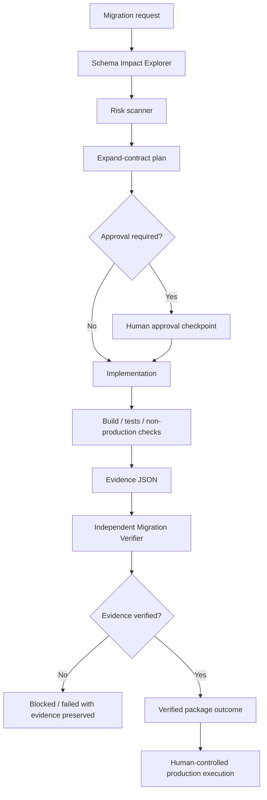

# Agent Database Migration Expand-Contract Gate

Reusable AI engineering kit for reviewing and planning database schema changes so that application versions can coexist safely during rollout, data backfills are verifiable, destructive contract steps are approval-gated, and migration success is proven with evidence rather than assumed from command completion.

## Problem
Database migrations frequently fail because schema evolution is treated as a single atomic code change while applications, workers, deployments, replicas, and background jobs change at different times. Renames, dropped columns, `NOT NULL` enforcement, type narrowing, large rewrites, and unbounded backfills can cause downtime, data loss, lock contention, or incompatibility between old and new application versions.

## Purpose
This package provides reusable Skills, Rules, Subagents, Workflows, Hooks, deterministic scripts, an evidence schema, example evidence, and tests for an expand-contract migration process.

## When to use
Use for ORM-generated migrations, SQL migration files, database refactors, column/table replacement, constraint introduction, data backfills, or migration review before release.

## When not to use
Do not use this package as an autonomous production migration runner. It deliberately stops before production execution and other approval-required actions.

## Architecture


## Package tree
```text
agent-database-migration-expand-contract-gate/
├── README.md
├── config/
│   └── migration-policy.json
├── examples/
│   └── migration-evidence.example.json
├── hooks/
│   ├── final-verification.md
│   └── pre-migration-gate.md
├── rules/
│   └── migration-safety-rules.md
├── schemas/
│   └── migration-evidence.schema.json
├── scripts/
│   ├── scan-migration-risk.py
│   └── verify-migration-evidence.py
├── skills/
│   ├── design-expand-contract-plan.md
│   └── investigate-migration-risk.md
├── subagents/
│   ├── migration-verifier.md
│   └── schema-impact-explorer.md
├── tests/
│   └── test_migration_scripts.py
└── workflows/
    └── expand-contract-migration.md
```

## Component responsibilities
- `skills/investigate-migration-risk.md`: gathers schema/application evidence and classifies risk.
- `skills/design-expand-contract-plan.md`: converts risky changes into phased expand/transition/backfill/cutover/contract plans.
- `rules/migration-safety-rules.md`: enforceable boundaries for schema, data, approvals, credentials, retries, and production protection.
- `subagents/schema-impact-explorer.md`: read-only blast-radius explorer.
- `subagents/migration-verifier.md`: independent evidence-based verifier.
- `workflows/expand-contract-migration.md`: bounded end-to-end workflow with explicit checkpoints and failure paths.
- `hooks/pre-migration-gate.md`: deterministic risk scan before continuation.
- `hooks/final-verification.md`: blocks success until evidence validates.
- `scripts/scan-migration-risk.py`: dependency-free scanner for high-risk SQL patterns.
- `scripts/verify-migration-evidence.py`: dependency-free evidence completion checker.
- `schemas/migration-evidence.schema.json`: structured handoff/output contract.
- `config/migration-policy.json`: reusable approval/risk policy.
- `examples/migration-evidence.example.json`: complete valid example.
- `tests/test_migration_scripts.py`: regression tests for safe/risky scanning and approval verification.

## Installation
Copy this directory into the target repository. Python 3.9+ is sufficient for the included deterministic scripts and tests; no third-party Python packages are required.

## Configuration
Edit `config/migration-policy.json` to add organization-specific approval categories or scanner policy. Do not remove safety gates merely to unblock a run. Project-specific build/test commands belong in the consuming repository workflow, not in secrets or this reusable package.

## Permissions
Core investigation requires repository read access and local execution permission. Automated database checks should use least-privilege, approved non-production credentials. Production migration, destructive schema changes, irreversible data transforms, secret changes, infrastructure changes, and breaking API/application contracts require explicit human approval.

## Usage
Run the deterministic scanner against migration files:

```bash
python scripts/scan-migration-risk.py path/to/migration.sql --json-out migration-risk.json
```

For multiple files:

```bash
python scripts/scan-migration-risk.py migrations/001.sql migrations/002.sql --json-out migration-risk.json
```

Create an evidence JSON following `schemas/migration-evidence.schema.json`, then verify completion:

```bash
python scripts/verify-migration-evidence.py migration-evidence.json
```

Run package tests:

```bash
python -m unittest tests/test_migration_scripts.py
```

## Example invocation for an AI coding agent
Use `workflows/expand-contract-migration.md` as the controlling workflow. Delegate initial blast-radius discovery to `subagents/schema-impact-explorer.md`; use the two Skills for investigation and phased planning; enforce `rules/migration-safety-rules.md`; run the pre-migration hook before implementation; and require `subagents/migration-verifier.md` plus the final-verification hook before reporting success.

## Workflow
The workflow is:

```text
Trigger
  -> Context and blast radius
  -> Deterministic risk scan
  -> Expand-contract plan
  -> Approval checkpoint when required
  -> Smallest safe implementation
  -> Build/tests/non-production checks
  -> Backfill/data verification
  -> Independent verifier
  -> Final evidence gate
  -> Verified outcome
  -> Human-controlled production execution
```

Automated retries are bounded to two and apply only to transient tool/build/test failures. Validation failures, compatibility failures, permission failures, missing approvals, and business-rule failures stop the workflow. Destructive SQL is never automatically retried.

## Approval boundaries
Explicit approval is required for production migrations, dropping tables/columns, renames that break compatibility, type narrowing, setting `NOT NULL` without proven compliant data/backfill, large table rewrites, irreversible data transforms, destructive SQL, infrastructure changes, and secret/configuration changes. The workflow stops before these actions.

## Failure handling
- **Transient tool/build/test failure:** preserve output, retry at most twice, then escalate.
- **Validation failure:** fix evidence or implementation; do not bypass the final gate.
- **Schema/data mismatch:** mark failed and do not proceed to contract cleanup.
- **Compatibility failure:** redesign the transition or stop.
- **Permission failure:** stop; never increase privilege automatically.
- **Missing approval:** remain blocked at checkpoint.
- **Production incident:** preserve evidence and hand off to human incident/forward-fix procedures; this kit does not autonomously mutate production.

## Verification
A migration is only `verified` when application compatibility, build/tests, schema checks, data checks, backfill evidence, approval references where required, and final evidence validation all pass. Migration execution alone is not verification.

## Definition of Done
- Current and target schema are evidenced.
- Affected readers/writers and deployment ordering are understood.
- Risk scanner findings are resolved or explicitly approval-gated.
- Expand/transition/backfill/cutover/contract stages are defined where needed.
- Backfill is idempotent/restartable when applicable and has a measurable completion query.
- Build/tests and schema/data/compatibility checks pass.
- Required approvals are referenced.
- Independent verification passes.
- `scripts/verify-migration-evidence.py` exits 0.
- Remaining risks are documented.
- No production execution is performed by this kit.

## Customization
Add project-specific migration locations, ORM checks, lock/timeout thresholds, table-size heuristics, database-specific explain commands, or CI wrappers around the scripts. Keep the reusable core tool-neutral and isolate environment-specific commands outside the safety rules and evidence contract.
