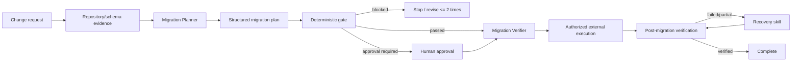

# Agent Database Migration Preflight & Rollback Gate

A reusable AI-engineering package for preparing database migrations with explicit risk classification, deterministic preflight checks, human approval boundaries, independent verification, and bounded recovery behavior.

## Problem
AI coding agents can generate migrations that compile while still causing long locks, incompatible rolling deployments, unbounded backfills, irreversible data loss, or ambiguous partial-failure states. Successful migration generation is not proof of safe rollout.

This package separates planning from execution, requires a structured migration plan, runs a deterministic static gate, forces approval for risky operations, blocks configured destructive production operations, and requires independent post-migration verification.

## When to use
Use for schema migrations, EF Core or other ORM migrations, index/constraint changes, renames, large data backfills, expand/contract rollouts, and production database changes prepared by AI agents.

## When not to use
This package is not a database migration engine, SQL parser, backup system, deployment system, or substitute for database-native permissions and monitoring. It never connects to a database or executes a migration.

## Architecture



## Package tree

```text
agent-database-migration-preflight-rollback-gate/
├── README.md
├── config/
│   └── policy.json
├── examples/
│   └── safe-add-column.json
├── hooks/
│   └── lifecycle.md
├── rules/
│   └── migration-safety.md
├── schemas/
│   ├── gate-result.schema.json
│   └── migration-plan.schema.json
├── scripts/
│   ├── migration_gate.py
│   └── verify_package.py
├── skills/
│   ├── migration-preflight.md
│   └── migration-recovery.md
├── subagents/
│   ├── migration-planner.md
│   └── migration-verifier.md
├── templates/
│   └── migration-plan.json
├── tests/
│   └── test_migration_gate.py
└── workflows/
    └── migration-preflight-rollout.md
```

## Components
- `skills/migration-preflight.md` defines evidence-first planning, operation classification, backfill planning, compatibility analysis, gating, and bounded revisions.
- `skills/migration-recovery.md` defines recovery for partial/failed migrations without automatic destructive retries.
- `rules/migration-safety.md` contains enforceable MUST/MUST NOT/SHOULD boundaries.
- `subagents/migration-planner.md` owns plan preparation without production execution authority.
- `subagents/migration-verifier.md` independently challenges and verifies the plan and postconditions.
- `workflows/migration-preflight-rollout.md` defines the end-to-end staged workflow and retry limits.
- `hooks/lifecycle.md` defines deterministic pre-execution and post-execution checkpoints.
- `scripts/migration_gate.py` evaluates a JSON plan against policy and never executes migrations.
- `scripts/verify_package.py` checks the package manifest locally.
- `schemas/` defines the input and gate-output contracts.

## Dependencies
Python 3.9+ only. The gate uses the Python standard library and has no database-driver dependency.

## Installation
Copy this package into the target repository. Keep the planning/verifier instructions available to the coding agent and wire the pre-execution hook into the host agent or CI workflow before database deployment tooling.

## Configuration
Edit `config/policy.json` to define:
- environment aliases treated as production;
- operations that are destructive or approval-required;
- maximum unbatched backfill size;
- lock and statement timeout ceilings;
- production rollback/backup requirements;
- whether destructive production work is blocked;
- expand/contract requirements for breaking changes.

Do not let an agent relax policy automatically to make a plan pass.

## Migration plan contract
Start from `templates/migration-plan.json`. Important fields include:
- `environment` and `change_id`;
- `breaking_change` and `expand_contract`;
- `backup_reference` and `approval_reference`;
- explicit lock/statement timeouts;
- operation list with type, row estimate, batching, and online characteristics;
- rollback/compensation strategy;
- measurable post-migration checks.

The JSON structure is documented by `schemas/migration-plan.schema.json`.

## Usage
Run the gate before any migration is handed to an execution mechanism:

```bash
python scripts/migration_gate.py \
  --plan examples/safe-add-column.json \
  --policy config/policy.json \
  --output gate-result.json
```

Exit codes:
- `0`: `passed`;
- `2`: `blocked`;
- `4`: `approval_required`;
- `3`: invalid input/configuration or tool error.

Every result includes `executed: false`. The output contract is defined in `schemas/gate-result.schema.json`.

## What the gate checks
The current deterministic implementation verifies:
- target environment and change identifier exist;
- migration operations are declared;
- lock and statement timeout ceilings are respected;
- configured destructive operations are blocked in production;
- configured risky operations require approval;
- large backfills are batched and specify batch size;
- breaking changes use expand/contract when required;
- production rollback/compensation exists;
- destructive changes have backup/snapshot evidence when required;
- measurable post-migration verification checks exist.

The gate is deliberately conservative. It is not a dialect-aware SQL analyzer, so database-native privileges, review, staging tests, monitoring, and operational controls remain required.

## Workflow
1. Inspect current schema, migrations, models, database access paths, and deployment order.
2. Build a structured migration plan.
3. Run the deterministic gate.
4. Revise genuine blocking issues at most twice; never evade the policy.
5. Have the independent Migration Verifier reproduce the gate and challenge assumptions.
6. Obtain human approval for operations that require it, bound to the exact plan/environment.
7. Execute only through a separately authorized deployment/operator mechanism.
8. Verify migration history, schema state, data invariants, smoke tests, and relevant monitoring.
9. If execution is partial or verification fails, invoke the recovery skill and do not automatically repeat data-changing actions.

## Approval boundaries
Explicit human approval is required for configured risky operations and any data-loss-capable recovery. Production destructive operations configured as blocked cannot be overridden by an agent. Changes to migration policy, production configuration, database permissions, schema operations outside the approved plan, irreversible migrations, and destructive recovery remain human-controlled.

Any material plan change invalidates the previous approval reference.

## Failure handling
- Static gate/configuration failure: retry once with unchanged inputs, then stop.
- Genuine validation finding: revise the plan at most twice and re-gate each revision.
- Read-only verification transient failure: retry once.
- Data-changing migration or recovery failure: never retry automatically; inspect actual database state first.
- Permission failure: stop rather than increasing privileges.
- Partial application or ambiguous migration history: invoke `skills/migration-recovery.md` and escalate if state cannot be proven.

## Verification
Run package-level checks:

```bash
python -m unittest tests/test_migration_gate.py
python scripts/verify_package.py
```

For a real migration, package tests are not proof of rollout success. The Migration Verifier must independently reproduce the gate and verify actual migration history/schema/data/application postconditions after authorized execution.

## Definition of Done
A migration task is complete only when:
- target environment and database context are known;
- every operation is explicitly classified;
- the exact migration plan has passed the current gate or has required approval;
- compatibility and backfill strategy are evidence-backed;
- required backup and rollback/compensation evidence exists;
- an independent verifier has reviewed the plan;
- authorized execution evidence exists;
- post-migration checks pass;
- any required recovery was independently verified;
- no blocking finding remains and residual risks are documented.

`Migration generated`, `build passed`, and `gate passed` are not equivalent to `migration verified successfully`.

## Customization
Extend `config/policy.json` with organization-specific operation types and thresholds. Add database-engine-specific evidence checks to the planning/verifier procedures, such as PostgreSQL concurrent indexes, SQL Server online index constraints, MySQL online DDL behavior, or EF Core migration scripts. Keep engine-specific execution adapters outside the core gate unless they can preserve the same least-privilege and approval boundaries.
