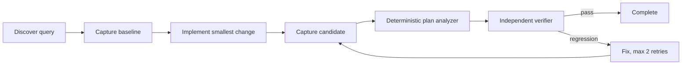

# Agent Database Query Plan Regression Gate

A reusable evidence-first kit that prevents an AI coding agent from declaring a database performance change complete when the SQL shape or query plan has regressed.

## Problem
AI-assisted changes to EF Core/LINQ/SQL can remain functionally correct while introducing table scans, explosive row estimates, extra round trips, sort/hash spills, missing-index sensitivity, or materially worse plan cost. Code review alone is weak evidence.

## Trigger
Use after a change can affect database reads/writes, especially LINQ/EF Core query shape, joins, filters, ordering, pagination, Includes, projections, indexes, or raw SQL.

## Inputs
- repository and working tree
- `config/query-plan-gate.yaml`
- baseline and candidate plan files (SQL Server `.sqlplan` XML or PostgreSQL `EXPLAIN (ANALYZE, BUFFERS, FORMAT JSON)` JSON)
- optional acceptance thresholds

## Architecture


## Package tree
```text
README.md
skills/query-evidence.md
skills/regression-triage.md
rules/database-safety.md
subagents/query-investigator.md
subagents/verification-agent.md
workflows/query-plan-regression.md
hooks/pre-change.md
hooks/post-change.md
scripts/query_plan_gate.py
config/query-plan-gate.yaml
schemas/plan-report.schema.json
examples/baseline-postgres.json
examples/candidate-postgres.json
tests/test_query_plan_gate.py
```

## Install
Python 3.10+ is sufficient; the analyzer uses only the standard library.

## Configure
Edit `config/query-plan-gate.yaml` for documentation/integration settings. The executable accepts explicit CLI thresholds so CI does not require a YAML dependency.

## Usage
```bash
python scripts/query_plan_gate.py --baseline baseline.json --candidate candidate.json --output plan-report.json --max-cost-ratio 1.30 --max-row-ratio 2.0 --forbid-new-seq-scan
python -m unittest tests/test_query_plan_gate.py
```

For PostgreSQL, store the JSON returned by `EXPLAIN (ANALYZE, BUFFERS, FORMAT JSON)`. For SQL Server, pass `.sqlplan` files. Capture both plans under comparable parameters/data/environment; otherwise stop and report that comparison evidence is invalid.

## Permissions and approval
The workflow is read-only by default. Agents may inspect code, plans, logs, and run read-only diagnostics in approved non-production environments. Explicit human approval is required before index/schema changes, production queries with `ANALYZE`, database configuration changes, destructive SQL, migrations, or production deployment.

## Failure handling
Transient plan-capture/tool failures may retry twice while preserving logs. Validation failures do not retry blindly. A detected regression permits at most two implementation/fix cycles; unresolved regression stops with evidence.

## Verification
A task is verified only when the report schema is valid, candidate and baseline are comparable, configured gates pass, relevant tests/build pass, diff is reviewed, and no approval-required action is pending. A successful query execution alone is not verification.

## Definition of Done
- query entry point and generated SQL were identified
- baseline and candidate evidence are comparable
- deterministic analyzer exits 0
- no forbidden new scan or configured cost/row regression exists
- functional tests pass
- independent verifier reviewed evidence
- remaining risks are recorded
- required approvals are present

## Portability
Core instructions are agent-neutral. Codex, Claude Code, Cursor, ChatGPT, Copilot, or other agents can call the scripts and follow the Markdown contracts without special adapters.