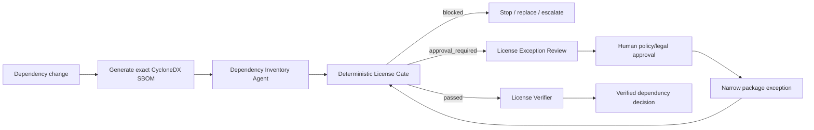

# Agent Dependency License Compliance Gate

Reusable guardrail for AI coding agents that add, upgrade, replace, or release third-party dependencies. The kit evaluates license metadata from a CycloneDX JSON SBOM against a repository policy, blocks configured licenses, routes ambiguous/review-required licenses to explicit human approval, and keeps the implementing agent from silently weakening compliance controls.

## Problem
AI coding agents can add useful packages quickly, but dependency changes also introduce license obligations and policy risk. A package can be technically correct and still be unacceptable for a product's distribution model. License metadata may also be missing, custom, ambiguous, or buried in transitive dependencies. Prompt-only instructions are too weak because an agent that can edit dependencies may also be tempted to relax policy to unblock itself.

This package separates dependency generation from license-policy authority. The deterministic gate never installs, upgrades, removes, or modifies dependencies. It only evaluates a supplied SBOM and returns `passed`, `blocked`, or `approval_required`.

## When to use
Use this kit for dependency additions, dependency upgrades, automated security updates, AI-generated package substitutions, release preparation, SBOM review, or any workflow where an agent may introduce third-party code.

## When not to use
This kit is not legal advice, a complete software-composition-analysis platform, a vulnerability scanner, or a substitute for organization-specific legal/compliance review. It evaluates declared SBOM license metadata against a configurable engineering policy. Complex licensing questions still require qualified human review.

## Architecture



## Package tree

```text
agent-dependency-license-compliance-gate/
├── README.md
├── config/
│   └── license-policy.yaml
├── examples/
│   ├── sbom-block.json
│   └── sbom-pass.json
├── hooks/
│   └── lifecycle.md
├── rules/
│   └── dependency-license-safety.md
├── schemas/
│   └── license-gate-result.schema.json
├── scripts/
│   ├── license_gate.py
│   └── verify_package.py
├── skills/
│   ├── dependency-license-review.md
│   └── license-exception-review.md
├── subagents/
│   ├── dependency-inventory-agent.md
│   └── license-verifier.md
├── templates/
│   └── license-exception-request.md
├── tests/
│   └── test_license_gate.py
└── workflows/
    └── license-compliance-gate.md
```

## Component responsibilities

`skills/dependency-license-review.md` defines the normal dependency review procedure. `skills/license-exception-review.md` defines the bounded human-approval path for packages that are not automatically allowed. `rules/dependency-license-safety.md` contains testable agent boundaries. `subagents/dependency-inventory-agent.md` collects exact dependency evidence without changing the graph, while `subagents/license-verifier.md` independently reproduces the result. `workflows/license-compliance-gate.md` connects these stages with bounded retries and stop conditions.

`config/license-policy.yaml` contains allow, approval-required, blocked, missing-license, and package-exception policy. `scripts/license_gate.py` is the deterministic evaluator. `schemas/license-gate-result.schema.json` defines the result contract. `hooks/lifecycle.md` describes predictable integration points. The two example SBOMs and unit tests make the package immediately verifiable.

## Dependencies

- Python 3.9+
- PyYAML
- A CycloneDX JSON SBOM generator appropriate for the repository ecosystem

Install the only Python dependency:

```bash
python -m pip install pyyaml
```

The package intentionally does not hard-code one SBOM generator. Use the generator already supported by the repository or platform, provided it produces a CycloneDX-style JSON document with `components[]`, package versions, stable identifiers (`purl` or `bom-ref`), and license metadata.

## Configuration

Edit `config/license-policy.yaml` to match organization policy before enforcing the gate. The sample configuration is conservative and intended as a starting point, not a legal conclusion.

Important fields:

- `allow`: SPDX identifiers accepted automatically.
- `approval_required`: licenses that need explicit human review.
- `block`: licenses the engineering gate must reject.
- `missing_license`: decision when the SBOM has no license declaration.
- `unknown_license`: decision for identifiers absent from all configured lists.
- `multiple_license_strategy`: `any_allowed` accepts a multi-license component when at least one declared option is allowed; `all_allowed` requires every declared license to be allowed unless another configured rule applies.
- `require_component_version`: blocks components without exact versions.
- `require_purl_or_bom_ref`: blocks components lacking a stable SBOM identifier.
- `package_exceptions`: narrow, human-approved exceptions. Prefer exact package identifier and exact version.

Do not let an implementing agent change this policy merely to unblock its own dependency change.

## Gate usage

Evaluate the passing example:

```bash
python scripts/license_gate.py \
  --sbom examples/sbom-pass.json \
  --policy config/license-policy.yaml \
  --output license-gate-result.json
```

Evaluate the blocked example:

```bash
python scripts/license_gate.py \
  --sbom examples/sbom-block.json \
  --policy config/license-policy.yaml
```

Exit codes:

- `0`: `passed`
- `2`: `blocked`
- `3`: tool, input, or configuration error
- `4`: `approval_required`

The result always contains `changed_dependencies: false` because the script never mutates dependency state.

## Input contract

The gate accepts a CycloneDX-like JSON object with a top-level `components` array. Each component should contain:

- `name`
- `version`
- `purl` or `bom-ref`
- `licenses`, using CycloneDX license entries such as `{"license":{"id":"MIT"}}`

The evaluator intentionally fails conservatively when required identity/version/license metadata is absent according to policy.

## Decision model

For each component, the gate first checks package-level exceptions, then required version/stable identity, then declared licenses. Explicit blocked licenses take precedence over approval-required and allowed lists when evaluating a single license. For multi-license components, the configured strategy decides whether one allowed option is enough or all options must be allowed.

A `passed` status means the SBOM satisfied the configured engineering policy. It does not mean a lawyer has reviewed the dependency, nor does it guarantee every real-world licensing obligation is represented in SBOM metadata.

## Package exceptions

An exception must never be created automatically. Run `skills/license-exception-review.md`, complete `templates/license-exception-request.md`, and obtain explicit approval from the designated human policy/legal/compliance owner.

A narrow exception can then be added to `package_exceptions`, for example:

```yaml
package_exceptions:
  - package: "pkg:generic/example-lib@2.4.1"
    version: "2.4.1"
    decision: approval_required
    reason: "Approved under compliance review record ABC-123"
```

Use the exact purl or bom-ref emitted by the SBOM. Any material package/version change invalidates the approval and must return through the workflow.

## Workflow

The end-to-end process is defined in `workflows/license-compliance-gate.md`. In short, the agent identifies the candidate graph, generates the SBOM, runs the deterministic gate, stops on blocked dependencies, prepares an exception request for approval-required dependencies, and then hands the final evidence to an independent verifier.

Retry loops are bounded. SBOM-generation or gate-execution transient failures may be retried once with unchanged inputs. Metadata disagreements, permission failures, or blocked licenses are not retryable through policy or privilege weakening.

## Agent permissions

The Dependency Inventory Agent should have read access to repository manifests/lockfiles and permission to run non-mutating metadata/SBOM commands. It does not need registry administration, production deployment, secret-management, or policy-owner permissions.

The License Verifier should be independent from the dependency author for higher-risk changes. Neither subagent can self-approve an exception.

## Approval boundaries

Explicit human approval is required for:

- `approval_required` gate results before a package exception is added;
- broad changes to organizational allow/block rules;
- accepting a dependency that policy currently blocks;
- changing distribution assumptions used in a compliance decision;
- weakening the gate or bypassing missing-license requirements.

Dependency installation/removal, production release, large upgrades, and other dangerous repository actions remain governed by the enclosing engineering workflow and require their own approvals where applicable.

## Failure and recovery

If the SBOM cannot be generated, preserve the command/error and retry once if the failure is plausibly transient. If license metadata is missing or custom, do not guess; use the configured missing/unknown decision. If authoritative metadata conflicts, stop and escalate with both sources. If a package is blocked, do not repeatedly edit policy or SBOM metadata to force success. If a package/version changes after approval, invalidate the approval and re-run the workflow.

## Verification

Run the package tests:

```bash
python -m unittest tests/test_license_gate.py
```

Verify required package files:

```bash
python scripts/verify_package.py
```

For a real repository task, package self-tests are not enough. The License Verifier must independently reproduce the gate result using the same candidate SBOM and policy, confirm package/version identity, inspect approval scope, and report discrepancies.

## Definition of Done

A dependency-license task is complete only when the exact candidate dependency graph has a current SBOM, the deterministic gate completed successfully, no blocked component remains, every approval-required component has exact human approval or a valid narrow package exception, the result was independently verified, package/build testing required by the enclosing change also passes, and unresolved licensing uncertainty is documented rather than hidden.

“Dependency added”, “SBOM generated”, and “gate executed” are not equivalent to verified completion.

## Portability

The core workflow is agent-tool neutral and can be used with OpenAI Codex, Claude Code, Cursor, ChatGPT, GitHub Copilot, OpenCode, or other coding agents. Tool-specific integration belongs in the host agent's hook configuration; the reusable instructions and Python gate remain unchanged.

## Customization

Organizations can extend the policy with additional SPDX identifiers, stricter multi-license behavior, review-only categories, or exact package exceptions. For stronger coverage, integrate the gate with an existing SBOM/SCA platform and make the CycloneDX file a CI artifact. Keep policy ownership outside the implementation agent and preserve the three-state contract: `passed`, `blocked`, and `approval_required`.
