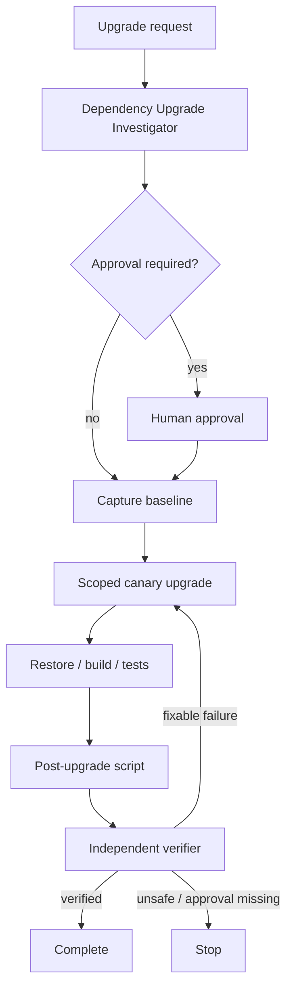

# Agent Dependency Upgrade Canary Gate

A reusable AI engineering package for upgrading one dependency (or a tightly bounded set) without letting an agent turn a small package change into an uncontrolled repository-wide update.

## Problem
Dependency upgrades often look mechanical but can silently regenerate lockfiles, move unrelated packages, introduce breaking runtime behavior, weaken security, or trigger migration work. An AI coding agent needs a deterministic baseline, explicit risk classification, narrow edit boundaries, bounded retries, and independent verification.

## Purpose
Use this kit to make dependency upgrades evidence-driven and canary-like: assess first, capture the exact starting state, apply the smallest possible dependency delta, run relevant verification, inspect scope, and require a second verifier before completion.

## When to use
- Patch/minor package upgrades.
- Security servicing updates.
- Dependency compatibility fixes.
- Framework/runtime package updates that can be isolated.
- Planned major upgrades after explicit approval.

## When not to use
- Full platform migrations with many independent workstreams.
- Unscoped “upgrade everything” requests.
- Production deployment or database migration execution; this kit stops before those approval-required actions.

## Architecture



Retries are bounded to two transient retries per command and two implementation fix/verify cycles.

## Package tree

```text
agent-dependency-upgrade-canary-gate/
├── README.md
├── config/
│   └── policy.yaml
├── examples/
│   └── dotnet-upgrade-request.yaml
├── hooks/
│   ├── post-upgrade.md
│   └── pre-upgrade.md
├── rules/
│   └── dependency-upgrade-rules.md
├── schemas/
│   └── upgrade-request.schema.json
├── scripts/
│   ├── capture-baseline.py
│   ├── detect-ecosystem.py
│   ├── requirements.txt
│   └── verify-upgrade.py
├── skills/
│   ├── assess-dependency-upgrade.md
│   └── execute-canary-upgrade.md
├── subagents/
│   ├── dependency-upgrade-investigator.md
│   └── dependency-upgrade-verifier.md
├── templates/
│   └── upgrade-request.yaml
├── tests/
│   └── test_detect_ecosystem.py
└── workflows/
    └── dependency-upgrade-canary.md
```

## Component responsibilities
- `config/policy.yaml`: retry limits, approval categories, verification expectations, output paths.
- `schemas/upgrade-request.schema.json`: structured request contract.
- `templates/upgrade-request.yaml`: copyable request template.
- `skills/assess-dependency-upgrade.md`: read-only risk/scope assessment procedure.
- `skills/execute-canary-upgrade.md`: bounded implementation and verification procedure.
- `subagents/dependency-upgrade-investigator.md`: owns dependency topology and migration evidence.
- `subagents/dependency-upgrade-verifier.md`: independently verifies scope and correctness.
- `rules/dependency-upgrade-rules.md`: enforceable safety boundaries.
- `workflows/dependency-upgrade-canary.md`: end-to-end orchestration and recovery model.
- `hooks/pre-upgrade.md`: blocks edits until a baseline is captured.
- `hooks/post-upgrade.md`: blocks completion until deterministic verification runs.
- `scripts/detect-ecosystem.py`: detects .NET, npm, and Python dependency files.
- `scripts/capture-baseline.py`: records Git HEAD/status and hashes package/lock files.
- `scripts/verify-upgrade.py`: compares changed scope and executes request verification commands.
- `tests/test_detect_ecosystem.py`: deterministic unit coverage for ecosystem detection.

## Installation
Requires Python 3.9+ and Git. YAML request parsing uses PyYAML:

```bash
python -m pip install -r scripts/requirements.txt
python -m unittest discover -s tests -p 'test_*.py'
```

The target repository must also provide the package manager and build/test tooling referenced by its request (for example .NET SDK, Node/npm, or pytest).

## Configuration
1. Copy `templates/upgrade-request.yaml` to a working request file outside this package or into your task workspace.
2. Set the target dependency, current/requested versions, ecosystem, expected changed files, verification commands, and acceptance criteria.
3. Review `config/policy.yaml` for organization-specific approval categories and commands.
4. Keep retry limits bounded; do not convert them to unlimited retry behavior.

## Permissions
Core investigation needs repository read access and package metadata access. Implementation needs repository write access and local package-manager/build execution. The kit does not require production credentials.

Never grant additional privileges merely because restore, tests, or tooling fail. Production deployment, production configuration, destructive database operations, secret changes, irreversible migrations, security-control weakening, force-push/history rewriting, breaking API changes, and other policy-listed high-risk operations require explicit human approval.

## Usage
From this package directory, point scripts at the target repository:

```bash
python scripts/detect-ecosystem.py --root /path/to/repo
python scripts/capture-baseline.py --root /path/to/repo
# Apply only the approved dependency change.
python scripts/verify-upgrade.py --root /path/to/repo --request /path/to/upgrade-request.yaml
```

For an AI coding agent, provide the request plus these entry points:

```text
Follow rules/dependency-upgrade-rules.md.
Run skills/assess-dependency-upgrade.md first.
Use workflows/dependency-upgrade-canary.md as the orchestration contract.
Do not edit until hooks/pre-upgrade.md succeeds.
After implementation, run hooks/post-upgrade.md and hand evidence to subagents/dependency-upgrade-verifier.md.
```

## Example invocation
`examples/dotnet-upgrade-request.yaml` demonstrates a servicing update for a .NET package with locked restore, build, and test checks.

## Workflow
1. Investigator proves the current dependency topology and classifies risk.
2. Workflow stops for approval when policy requires it.
3. Pre-upgrade hook captures clean Git/package baseline.
4. Implementer performs only the requested dependency change plus mechanically required compatibility edits.
5. Restore/install runs without deleting lockfiles.
6. Request-specific verification commands run.
7. Post-upgrade hook creates `verification.json` and rejects unexpected scope.
8. Independent verifier confirms final dependency resolution, diff scope, command evidence, approval compliance, and residual risk.
9. At most two evidence-based fix/verify cycles are allowed.

## Approval boundaries
Approval is mandatory for major versions, security-sensitive/auth libraries, runtime/framework upgrades, database providers, build toolchains, more than five direct dependencies, breaking API changes, production changes, destructive operations, schema changes, irreversible migrations, secret changes, or weakened security controls.

Agents stop at the boundary; they do not infer approval and do not increase permissions.

## Failure handling
- **Transient registry/tool failure:** preserve output and retry at most twice.
- **Build/test/validation failure:** formulate a new evidence-based hypothesis before retrying; maximum two fix cycles.
- **Dependency drift:** revert the broad method and try one narrower method; stop after the second unsuccessful attempt.
- **Permission failure:** stop immediately; no privilege escalation.
- **New approval-required scope:** return `needs-approval` before acting.
- **Ambiguous target or unbounded change:** return `blocked`.

Evidence is kept under `.ai/dependency-upgrade-canary/` in the target repository.

## Verification
Task execution is not success. Verification requires:
- baseline captured from the intended HEAD;
- requested dependency delta present;
- no unexplained direct-dependency drift;
- relevant restore/build/tests pass;
- expected changed-file scope is satisfied;
- final Git diff is reviewed;
- target resolved version is checked with the ecosystem package manager;
- required approvals are evidenced;
- independent verifier returns `verified`.

`verify-upgrade.py` intentionally does not claim semantic compatibility solely from package resolution. The verifier must inspect target resolution and repository-specific behavior.

## Definition of Done
The package workflow is complete only when all of the following are true:
1. Target/current/requested versions and affected manifests were identified.
2. Risk classification and approvals are complete.
3. Baseline evidence exists.
4. Requested package change and only necessary compatibility edits exist.
5. Verification commands pass.
6. Unexpected dependency or file drift is absent or explicitly justified and approved.
7. Final diff has been reviewed.
8. Independent verifier status is `verified`.
9. Remaining non-blocking risks are documented.
10. No blocking failure remains.

## Customization
Adjust approval categories and default commands in `config/policy.yaml`; extend `detect-ecosystem.py` only when a new ecosystem has meaningful deterministic markers. Keep tool-specific agent adapters outside the core workflow so the same rules can be used with Codex, Claude Code, Cursor, ChatGPT, GitHub Copilot, OpenCode, or another coding agent.
