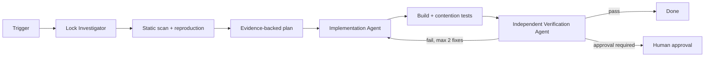

# Agent Distributed Lock Lease Safety Gate

Reusable, tool-neutral AI engineering kit for investigating, repairing, and independently verifying distributed lock/lease correctness.

## Problem
A time-bounded distributed lock does not by itself guarantee mutual exclusion. A holder can pause past TTL, another worker can acquire the lease, and the stale holder can resume, write shared state, or even delete the new owner's lock. Unsafe release, unbounded renewal, busy retry loops, and missing fencing can turn ordinary pauses/network failures into duplicate jobs, corruption, or conflicting side effects.

## Purpose
Give coding agents a bounded evidence-first workflow plus deterministic checks for lock ownership, renewal, release, contention, expiry, and stale-owner behavior.

## When to use
Use when adding/changing Redis/database/advisory locks, leader election, singleton background jobs, schedulers, payment/inventory coordination, or diagnosing duplicate execution/overlapping critical sections.

## When not to use
Do not add distributed locking when a local mutex, database uniqueness constraint, idempotency key, queue partition, transaction, or optimistic concurrency already provides the required guarantee more simply. This kit does not prove the correctness of a consensus algorithm or replace vendor-specific distributed-systems analysis.

## Architecture


## Package tree
```text
agent-distributed-lock-lease-safety-gate/
├── README.md
├── config/gate.yaml
├── schemas/evidence.schema.json
├── skills/investigate-lock-safety.md
├── skills/remediate-lock-safety.md
├── rules/safety-rules.md
├── subagents/lock-investigator.md
├── subagents/implementation-agent.md
├── subagents/verification-agent.md
├── workflows/distributed-lock-safety.md
├── hooks/lifecycle-hooks.md
├── scripts/scan-locks.py
├── scripts/verify-evidence.py
├── examples/evidence.example.json
└── tests/test-scripts.py
```

## Components
- `skills/investigate-lock-safety.md`: lifecycle tracing, evidence collection, expiry/stale-owner analysis.
- `skills/remediate-lock-safety.md`: minimal safe remediation procedure.
- `rules/safety-rules.md`: enforceable MUST/MUST NOT/SHOULD boundaries.
- `subagents/*`: separates investigation, implementation and independent verification ownership.
- `workflows/distributed-lock-safety.md`: end-to-end bounded workflow and failure paths.
- `hooks/lifecycle-hooks.md`: deterministic lifecycle checks.
- `scripts/scan-locks.py`: dependency-free heuristic source scanner; high/critical findings exit 2.
- `scripts/verify-evidence.py`: dependency-free evidence contract validator.
- `schemas/evidence.schema.json`: machine-readable handoff contract.
- `config/gate.yaml`: portable defaults; the scripts themselves require no YAML library.
- `tests/test-scripts.py`: standard-library tests for scanner and evidence validation.

## Installation
Copy this directory into a repository. Requires Python 3.9+ for included scripts. No Python packages are required. Point your coding agent to `README.md`, `rules/safety-rules.md`, and `workflows/distributed-lock-safety.md`.

## Configuration
Adjust `config/gate.yaml` to the repository's lease budget and approval policy. Defaults: 120-second maximum lease duration, renewal at half-life, maximum 3 renewals, 10-second acquire timeout, 2 acquisition/tool retries. Treat these as guardrails, not universal production values.

## Permissions
Investigation needs repository read plus local test execution. Implementation needs scoped repository write. Production access, lock deletion, backend/topology/config changes, infrastructure/schema changes, and security changes are not required and require explicit human approval if proposed.

## Usage
```bash
python scripts/scan-locks.py /path/to/repo --json > lock-scan.json
python -m unittest tests/test-scripts.py
python scripts/verify-evidence.py report.json
```

Example agent invocation: `Run the distributed lock lease safety workflow for the singleton billing worker. Treat production as read-only, preserve evidence, and stop at any approval boundary.`

## Workflow
The investigator maps acquire/renew/release and protected writes, then reproduces contention, expiry, and stale-owner behavior locally. The implementer applies the smallest evidenced fix and gets at most two test-fix cycles. The independent verifier reruns static checks, project tests, concurrency scenarios, and evidence validation. Unknown semantics are `blocked`; they are never converted to a pass by assumption.

## Safety model
Safe release requires ownership identity and an atomic conditional operation. Renewal must prove ownership and be bounded. If a stale holder can mutate the protected resource after lease expiry, the design needs a resource-enforced stale-write defense such as a monotonically increasing fencing token where feasible. Timing alone is not proof of exclusivity.

## Approval boundaries
Explicit approval is required before production rollout/config mutation, destructive lock cleanup, lock backend replacement, schema/infrastructure changes, secret/permission changes, security weakening, irreversible migration, or breaking contract changes. Agents stop before these actions and never increase privilege to unblock themselves.

## Failure and recovery
Transient acquisition/tool failures retry at most twice with evidence preserved. Validation failures require a changed hypothesis, not blind retry. Test-fix loops stop after two implementation retries. Permission failures stop without escalation. Missing backend semantics or unavailable safe reproduction produces `blocked` with the missing evidence documented.

## Verification
A successful run requires project-relevant build/tests, no new high/critical scanner finding, passing contender/expiry/stale-owner scenarios, a valid evidence report, no unintended diff, and required approvals. `Task executed` is not equivalent to `verified successfully`.

## Definition of Done
- Lock lifecycle and protected resource are identified.
- Facts, hypotheses, decisions, evidence, and open questions are separated.
- Release and renewal ownership semantics are proven safe.
- Stale-owner behavior is prevented or explicitly blocked with evidence.
- Contention, expiry, and stale-owner verification all pass.
- Relevant build/tests pass and evidence validates.
- No unresolved high/critical finding or blocking failure remains.
- Approval exists for every approval-required action.
- Residual risks are documented.

## Customization
Extend `scan-locks.py` with repository-specific APIs, but keep heuristic findings as investigation signals rather than proof. Add backend-specific integration tests for Redis Lua compare-and-delete, SQL advisory locks, etc. Keep tool-specific agent adapters outside the core workflow so the package remains usable with Codex, Claude Code, Cursor, ChatGPT, GitHub Copilot, OpenCode, and other coding agents.
