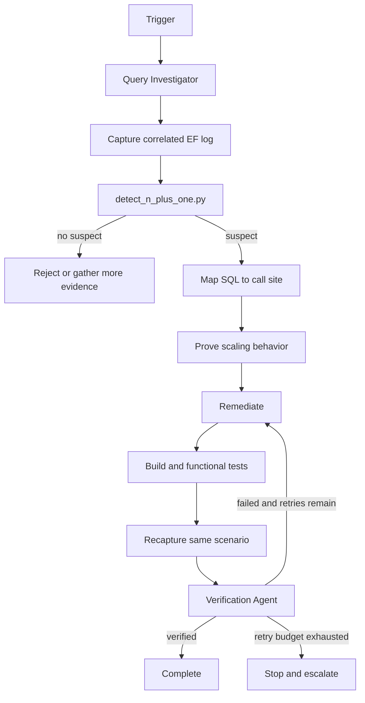

# Agent EF Core N+1 Detection Gate

Reusable AI engineering kit for detecting, proving, remediating, and independently verifying EF Core N+1 query problems.

## Problem
N+1 problems are frequently misdiagnosed because repeated SQL may be legitimate, logs may be uncorrelated, and a lower query count can still hide semantic regressions. This kit combines deterministic log analysis with a structured agent workflow so an N+1 claim must be supported by both command-level evidence and a concrete per-item code path.

## Purpose
Use the package to turn a vague performance suspicion into an evidence-based gate:

```text
Trigger
  -> capture correlated EF Core commands
  -> deterministic repeated-query detection
  -> map suspect SQL to code
  -> prove growth with collection size
  -> implement smallest safe fix
  -> functional test
  -> recapture same scenario
  -> independent verification
  -> complete
```

## When to use
- An endpoint or background job becomes slower as result count grows.
- EF Core logs show the same SQL shape repeatedly with different parameter values.
- Lazy loading or per-item repository calls are suspected.
- A code review introduces navigation access inside a loop.
- A performance regression needs query-count evidence.

## When not to use
- Pure CPU or network latency with no repeated database access.
- Batch jobs intentionally issuing independent writes per record where transactional semantics require it.
- Production-only investigation when required logs cannot be accessed safely.

## Architecture



## Package tree

```text
agent-ef-core-n-plus-one-detection-gate/
├── README.md
├── config/
│   └── policy.yaml
├── hooks/
│   └── lifecycle.md
├── rules/
│   └── ef-core-query-safety.md
├── schemas/
│   └── n-plus-one-result.schema.json
├── scripts/
│   ├── detect_n_plus_one.py
│   └── verify_package.py
├── skills/
│   ├── investigate-n-plus-one.md
│   └── remediate-n-plus-one.md
├── subagents/
│   ├── query-investigator.md
│   └── verification-agent.md
├── workflows/
│   └── n-plus-one-gate.md
├── examples/
│   ├── ef-log-sample.txt
│   └── expected-result.json
└── tests/
    └── test_detect_n_plus_one.py
```

Actual files:
- `config/policy.yaml`
- `hooks/lifecycle.md`
- `rules/ef-core-query-safety.md`
- `schemas/n-plus-one-result.schema.json`
- `scripts/detect_n_plus_one.py`
- `scripts/verify_package.py`
- `skills/investigate-n-plus-one.md`
- `skills/remediate-n-plus-one.md`
- `subagents/query-investigator.md`
- `subagents/verification-agent.md`
- `workflows/n-plus-one-gate.md`
- `examples/ef-log-sample.txt`
- `examples/expected-result.json`
- `tests/test_detect_n_plus_one.py`

## Component responsibilities

`skills/investigate-n-plus-one.md` defines the evidence-gathering procedure. `skills/remediate-n-plus-one.md` owns behavior-preserving remediation. `subagents/query-investigator.md` performs root-cause evidence collection without editing implementation code. `subagents/verification-agent.md` independently validates semantics and query-count improvement. `rules/ef-core-query-safety.md` enforces repository, database, and approval boundaries. `workflows/n-plus-one-gate.md` defines the bounded end-to-end loop. `hooks/lifecycle.md` maps predictable lifecycle points to deterministic commands. `scripts/detect_n_plus_one.py` detects repeated normalized SQL shapes with distinct parameter sets. `scripts/verify_package.py` verifies package completeness. `schemas/n-plus-one-result.schema.json` defines the detector output contract.

## Installation

Requires Python 3.9+ only. Copy this directory into the target repository. No third-party Python packages are required.

For EF Core evidence, enable `Microsoft.EntityFrameworkCore.Database.Command` logging in a safe non-production environment or use existing read-only production logs. Add a request/job correlation marker matching `config/policy.yaml` before command output when possible.

## Configuration

Edit `config/policy.yaml` for repository-specific thresholds. Important values:

- `minimum_repeated_query_count`: minimum repeated executions of one normalized SQL shape in a request.
- `minimum_distinct_parameter_sets`: avoids flagging identical retries or repeated constant probes.
- `maximum_allowed_suspect_groups`: CI gate tolerance; default `0`.
- `request_marker_pattern`: correlation boundary used by the parser.
- `ignore_sql_patterns`: known harmless commands.
- `max_retries`: remediation retry budget; fixed at two in the workflow.

Do not lower thresholds simply to suppress a confirmed issue. Tune them only with representative evidence.

## Permissions

The normal workflow requires read access to source and logs plus permission to run local builds/tests. It does not require production write access, database DDL privileges, secret access, or infrastructure mutation.

Explicit human approval is required before:
- production query/config changes;
- database schema or index changes;
- breaking API changes;
- globally disabling lazy loading;
- any destructive or irreversible action.

## Usage

Run package tests:

```bash
python -m unittest tests/test_detect_n_plus_one.py
```

Analyze an EF Core command log:

```bash
python scripts/detect_n_plus_one.py \
  --log examples/ef-log-sample.txt \
  --policy config/policy.yaml \
  --out n-plus-one-result.json
```

Exit codes:
- `0`: detector completed and suspect count is within policy.
- `2`: detector completed and suspect count exceeds policy.
- `3`: invalid input/tooling failure.

The detector output should conform to `schemas/n-plus-one-result.schema.json`.

## Example invocation for an AI coding agent

Use `workflows/n-plus-one-gate.md` as the orchestration contract. Delegate initial evidence gathering to `subagents/query-investigator.md`, use `skills/investigate-n-plus-one.md`, then apply `skills/remediate-n-plus-one.md` only after confirmation. The implementing agent must not be the only verifier; final verification belongs to `subagents/verification-agent.md`.

## Detection model

The deterministic detector groups EF Core commands by request identifier and normalized SQL. Literal values are normalized, while parameter-line evidence is retained. A group is considered suspect only when both execution count and distinct parameter-set thresholds are met. This is intentionally a heuristic gate, not proof by itself. The investigation skill requires mapping the group to a per-item code path before declaring the problem confirmed.

## Remediation choices

Choose the smallest approach that preserves semantics:
- projection into the required read model;
- targeted `Include` when navigation materialization is actually required;
- one bounded batch query followed by in-memory key lookup;
- moving `ToListAsync`/materialization outside a loop when deferred execution is the cause;
- explicit loading performed once for a bounded aggregate.

Avoid solving N+1 by loading an unbounded dataset or changing tenant/authorization filters.

## Approval boundaries

The agent must stop before database DDL, index creation, production configuration changes, production query rewrites, global lazy-loading changes, breaking public contracts, destructive actions, or permission escalation. Approval is an explicit checkpoint, not an informational warning.

## Failure handling

Failures are classified as evidence, validation, build/test, tool, permission, or environment failures. Incomplete correlation produces `inconclusive` rather than a guessed diagnosis. Remediation has a maximum of two retries. Each retry preserves the previous diff, detector output, and test/log evidence. After the second failed remediation, the workflow stops and escalates rather than looping indefinitely.

## Verification

A task is only **executed** when a remediation change exists. It is **verified successfully** only when:
- the original code path and repeated query group were proven;
- functional build/tests pass;
- the after-log uses the same scenario and representative input size;
- the original suspect group is absent;
- no new blocking suspect group appears;
- authorization, tenant, filtering, ordering, paging, tracking, and public-contract behavior remain intact;
- the independent verifier returns `verified`;
- all required approvals exist.

Run package integrity validation before publishing:

```bash
python scripts/verify_package.py
```

## Definition of Done

1. Required context was gathered.
2. Repeated-query evidence is correlated to a request/job.
3. The suspect SQL is mapped to a concrete per-item code path.
4. Growth behavior is confirmed or the hypothesis is rejected/inconclusive.
5. A confirmed problem has the smallest safe remediation.
6. Relevant build/tests pass.
7. Before/after detector evidence exists for the same scenario.
8. Independent verification returns `verified`.
9. Approval-required changes have explicit approval.
10. Remaining risks are documented and no blocking failure remains.

## Customization

Adjust thresholds and correlation format in `config/policy.yaml`. Keep the core workflow tool-neutral. If integrating with Codex, Claude Code, Cursor, ChatGPT, GitHub Copilot, OpenCode, or another agent, adapt only the invocation layer; do not weaken the evidence, retry, approval, or independent-verification requirements.
