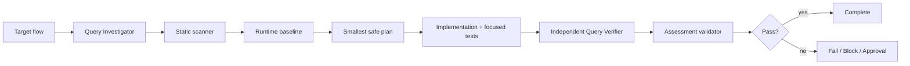

# Agent EF Core N+1 Regression Gate

A reusable evidence-based gate for detecting, proving, and preventing EF Core N+1 query regressions without changing business semantics.

## Problem
An endpoint or job can appear functionally correct while executing one base query plus one or more queries per returned item. Lazy loading, loop-contained repository calls, per-item lookups, premature materialization, or hidden repository abstractions can make latency and database load grow with result size.

## Purpose
This package gives coding agents and developers a repeatable workflow to identify suspected N+1 behavior, measure query-count scaling, implement the smallest safe query-shape change, and independently verify both performance and result equivalence.

## When to use
Use for slow EF Core endpoints/jobs, PRs changing navigation loading or projections, lazy-loading code, loop-based data access, or incidents where SQL command volume grows with returned item count.

## When not to use
Do not use query count alone as proof of a defect. Multiple intentional batched queries may be valid. Do not use the package to justify broad `Include` graphs or client-side filtering without measuring the replacement behavior.

## Architecture


## Package tree
```text
agent-ef-core-n-plus-one-regression-gate/
├── README.md
├── config/n-plus-one-policy.json
├── schemas/assessment.schema.json
├── scripts/scan-n-plus-one.py
├── scripts/validate-assessment.py
├── skills/n-plus-one-investigation.md
├── rules/n-plus-one-safety.md
├── subagents/query-investigator.md
├── subagents/query-verifier.md
├── workflows/n-plus-one-gate.md
├── hooks/lifecycle-hooks.md
├── examples/assessment.json
└── tests/self-test.py
```

## Component responsibilities
`skills/n-plus-one-investigation.md` defines the reusable investigation procedure. `rules/n-plus-one-safety.md` defines enforceable editing, evidence, testing, and approval constraints. `subagents/query-investigator.md` owns reproduction/root-cause evidence while `subagents/query-verifier.md` independently verifies the claim. `workflows/n-plus-one-gate.md` defines the bounded end-to-end flow. `scripts/scan-n-plus-one.py` finds suspicious C# patterns; its findings are advisory. `scripts/validate-assessment.py` checks the final structured output. `config/n-plus-one-policy.json` centralizes retry limits, thresholds, and approvals. `tests/self-test.py` verifies the bundled scripts.

## Dependencies
Python 3.9+ for bundled scripts. The target repository keeps its existing .NET/EF Core build and test tooling. No third-party Python packages are required.

## Installation
Copy this directory into a repository or agent-instruction location while preserving relative paths. Adjust `config/n-plus-one-policy.json` only to make repository policy stricter or to reflect repository-specific approval boundaries.

## Permissions
Default operation requires repository read access and permission to run local non-destructive build/tests. EF Core SQL logging/interceptors may be enabled in a test environment, but sensitive SQL parameter values and connection strings must not be exposed. Schema changes, production configuration/deployment, breaking APIs, or large dependency upgrades require explicit human approval.

## Usage
Run the scanner from this package:

```bash
python3 scripts/scan-n-plus-one.py /path/to/repository --output scan.json
```

Exit `0` means no heuristic findings, `1` means findings require investigation, and `2` means invalid invocation/input. A scanner hit is not proof of N+1.

Follow `skills/n-plus-one-investigation.md` and `workflows/n-plus-one-gate.md`. Establish a representative runtime baseline, preferably at more than one collection size, and measure the number of executed SQL commands for the same logical flow.

Validate the final assessment:

```bash
python3 scripts/validate-assessment.py assessment.json
```

Run package self-test:

```bash
python3 tests/self-test.py
```

## Recommended runtime measurement
Use the repository's existing EF Core `DbCommandInterceptor`, diagnostic listener, or test logging mechanism to count executed commands. Exercise the same input and result contract before and after the change. Testing N=1 and a larger N helps distinguish a constant query strategy from query count that grows with item count.

Record at minimum:

- baseline query count
- changed query count
- representative input size
- returned result equivalence
- focused test outcome
- any SQL-shape risk introduced by the replacement

## Safe remediation patterns
Depending on evidence, useful fixes include server-side projection, filtered/targeted `Include`, explicit join, batching IDs into one query, preloading a dictionary/set, or removing lazy loading from the specific path. Prefer the narrowest change that preserves authorization, tenant filters, ordering, pagination, null behavior, tracking semantics, and result cardinality.

Do not automatically replace N+1 with a single huge join. An over-broad include graph can create cartesian explosion, duplicate rows, large payloads, and worse memory/latency.

## Verification
Task execution is not proof of success. A `pass` assessment requires:

- baseline and changed query counts
- changed query count no greater than baseline in the representative scenario
- result equivalence confirmed
- focused tests passing
- query count independently verified
- diff reviewed
- assessment contract valid

The independent verifier must not rely solely on the implementing agent's interpretation.

## Failure and recovery
Transient database/test/tool failures may be retried at most twice. Preserve command output, input size, query-count evidence, and attempt number. Deterministic failures require diagnosis or a change before rerunning. If representative reproduction cannot be created, status is `blocked`, not `pass`.

## Approval boundaries
Stop before database schema changes, production configuration/deployment, breaking API changes, large dependency upgrades, destructive SQL, or other irreversible actions. Never weaken filters, authorization, or security controls to obtain better performance measurements.

## Definition of Done
The target flow and EF Core query/materialization points are mapped; static findings were reviewed; baseline scaling evidence exists; the root cause is evidence-backed; the smallest safe remediation was implemented if needed; focused tests pass; returned results are equivalent; changed query count does not exceed baseline for the representative case; independent verification completed; diff was reviewed; assessment validates; required approvals exist; remaining risks are documented; and no blocking failure remains for a `pass` verdict.

## Customization
Add repository-specific scanner patterns only when they are deterministic enough to be useful. Keep runtime query-count evidence as the deciding signal. Tighten thresholds and approval rules in `config/n-plus-one-policy.json` as required by the target repository.
