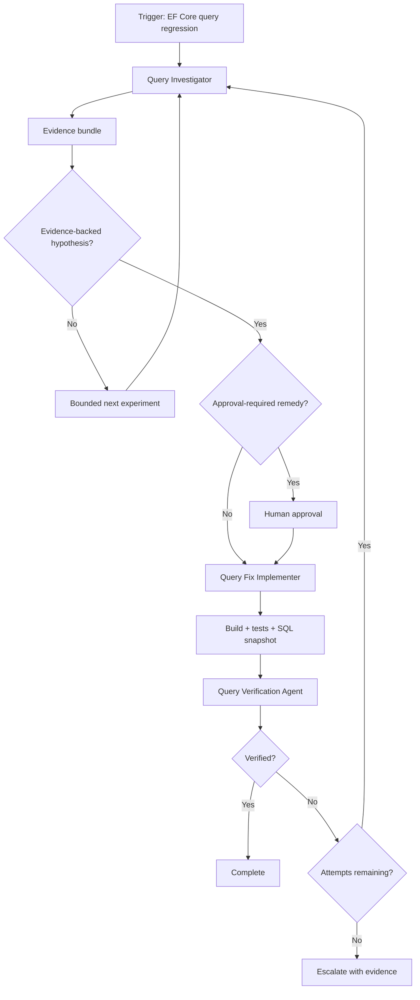

# Agent EF Core Query Regression Investigator

A reusable, tool-neutral AI engineering kit for investigating and safely fixing EF Core query performance regressions with reproducible evidence instead of generic optimization guesses.

## Problem
EF Core performance regressions are easy to misdiagnose because application latency, generated SQL, tracking behavior, query shape, data distribution, indexes, provider behavior, and execution plans can all contribute. Ad-hoc agents often jump directly to common optimizations without proving causality.

## Purpose
This package enforces an evidence-first workflow: trace the query, reproduce the symptom, capture SQL and plan evidence, test one bounded hypothesis at a time, implement the smallest safe fix, and independently verify behavior and performance.

## When to use
Use when an EF Core-backed endpoint, job, repository method, or application workflow becomes slower, times out, issues more queries, allocates unexpectedly, or shows a plan regression after a code/model/provider/database change.

## When not to use
Do not use this package as a general database migration tool, schema designer, production tuning bot, or automatic index creator. It intentionally stops at approval boundaries for database and production changes.

## Architecture



The workflow allows at most three hypothesis attempts and at most two retries for transient tool/database failures.

## Package tree

```text
agent-ef-core-query-regression-investigator/
├── README.md
├── config/
│   └── query-regression.yaml
├── hooks/
│   ├── post-edit-verification.md
│   └── pre-investigation.md
├── rules/
│   └── query-investigation-rules.md
├── schemas/
│   └── investigation.schema.json
├── scripts/
│   ├── verify-package.py
│   └── verify-repository.sh
├── skills/
│   ├── collect-query-evidence.md
│   └── validate-query-fix.md
├── subagents/
│   ├── query-fix-implementer.md
│   ├── query-investigator.md
│   └── query-verifier.md
├── templates/
│   └── investigation-report.md
└── workflows/
    └── ef-core-query-regression.md
```

## Component responsibilities
- `config/query-regression.yaml`: thresholds, bounded retry policy, approval boundaries, and artifact paths.
- `rules/query-investigation-rules.md`: enforceable MUST/MUST NOT/SHOULD behavior.
- `skills/collect-query-evidence.md`: procedure for repository tracing, reproduction, SQL capture, measurements, and plan evidence.
- `skills/validate-query-fix.md`: independent correctness/performance verification procedure.
- `subagents/query-investigator.md`: read-only investigation and hypothesis ownership.
- `subagents/query-fix-implementer.md`: minimal evidence-backed source/test changes.
- `subagents/query-verifier.md`: independent verification; does not edit implementation code.
- `workflows/ef-core-query-regression.md`: end-to-end bounded workflow, checkpoints, retries, approvals, failure paths, and Definition of Done.
- `hooks/pre-investigation.md`: deterministic preflight hook.
- `hooks/post-edit-verification.md`: deterministic post-edit validation hook.
- `scripts/verify-repository.sh`: safe .NET repository preflight/build/test/diff checks.
- `scripts/verify-package.py`: package completeness/reference validation.
- `schemas/investigation.schema.json`: structured investigation handoff contract.
- `templates/investigation-report.md`: human-readable evidence report template.

## Installation
Copy this directory into the repository or an agent-instructions directory. Keep paths intact because workflow and hooks reference package-relative assets.

Requirements for deterministic repository verification:
- Bash
- Git
- .NET SDK compatible with the target repository
- `dotnet format` available through the installed SDK/tooling

No database credentials or secrets are stored by this package.

## Configuration
Edit `config/query-regression.yaml` only when repository policy requires different thresholds or approval boundaries. Do not weaken approval boundaries merely to unblock automation.

For repositories with exactly one `.sln` or `.csproj` within depth 3, `scripts/verify-repository.sh --verify` discovers it automatically. Otherwise set:

```bash
export DOTNET_TARGET="src/MyApplication.sln"
```

Optionally limit tests during a targeted loop:

```bash
export DOTNET_TEST_FILTER="FullyQualifiedName~QueryPerformanceTests"
```

The final verification should still include the repository's required broader test/build gates.

## Permissions
Use least privilege. Repository read access is sufficient for investigation. Editing access is required only for an approved code fix. Database access should be read-only for plan/evidence collection. Never silently request broader production or database permissions.

## Usage
1. Read `rules/query-investigation-rules.md`.
2. Run the preflight described in `hooks/pre-investigation.md`.
3. Start `workflows/ef-core-query-regression.md` with the symptom, target operation, repository, baseline evidence, and acceptance criteria.
4. The Query Investigator executes `skills/collect-query-evidence.md` and uses `templates/investigation-report.md` plus `schemas/investigation.schema.json` for the handoff.
5. If the remedy stays within code-edit boundaries, the Query Fix Implementer makes the smallest evidence-backed change and adds/updates tests.
6. Run `hooks/post-edit-verification.md`.
7. The Query Verification Agent executes `skills/validate-query-fix.md` and reports PASS, FAIL, or NOT-VERIFIED.

## Example invocation

```text
Investigate the EF Core regression in GET /api/orders/search.
Baseline p95 was ~180 ms; current p95 is ~950 ms after commit abc123.
Use representative page size 50 and the same tenant/date filters.
Do not change schema or indexes without approval.
Follow workflows/ef-core-query-regression.md and produce evidence before changing code.
```

## Workflow outputs
The workflow produces these runtime artifacts in the target repository/work area:
- `artifacts/ef-query-investigation.md`
- `artifacts/generated-sql.txt`
- `artifacts/verification.md`

These are runtime outputs and are intentionally not pre-created by this reusable package.

## Approval boundaries
Explicit human approval is required before:
- Schema changes.
- Production index creation/removal/change.
- Query hints.
- Write-capable raw SQL.
- Production configuration changes.
- Dependency/provider upgrades.
- Any other destructive, irreversible, permission-widening, or security-weakening action.

Agents stop before the action; approval is not inferred from the existence of the incident or performance problem.

## Failure handling
- Transient database/tool failures: maximum two retries, preserving evidence.
- Build/test failures: diagnose rather than retry blindly.
- Permission failures: stop without escalating privileges.
- Non-reproducible regressions: report NOT-VERIFIED rather than invent a cause.
- Failed hypotheses: move to the next evidence-ranked hypothesis, maximum three attempts total.
- Exhausted attempts: escalate with preserved facts, failed experiments, and remaining hypotheses.

## Verification
Repository verification:

```bash
bash scripts/verify-repository.sh --preflight
DOTNET_TARGET="path/to/app.sln" bash scripts/verify-repository.sh --verify
```

Package verification after copying locally:

```bash
python3 scripts/verify-package.py
```

Deterministic checks do not replace query-specific verification. Successful completion also requires equivalent before/after workload comparison, generated SQL capture, behavioral tests, and independent diff review.

## Definition of Done
The task is verified successfully only when:
- Relevant repository/query context was gathered.
- The regression was reproduced or explicitly classified as non-reproducible.
- Before/after generated SQL is available for any code change.
- Root-cause claims are evidence-backed.
- Behavioral tests pass.
- Relevant build passes.
- Equivalent workload performance verification passes.
- Final diff has no unintended changes.
- Required human approvals exist for any approval-bound action, or such actions were not performed.
- Remaining risks are documented.
- Independent verification status is PASS.

## Customization
Keep the workflow and safety rules tool-neutral. Adapt command execution or agent syntax for Codex, Claude Code, Cursor, ChatGPT, GitHub Copilot, OpenCode, or another coding agent without changing the evidence, bounded retry, approval, or independent verification requirements.
