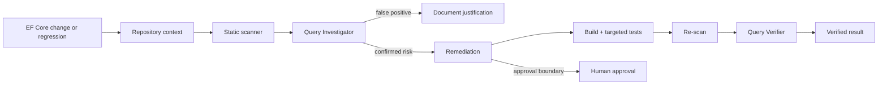

# Agent EF Core Query Shape Regression Gate

Reusable implementation kit for AI coding agents and .NET teams that need to detect, investigate, remediate, and independently verify EF Core query-shape regressions before they become production latency or database-load problems.

## Problem
EF Core code can remain functionally correct while becoming materially worse operationally. Common examples include materializing before filtering, overly broad Include graphs, synchronous database terminals inside async flows, repeated `SaveChanges` inside loops, or changes that silently increase rows/joins/round trips. These regressions are easy for an AI agent to introduce because the code compiles and ordinary tests may still pass.

This package combines deterministic static heuristics with an evidence-driven agent workflow. Static findings are treated as signals, not proof; confirmed performance claims require repository/runtime evidence.

## When to use
Use during EF Core feature implementation, code review, refactoring, performance investigations, PR preparation, incident remediation, or when a change touches LINQ query construction, navigation loading, materialization, persistence loops, tracking behavior, or async database access.

## When not to use
Do not use the scanner as a complete EF Core analyzer or SQL optimizer. It is intentionally heuristic and does not replace profiling, generated SQL inspection, database execution plans, benchmark evidence, provider-specific guidance, or database-native monitoring.

## Architecture



## Package tree

```text
agent-ef-core-query-shape-regression-gate/
├── README.md
├── config/
│   └── policy.yaml
├── examples/
│   └── problematic-query.cs
├── hooks/
│   └── lifecycle.md
├── rules/
│   └── ef-core-query-safety.md
├── schemas/
│   └── scan-result.schema.json
├── scripts/
│   ├── scan_ef_queries.py
│   └── verify_package.py
├── skills/
│   ├── query-regression-remediation.md
│   └── query-shape-investigation.md
├── subagents/
│   ├── query-investigator.md
│   └── query-verifier.md
├── tests/
│   └── test_scan_ef_queries.py
└── workflows/
    └── query-shape-regression-gate.md
```

## Components

- `scripts/scan_ef_queries.py` performs deterministic heuristic scanning of C# files and emits structured JSON.
- `config/policy.yaml` controls severity threshold, ignored paths, and approval-sensitive categories.
- `skills/query-shape-investigation.md` defines evidence-first investigation.
- `skills/query-regression-remediation.md` defines bounded remediation and proof requirements.
- `rules/ef-core-query-safety.md` prevents semantic or security regressions while optimizing queries.
- `subagents/query-investigator.md` owns discovery and evidence gathering.
- `subagents/query-verifier.md` independently verifies the final change.
- `workflows/query-shape-regression-gate.md` defines the end-to-end bounded workflow.
- `hooks/lifecycle.md` defines scan/build/test/approval/final-verification lifecycle hooks.
- `schemas/scan-result.schema.json` defines the scanner output contract.
- `tests/test_scan_ef_queries.py` validates core scanner behavior.

## Dependencies

- Python 3.9+
- PyYAML
- A .NET repository using EF Core for real task execution
- `dotnet` CLI for build/test verification when integrating into a .NET project

Install scanner dependency:

```bash
python -m pip install pyyaml
```

## Configuration

Edit `config/policy.yaml` to tune repository-specific behavior. The default policy warns/blocks at `warning` severity, ignores migrations/generated files, and flags potentially risky patterns such as broad materialization or repeated persistence.

The scanner is deliberately conservative. Do not weaken the policy automatically to make a task pass. If a finding is a false positive, preserve the evidence and justification in the task result.

## Usage

Run the scanner against a repository:

```bash
python scripts/scan_ef_queries.py \
  --root /path/to/repository \
  --policy config/policy.yaml \
  --output ef-query-scan.json
```

Exit codes:

- `0`: no finding at or above the configured severity threshold
- `2`: one or more blocking findings
- `3`: configuration/tool error

Example against this package's sample code:

```bash
python scripts/scan_ef_queries.py \
  --root examples \
  --policy config/policy.yaml
```

## Detected patterns

The current deterministic scanner includes practical heuristics for:

- `AsEnumerable()` transitions that may move evaluation to memory
- materialization followed by filtering
- potentially unbounded `ToList()`/`ToListAsync()` calls
- `SaveChanges`/`SaveChangesAsync` inside nearby loop scopes
- oversized `Include`/`ThenInclude` usage
- synchronous EF query terminals detected inside async methods

These are investigation signals. A warning is not automatically a bug, and absence of a warning is not proof of optimal SQL.

## Recommended agent workflow

1. Inspect the affected request/job path, DbContext configuration, entity mappings, navigation relationships, nearby queries, and tests.
2. Run the baseline static scan.
3. Classify each finding as confirmed, false positive, or inconclusive.
4. For confirmed risks, collect generated SQL with safe tooling such as `ToQueryString()` or EF Core command logging in an appropriate non-production diagnostic context.
5. Measure relevant shape characteristics: selected columns, joins, row multiplicity, query count/round trips, materialized entities, latency, or allocations.
6. Apply the smallest behavior-preserving remediation.
7. Build, run targeted tests, and re-scan.
8. Have the Query Verifier independently inspect semantics and before/after evidence.
9. Report success only after verification.

## Approval boundaries

Explicit human approval is required before:

- adding or changing production indexes/schema
- removing or weakening global query filters
- production configuration changes
- breaking API behavior
- changing tracking semantics on a write path when correctness is not already proven
- destructive SQL or production data changes

The agent must stop before these actions. It must never increase database permissions to unblock itself.

## Failure and recovery

Scanner/tool transient failures may be retried once with unchanged inputs. Build/test environment failures may be retried once when clearly transient. A remediation may be attempted at most twice per finding. Each failed attempt should preserve its scan/build/test/SQL evidence. After two failed remediation attempts, restore the last safe state when possible or escalate.

Permission failures, security-filter ambiguity, or unknown tenant semantics are not retryable through privilege expansion or speculative edits.

## Verification

Validate the package itself:

```bash
python -m unittest tests/test_scan_ef_queries.py
python scripts/verify_package.py
```

For a real EF Core change, success additionally requires:

- affected execution path identified
- final static scan reviewed
- solution/project build passes
- targeted tests pass
- tenant/security/order/pagination semantics remain correct
- claimed performance improvement has generated-SQL or runtime evidence where feasible
- final diff contains no unrelated changes
- independent Query Verifier returns `verified`

## Definition of Done

The task is complete only when the relevant context was gathered, findings were evidence-classified, the final code builds, targeted tests pass, the final scan is reviewed, required approvals were obtained, independent verification confirms semantics and the claimed query-shape improvement, and unresolved risks are documented.

“Code compiles” or “scanner passed” alone is not proof of a successful optimization.

## Portability

The package is tool-neutral. Its Skills, Rules, Subagents, Workflow, and Hooks can be adapted to OpenAI Codex, Claude Code, Cursor, ChatGPT, GitHub Copilot, OpenCode, or another coding-agent environment. Keep database credentials and production access in the host platform's permission system rather than this package.

## Customization

Extend `scan_ef_queries.py` or replace its heuristics with Roslyn analyzers for stronger syntax awareness. Useful repository-specific extensions include detecting missing pagination on known high-cardinality DbSets, enforcing approved projection patterns, comparing query counts in integration tests, or exporting diagnostic artifacts from EF Core interceptors. Preserve the same evidence-first workflow even when the deterministic implementation changes.
