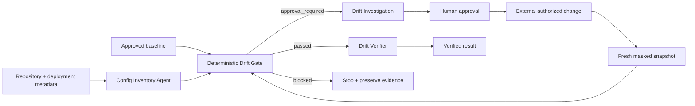

# Agent Environment Configuration Drift Gate

Reusable guardrail for AI-assisted deployments and operations that detects configuration drift between an approved baseline and a target environment before changes proceed.

## Problem
AI coding and operations agents can inspect repository code correctly while still acting on an environment whose runtime configuration has drifted. A deployment may fail or become unsafe because auth settings, database providers, storage endpoints, feature flags, TLS validation, or other operational settings differ from the state the agent assumes. Ad-hoc manual comparison is error-prone, and copying full configuration into prompts can expose secrets.

This kit adds a deterministic, secret-aware drift gate plus evidence, approval, and verification procedures. The gate **never modifies configuration**.

## Purpose
Use the package to answer four questions before an AI-assisted operational action:

1. Does the target environment match its approved configuration baseline?
2. Which differences are routine, approval-required, or blocked?
3. Is the change supported by repository/deployment/change evidence?
4. After an authorized external change, does a fresh snapshot verify the intended state?

## When to use
- Before production/staging deployments.
- Before an agent recommends or prepares environment changes.
- During incidents where runtime behavior differs by environment.
- After infrastructure/config changes to verify expected state.
- When onboarding a service to configuration-drift control.

## When not to use
- As a secret-management system.
- As the mechanism that writes production configuration.
- As a substitute for cloud/platform policy, RBAC, deployment protections, or configuration-service audit logs.
- When baseline provenance is unknown or configuration sources are incomplete.

## Architecture



The Python gate consumes JSON/YAML snapshots, flattens nested keys, ignores configured runtime noise, redacts sensitive values, classifies protected/approval-required differences, and emits a machine-readable result. It does not connect to cloud providers or configuration stores.

## Package tree

```text
agent-environment-config-drift-gate/
├── README.md
├── config/
│   └── policy.yaml
├── examples/
│   ├── baseline.json
│   └── current.json
├── hooks/
│   └── lifecycle.md
├── rules/
│   └── config-drift-safety.md
├── schemas/
│   └── drift-result.schema.json
├── scripts/
│   ├── config_drift_gate.py
│   └── verify_package.py
├── skills/
│   ├── config-baseline-capture.md
│   └── config-drift-investigation.md
├── subagents/
│   ├── config-inventory-agent.md
│   └── drift-verifier.md
├── templates/
│   └── config-change-approval.md
├── tests/
│   └── test_config_drift_gate.py
└── workflows/
    └── config-drift-gate.md
```

## Component responsibilities
- `config/policy.yaml` defines protected keys, approval-required patterns, security-weakening patterns, drift-count thresholds, ignored runtime keys, and production aliases.
- `scripts/config_drift_gate.py` performs deterministic comparison and secret-aware reporting.
- `scripts/verify_package.py` checks that all required package artifacts exist and are non-empty.
- `skills/config-baseline-capture.md` defines how to create safe, provenance-backed, masked baselines.
- `skills/config-drift-investigation.md` defines how to investigate unexpected or risky drift.
- `rules/config-drift-safety.md` provides enforceable MUST/MUST NOT/SHOULD behavior.
- `subagents/config-inventory-agent.md` owns read-only snapshot collection.
- `subagents/drift-verifier.md` independently reproduces and verifies results.
- `workflows/config-drift-gate.md` defines the bounded end-to-end lifecycle.
- `hooks/lifecycle.md` describes integration points for CI/CD and agent runtimes.
- `schemas/drift-result.schema.json` defines the gate output contract.
- `templates/config-change-approval.md` is the approval packet for intentional production/protected changes.

## Dependencies
Python 3.9+ and PyYAML:

```bash
python -m pip install pyyaml
```

The standard library handles JSON, glob matching, regular expressions, file I/O, and argument parsing.

## Permissions
The package itself requires only filesystem read/write access to its local snapshot/result files. Any environment snapshot collection should use the least privilege necessary and should prefer masked/read-only exports. The AI agent does not need permission to mutate production configuration.

Never grant secret-store read access merely to make drift comparison easier. Compare sensitive-key presence with masked placeholders instead.

## Configuration
Edit `config/policy.yaml` for the repository/application being protected.

Important fields:
- `sensitive_key_patterns`: substrings that cause old/new values to be replaced with `<redacted>` in results.
- `protected_keys`: exact/glob-style keys that are blocked from drifting in configured production environments.
- `approval_required_keys`: key patterns that require explicit review when changed.
- `blocked_change_patterns`: regex rules for known unsafe transitions such as disabling HTTPS or certificate validation.
- `ignore_keys`: volatile runtime metadata omitted from comparison.
- `max_changed_keys`, `max_added_keys`, `max_removed_keys`: blast-radius limits for unexpectedly broad configuration changes.
- `production_environment_names`: names treated as production.
- `block_protected_key_changes_in_production`: enables blocking behavior for protected keys.

Do not automatically relax policy because a deployment is blocked.

## Snapshot format
JSON and YAML are supported. Nested objects are flattened using dot-separated keys. For example:

```json
{
  "auth": {
    "require_https": true
  }
}
```

becomes `auth.require_https` for policy matching.

Sensitive values should already be masked at collection time. The gate also redacts configured sensitive keys in its output, but this is defense in depth, not permission to ingest secret plaintext unnecessarily.

## Usage
Compare the included example snapshots:

```bash
python scripts/config_drift_gate.py \
  --baseline examples/baseline.json \
  --current examples/current.json \
  --policy config/policy.yaml \
  --environment staging \
  --output drift-result.json
```

The example changes `feature_flags.new_checkout`, so the result is `approval_required`.

### Exit codes
- `0` — `passed`
- `2` — `blocked`
- `4` — `approval_required`
- `3` — gate/configuration/input error

The result always includes `modified: false` because the gate never changes configuration.

## Output contract
The result contains:
- `status`
- `environment`
- counts for changed/added/removed keys
- exact changed/added/removed key records with sensitive values redacted
- blocking `findings`
- `approvals` for changes requiring human authorization
- `modified: false`

Validate downstream integrations against `schemas/drift-result.schema.json`.

## Workflow
1. Identify application and environment scope.
2. Capture or retrieve an approved baseline using `skills/config-baseline-capture.md`.
3. Collect a fresh masked current snapshot through the Config Inventory Agent.
4. Run the deterministic gate.
5. Stop immediately on blocked security weakening or protected production drift.
6. Investigate approval-required drift using repository/deployment/change evidence.
7. Obtain explicit human approval for intentional production/protected configuration changes.
8. Let an external authorized mechanism perform the exact approved mutation.
9. Capture a new masked snapshot after the change.
10. Re-run the gate.
11. Have the Drift Verifier independently reproduce the result and confirm evidence.

See `workflows/config-drift-gate.md` for checkpoints, retry limits, stop conditions, and failure paths.

## Approval boundaries
Explicit human approval is required before:
- production configuration mutation,
- protected-key changes,
- baseline replacement after intentional production changes,
- auth/database/storage/messaging changes selected by policy,
- feature-flag changes selected by policy,
- security-control changes,
- endpoint/data-plane changes.

Approval must reference the exact environment, baseline/current snapshot context, affected keys, intended values, execution mechanism, rollback, and verification plan. Any material change after review invalidates the approval.

The package never performs the production mutation itself.

## Failure and recovery
- Gate/config/input failure: retry once only when the failure is plausibly transient and inputs remain unchanged.
- Masked-export/tool transient failure: retry once.
- Missing source, permission failure, conflicting evidence, or unknown protected drift: stop and escalate.
- Drift investigation may revise an intended-state hypothesis at most twice; preserve earlier evidence.
- Verification mismatch after an approved change: stop. Do not auto-reconcile production.
- Secret exposure: stop processing that artifact and replace it with a safe masked export.

Never resolve a failure by silently widening privileges or rewriting the baseline.

## Verification
Run package regression tests:

```bash
python -m unittest tests/test_config_drift_gate.py
```

Run package-integrity verification:

```bash
python scripts/verify_package.py
```

For a real environment, successful script execution is not sufficient. The Drift Verifier must reproduce the gate result, validate snapshot scope/provenance, and confirm that approval and deployment/change evidence correspond to the exact keys under review.

## Definition of Done
A configuration-drift task is verified successfully only when:
- application/environment scope is known,
- required configuration sources are inventoried,
- snapshots contain no secret plaintext,
- baseline provenance is trusted,
- the deterministic gate executed successfully,
- blocking findings are absent,
- approval-required changes have valid explicit approval,
- any production mutation occurred through an authorized external mechanism,
- a fresh post-change snapshot was captured,
- independent verification reproduced the result,
- remaining risk/open questions are documented.

“Diff generated” and “agent completed the task” are not proof of a safe configuration state.

## Customization
Adapt the policy to your configuration naming conventions and provider semantics. Add protected keys for tenant identifiers, authentication authorities, database providers, storage accounts, message brokers, external API endpoints, encryption settings, or other controls where drift carries operational/security risk.

For stronger enforcement, integrate this gate before the deployment job that owns production write credentials. Keep the core package tool-neutral and let platform-specific adapters handle masked exports from Kubernetes, Azure App Configuration, AWS, GCP, Terraform outputs, Helm values, CI/CD variable stores, or other systems.

The deterministic gate should remain downstream of safe snapshot collection and upstream of any privileged production action.
