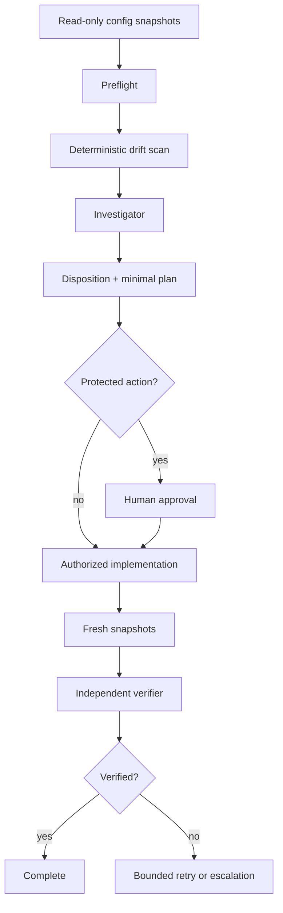

# Agent Environment Config Drift Reconciliation

Reusable AI engineering kit for detecting, investigating, safely reconciling, and independently verifying configuration drift between application environments.

## Problem
Applications often behave differently across development, staging, and production because configuration has diverged from its intended source of truth. Ad-hoc comparison is error-prone, can leak secrets, and can encourage unsafe direct production edits. This kit provides deterministic drift detection, evidence-driven investigation, bounded recovery, explicit approval boundaries, and independent post-change verification.

## Purpose
Use this package to answer four questions safely:
1. What configuration differs between environments?
2. Which differences are intentional versus unexplained drift?
3. What is the smallest safe reconciliation action?
4. What evidence proves the intended state after the change?

## When to use
- Before releases when environment parity matters.
- After incidents involving environment-specific behavior.
- After configuration, infrastructure, deployment, or secret rotation work.
- When staging succeeds but production fails, or vice versa.
- During periodic environment drift audits.

## When not to use
- As a secret-management system.
- As an automatic production configuration writer.
- For database schema comparison; use a schema/migration-specific workflow instead.
- When authoritative snapshots cannot be obtained safely.

## Architecture



The scanner never emits raw configuration values. Differences are represented using key names and SHA-256 fingerprints truncated to 16 hex characters.

## Package tree

```text
agent-environment-config-drift-reconciliation/
├── README.md
├── config/
│   └── drift-policy.json
├── schemas/
│   └── drift-report.schema.json
├── skills/
│   └── config-drift-analysis.md
├── rules/
│   └── config-drift-safety.md
├── subagents/
│   ├── config-drift-investigator.md
│   └── config-drift-verifier.md
├── workflows/
│   └── reconcile-config-drift.md
├── hooks/
│   ├── pre-reconcile.md
│   └── post-reconcile.md
├── scripts/
│   ├── scan-config-drift.py
│   └── verify-package.py
└── examples/
    ├── inventory.json
    ├── production.json
    └── staging.json
```

## Component responsibilities
- `config/drift-policy.json`: baseline environment, ignored keys, secret/risk patterns, approval patterns, and retry limits.
- `schemas/drift-report.schema.json`: structured output contract for deterministic drift reports.
- `skills/config-drift-analysis.md`: reusable investigation procedure and stop conditions.
- `rules/config-drift-safety.md`: enforceable MUST/MUST NOT/SHOULD safety boundaries.
- `subagents/config-drift-investigator.md`: evidence gathering, classification, and reconciliation planning.
- `subagents/config-drift-verifier.md`: independent post-change verification.
- `workflows/reconcile-config-drift.md`: full trigger-to-completion workflow with bounded retries and approval checkpoints.
- `hooks/pre-reconcile.md`: package/input validation and initial scan lifecycle hook.
- `hooks/post-reconcile.md`: fresh rescan and verification lifecycle hook.
- `scripts/scan-config-drift.py`: deterministic secret-safe scanner supporting JSON and `.env` snapshots.
- `scripts/verify-package.py`: package completeness, JSON validity, and README-reference verifier.
- `examples/inventory.json`: example environment inventory.
- `examples/production.json`: safe example production snapshot.
- `examples/staging.json`: safe example staging snapshot containing intentional sample differences.

## Installation
Copy this directory into the target repository. Python 3.10+ is the only runtime dependency for the included scripts; they use only the Python standard library.

Run from the package root:

```bash
python3 scripts/verify-package.py
```

## Configuration
Edit `config/drift-policy.json` before use:
- Set `baseline_environment` to the environment treated as the comparison baseline.
- Add non-semantic volatile keys to `ignored_keys`.
- Add organization-specific secret markers to `secret_key_patterns`.
- Add protected configuration patterns to `approval_required_patterns`.
- Tune `high_risk_patterns` and `medium_risk_patterns`.
- Keep retries bounded with `max_reconcile_attempts`.

Do not place secrets in the policy.

## Inventory contract
Create an inventory using the same shape as `examples/inventory.json`:

```json
{
  "environments": {
    "production": {"path": "production.json", "format": "json"},
    "staging": {"path": "staging.json", "format": "json"}
  }
}
```

Paths are resolved relative to the inventory file. Supported formats are `json` and `env`. JSON objects are flattened into dotted keys. `.env` files support blank lines, comments, `export KEY=value`, and `KEY=value`.

Use exported read-only snapshots. Never point this package at a mechanism that mutates the live environment.

## Permissions
Core analysis needs read-only access to:
- Configuration snapshots.
- Relevant repository files and deployment definitions.
- Optional audit/change history.

The package must not elevate its own permissions. Any production or protected mutation is performed only by an authorized operator or implementation mechanism after explicit approval.

## Usage
First validate package integrity:

```bash
python3 scripts/verify-package.py
```

Then run the example scan:

```bash
python3 scripts/scan-config-drift.py \
  --inventory examples/inventory.json \
  --policy config/drift-policy.json \
  --output drift-report.json
```

Exit codes:
- `0`: no drift detected.
- `1`: drift detected; continue to investigation.
- `2+`: invalid input or tool failure; block the workflow.

The included example intentionally returns drift because staging uses different logging and feature values.

## Example agent invocation

```text
Use skills/config-drift-analysis.md and rules/config-drift-safety.md.
Run the pre-reconcile hook with my read-only environment inventory.
Investigate every high-risk or approval-required finding using subagents/config-drift-investigator.md.
Separate facts, hypotheses, decisions, evidence, and open questions.
Propose the smallest source-of-truth reconciliation plan.
Stop before protected actions.
After an authorized change, hand fresh evidence to subagents/config-drift-verifier.md and execute the post-reconcile hook.
```

## Workflow
Follow `workflows/reconcile-config-drift.md`:

```text
Trigger
  -> Preflight
  -> Detect
  -> Investigate
  -> Plan
  -> Human approval when required
  -> Authorized execution
  -> Fresh snapshots
  -> Independent verification
  -> Complete or bounded escalation
```

The implementing actor must not be the only verifier for protected/high-risk work.

## Approval boundaries
Explicit human approval is required before:
- Any production configuration mutation when policy enables that protection.
- Secret changes.
- Authentication/authorization, OIDC, SAML, TLS, encryption, or security-control changes.
- Database connection changes.
- Schema/infrastructure changes discovered during remediation.
- Irreversible actions or changes that weaken controls.

The agent stops at the approval boundary. It does not silently increase permissions or patch production to make the report clean.

## Failure handling
- Invalid JSON/inventory: stop and correct input.
- Missing snapshot: block; obtain a safe read-only export.
- Transient read/tool failure: retry at most twice while preserving stderr.
- Permission failure: stop without elevation.
- Verification failure: preserve report/test evidence and retry reconciliation at most `max_reconcile_attempts` times.
- Repeated failure or new unexplained high-risk drift: escalate and stop.

## Verification
Verification is evidence-based, not equivalent to merely executing a change.

Required checks:
1. `scripts/verify-package.py` passes.
2. The initial scanner report is generated successfully.
3. Every high-risk finding has evidence and a disposition: `accept`, `reconcile`, or `investigate`.
4. Required approvals exist before protected actions.
5. The applied diff/receipt matches approved scope.
6. Fresh snapshots are collected after the change.
7. The scanner is rerun and residual findings are explained.
8. Relevant tests/build/runtime probes pass.
9. `subagents/config-drift-verifier.md` reports `verified` before completion.
10. No raw secret values appear in reports or committed artifacts.

`schemas/drift-report.schema.json` is the contract for scanner output. The scanner produces status `clean` or `drift-detected`; workflow-level investigation may additionally be blocked when required evidence or permission is unavailable.

## Definition of Done
The task is complete only when:
- Required context and fresh snapshots were gathered.
- Deterministic drift detection completed.
- Every high-risk finding has evidence and an explicit disposition.
- Required human approval was obtained before protected actions.
- Approved reconciliation was limited to intended scope.
- Post-change scan and relevant behavioral checks passed.
- Independent verification succeeded.
- Accepted environment-specific differences and remaining risks are documented.
- No blocking failure remains.

## Customization
- Replace example snapshots/inventory with repository-specific exported snapshots.
- Add organization-specific risk and approval patterns to `config/drift-policy.json`.
- Connect the pre/post hooks to CI, deployment verification, or incident workflows while keeping mutation permissions separate.
- Add project-specific test commands to the verification stage rather than embedding them in the scanner.
- Keep tool-specific agent adapters outside the core workflow so the package remains usable with Codex, Claude Code, Cursor, ChatGPT, Copilot, OpenCode, or other coding agents.
