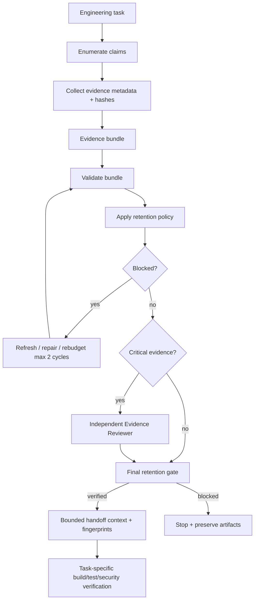

# Agent Evidence Retention Budget

A reusable, tool-neutral AI engineering kit for preserving enough evidence to verify, reproduce, review, and recover an engineering task without flooding agent context with every log, diff, test output, API response, database artifact, or research document.

## Problem
Long-running AI-assisted engineering workflows accumulate evidence faster than an agent can safely keep in active context. Ad-hoc truncation creates a second failure mode: important verification, failure, security, or approval evidence may disappear while verbose low-value output remains. Agents may then confuse remembered summaries with authoritative proof, re-fetch unrelated context repeatedly, or silently drop evidence needed to reproduce a decision.

This package treats context size as a deterministic evidence-retention problem rather than a prompt-writing problem.

## Purpose
The kit creates an explicit evidence bundle, maps claims to source artifacts, fingerprints every source, applies a configurable context budget, preserves mandatory proof at least as immutable reference metadata, excludes sensitive material from model context, requires independent review for critical retention decisions, and exposes a final fail-closed gate.

The core invariant is:

> Context may be reduced, but evidence required to prove a current `verified` or `blocked` claim must remain traceable to an exact source artifact and hash.

## When to use
Use when:
- agent workflows generate large build/test/E2E outputs;
- production investigations accumulate logs and traces;
- code review or architecture work spans many files;
- long-running agents checkpoint and resume;
- multiple agents hand off research/implementation/review context;
- evidence needs to survive context compaction;
- a task must stay auditable without embedding sensitive source content;
- context/token cost is becoming large enough to encourage arbitrary truncation.

## When not to use
Do not use this package as:
- a legal records-retention system;
- a backup/archive product;
- a replacement for repository-native artifact retention;
- a secret-management system;
- proof that the underlying engineering task itself is correct;
- authorization to delete production logs or source artifacts.

For small tasks with only a few short artifacts, the bundle may add unnecessary overhead.

## Architecture


## Package tree
```text
agent-evidence-retention-budget/
├── README.md
├── config/
│   └── evidence-retention-policy.json
├── examples/
│   └── evidence-review.example.json
├── hooks/
│   └── evidence-retention-hooks.md
├── rules/
│   └── evidence-retention-governance.md
├── schemas/
│   ├── evidence-bundle.schema.json
│   ├── evidence-record.schema.json
│   └── evidence-review.schema.json
├── scripts/
│   ├── apply-retention-policy.py
│   ├── evaluate-retention-gate.py
│   ├── hash-evidence-file.py
│   └── validate-evidence-bundle.py
├── skills/
│   ├── classify-and-budget-evidence.md
│   └── prune-and-preserve-evidence.md
├── subagents/
│   ├── evidence-curator.md
│   └── evidence-reviewer.md
├── templates/
│   └── evidence-bundle.example.json
├── tests/
│   └── smoke-test.py
└── workflows/
    └── evidence-retention-workflow.md
```

## Component responsibilities
- `skills/classify-and-budget-evidence.md`: creates claim/evidence mappings and a deterministic budget plan.
- `skills/prune-and-preserve-evidence.md`: reduces active context without deleting authoritative source proof.
- `rules/evidence-retention-governance.md`: enforceable safety, retry, sensitivity, and evidence rules.
- `subagents/evidence-curator.md`: owns inventory and budgeting; cannot self-approve critical plans.
- `subagents/evidence-reviewer.md`: independently verifies critical retention decisions.
- `workflows/evidence-retention-workflow.md`: bounded end-to-end workflow.
- `hooks/evidence-retention-hooks.md`: lifecycle gates for collection, validation, budgeting, review, approval, and final verification.
- `scripts/hash-evidence-file.py`: hashes a local evidence file without printing its content.
- `scripts/validate-evidence-bundle.py`: validates core bundle integrity and computes the bundle fingerprint.
- `scripts/apply-retention-policy.py`: deterministically assigns context modes within policy budget.
- `scripts/evaluate-retention-gate.py`: verifies current validation, current retention plan, reviewer independence, and approval boundaries.
- `config/evidence-retention-policy.json`: context budgets, sensitivity rules, freshness, review, retries, and dangerous actions.
- `schemas/*.json`: portable input/output contracts.
- `tests/smoke-test.py`: behavioral smoke test using Python standard library only.

## Dependencies
- Python 3.9+
- Python standard library only for included scripts/tests
- A durable location for authoritative evidence artifacts
- Repository/log/test/API/database tooling already used by the target project

No third-party Python package is required.

## Installation
Copy this directory into your repository or shared agent-tooling workspace. Keep relative paths unchanged or update workflow/hook commands consistently.

Run:
```bash
python tests/smoke-test.py
```

Expected output:
```text
smoke-test: PASS
```

## Configuration
Edit `config/evidence-retention-policy.json`.

### Budget
- `max_context_bytes`: maximum estimated evidence bytes loaded into active context.
- `max_full_items`: cap on full-content items.
- `max_summary_items`: cap on summary items.
- `summary_cost_bytes`: deterministic estimate used for one summary.
- `reference_cost_bytes`: deterministic estimate used for one metadata-only reference.

### Retention behavior
- `mandatory_types`: evidence types that should never silently disappear from the retention plan.
- `mandatory_claim_statuses`: claim states whose explicit required evidence must be preserved.
- `never_embed_sensitivity`: sensitivity classes that may only be represented by metadata/reference.
- importance preferences determine full/summary/reference priority.

### Freshness
`max_age_minutes_for_active_verification` limits how old mandatory evidence may be when it is actively used to support a current verification claim.

### Retry
- transient tool retry: max 1;
- validation retry: 0;
- rebudget cycles: max 2.

Do not increase the budget, reduce importance, lower sensitivity, or weaken freshness solely to force a blocked workflow green.

## Evidence model
Each evidence record includes:
- stable evidence ID;
- evidence type;
- source identity;
- observation timestamp;
- SHA-256 content hash;
- durable storage reference;
- estimated full-context cost;
- importance;
- sensitivity;
- claim mappings;
- optional traceable summary/facts.

The bundle also contains claims with statuses:
- `fact`
- `hypothesis`
- `decision`
- `executed`
- `verified`
- `blocked`
- `open`

This separation prevents an agent from promoting execution into verification.

## Retention modes
`apply-retention-policy.py` produces one mode for every evidence item:

- `keep-full`: full source content may be loaded if the caller chooses and source policy permits it.
- `keep-summary`: use the bundle's traceable summary plus immutable source reference/hash.
- `reference-only`: keep metadata/hash/reference but not content in model context.
- `exclude-context`: not loaded into current context; source still exists outside context.

This script never deletes the authoritative source artifact.

## Usage
### 1. Hash source evidence
For a local artifact:
```bash
python scripts/hash-evidence-file.py artifacts/test-output.txt \
  --storage-ref artifact://ci/run/123/test-output.txt \
  --output artifacts/test-output.metadata.json
```

The script prints only the SHA-256 hash, not evidence content.

For remote/provider evidence, obtain equivalent hash/reference metadata from a read-only adapter.

### 2. Create the bundle
Copy the template:
```bash
cp templates/evidence-bundle.example.json artifacts/evidence-bundle.json
```
Replace the example IDs/timestamps/hashes/references with real task evidence. Do not use the example hashes as proof.

### 3. Validate
```bash
python scripts/validate-evidence-bundle.py \
  --bundle artifacts/evidence-bundle.json \
  --policy config/evidence-retention-policy.json \
  --output artifacts/bundle-validation.json
```

A successful validation writes `status=verified` and `bundle_fingerprint`.

### 4. Apply the retention budget
```bash
python scripts/apply-retention-policy.py \
  --bundle artifacts/evidence-bundle.json \
  --validation artifacts/bundle-validation.json \
  --policy config/evidence-retention-policy.json \
  --output artifacts/retention-plan.json
```

The planner blocks if mandatory evidence is stale or if even minimum mandatory metadata cannot fit the configured context budget.

### 5. Independent review for critical evidence
When critical evidence exists, create `artifacts/evidence-review.json` following `schemas/evidence-review.schema.json` / `examples/evidence-review.example.json`.

The reviewer must bind the review to:
- current `bundle_fingerprint`;
- current `retention_fingerprint`;
- a reviewer identity different from the implementation owner when self-review is disabled.

### 6. Final gate
Without required critical review:
```bash
python scripts/evaluate-retention-gate.py \
  --bundle artifacts/evidence-bundle.json \
  --validation artifacts/bundle-validation.json \
  --retention artifacts/retention-plan.json \
  --policy config/evidence-retention-policy.json \
  --implementation-owner implementation-agent \
  --output artifacts/retention-gate.json
```

With critical review:
```bash
python scripts/evaluate-retention-gate.py \
  --bundle artifacts/evidence-bundle.json \
  --validation artifacts/bundle-validation.json \
  --retention artifacts/retention-plan.json \
  --policy config/evidence-retention-policy.json \
  --implementation-owner implementation-agent \
  --review artifacts/evidence-review.json \
  --output artifacts/retention-gate.json
```

Only `status=verified` permits the workflow to use the bounded retention plan as safe handoff evidence.

## Handoff contract
A downstream agent should receive:
- task ID and repository revision;
- relevant claims;
- evidence selected by the retention plan;
- reference-only metadata for non-loaded proof;
- bundle fingerprint;
- retention fingerprint;
- blockers/open questions;
- exact verification stage it owns.

Do not pass a prose-only summary that loses the fingerprints and source references.

## Approval boundaries
This package manages context representation, not destructive retention actions.

Explicit human approval is required before:
- deleting authoritative source evidence;
- weakening evidence-retention policy;
- removing audit/security artifacts;
- purging production logs;
- changing secrets or production configuration;
- or another dangerous action configured in `approval_required_actions`.

Normal dangerous engineering actions still retain their usual approval boundaries: production deployment, destructive SQL, schema/data deletion, force push/history rewrite, infrastructure changes, secret changes, breaking API changes, security weakening, irreversible migrations, and large dependency upgrades.

Agents must stop before these actions and must never silently increase permissions.

## Failure and recovery
### Transient source/tool failure
Preserve the first error and retry at most once.

### Validation failure
Do not retry automatically. Fix malformed/missing evidence metadata or block the affected claim.

### Stale mandatory evidence
Refresh only the evidence supporting the active verification claim. Do not widen freshness thresholds simply to pass.

### Context-budget failure
Try at most two rebudget cycles. Reduce duplicate/non-required active context or add a traceable summary when safe. Never delete authoritative source evidence or drop required metadata.

### Sensitive evidence
Keep prohibited sensitivity classes reference-only. If the task requires reading secret/credential content, use the appropriate security/secret workflow instead of bypassing this policy.

### Stale fingerprints
Any bundle change invalidates validation and retention fingerprints. Re-run validation/budgeting. Any retention-plan change invalidates critical review.

### Permission failure
Stop and escalate. Do not silently elevate permissions to fetch or delete evidence.

### Repeated failure
After bounded retries/rebudget cycles are exhausted, preserve artifacts and return blocked evidence instead of looping autonomously.

## Verification
Evidence-retention success requires:
1. bundle validation status is `verified`;
2. bundle fingerprint matches current bundle content;
3. retention plan status is `verified`;
4. retention plan is bound to the current bundle fingerprint;
5. estimated context use does not exceed policy;
6. mandatory evidence remains traceable by hash and storage reference;
7. prohibited sensitivity classes are not embedded;
8. stale mandatory active evidence is refreshed or the workflow blocks;
9. required critical review is independent and fingerprint-bound;
10. dangerous retention actions have explicit human approval;
11. final retention gate returns `verified`.

These checks prove retention/handoff integrity only. The underlying engineering task still needs its own build, tests, security checks, API/database verification, acceptance criteria, or operational validation.

## Definition of Done
- Problem/task scope is explicit.
- Claims are classified and mapped to real evidence.
- Source evidence has current hash/reference metadata.
- Bundle validation passes.
- Retention plan is within budget.
- Verification/failure/security/approval evidence is not silently lost.
- Sensitive source content is excluded according to policy.
- Retry/rebudget loops stayed within configured limits.
- Required independent review is current.
- Required human approvals exist before dangerous actions.
- Final gate is `verified`.
- Downstream task verification is recorded separately from retention success.
- No blocking evidence-integrity issue remains.

## Security and privacy
The package is deliberately metadata-first. Do not record secret values, credentials, access tokens, private keys, production connection strings, or personal-sensitive payloads in bundle summaries or examples. Use hashes, source identities, storage references, and minimally necessary non-sensitive facts.

A `storage_ref` should be an identifier/URI meaningful to your tooling; it must not itself contain credentials.

## Portability
The core workflow is independent of OpenAI Codex, Claude Code, Cursor, ChatGPT, GitHub Copilot, OpenCode, MCP hosts, CI systems, or custom agent runtimes.

Provider-specific adapters should only:
- collect read-only artifact metadata;
- compute/fetch hashes;
- resolve storage references;
- load the selected retention modes for the next agent stage.

They should not redefine the core claims, sensitivity rules, fingerprint semantics, or final-gate behavior.

## Customization
Tune budgets and evidence types to repository size and risk. Examples:
- incident workflows may prioritize failure/log/trace evidence;
- code-generation workflows may prioritize diff/build/test evidence;
- architecture workflows may prioritize decisions and repository evidence;
- multi-agent research may prioritize authoritative source/research evidence.

Keep these invariants stable:
- authoritative evidence remains outside arbitrary context truncation;
- every important claim is traceable;
- hashes/fingerprints detect drift;
- sensitive content is not embedded by default;
- retry/rebudget loops are bounded;
- critical retention decisions get independent review;
- deletion/retention weakening requires explicit approval;
- execution is not verification.
