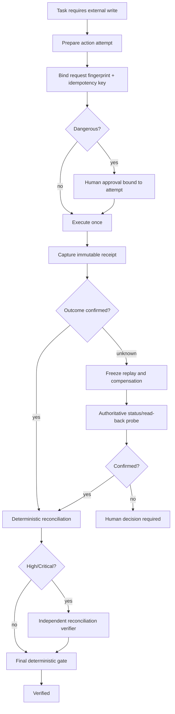

# Agent External Action Receipt Reconciliation

Reusable AI-engineering guard for external write-side effects whose caller may lose acknowledgement after the remote system has already accepted or completed the action.

## Problem
AI agents often call external APIs, cloud tools, queues, ticket systems, deployment endpoints, payment-like operations, or remote job schedulers. If the client times out or disconnects, the agent may incorrectly assume failure and retry. That can create duplicate jobs, duplicate messages, repeated deployments, duplicated tickets, double writes, or unsafe compensations.

A transport failure is not proof of business failure. This package converts uncertain side effects into an evidence-bound workflow using stable idempotency keys, request fingerprints, immutable receipts, authoritative read-back/status probes, bounded retries, independent high-risk review, and a deterministic final gate.

## Purpose
Guarantee that an agent does not replay, compensate, or claim verification for an external write until the actual external outcome has been reconciled.

## When to use
Use for remote mutations such as:
- REST/GraphQL/RPC writes.
- Cloud resource operations.
- Remote job submission.
- Message or event publication where duplicate delivery matters.
- Ticket/order/payment-like creation flows.
- Deployment/release requests.
- SaaS administration actions.
- Any tool call where a timeout can occur after the server accepted the operation.

## When not to use
Do not use for purely local deterministic edits, read-only API calls, or naturally idempotent operations whose repeated execution is provably harmless and whose result is immediately authoritative.

## Architecture


## Package tree
```text
agent-external-action-receipt-reconciliation/
├── README.md
├── config/
│   └── reconciliation-policy.json
├── schemas/
│   ├── action-attempt.schema.json
│   ├── action-receipt.schema.json
│   └── reconciliation-review.schema.json
├── scripts/
│   ├── fingerprint-attempt.py
│   ├── evaluate-reconciliation.py
│   └── verify-final-gate.py
├── skills/
│   ├── prepare-external-action.md
│   └── reconcile-uncertain-action.md
├── rules/
│   └── external-action-reconciliation-governance.md
├── subagents/
│   ├── external-action-coordinator.md
│   └── reconciliation-verifier.md
├── workflows/
│   └── external-action-reconciliation-workflow.md
├── hooks/
│   └── external-action-lifecycle-hooks.md
├── templates/
│   └── action-attempt.example.json
├── examples/
│   └── reconciliation-review.example.json
└── tests/
    └── smoke-test.py
```

## Component responsibilities
- **Policy** defines retry, replay, high-risk verification, and approval boundaries.
- **Schemas** define stable handoff contracts for attempts, receipts, and reviews.
- **Fingerprint script** binds review/approval to the material action identity.
- **Reconciliation evaluator** classifies ordered receipts and fails closed while outcome remains unknown.
- **Final gate** requires resolved evidence, high-risk independent review, and dangerous-action approval.
- **Skills** provide reusable agent procedures for preparation and recovery.
- **Rules** make unsafe replay/compensation behavior explicitly forbidden.
- **Subagents** separate execution coordination from independent verification.
- **Workflow/hooks** turn the package into an operational lifecycle instead of an ad-hoc prompt.
- **Smoke test** validates important deterministic branches without network access.

## Dependencies
- Python 3.9+.
- Python standard library only for package scripts/tests.
- The host repository's external API/tool client.
- An authoritative external status/read-back capability appropriate to the integration.

No third-party Python package is required by the core guard.

## Permissions
Use least privilege. The coordinator needs only the specific external write permission plus read-only status access. The verifier should normally need read-only status/repository access only.

Never silently broaden permissions. Permission failure is not a transient reconciliation failure.

## Installation
Copy this directory into the target repository, preserve its relative paths, and adapt `config/reconciliation-policy.json` only where the provider's documented behavior requires it.

The runtime `artifacts/` directory referenced below is produced by the workflow and is intentionally not part of this package.

## Configuration
Default policy:
- One transient retry maximum for a read-only status probe.
- Zero automatic write replays while the outcome is unknown.
- Idempotency key and request fingerprint required.
- Status/read-back required for unknown results.
- Independent verifier required for high/critical risk.
- Dangerous actions require explicit human approval.

Do not weaken these defaults merely to make a blocked workflow pass.

## Core concepts
### Logical action
One intended external mutation against one identified target.

### Idempotency key
A stable key reused only for the exact same logical request. A lost response must not cause generation of a new key for the same action.

### Request fingerprint
SHA-256 over canonical material request fields. It proves that a reused idempotency key still refers to the same request.

### Receipt
Immutable evidence from either the original write transport/result or an authoritative status probe.

### Outcome
- `confirmed-success`
- `confirmed-failure`
- `unknown`

Timeout, disconnect, missing acknowledgement, and ambiguous tool error map to `unknown` unless separate authoritative evidence proves the business outcome.

## Usage
### 1. Prepare the attempt
Create `artifacts/action-attempt.json` following `schemas/action-attempt.schema.json` and `templates/action-attempt.example.json`.

Calculate the attempt fingerprint:
```bash
python3 scripts/fingerprint-attempt.py artifacts/action-attempt.json \
  --output artifacts/action-fingerprint.json
```

### 2. Approval before dangerous execution
If `dangerous_action=true`, obtain explicit approval for the exact attempt fingerprint before invoking the external write.

### 3. Execute once and capture receipt
Write `artifacts/action-receipt-001.json` according to `schemas/action-receipt.schema.json`.

If the call times out, the receipt must use:
```json
{
  "transport_status": "timeout",
  "outcome": "unknown"
}
```
Do not replay yet.

### 4. Reconcile unknown outcome
Perform the authoritative read-only status/read-back probe and save another receipt with `transport_status=status-probe`.

Evaluate:
```bash
python3 scripts/evaluate-reconciliation.py \
  artifacts/action-attempt.json \
  artifacts/action-receipt-001.json \
  artifacts/action-receipt-002.json \
  --policy config/reconciliation-policy.json \
  --output artifacts/reconciliation.json
```

### 5. Independent review for high/critical risk
Create `artifacts/reconciliation-review.json` matching `schemas/reconciliation-review.schema.json` and bind it to the exact attempt fingerprint.

The original action executor must not be the only high-risk verifier.

### 6. Final gate
Low/medium, non-dangerous example:
```bash
python3 scripts/verify-final-gate.py \
  artifacts/action-attempt.json \
  artifacts/reconciliation.json \
  --policy config/reconciliation-policy.json \
  --output artifacts/final-gate.json
```

High-risk dangerous example:
```bash
python3 scripts/verify-final-gate.py \
  artifacts/action-attempt.json \
  artifacts/reconciliation.json \
  --policy config/reconciliation-policy.json \
  --review artifacts/reconciliation-review.json \
  --approval artifacts/approval.json \
  --output artifacts/final-gate.json
```

Only `status=verified` proves reconciliation completion.

## Approval boundaries
Explicit human approval is required before dangerous actions including production deployment, destructive SQL/data changes, schema changes, infrastructure/secret changes, production configuration, breaking public contracts, irreversible migrations, force push/history rewriting, and similarly high-impact external mutations.

A retry or compensation that is itself dangerous is a new approval-bound action. Previous approval does not automatically authorize a materially changed request.

## Failure and recovery
### Transient status-probe failure
Preserve evidence and retry the read-only probe once.

### Validation failure
Zero automatic retries. Fix the contract or input first.

### Permission failure
Zero automatic retries. Stop; do not widen permissions.

### Unknown after bounded reconciliation
Return `human-decision-required`. Do not replay or compensate automatically.

### Contradictory receipts
Stop and require human decision. Never select the more convenient receipt.

### Confirmed failure
The original attempt is terminally failed. A later retry must be an explicit new decision using provider-safe idempotency semantics, not an automatic continuation of the unknown attempt.

## Verification model
`Task executed` means the write call was invoked.

`Task reconciled` means authoritative evidence established success or failure.

`Task verified successfully` means:
- reconciliation is terminal;
- receipts bind the exact attempt;
- high/critical risk has independent review;
- dangerous action has exact approval evidence;
- final gate returns `verified`.

These states are intentionally distinct.

## Retry and stop conditions
- External write replay while unknown: **0**.
- Read-only status probe transient retry: **1 maximum**.
- Permission/validation failure: **0**.
- Unknown after bounded probe: **stop**.
- Contradictory evidence: **stop**.
- Missing required approval/review: **stop**.

There are no infinite loops.

## Run smoke tests
```bash
python3 tests/smoke-test.py
```

The smoke test is local, stdlib-only, and validates:
- timeout produces a nonterminal `needs-probe` state;
- authoritative success probe resolves to `accept-success`;
- medium-risk resolved action passes final gate;
- high-risk action without independent review is blocked.

## Definition of Done
- The external action was pre-registered before execution.
- Idempotency key and request fingerprint identify one logical request.
- Every invocation/probe has an immutable receipt.
- No unknown action was blindly replayed or compensated.
- Terminal outcome is supported by authoritative evidence.
- High/critical outcome has independent review.
- Dangerous action has exact human approval evidence.
- Final gate returns `verified`.
- Remaining uncertainty is documented as blocking rather than hidden.

## Portability
The core contracts and workflow are tool-neutral and can be used with Codex, Claude Code, Cursor, ChatGPT, GitHub Copilot, OpenCode, custom agents, CI runners, or orchestration frameworks.

Provider-specific behavior belongs in the host integration and policy configuration. Do not claim idempotency/status capabilities that the provider does not document or expose.

## Customization
Safe customization points:
- provider-specific target/resource identifiers;
- canonical request fields used to calculate `request_fingerprint`;
- authoritative status/read-back adapter;
- risk classification rules;
- stricter independent-review requirements.

Do not customize by enabling blind replay while `unknown`, allowing compensation before reconciliation, or weakening dangerous-action approval boundaries.
