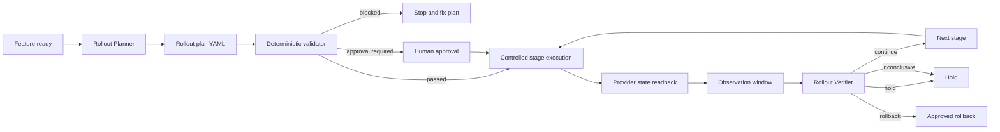

# Agent Feature Flag Rollout Safety Gate

A reusable AI-engineering package for planning, validating, observing, and verifying progressive feature-flag rollouts without giving the planning or verification agent direct production mutation authority.

## Problem
Feature flags reduce deployment risk only when rollout is actually bounded. AI coding and operations agents can otherwise turn a safe-looking flag into a large blast radius by starting at 100%, skipping observation time, using vague success criteria, continuing while telemetry is unavailable, reusing stale approval, or forgetting rollback and flag expiry. This kit converts rollout intent into a deterministic, reviewable contract before any provider state change.

## Purpose
Use structured agent behavior for context gathering and risk analysis, deterministic validation for mechanical safety rules, explicit human approval for protected transitions, provider readback after state changes, and independent telemetry verification before progression.

The validator never calls a feature-flag provider and never changes a flag. Production mutation remains outside the package and should be performed by a separate controlled operator or platform integration with least privilege.

## When to use
Use for new features, risky refactors, model/provider switches, performance changes, migration paths, new integrations, configuration behavior, or any release where a flag controls production exposure.

## When not to use
Do not use this package as a replacement for your feature-flag platform, access-control system, deployment pipeline, incident response process, or observability stack. Do not create a flag merely to avoid fixing an unsafe fallback. Emergency incident rollback may use a separately approved break-glass process, but evidence and readback should still be preserved.

## Architecture



## Package tree

```text
agent-feature-flag-rollout-safety-gate/
├── README.md
├── config/
│   └── policy.yaml
├── examples/
│   ├── safe-rollout.yaml
│   └── unsafe-rollout.yaml
├── hooks/
│   └── lifecycle.md
├── rules/
│   └── feature-flag-safety.md
├── schemas/
│   └── rollout-result.schema.json
├── scripts/
│   ├── validate_rollout.py
│   └── verify_package.py
├── skills/
│   ├── rollout-planning.md
│   └── rollout-verification.md
├── subagents/
│   ├── rollout-planner.md
│   └── rollout-verifier.md
├── templates/
│   └── rollout-plan.yaml
├── tests/
│   └── test_validate_rollout.py
└── workflows/
    └── progressive-rollout.md
```

## Component responsibilities
`skills/rollout-planning.md` gathers repository, flag, cohort, fallback, and telemetry context and turns it into a bounded plan. `skills/rollout-verification.md` independently determines whether the current stage may continue, hold, or roll back. `rules/feature-flag-safety.md` defines enforceable boundaries. `subagents/rollout-planner.md` and `subagents/rollout-verifier.md` separate planning from runtime verification. `workflows/progressive-rollout.md` defines the bounded end-to-end loop. `hooks/lifecycle.md` identifies deterministic lifecycle gates. `scripts/validate_rollout.py` validates plan structure and policy without executing a rollout. `scripts/verify_package.py` checks package completeness. `config/policy.yaml` contains portable rollout safety limits. `schemas/rollout-result.schema.json` defines the validator output contract.

## Installation
Requires Python 3.9+ and PyYAML.

```bash
python -m pip install pyyaml
```

Copy this directory into the repository that owns the feature or into a shared engineering-agent library. Keep provider-specific mutation code outside the core package.

## Configuration
Edit `config/policy.yaml` to match organizational policy. The default policy requires a kill switch, owner, expiry within 90 days, rollback plan, observability, `error_rate` and `latency` metrics, at least five minutes per stage, an initial percentage no larger than 10%, percentage steps no larger than 50 points, canary exposure before full rollout, and approval for production and 100% exposure.

`production_environment_names` lets the validator recognize environment aliases. `allowed_target_types` restricts plan targeting to percentage, user, tenant, region, or internal cohorts. Do not let agents rewrite this policy simply because a plan fails validation.

## Rollout plan contract
Start from `templates/rollout-plan.yaml`. A plan includes the flag key, owner, service, environment, expiry, kill-switch confirmation, risk summary, rollback trigger/action, metrics with abort thresholds, and ordered rollout stages. Percentage stages must increase monotonically. Every stage requires an observation duration and success criteria.

The validator intentionally does not attempt to interpret natural-language thresholds such as `p95 greater than 500 ms`. Your observability adapter or verifier must evaluate those criteria against real telemetry. This separation keeps deterministic structural policy simple while leaving domain-specific metric evaluation to the runtime verification layer.

## Usage
Validate a staging plan:

```bash
python scripts/validate_rollout.py \
  --plan examples/safe-rollout.yaml \
  --policy config/policy.yaml \
  --output rollout-result.json
```

Exit codes are:

- `0`: `passed` — structurally allowed by policy; no flag state was changed.
- `2`: `blocked` — one or more policy findings must be fixed.
- `4`: `approval_required` — the plan is structurally valid but a protected transition requires human authorization.
- `3`: validator/configuration/tool error.

The output always contains `executed: false` because the validator has no feature-flag mutation capability.

Validate the intentionally unsafe example:

```bash
python scripts/validate_rollout.py \
  --plan examples/unsafe-rollout.yaml \
  --policy config/policy.yaml
```

It is expected to block because it lacks a kill switch and valid rollback plan, omits a required latency metric, uses an excessive expiry, starts at 100%, and uses too short an observation duration.

## Example agent invocation
Give the planning agent the feature request, repository context, `rules/feature-flag-safety.md`, `skills/rollout-planning.md`, the template, and read-only access to flag state and telemetry definitions. Require it to save a plan and run the validator. If the validator returns `approval_required`, the agent stops and produces the exact plan for approval rather than mutating the provider.

After an authorized operator changes a stage, give the verifier the exact validated plan, provider readback, activation timestamp, and telemetry window. The verifier follows `skills/rollout-verification.md` and returns only one progression decision: `continue`, `hold`, `rollback`, or `inconclusive` with evidence.

## Permissions
The Rollout Planner should have repository read/write access only as needed to create plan artifacts, read-only flag-provider access, read-only observability access, and test/build execution. The Rollout Verifier should have read-only provider and telemetry access. Neither role needs production flag mutation permission. Production stage changes should be delegated to a human or a narrowly scoped deployment integration that validates the approved artifact.

Never increase permissions to resolve a validator, provider, or telemetry failure.

## Approval boundaries
Explicit human approval is required when configured for production activation and 100% rollout. Separate explicit approval is also required before deleting a flag, removing fallback code, weakening a security control, performing irreversible cleanup, or changing production/infrastructure configuration outside the flag provider.

Approval must reference the exact plan and environment. A material plan change invalidates previous validation and approval.

## Workflow
The complete procedure is defined in `workflows/progressive-rollout.md`. Each stage follows: context → plan → validate → approval checkpoint → controlled mutation → provider readback → minimum observation window → independent verification. The loop is bounded by the number of stages in the validated plan and the policy maximum of eight stages; there is no infinite autonomous progression.

## Failure and recovery
Validation findings may be corrected and retried at most twice without policy relaxation. Transient provider or telemetry read failures may be retried once. Missing telemetry results in `inconclusive`, never implicit continuation. A threshold breach produces `hold` or `rollback` according to the approved rollback plan. A failed rollback stops autonomous activity, preserves evidence, and escalates. A mismatch between provider readback and the approved stage blocks progression.

## Verification
Run package tests and integrity checks:

```bash
python -m unittest tests/test_validate_rollout.py
python scripts/verify_package.py
```

For a real rollout, code/test success is not enough. Verification also requires actual provider state readback, completion of the minimum observation window, evidence for every required metric and success criterion, correct approval state, and an independent verifier decision.

## Output contract
`schemas/rollout-result.schema.json` describes validator results with `passed`, `blocked`, or `approval_required`. Blocking findings identify a code, message, and optional plan path. Approval requirements identify the protected transition. `validated: true` means the validator completed; `executed: false` makes clear that validation did not change a flag.

## Definition of Done
A rollout is verified successfully only when the exact plan was validated; target environment, owner, expiry, fallback, and rollback are known; required approvals exist; each executed stage matches provider readback; every minimum observation period elapsed; all required metrics and success criteria were evaluated; no unresolved blocking threshold breach remains; independent verification completed; final flag state matches the approved plan; and cleanup/follow-up risk is documented.

A generated plan, a passing validator result, or a provider mutation alone is not proof of completion.

## Portability
The package is tool-neutral. It can be used with OpenAI Codex, Claude Code, Cursor, ChatGPT, GitHub Copilot, OpenCode, or other agents. Provider-specific integrations for LaunchDarkly, Azure App Configuration, Unleash, ConfigCat, home-grown flags, or deployment systems should be added outside the core workflow as narrow adapters that expose readback and controlled mutation while preserving the same approval boundaries.

## Customization
Adjust metric names, expiry limits, stage duration, target types, and percentage rules in `config/policy.yaml`. Add organization-specific business metrics to `required_metrics` when they can be consistently evaluated. For stronger automation, build a provider adapter that consumes an approved rollout plan and changes only the requested stage, then returns authoritative readback. Keep production credentials in that adapter or secret store, never in prompts, plans, examples, or repository files.
