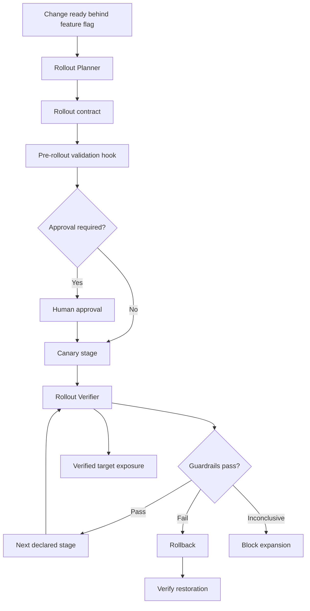

# Agent Feature Flag Rollout Verifier

A reusable AI engineering kit for planning, validating, and verifying progressive feature-flag rollouts with explicit guardrails, bounded retries, rollback readiness, and human approval at production risk boundaries.

## Problem
Feature flags reduce deployment risk only when exposure changes are controlled. Ad-hoc rollout decisions can expand a broken path, hide missing fallback coverage, or treat deployment success as product correctness.

## Purpose
This package turns a feature-flag rollout into an evidence-based workflow: discover both code paths, classify risk, define rollout stages and telemetry guardrails, validate the contract deterministically, require approvals for dangerous transitions, independently verify each stage, and stop or roll back on failure.

## When to use
Use when enabling a new flagged behavior, increasing exposure, changing target cohorts, validating a canary, or preparing a production rollout.

## When not to use
Do not use this package as a substitute for deployment orchestration, schema-migration safety, incident response, or feature-flag provider administration. It intentionally does not grant itself production write access.

## Architecture



## Package tree

```text
agent-feature-flag-rollout-verifier/
├── README.md
├── config/
│   └── rollout-policy.yaml
├── examples/
│   └── sample-rollout.json
├── hooks/
│   └── pre-rollout.md
├── rules/
│   └── rollout-safety.md
├── schemas/
│   └── rollout-contract.schema.json
├── scripts/
│   └── validate-rollout.py
├── skills/
│   ├── plan-rollout.md
│   └── verify-rollout.md
├── subagents/
│   ├── rollout-planner.md
│   └── rollout-verifier.md
├── tests/
│   └── test-validator.sh
└── workflows/
    └── progressive-rollout.md
```

## Components
- `skills/plan-rollout.md` defines the planning procedure and output contract.
- `skills/verify-rollout.md` defines independent stage verification.
- `rules/rollout-safety.md` contains enforceable MUST/MUST NOT/SHOULD behavior.
- `subagents/rollout-planner.md` owns risk analysis and plan construction.
- `subagents/rollout-verifier.md` independently evaluates rollout evidence.
- `workflows/progressive-rollout.md` defines the complete bounded rollout loop.
- `hooks/pre-rollout.md` blocks rollout until deterministic validation succeeds.
- `scripts/validate-rollout.py` checks rollout contracts against policy.
- `config/rollout-policy.yaml` centralizes retry, risk, approval, and required-check policy.
- `schemas/rollout-contract.schema.json` documents the structured handoff contract.
- `examples/sample-rollout.json` is a runnable example.
- `tests/test-validator.sh` proves the validator accepts a safe contract and rejects an unsafe initial exposure.

## Installation
Requirements:
- Python 3.9+
- PyYAML
- Bash for the included shell test

Install the only Python dependency:

```bash
python -m pip install pyyaml
```

Copy this package into your repository or agent-instruction directory. Keep its relative paths unchanged unless you update references consistently.

## Configuration
Edit `config/rollout-policy.yaml` to match your organization. In particular, review:
- Initial rollout limits per risk level.
- Approval-required actions.
- Required preflight checks.
- Maximum retry count.

Do not weaken production or security approval boundaries merely to make automation proceed.

## Permissions
Recommended agent permissions:
- Read repository files and tests.
- Run local build/test commands.
- Read feature-flag state.
- Read telemetry/logs.
- Write rollout artifacts in the working repository.

Production feature-flag writes should remain human-operated or explicitly approved through a separate least-privilege integration.

## Usage
1. Read `rules/rollout-safety.md`.
2. Have the Rollout Planner follow `skills/plan-rollout.md`.
3. Create a rollout contract based on `examples/sample-rollout.json`.
4. Validate it:

```bash
python scripts/validate-rollout.py \
  --contract examples/sample-rollout.json \
  --policy config/rollout-policy.yaml
```

5. Run the package self-test:

```bash
bash tests/test-validator.sh
```

6. Follow `workflows/progressive-rollout.md` for canary, observation, expansion, rollback, and final verification.
7. Use the Rollout Verifier for every stage decision.

## Example invocation

```text
Use agent-feature-flag-rollout-verifier for flag checkout-v2.
Target environment: staging.
Requested exposure: 25%.
Map all flag evaluations, classify risk, define measurable guardrails and rollback conditions, produce a rollout contract, validate it, and stop before any approval-required action.
```

## Workflow behavior
The workflow uses a bounded Observe → Decide → Expand cycle. A stage can progress only when current evidence passes declared guardrails. Transient tool failures may be retried at most twice. Validation failures, test failures, or guardrail breaches require changed evidence or remediation rather than blind retry.

## Approval boundaries
Explicit human approval is required before:
- Production flag enablement.
- Rollout above 25%.
- Security-sensitive paths.
- Breaking-contract paths.
- Irreversible data paths.

Separate approval is also required for destructive SQL, schema changes, secret changes, production configuration changes, infrastructure changes, data deletion, force push/history rewriting, security weakening, or other dangerous actions outside the flag rollout itself.

## Failure handling
- **Transient tool/telemetry failure:** preserve output and retry at most twice.
- **Contract validation failure:** block; correct the contract or policy mismatch.
- **Build/test failure:** block rollout; fix or revert before re-evaluation.
- **Guardrail breach:** stop expansion and execute the approved rollback path.
- **Inconclusive evidence:** block expansion rather than assuming success.
- **Permission failure:** do not escalate privileges automatically; request human intervention.
- **Rollback failure:** stop all progression and escalate as high severity.

## Verification
A rollout is not successful merely because a flag was changed. Verification requires:
- The contract validates against policy.
- Both flag-off and flag-on paths are tested.
- Baseline evidence exists.
- Rollback readiness is verified.
- Current provider state matches the declared stage.
- Every required guardrail has current evidence.
- No blocking test or guardrail failed.
- Required approvals are recorded.
- Final status is `verified`.

## Definition of Done
The package workflow is complete only when the requested target exposure is reached, each stage has passing evidence, the actual flag state matches the contract, rollback readiness was proven, all required approvals exist, no guardrail remains breached or unknown, unresolved risks are documented, and final verification status is `verified`.

## Customization
You may add provider-specific adapters or organization-specific telemetry queries, but keep provider write operations isolated from core planning/verification logic. Preserve the structured contract, bounded retries, independent verifier, and approval boundaries so the package remains portable across OpenAI Codex, Claude Code, Cursor, ChatGPT, GitHub Copilot, OpenCode, and other coding-agent environments.
