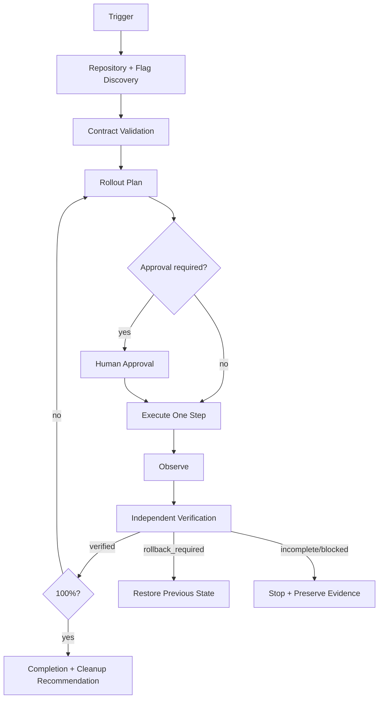

# Agent Feature Flag Safe Rollout Gate

A reusable AI engineering kit for planning, executing, and independently verifying feature-flag rollouts without treating configuration mutation as proof of success.

## Problem
Feature flags reduce deployment risk only when ownership, defaults, targeting, rollback, observability, and cleanup are disciplined. Common failures include production defaults being enabled too early, percentage rollout expanding faster than telemetry can prove safety, targeting rules silently broadening, kill switches disappearing, stale flags accumulating, and AI agents claiming success immediately after changing configuration.

## Purpose
This package gives coding/operations agents a bounded workflow with deterministic validation, repository scanning, explicit approval boundaries, preserved rollback state, and independent verification.

## When to use
Use when introducing a flag, changing its default, changing targeting, increasing rollout percentage, reviewing an existing rollout, or preparing flag cleanup after full exposure.

## When not to use
Do not use it as a deployment system, a feature-flag provider SDK, or a substitute for production observability. It does not grant permission to mutate production configuration.

## Architecture



## Package tree

```text
agent-feature-flag-safe-rollout-gate/
├── README.md
├── config/
│   └── rollout-policy.json
├── schemas/
│   └── flag-contract.schema.json
├── scripts/
│   ├── scan-feature-flags.py
│   └── validate-flags.py
├── skills/
│   ├── inspect-feature-flag-rollout.md
│   └── verify-rollout-state.md
├── rules/
│   └── rollout-safety-rules.md
├── subagents/
│   ├── rollout-planner.md
│   ├── rollout-executor.md
│   └── rollout-verifier.md
├── workflows/
│   └── safe-rollout-workflow.md
├── hooks/
│   ├── pre-rollout-validation.md
│   └── post-rollout-verification.md
├── templates/
│   └── rollout-report.json
├── examples/
│   └── example-flag.json
└── tests/
    └── test_validate_flags.py
```

## Component responsibilities
- `config/rollout-policy.json`: portable safety policy, allowed percentage steps, blocking conditions, and approval boundaries.
- `schemas/flag-contract.schema.json`: structured contract for flags and verification metrics.
- `scripts/validate-flags.py`: deterministic contract and production-approval validation.
- `scripts/scan-feature-flags.py`: repository scanner for likely flag/provider usage points.
- `skills/inspect-feature-flag-rollout.md`: evidence-gathering and rollout-assessment procedure.
- `skills/verify-rollout-state.md`: independent verification procedure.
- `rules/rollout-safety-rules.md`: enforceable MUST/MUST NOT/SHOULD rules.
- `subagents/*`: separated planning, execution, and verification ownership.
- `workflows/safe-rollout-workflow.md`: bounded end-to-end rollout loop.
- `hooks/*`: deterministic blocking lifecycle gates.
- `templates/rollout-report.json`: structured handoff/report shape.
- `tests/test_validate_flags.py`: executable smoke tests for the validator.

## Dependencies
Python 3.9+ is sufficient for the included scripts. No third-party Python packages are required. Your project still needs its own feature-flag provider, telemetry, test, and build tooling.

## Installation
Copy this directory into the target repository. Keep the core instructions tool-neutral. If your repository uses a specific provider, add provider-specific commands only in local configuration or orchestration; do not weaken the rules.

## Configuration
Edit `config/rollout-policy.json` when your organization requires different approved rollout steps or approval boundaries. Keep retry counts bounded. Provide each flag through a JSON contract compatible with `schemas/flag-contract.schema.json`.

The example contract is `examples/example-flag.json`.

## Permissions
The Planner and Verifier should operate read-only. The Executor receives only the minimum provider/config permission needed for the explicitly approved mutation. Never increase permissions automatically to overcome a failure.

## Usage

Discover likely flag locations:

```bash
python scripts/scan-feature-flags.py . --json-out rollout-scan.json
```

Validate a staging contract:

```bash
python scripts/validate-flags.py examples/example-flag.json --environment staging
```

Validate a production action that requires recorded approval:

```bash
python scripts/validate-flags.py flag.json --environment production --approval-file approval.json
```

Run validator tests:

```bash
python tests/test_validate_flags.py
```

Then execute `workflows/safe-rollout-workflow.md` with the planner, executor, and independent verifier roles.

## Example invocation

Use the package with an AI coding/operations agent by supplying:
- repository root,
- target flag contract,
- target environment,
- current provider/config state,
- acceptance criteria,
- available metrics/logs/traces,
- and approval artifact only when approval has actually been granted.

The agent should first execute `skills/inspect-feature-flag-rollout.md`, not mutate production.

## Workflow guarantees
The workflow performs one rollout step at a time. Each mutation preserves the previous known-good state, pauses for evidence, and must pass independent verification before further expansion. Read-only transient failures may be retried twice. Mutations are never blindly retried when outcome is ambiguous.

## Approval boundaries
Explicit human approval is required before:
- production rollout above 25%,
- changing a production default to enabled,
- removing/bypassing a kill switch,
- breaking API contracts,
- weakening security controls,
- deployment, infrastructure, secret, destructive data, or irreversible migration actions that become part of a rollout.

Agents stop before these actions if approval is absent.

## Failure handling
- Missing owner, kill switch, metrics, stale flag, invalid rollout step, or unapproved restricted production state: validation failure; do not retry without changed input.
- Telemetry/provider read transient failure: retry at most twice, preserving evidence.
- Permission failure: stop immediately; do not escalate privileges automatically.
- Ambiguous mutation result: fetch actual state and stop exposure growth; retry only if the previous attempt is proven not to have applied.
- Rollback threshold exceeded: stop expansion and move to the preserved previous state using the approved rollback path.
- Missing evidence: return `verification_incomplete`, never `verified`.

## Verification
Success is evidence-based. A rollout step is verified only when:
1. actual provider/config state matches declared state;
2. targeting and percentage are no broader than approved;
3. kill switch remains available;
4. every success metric passes;
5. every rollback condition is evaluated and remains false;
6. no unintended flag/config changes occurred;
7. required approval exists for restricted actions.

Configuration mutation alone means **task executed**, not **task verified successfully**.

## Definition of Done
The package considers the rollout complete only when:
- relevant repository evaluation points were inspected;
- flag contract validation passes;
- all production mutations had required approval;
- bounded rollout checkpoints were followed;
- independent verification passes at the final state;
- no blocking rollback condition remains;
- previous state/rollback evidence is preserved through the required rollback window;
- stale/temporary flag cleanup is explicitly recommended and remaining risks are documented.

## Customization
You may add provider adapters, organization-specific telemetry commands, or repository-specific hooks. Keep provider logic isolated from the core workflow, preserve the independent verifier, keep retry loops bounded, and do not weaken approval or production-safety rules merely to unblock automation.
