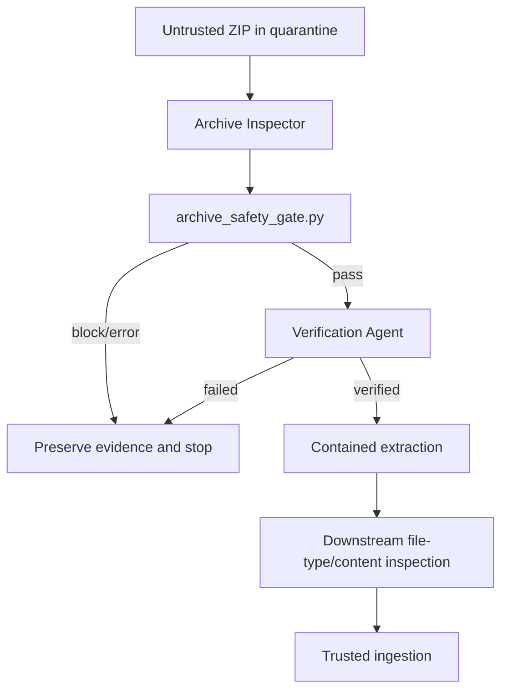

# Agent File Upload Archive Extraction Safety Gate

Reusable security kit for AI agents and applications that receive untrusted ZIP archives and must prevent path traversal, unsafe links, duplicate normalized paths, decompression bombs, oversized entries, and accidental extraction into trusted locations.

## Problem
Archive upload workflows often validate file extension or ZIP readability but then extract attacker-controlled paths and sizes. An archive can be structurally valid while containing `../` traversal, absolute paths, link entries, normalized-name collisions, extreme compression ratios, or enough expanded data to exhaust disk/memory. AI coding agents can amplify this risk when they download and automatically inspect artifacts.

## Purpose
Put a deterministic safety gate before extraction, separate inspection from verification, preserve evidence for failures, and require approval before weakening security boundaries.

## When to use
Use for customer ZIP imports, build artifacts from untrusted sources, plugin/theme bundles, support attachments, AI-agent downloads, repository snapshots, or any workflow that extracts archive contents.

## When not to use
This package is not a malware detector and currently implements ZIP-specific structural validation. Add file-type and malware scanning after structural validation when required by the threat model.

## Architecture


## Package tree
```text
agent-file-upload-archive-extraction-safety-gate/
├── README.md
├── config/
│   └── archive-policy.yaml
├── hooks/
│   └── lifecycle.md
├── rules/
│   └── archive-safety.md
├── schemas/
│   └── scan-result.schema.json
├── scripts/
│   ├── archive_safety_gate.py
│   └── verify_package.py
├── skills/
│   ├── archive-threat-assessment.md
│   └── safe-extraction.md
├── subagents/
│   ├── archive-inspector.md
│   └── verification-agent.md
├── templates/
│   └── incident-report.md
├── tests/
│   └── test_archive_safety_gate.py
└── workflows/
    └── archive-upload-safety.md
```

## Component responsibilities
- `scripts/archive_safety_gate.py`: deterministic ZIP inspection and contained extraction.
- `config/archive-policy.yaml`: limits and structural rules.
- `schemas/scan-result.schema.json`: machine-readable result contract.
- `skills/`: investigation and extraction procedures.
- `subagents/`: independent inspection and verification ownership.
- `rules/archive-safety.md`: enforceable safety boundaries.
- `workflows/archive-upload-safety.md`: bounded end-to-end lifecycle with retry and approval rules.
- `hooks/lifecycle.md`: integration points before scan, extraction, and completion.
- `tests/`: regression coverage for traversal, collisions, limits, and safe extraction.

## Dependencies
Python 3.9+ is sufficient with default limits. `PyYAML` is required when loading `config/archive-policy.yaml`:

```bash
python -m pip install pyyaml
```

No archive content is executed.

## Configuration
Tune `config/archive-policy.yaml` to infrastructure and business limits. Defaults block archives over 100 MiB, more than 1,000 entries, over 512 MiB total expanded size, entries over 100 MiB, compression ratio above 100:1, links, absolute paths, traversal, and normalized-path collisions.

Do not raise limits merely to make a failing upload pass. Treat material production policy weakening as an approval-required change.

## Permissions
The scanner needs read access to quarantined archives. Extraction requires write access only to an isolated destination. It should not have write access to application binaries, configuration, secrets, deployment directories, or production-served roots.

## Usage
Scan without extraction:

```bash
python scripts/archive_safety_gate.py incoming.zip \
  --policy config/archive-policy.yaml \
  --output scan-result.json
```

Exit codes:
- `0`: pass
- `2`: deterministic policy block
- `3`: scanner/tool error

Extract only when the same gate passes:

```bash
python scripts/archive_safety_gate.py incoming.zip \
  --policy config/archive-policy.yaml \
  --extract-to ./quarantine/extracted
```

The extractor recomputes each target path and refuses a target that resolves outside the extraction root.

## Example agent invocation
Tell the Archive Inspector:

> Inspect `incoming.zip` using this package. Do not extract before the deterministic gate passes. Return facts, scanner evidence, violations, confidence, and recommended action. If the archive passes, hand the result to the Verification Agent before extraction.

## Workflow
Follow `workflows/archive-upload-safety.md`: Context → structural gate → decision → independent verification → contained extraction → downstream inspection → completion.

Retries are bounded: one retry for transient filesystem/tool-environment failures after evidence is preserved; zero retries for deterministic policy violations.

## Approval boundaries
Explicit human approval is required before weakening structural controls or production limits, trusting blocked content, changing production upload behavior materially, moving blocked content into trusted storage, or deleting evidence required by an active incident.

## Failure handling
- `block`: preserve archive identity and scan evidence; do not extract.
- `error`: diagnose format/environment/permission cause; maximum one retry for a genuinely transient/tool failure.
- repeated error: stop and escalate with evidence.
- post-extraction content failure: quarantine extracted output and stop ingestion.

Never retry a policy violation until it succeeds.

## Verification
Run:

```bash
python -m unittest discover -s tests -p 'test_*.py'
python scripts/verify_package.py
```

For application integration, additionally validate `scan-result.json` against `schemas/scan-result.schema.json` with your standard JSON Schema validator.

## Definition of Done
A run is verified successfully only when required context was captured, the deterministic gate completed, the independent verifier agreed, no blocked archive was extracted, any extraction stayed inside the isolated root, required approvals exist, evidence is preserved, and no blocking failure remains. Package changes additionally require tests and `verify_package.py` to pass.

## Customization
Keep the gate tool-neutral. Adapters for Codex, Claude Code, Cursor, ChatGPT, Copilot, OpenCode, CI systems, or web upload handlers should call the deterministic script rather than duplicate its security logic. Extend the workflow with MIME validation, antivirus scanning, content policies, archive hashing, and retention controls where required.
