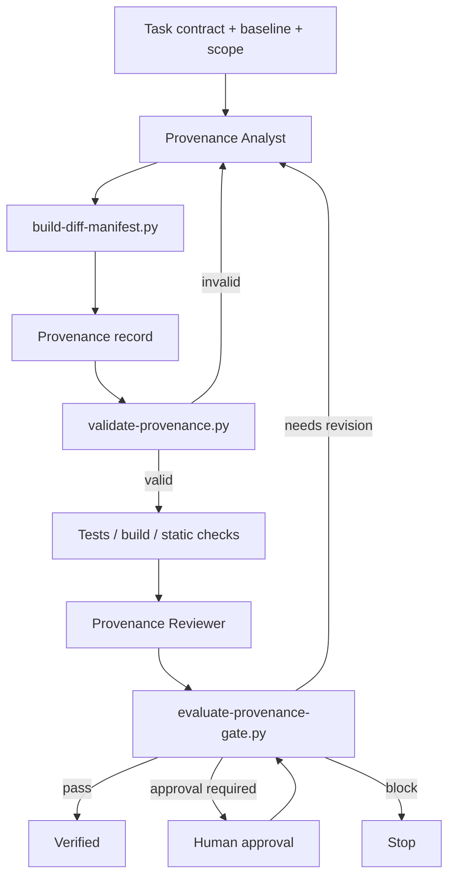

# Agent-Generated Code Provenance Gate

A reusable, tool-neutral gate for proving why every material AI-generated code change exists, which requirement/evidence justifies it, whether it stayed inside approved scope, and how it was independently verified.

## Problem
AI coding agents can produce plausible diffs that contain unrelated cleanup, accidental configuration edits, hidden generated changes, test modifications that weaken verification, or changes that cannot be traced back to the task. A passing build does not prove that every changed line was necessary or authorized.

## Purpose
This kit creates an evidence trail from **task contract → changed files → rationale/evidence → verification → independent review → final gate**. It is designed to detect unexplained and out-of-scope changes before merge, release, or agent-to-agent handoff.

## When to use
Use for AI-assisted feature work, bug fixes, refactoring, test generation, code review remediation, migrations, repository maintenance, and any workflow where generated code must be auditable.

## When not to use
Do not use it as a substitute for normal testing, security review, architecture review, or human approval for dangerous actions. It proves provenance and scope; it does not prove business correctness by itself.

## Architecture



## Component responsibilities
- `skills/change-provenance-capture.md` — procedure for constructing the task/evidence/change mapping.
- `skills/diff-scope-verification.md` — independent procedure for challenging scope and provenance claims.
- `rules/code-provenance-governance.md` — enforceable MUST/MUST NOT/SHOULD rules.
- `subagents/provenance-analyst.md` — owns evidence capture and classification.
- `subagents/provenance-reviewer.md` — independently verifies the diff and record without editing implementation code.
- `workflows/generated-code-provenance-workflow.md` — bounded end-to-end workflow.
- `hooks/provenance-hooks.md` — lifecycle hooks and exact script commands.
- `config/provenance-policy.json` — risk tags, approval boundaries, reviewer policy, and retry limits.
- `schemas/provenance-record.schema.json` — machine-readable record contract.
- `scripts/build-diff-manifest.py` — builds a deterministic Git changed-file manifest and normalized diff hash.
- `scripts/validate-provenance.py` — validates path coverage, scope, mappings, evidence ids, and verification obligations.
- `scripts/evaluate-provenance-gate.py` — final fail-closed gate for verification, reviewer independence, risk, and approval state.
- `templates/provenance-record.json` — copyable record template.
- `examples/example-provenance-record.json` — filled example.
- `tests/smoke-test.py` — validates pass, approval-required, and invalid-scope behavior.

## Package tree

```text
agent-generated-code-provenance-gate/
├── README.md
├── config/
│   └── provenance-policy.json
├── examples/
│   └── example-provenance-record.json
├── hooks/
│   └── provenance-hooks.md
├── rules/
│   └── code-provenance-governance.md
├── schemas/
│   └── provenance-record.schema.json
├── scripts/
│   ├── build-diff-manifest.py
│   ├── evaluate-provenance-gate.py
│   └── validate-provenance.py
├── skills/
│   ├── change-provenance-capture.md
│   └── diff-scope-verification.md
├── subagents/
│   ├── provenance-analyst.md
│   └── provenance-reviewer.md
├── templates/
│   └── provenance-record.json
├── tests/
│   └── smoke-test.py
└── workflows/
    └── generated-code-provenance-workflow.md
```

## Installation
Copy this directory into the target repository. Python 3.9+ and Git are the only runtime dependencies for the deterministic scripts.

Create a working artifact directory if desired:

```bash
mkdir -p artifacts
cp templates/provenance-record.json artifacts/provenance-record.json
```

## Configuration
Edit `config/provenance-policy.json` when your repository needs different high-risk tags or approval requirements. Keep retry limits bounded. Do not remove approval requirements merely to unblock a task.

The provenance record must define:
- task id/title and implementation owner;
- baseline ref;
- allowed path patterns;
- atomic requirements/evidence ids;
- every changed path with rationale and mappings;
- verification checks and owners;
- review state;
- human approval when required.

## Permissions
The core workflow needs read access to repository files and Git history plus permission to run local build/test commands. Production, destructive, infrastructure, database, secret, breaking-contract, or irreversible actions remain outside the automatic permission boundary and require explicit human approval.

## Usage

### 1. Capture baseline and scope
Set `baseline_ref` and `allowed_scope` before editing.

### 2. Build current diff manifest

```bash
python scripts/build-diff-manifest.py \
  --repo . \
  --baseline origin/main \
  --output artifacts/diff-manifest.json
```

### 3. Complete provenance mapping
Copy `templates/provenance-record.json`, replace template values, map every material changed path, and set `diff_sha256` to the hash emitted by the diff manifest.

### 4. Validate before review

```bash
python scripts/validate-provenance.py \
  --record artifacts/provenance-record.json \
  --diff artifacts/diff-manifest.json \
  --policy config/provenance-policy.json
```

### 5. Run verification and independent review
Record actual test/build/static-analysis results. For high-risk changes, the reviewer identity must differ from the implementation owner.

### 6. Run the final gate

```bash
python scripts/evaluate-provenance-gate.py \
  --record artifacts/provenance-record.json \
  --diff artifacts/diff-manifest.json \
  --policy config/provenance-policy.json
```

Exit behavior:
- `0` — pass;
- `1` — blocked/invalid;
- `2` — input/tool failure;
- `3` — explicit human approval required.

## Example invocation
A bug-fix agent changes one endpoint and one regression test. The provenance record maps both paths to the failing test and acceptance criterion. If the agent also updates an unrelated package file, validation fails because that path is not mapped or is outside allowed scope. The workflow must either revert it or explicitly revise scope with human/task-owner authorization.

## Workflow
The canonical workflow is `workflows/generated-code-provenance-workflow.md`. Review revisions are capped at two cycles. Verification reruns are capped at two and are permitted only after a concrete transient/environment correction. Policy, scope, permission, and approval failures are never retried automatically.

## Approval boundaries
Human approval is required for changes tagged by policy as destructive, breaking-contract, security-sensitive, database/schema, infrastructure, production configuration, or irreversible. Approval must identify an approver and reason; an agent cannot approve its own dangerous action.

## Failure handling
- Invalid baseline: stop and preserve the Git error.
- Diff generation failure: retry once only if the failure is transient.
- Diff changes after review: invalidate the previous review and regenerate the manifest.
- Missing evidence or unexplained path: block.
- Verification failure: preserve first failure output; rerun only after a specific corrective action, maximum two reruns.
- Reviewer/implementation identity conflict on high-risk work: block.
- Approval absent: return `human-approval-required` rather than silently escalating privileges.

## Verification
The kit distinguishes **implemented** from **verified**. Verification requires:
- current diff hash matches the provenance record;
- all changed paths are represented;
- all paths are within declared scope;
- every material change has a rationale and requirement/evidence reference;
- all required verification checks are `passed`;
- high-risk changes have an independent reviewer;
- approval-required risk tags have explicit human approval;
- final gate returns `pass`.

Run the package smoke test:

```bash
python tests/smoke-test.py
```

## Safety
- Least privilege by default.
- No secrets in provenance artifacts.
- No automatic scope widening.
- No automatic dangerous-action approval.
- No infinite verification or review loops.
- No treating a successful code generation/build step as proof that the diff is justified.

## Definition of Done
A provenance-gated task is done only when:
1. baseline and allowed scope are recorded;
2. current diff manifest exists and is fresh;
3. every material changed path has rationale and traceable evidence/requirement ids;
4. no unexplained or unacknowledged out-of-scope changes remain;
5. verification checks have passed;
6. independent review is complete where required;
7. required human approval exists;
8. remaining non-blocking risks are documented;
9. final deterministic gate returns `pass`.

## Customization
Add repository-specific risk tags, evidence conventions, or CI wrappers in configuration/adapters rather than changing the core ownership model. The workflow is portable across Codex, Claude Code, Cursor, ChatGPT, GitHub Copilot, OpenCode, and other coding agents because its core artifacts are Git, JSON, Markdown, and Python rather than tool-specific agent APIs.