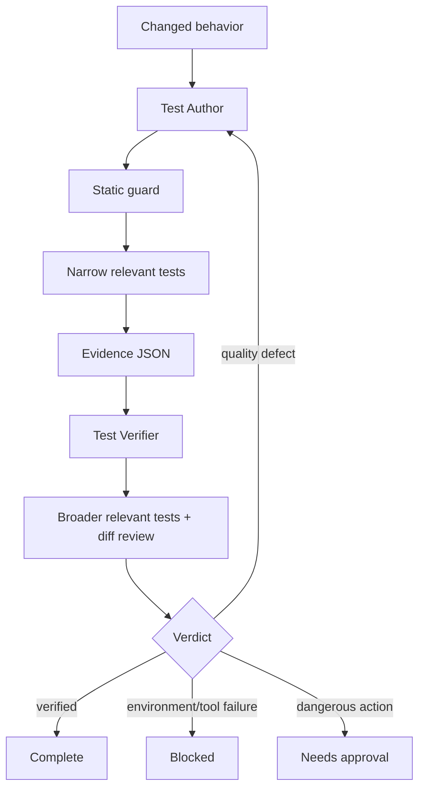

# Agent Generated Test Quality Gate

A reusable quality gate for AI-generated or AI-modified tests. It prevents green-but-low-signal test suites by requiring behavior-linked assertions, bounded repair loops, deterministic execution, structured evidence, and independent verification.

## Problem
AI coding agents can generate tests that compile and pass while proving little: existence-only assertions, excessive snapshots, implementation-detail assertions, skipped/focused tests, unstable dependencies, or tests that would also pass against the buggy implementation.

This package turns test generation into an evidence-producing workflow instead of treating test execution alone as proof of correctness.

## When to use
Use it when an agent adds or changes tests for a feature, bug fix, refactor, dependency update, generated code change, or regression.

Do not use it as a replacement for product acceptance criteria, security review, performance testing, or manual exploratory QA when those are independently required.

## Architecture



The Test Author owns test design and implementation. The Test Verifier independently evaluates evidence and must not be the sole author of the changes being verified.

## Package tree

```text
agent-generated-test-quality-gate/
├── README.md
├── config/
│   └── test-quality.yaml
├── hooks/
│   └── test-quality-hooks.md
├── rules/
│   └── test-quality-rules.md
├── schemas/
│   └── test-evidence.schema.json
├── scripts/
│   ├── check-generated-tests.py
│   └── validate-evidence.py
├── skills/
│   ├── generate-high-signal-tests.md
│   └── review-test-evidence.md
├── subagents/
│   ├── test-author.md
│   └── test-verifier.md
├── templates/
│   └── test-evidence.json
└── workflows/
    └── generated-test-quality-gate.md
```

## Component responsibilities
- `config/test-quality.yaml`: thresholds, retry limits, approval boundaries, default commands, and high-risk path hints.
- `rules/test-quality-rules.md`: enforceable MUST/MUST NOT/SHOULD behavior.
- `skills/generate-high-signal-tests.md`: procedure for designing and implementing behavior-linked tests.
- `skills/review-test-evidence.md`: independent review procedure.
- `subagents/test-author.md`: constrained implementation role.
- `subagents/test-verifier.md`: independent verification role.
- `workflows/generated-test-quality-gate.md`: complete bounded lifecycle and failure paths.
- `hooks/test-quality-hooks.md`: lifecycle checks and blocking behavior.
- `scripts/check-generated-tests.py`: dependency-free static scan for common low-signal/disabled generated tests.
- `scripts/validate-evidence.py`: dependency-free structural validation of evidence JSON.
- `schemas/test-evidence.schema.json`: machine-readable handoff contract.
- `templates/test-evidence.json`: editable evidence starter.

## Installation
Copy this directory into the target repository, for example under `.ai/agent-generated-test-quality-gate/`, or copy the individual assets into equivalent agent configuration locations.

Requirements for the deterministic scripts:
- Python 3.9+
- Git
- The repository's normal test runtime/toolchain

No Python packages are required by the included scripts.

## Configuration
Edit `config/test-quality.yaml` to match repository conventions. At minimum review:
- `commands.default_test`
- high-risk path globs
- approval-required action categories
- retry limits
- boundary/negative-case requirement

The defaults are intentionally conservative and non-destructive.

## Permissions
Give the Test Author read access to the repository, permission to edit test code/test helpers, and permission to run local non-destructive commands. Give the Test Verifier read access plus permission to run tests/static checks. Neither role requires production deployment, destructive database, secret, infrastructure, or Git-history rewrite permissions.

Never silently grant additional permissions to unblock the workflow.

## Usage

1. Identify a base ref, such as `origin/main`.
2. Give the Test Author the changed implementation, acceptance criteria or bug evidence, and repository test conventions.
3. Follow `skills/generate-high-signal-tests.md`.
4. Run the static guard:

```bash
python scripts/check-generated-tests.py --base origin/main
```

5. Run the narrow relevant repository test command.
6. Copy `templates/test-evidence.json` to a task-specific evidence path and replace every sample value with real evidence.
7. Validate the evidence structure:

```bash
python scripts/validate-evidence.py path/to/test-evidence.json
```

8. Hand the final diff and evidence to the Test Verifier and follow `skills/review-test-evidence.md`.
9. Only mark the task verified when the workflow Definition of Done is satisfied.

## Example agent invocation

```text
Use agent-generated-test-quality-gate for the current diff against origin/main.
Read the changed implementation and nearest existing tests first.
Generate the smallest high-signal regression/behavior test set.
Follow rules/test-quality-rules.md and skills/generate-high-signal-tests.md.
Run the static guard and relevant tests, produce evidence matching schemas/test-evidence.schema.json, then hand off to the independent Test Verifier for skills/review-test-evidence.md.
Do not declare verified until the verifier returns verified.
```

## Workflow
The normative end-to-end process is `workflows/generated-test-quality-gate.md`. Author-side test repairs are limited to two attempts. Verification has one retry for transient command failure. Repeated quality, implementation, permission, or environment failures stop with preserved evidence rather than looping indefinitely.

## Approval boundaries
Explicit human approval is required before:
- production deployment or production configuration change
- destructive data or database schema change
- breaking public API contract
- weakening a security control
- irreversible migration
- large dependency upgrade
- force push/history rewrite
- secret or infrastructure change

Agents must stop before performing such actions.

## Failure handling
- **Test defect:** Test Author may repair within the two-attempt budget.
- **Implementation defect:** stop test-only work and hand evidence to the implementation owner.
- **Transient command/tool failure:** retry once for that command.
- **Environment or permission failure:** preserve output and mark `blocked`; do not escalate privileges.
- **Approval boundary:** mark `needs-approval` and stop before the action.
- **Verifier quality finding:** return to Test Author only while author retry budget remains; otherwise stop blocked with findings.

## Verification
A task is not verified merely because code was generated or tests were executed. Verification requires all applicable evidence below:
- static guard exits 0
- evidence validator exits 0
- narrow relevant tests pass
- broader relevant tests pass when available and practical
- every changed behavior has a test or explicit evidence-based disposition
- meaningful observable assertions are present
- relevant negative/boundary behavior is covered
- tests are deterministic
- no new skip/focus markers exist
- regression evidence shows the test detects prior bad behavior when applicable
- final diff contains no unintended weakening or unrelated generated changes
- independent Test Verifier returns `verified`

## Definition of Done
The package workflow is complete only when:
1. Required implementation and test context was gathered.
2. Changed behavior was enumerated.
3. Test changes exist and satisfy the enforceable rules.
4. Static and evidence validation passed.
5. Relevant tests passed.
6. Independent verification completed successfully.
7. Required approval was obtained for any approval-boundary action; otherwise that action was not performed.
8. Remaining risks are documented.
9. No blocking failure remains.

## Customization
Adapt test filename detection in `scripts/check-generated-tests.py` for repository-specific conventions. Extend the static guard only with deterministic checks that have acceptably low false-positive rates. Keep semantic judgments—such as whether an assertion genuinely proves a business behavior—in the reviewer skill rather than pretending they can always be reduced to regex checks.

For non-.NET repositories, replace the default test command in configuration and retain the same behavior → test → evidence → independent verification model.
