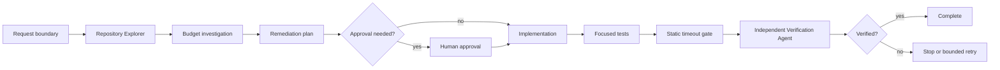

# Agent HTTP Client Timeout Budget Propagation Gate

Reusable implementation kit for preventing outbound HTTP calls and retries from exceeding a caller's end-to-end deadline.

## Problem
Distributed request paths often configure each HTTP client independently. A parent request may have a 5-second SLA while a child call waits 10 seconds, retries add more delay, or cancellation is dropped between layers. The result is latency amplification, work continuing after the caller has gone away, thread/socket pressure, and inconsistent timeout behavior that is difficult to diagnose.

## Purpose
This package gives coding agents and engineering teams a repeatable workflow for discovering timeout-budget violations, implementing deadline/cancellation propagation, statically detecting common unsafe patterns, independently verifying remediation, and stopping before approval-required production changes.

## When to use
Use when adding/changing outbound HTTP calls, introducing retries, diagnosing requests that outlive their SLA, fixing cancellation bugs, or reviewing a service chain for bounded latency.

## When not to use
Do not use as a substitute for load testing, capacity planning, or downstream service optimization. The static gate is intentionally conservative and is evidence for review, not proof that runtime latency is healthy.

## Architecture


## Package tree
```text
agent-http-client-timeout-budget-propagation-gate/
├── README.md
├── config/
│   └── policy.yaml
├── hooks/
│   └── lifecycle.md
├── rules/
│   └── timeout-budget-safety.md
├── schemas/
│   └── timeout-budget-result.schema.json
├── scripts/
│   ├── timeout_budget_gate.py
│   └── verify_package.py
├── skills/
│   ├── timeout-budget-investigation.md
│   └── timeout-budget-remediation.md
├── subagents/
│   ├── repository-explorer.md
│   └── verification-agent.md
├── tests/
│   └── test_timeout_budget_gate.py
└── workflows/
    └── timeout-budget-gate.md
```

## Component responsibilities
- `skills/timeout-budget-investigation.md`: traces the request chain and builds evidence.
- `skills/timeout-budget-remediation.md`: defines the smallest safe deadline/cancellation fix.
- `rules/timeout-budget-safety.md`: enforceable MUST/MUST NOT/SHOULD rules.
- `subagents/repository-explorer.md`: read-only call-chain explorer.
- `subagents/verification-agent.md`: independent verifier that does not implement the fix.
- `workflows/timeout-budget-gate.md`: bounded end-to-end workflow with retry and approval rules.
- `hooks/lifecycle.md`: deterministic pre/post/final lifecycle actions.
- `scripts/timeout_budget_gate.py`: static scanner for unbounded timeout and missing .NET cancellation-token patterns.
- `scripts/verify_package.py`: verifies required package files and placeholder absence.
- `config/policy.yaml`: portable policy values.
- `schemas/timeout-budget-result.schema.json`: output contract for static gate results.
- `tests/test_timeout_budget_gate.py`: executable regression tests for the scanner.

## Dependencies
Python 3.10+ and PyYAML are required for the scripts. The consuming repository uses its own native build/test tooling.

Install the script dependency:
```bash
python -m pip install pyyaml
```

## Configuration
Edit `config/policy.yaml` to match the consuming service SLA. Important values are `default_request_budget_ms`, `minimum_downstream_budget_ms`, `network_reserve_ms`, `max_retries`, `propagation_header`, and the approval threshold for large production budget increases.

Do not put secrets in this policy.

## Permissions
The exploration and verification stages require read access plus permission to run tests locally/CI. Production deployment, production configuration changes, infrastructure mutations, resilience-control weakening, or large timeout-budget increases require explicit human approval.

## Usage
Run the deterministic gate against a repository:
```bash
python scripts/timeout_budget_gate.py --root /path/to/repo --policy config/policy.yaml --out timeout-budget-report.json
```

Run package verification:
```bash
python scripts/verify_package.py
```

Run scanner tests:
```bash
python -m unittest tests/test_timeout_budget_gate.py
```

## Example invocation for an AI coding agent
Use `skills/timeout-budget-investigation.md` first for the target request path. Produce evidence before proposing a fix. Apply `rules/timeout-budget-safety.md`. If remediation is needed, follow `skills/timeout-budget-remediation.md` and the bounded stages in `workflows/timeout-budget-gate.md`. A separate verifier should finish with `subagents/verification-agent.md`.

## Core invariant
For every downstream attempt:

`child timeout <= remaining parent budget - network reserve`

No retry may start if there is insufficient remaining budget for another useful attempt.

## Approval boundaries
Stop before any production deployment/configuration/infrastructure change, weakening resilience controls, or any timeout-budget increase that meets the percentage threshold in `config/policy.yaml`. The package never grants itself broader permissions.

## Failure handling
Tool/transient command failures may be retried once. Implementation/test failures allow at most two fix-test cycles. Missing permissions or environments stop the workflow. Every failed attempt preserves the report, command output, and relevant diff evidence.

## Verification
A task is executed when code was changed and commands ran. It is verified successfully only when the parent SLA is documented, downstream calls are budget-capped, cancellation propagates, retries are bounded, focused tests pass, the static gate passes or all scanner findings are dispositioned with evidence, the diff contains no unintended changes, and the independent verifier reports `verified`.

## Definition of Done
- Request boundary and parent deadline are known.
- All scoped downstream HTTP edges have known timeout and cancellation behavior.
- Child attempts cannot knowingly outlive the remaining parent budget.
- Caller cancellation reaches downstream operations.
- Retry count and retry eligibility are bounded by policy and remaining time.
- Focused tests pass.
- Static gate output is valid and non-blocking.
- Independent verification is complete.
- Approval-required actions were not performed without approval.
- Remaining runtime uncertainty or risk is documented.

## Portability
The workflow and contracts are tool-neutral. Agent-specific adapters are unnecessary unless a particular environment requires one. The core procedures can be used with Codex, Claude Code, Cursor, ChatGPT, GitHub Copilot, OpenCode, or another coding agent that can read repositories and run authorized commands.

## Customization
Extend the deterministic scanner only for patterns that can be tested reliably. Keep runtime tracing rules in Skills rather than encoding uncertain semantic conclusions into regex. For languages other than .NET, add focused detectors and matching unit tests instead of broad unverified patterns.
