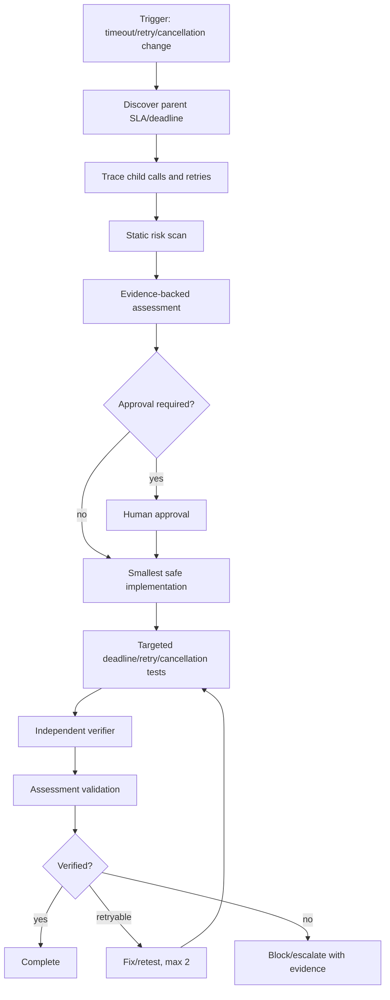

# Agent HTTP Timeout Budget Propagation Gate

A reusable AI-engineering package for preventing timeout, retry, and cancellation changes from violating an end-to-end request or job deadline.

## Problem

Distributed request paths frequently accumulate independent timeout constants: an API has a 30-second SLA, an SDK call has a 30-second timeout, a database call has another 30-second timeout, and retries restart those timers. The system then either exceeds the caller deadline, abandons work after the client is gone, or fails prematurely because a child timeout does not reflect the remaining budget.

This kit turns timeout review into an evidence-based workflow with deterministic scanning, structured assessment, bounded remediation loops, independent verification, and explicit approval boundaries.

## When to use

Use this package when changing:

- HTTP/API client timeouts.
- Database command timeouts.
- SDK or message-client timeout policies.
- Retry, polling, backoff, or resilience handlers.
- Background-job deadlines.
- Cancellation-token propagation.
- Gateway/proxy timeout behavior that must align with application code.

Do not use it as a replacement for production load testing, capacity planning, or a full resilience architecture review.

## Architecture



## Package tree

```text
agent-http-timeout-budget-propagation-gate/
├── README.md
├── config/
│   └── timeout-budget.yaml
├── schemas/
│   └── timeout-assessment.schema.json
├── scripts/
│   ├── scan-timeout-risk.py
│   └── validate-assessment.py
├── skills/
│   └── timeout-budget-investigation.md
├── rules/
│   └── timeout-safety-rules.md
├── subagents/
│   ├── timeout-investigator.md
│   └── timeout-verifier.md
├── workflows/
│   └── timeout-budget-review.md
├── hooks/
│   └── lifecycle-hooks.md
├── examples/
│   └── example-assessment.json
└── tests/
    └── self-test.py
```

## Component responsibilities

`config/timeout-budget.yaml` defines default budget assumptions, risk weights, retry limits, approval boundaries, statuses, and verification requirements.

`schemas/timeout-assessment.schema.json` defines the machine-readable handoff contract for findings and verification.

`scripts/scan-timeout-risk.py` performs a deterministic heuristic scan for dangerous timeout/retry/cancellation patterns. Exit code `0` means score below warning threshold, `1` means warning-level score, and `2` means block-level score. Scanner output is evidence input, not automatic proof of a defect.

`scripts/validate-assessment.py` validates the required assessment fields and enforces strong pass semantics: a `pass` must have successful verification and zero unresolved risks.

`skills/timeout-budget-investigation.md` is the reusable procedure for tracing parent deadlines, downstream calls, retries, cancellation, evidence, fixes, and stop conditions.

`rules/timeout-safety-rules.md` contains enforceable MUST, MUST NOT, and SHOULD behavior.

`subagents/timeout-investigator.md` owns evidence gathering and risk classification. `subagents/timeout-verifier.md` independently verifies the final change.

`workflows/timeout-budget-review.md` defines the end-to-end workflow, checkpoints, bounded retry loop, failure paths, approval gates, and Definition of Done.

`hooks/lifecycle-hooks.md` defines pre-task scanning, post-edit testing, assessment validation, and final diff review.

`tests/self-test.py` verifies the package's scanner and validator behavior using safe and risky fixtures.

## Installation

Copy this directory into the target repository, preserving paths. Python 3.9+ is sufficient for the deterministic scripts; they depend only on the Python standard library.

The workflow itself is tool-neutral and can be used with Codex, Claude Code, Cursor, ChatGPT, GitHub Copilot, OpenCode, or another coding agent capable of reading repository files and invoking local commands.

## Configuration

Review `config/timeout-budget.yaml` before first use. Adapt `default_request_budget_ms` only when the repository has a known default SLA. Do not treat the default as evidence for a specific endpoint when its actual gateway/request/job deadline differs.

The default package uses:

- Parent request budget: 30,000 ms.
- Minimum reserve: 250 ms.
- Maximum fix-retest cycles: 2.
- Maximum transient tool retries: 2.
- Warning risk score: 3.
- Blocking risk score: 6.

## Permissions

The normal workflow requires only repository read/write access for the intended code change and permission to run local tests/scripts.

Explicit human approval is required before:

- Production configuration changes.
- Infrastructure or gateway timeout changes.
- Breaking API-contract changes.
- Database schema changes.
- Security-control changes.
- Large dependency upgrades.

Agents must not increase permissions automatically to bypass a blocked step.

## Usage

Run the initial risk scan from this package directory:

```bash
python3 scripts/scan-timeout-risk.py /path/to/repository --json
```

Then follow `skills/timeout-budget-investigation.md` and `workflows/timeout-budget-review.md` to trace the actual request path and classify scanner findings.

Produce an assessment matching `schemas/timeout-assessment.schema.json`. The included example can be used as a structural reference:

```bash
python3 scripts/validate-assessment.py examples/example-assessment.json
```

Run package self-tests:

```bash
python3 tests/self-test.py
```

## Example invocation for an AI coding agent

```text
Review the timeout-budget safety of the change to POST /orders/{id}/confirm.
Use skills/timeout-budget-investigation.md, obey rules/timeout-safety-rules.md,
run scripts/scan-timeout-risk.py, follow workflows/timeout-budget-review.md,
and produce a final assessment matching schemas/timeout-assessment.schema.json.
Do not change production or infrastructure timeout configuration without approval.
```

## Core budget model

Treat the parent deadline as the upper bound for the entire operation, not as a value that every child may consume independently.

For a child call, the safe budget is conceptually:

```text
child_budget <= parent_deadline - elapsed_time - retry_delay_reserve - cleanup_reserve
```

A retry attempt must use the remaining budget. It must not restart the original full timeout unless the business contract explicitly defines independent operations.

## Scanner interpretation

The scanner intentionally favors portability over language-specific AST analysis. It detects evidence candidates such as:

- Infinite or disabled timeouts.
- Hard-coded timeout constants.
- Blocking waits in async paths.
- Retry constructs that need deadline review.
- HttpClient calls that require cancellation inspection.
- Empty catches around timeout/cancellation signals.

A finding must be traced to the actual call path before remediation. False positives should be documented rather than hidden globally.

## Verification

Verification is evidence-based. For a normal code change, prove at least:

1. The parent deadline/SLA is known.
2. Downstream timeout and retry layers were traced.
3. Child operations cannot intentionally exceed the remaining parent budget.
4. Retry loops terminate when the parent deadline is exhausted.
5. Cancellation/deadline signals propagate where supported.
6. Success-before-deadline behavior passes tests.
7. Deadline exhaustion/cancellation behavior passes tests when relevant.
8. Scanner output was reviewed after the change.
9. Final diff contains no unintended timeout/config changes.
10. Final assessment validates with `scripts/validate-assessment.py`.

Running the implementation is not the same as verifying it. A generated code change is incomplete until the verifier has evidence for the final verdict.

## Failure and recovery

Transient tool failures may be retried at most twice while preserving error output. Implementation failures may enter at most two fix-retest cycles.

Stop immediately rather than retry when the parent deadline is unknown, required permissions are missing, human approval is required, or evidence proves the requested behavior cannot fit within the SLA.

After the retry budget is exhausted, preserve the failing commands, outputs, diff, hypotheses, and unresolved risks, and return `block` rather than continuing autonomously.

## Definition of Done

The package workflow is complete only when:

- Required context and the parent deadline were gathered.
- The relevant call chain, timeouts, retries, and cancellation path were traced.
- Evidence-backed findings were resolved or explicitly approved/accepted.
- Relevant tests passed.
- The scanner was re-run and remaining findings reviewed.
- The independent verifier completed verification.
- The final assessment contract validated.
- Required approvals were obtained.
- No blocking failure or unresolved blocking risk remains.

## Customization

Adjust scanner patterns and risk weights for repository-specific libraries, but keep scanner logic deterministic and test changes with `tests/self-test.py`. Add language-specific analyzers only when they materially improve signal quality.

If a platform already provides an absolute deadline header or request context, prefer adapting the workflow to that existing signal instead of introducing another timeout abstraction.
