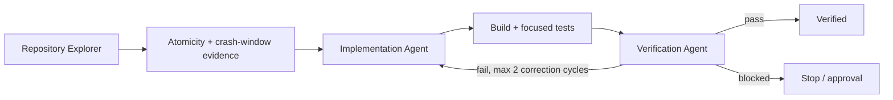

# Agent Idempotency-Key Concurrency Gate

Reusable engineering kit for preventing duplicate side effects when retried or concurrent requests reuse an idempotency key.

## Problem
An endpoint can appear idempotent in sequential testing yet execute the protected operation twice when two workers observe the key as absent at the same time, when a crash occurs between the side effect and outcome persistence, or when a key is reused for a different payload. These defects commonly affect payment/order creation, provisioning, message handling, external API commands, and background jobs.

## When to use
Use when adding/changing idempotency support, retry policies, mutating endpoints, queue/job handlers, persistence, or after duplicate side effects are observed. Do not use this kit as a substitute for domain-level deduplication when the business operation has no stable identity.

## Architecture


The core invariant is: a scoped key is atomically owned before a duplicate-sensitive side effect; the key is bound to a stable request fingerprint; terminal outcome is replayable; concurrent callers cannot independently perform the same logical operation.

## Package tree
```text
agent-idempotency-key-concurrency-gate/
├── README.md
├── config/gate.json
├── schemas/evidence.schema.json
├── skills/investigate-idempotency.md
├── skills/implement-safe-idempotency.md
├── rules/safety.md
├── subagents/repository-explorer.md
├── subagents/implementation-agent.md
├── subagents/verification-agent.md
├── workflows/idempotency-gate.md
├── hooks/pre-task.md
├── hooks/final-verification.md
├── scripts/scan-idempotency.py
├── scripts/concurrency-probe.py
└── examples/evidence.json
```

## Dependencies
Python 3.9+ for package scripts. Application build/test dependencies remain those of the target repository. No third-party Python package is required.

## Installation
Copy this directory into the target repository or agent configuration repository. Review `config/gate.json`; keep the default two-retry ceiling unless a project has a stricter policy.

## Permissions
Repository read access is sufficient for investigation. Implementation requires write access only to scoped application/test files. The concurrency probe requires network access to an explicitly safe non-production endpoint.

## Usage
1. Give the Repository Explorer the target mutating operation.
2. Follow `workflows/idempotency-gate.md`.
3. Collect static signals with:
   `python scripts/scan-idempotency.py /path/to/repo --output idempotency-scan.json`
4. Implement only confirmed gaps using `skills/implement-safe-idempotency.md`.
5. Run the target project's build and tests.
6. When a safe local/test endpoint exists, verify concurrency with:
   `python scripts/concurrency-probe.py http://localhost:5000/orders --key test-key-123456789 --body '{"sku":"A","qty":1}'`
7. Have the Verification Agent produce evidence conforming to `schemas/evidence.schema.json`.

The scanner is intentionally heuristic. A missing signal means review is needed; a match is not proof of safety.

## Approval boundaries
Explicit human approval is required before database schema changes, production configuration changes, breaking API contracts, infrastructure or secret changes, destructive actions, deployments, or security-control weakening. Never run concurrency probes against production without explicit approval.

## Failure and recovery
Transient tool/environment failures may be retried at most twice with evidence preserved. Logic, build, or test failures require diagnosis; the workflow permits at most two scoped correction cycles before escalation. Permission failures, unresolved business semantics, and approval-required actions stop the workflow with status `blocked`.

## Verification
A successful result proves, with repository/test evidence: sequential duplicate replay is safe; concurrent same-key execution produces one logical protected side effect; same key with a different fingerprint is rejected; key scope is appropriate; failure/in-progress recovery is bounded; build and relevant tests pass; and the final diff contains no unexplained changes.

## Definition of Done
- Protected side effects and crash windows are mapped.
- Atomic ownership is evidenced rather than assumed.
- Fingerprint mismatch behavior is tested.
- Sequential and concurrent replay tests pass.
- Build/relevant test suite passes.
- Independent verifier returns `pass`.
- No approval-required action remains pending.
- Remaining non-blocking risks are documented in evidence.

## Customization
Adapt key scope, fingerprint inputs, in-progress response behavior, retention, and storage primitives to the target system. Keep the workflow and evidence contract tool-neutral; isolate framework-specific implementation in the target repository rather than weakening the gate invariants.
