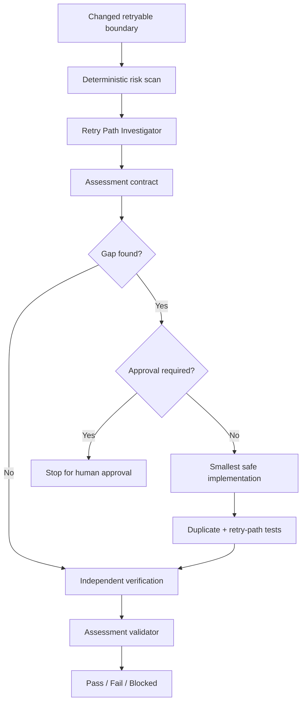

# Agent Idempotency Retry Safety Gate

## Problem
Retries, message redelivery, background jobs, API commands, and external callbacks can execute the same logical operation more than once. A retry policy can improve availability while simultaneously duplicating database rows, payments, messages, emails, files, or external API effects when idempotency is not enforced at the correct boundary.

## Purpose
This package gives an AI coding agent a repeatable, evidence-based gate for detecting and verifying retry/idempotency risks before merge. It combines deterministic scanning and assessment validation with explicit investigation, implementation, approval, and independent verification responsibilities.

## When to use
Use when a change touches retries, resilience policies, message consumers, queue acknowledgements, Hangfire/background workers, scheduled jobs, command handlers, webhook receivers, payment flows, notifications, persistence, or external API calls that may be retried.

## When not to use
Do not use this as a substitute for load testing, distributed-system chaos testing, database migration review, or production incident response when the primary problem is unrelated to duplicate execution. For purely read-only operations with no externally visible state change, the full gate may be unnecessary.

## Architecture



## Package tree

```text
agent-idempotency-retry-safety-gate/
├── README.md
├── config/
│   └── idempotency-gate.yaml
├── examples/
│   └── assessment.example.json
├── hooks/
│   └── lifecycle-hooks.md
├── rules/
│   └── idempotency-safety.md
├── schemas/
│   └── assessment.schema.json
├── scripts/
│   ├── scan-retry-risk.py
│   └── validate-assessment.py
├── skills/
│   └── idempotency-retry-review.md
├── subagents/
│   ├── retry-path-investigator.md
│   └── verification-agent.md
├── tests/
│   └── self-test.py
└── workflows/
    └── retry-safety-gate.md
```

## Component responsibilities
- `skills/idempotency-retry-review.md`: reusable review procedure from scan through verification.
- `rules/idempotency-safety.md`: enforceable MUST/MUST NOT/SHOULD constraints.
- `subagents/retry-path-investigator.md`: read-only ownership of retry/side-effect mapping.
- `subagents/verification-agent.md`: independent post-change verifier.
- `workflows/retry-safety-gate.md`: end-to-end staged workflow, checkpoints, bounded retries, approval points, and Definition of Done.
- `hooks/lifecycle-hooks.md`: deterministic pre-task, post-edit, final-validation, and diff-review hooks.
- `scripts/scan-retry-risk.py`: scans changed text files for retry, side-effect, and idempotency signals; exits 1 when high-risk files are detected and 2 on tool failure.
- `scripts/validate-assessment.py`: dependency-free structural and completion validation for assessment JSON.
- `schemas/assessment.schema.json`: portable JSON Schema contract for integrations that have a schema validator.
- `examples/assessment.example.json`: known-good assessment example.
- `tests/self-test.py`: verifies the validator accepts the example and rejects a false `pass` with incomplete verification.
- `config/idempotency-gate.yaml`: shared thresholds, keywords, approval boundaries, and required checks.

## Installation
Copy this directory into a repository. Python 3.9+ and Git are sufficient for the included scripts. No Python packages are required.

If you integrate the JSON Schema with CI, use any Draft 2020-12 compatible validator; the included `validate-assessment.py` remains the zero-dependency gate.

## Configuration
Adjust `config/idempotency-gate.yaml` to match project terminology and risk boundaries. Keep approval-required categories at least as strict as the defaults unless a human owner explicitly changes governance.

The scanner uses keyword heuristics and is intentionally conservative. Its output is triage evidence, not proof that code is safe or unsafe.

## Permissions
The investigator and verifier require read access plus permission to run non-destructive local tests/builds. Implementation requires normal repository edit permissions. The package never requires production credentials, deployment rights, schema-change permission, queue administration, or secret access.

## Usage
From the copied package directory or adapt paths to your repository layout:

```bash
python scripts/scan-retry-risk.py --base origin/main --output .ai/idempotency-scan.json
python tests/self-test.py
python scripts/validate-assessment.py examples/assessment.example.json
```

For a real review, create `.ai/idempotency-assessment.json` from the example structure and populate it with repository evidence. Then execute the procedure in `skills/idempotency-retry-review.md` and the ownership/checkpoints in `workflows/retry-safety-gate.md`.

## Example invocation for an AI coding agent

```text
Run the agent-idempotency-retry-safety-gate against origin/main.
Inspect changed retryable boundaries, map all side effects and retry/redelivery paths,
and create .ai/idempotency-assessment.json. Do not edit until investigation is complete.
If a gap is confirmed, implement only the smallest safe fix unless an approval boundary is crossed.
Run duplicate-delivery and retry-path regression tests, then hand verification to the independent verifier role.
Do not mark pass unless all required verification checks pass.
```

## Workflow
1. Run deterministic risk scan before editing.
2. Investigator maps execution boundaries, retries, acknowledgements, failure windows, side effects, and existing guards.
3. Create assessment with facts/evidence separated from findings and open risks.
4. Plan the smallest change when a confirmed gap exists.
5. Stop for human approval when required.
6. Implement and run duplicate-delivery plus retry-path tests.
7. Allow at most two fix/retest cycles; preserve failure evidence from each.
8. Independent verifier reruns checks and reviews the final diff.
9. Validate the assessment contract and finalize only with evidence.

## Approval boundaries
Explicit human approval is required before:
- Production configuration changes.
- Database schema changes or destructive data changes.
- Breaking API contract changes.
- Payment behavior changes.
- Message redelivery/acknowledgement policy changes.
- Any other destructive, irreversible, permission-expanding, secret-changing, or production-deployment action.

Agents must stop before these actions; approval is not permission to silently widen scope beyond the approved action.

## Failure handling
Transient tool failures may be retried at most twice. Implementation/test cycles are limited to two. Permission failures, missing approvals, unavailable production dependencies, and destructive-action requirements are not retryable. Preserve failing command output, the current assessment, and the diff before escalating.

Statuses are:
- `pass`: all required verification checks passed.
- `fail`: a confirmed safety defect remains or the retry budget is exhausted.
- `blocked`: required evidence/environment/tooling is unavailable.
- `needs-approval`: a required fix crosses an approval boundary.

## Verification
Minimum evidence for `pass`:
- Side-effect inventory is complete for changed retryable boundaries.
- Retry/redelivery behavior and maximum attempts are identified.
- Duplicate-delivery test passes.
- Retry-path test passes.
- Final diff review passes.
- Assessment validates with `scripts/validate-assessment.py`.
- No unapproved dangerous change is present.

Run package self-verification with:

```bash
python tests/self-test.py
```

## Definition of Done
The task is complete only when relevant changed boundaries have been traced, duplicate effects are guarded or proven safe, retry and duplicate-delivery regression tests pass, independent verification is complete, the assessment contract validates, required approvals exist, unresolved risks are recorded, and no blocking failure remains.

## Customization
Extend scanner keywords for project-specific frameworks, replace example test commands with repository-native commands, and add framework-specific idempotency patterns to agent context. Keep core rules, bounded retries, evidence requirements, and approval stops tool-neutral so the package can be used with Codex, Claude Code, Cursor, ChatGPT, GitHub Copilot, OpenCode, or other coding agents.
